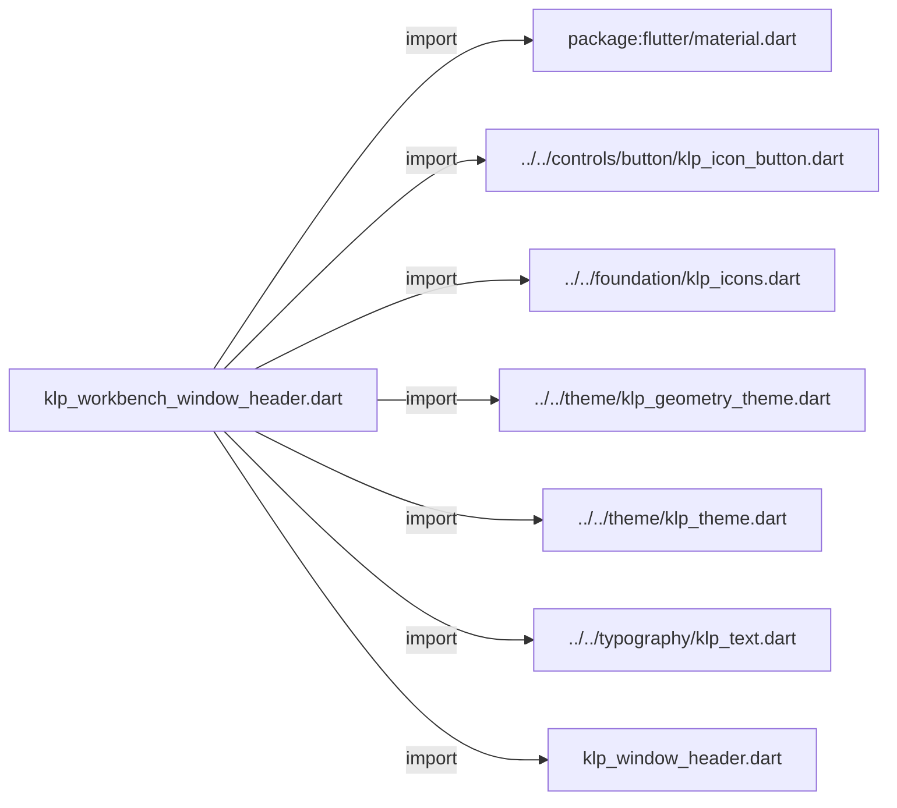
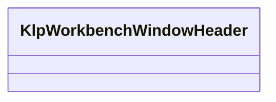
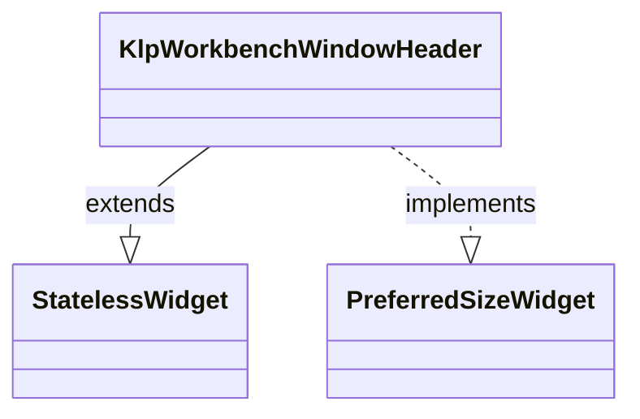

# klp_workbench_window_header.dart：直接依賴與宣告架構

[回到目錄](README.md) · [來源檔案](../../../../../lib/src/shell/window/klp_workbench_window_header.dart)

## 範圍

核心是 `lib/src/shell/window/klp_workbench_window_header.dart`。主要視角為該檔案明寫的 import／export／part；輔助視角為本檔宣告及 extends／implements／with／on 關係。只展開一層外部邊界。

## 直接依賴圖

## 依賴證據

| 關係 | 原始 directive | 來源 |
|---|---|---|
| import | <code>import &#x27;package:flutter/material.dart&#x27;;</code> | [lib/src/shell/window/klp_workbench_window_header.dart:1](../../../../../lib/src/shell/window/klp_workbench_window_header.dart#L1) |
| import | <code>import &#x27;../../controls/button/klp_icon_button.dart&#x27;;</code> | [lib/src/shell/window/klp_workbench_window_header.dart:3](../../../../../lib/src/shell/window/klp_workbench_window_header.dart#L3) |
| import | <code>import &#x27;../../foundation/klp_icons.dart&#x27;;</code> | [lib/src/shell/window/klp_workbench_window_header.dart:4](../../../../../lib/src/shell/window/klp_workbench_window_header.dart#L4) |
| import | <code>import &#x27;../../theme/klp_geometry_theme.dart&#x27;;</code> | [lib/src/shell/window/klp_workbench_window_header.dart:5](../../../../../lib/src/shell/window/klp_workbench_window_header.dart#L5) |
| import | <code>import &#x27;../../theme/klp_theme.dart&#x27;;</code> | [lib/src/shell/window/klp_workbench_window_header.dart:6](../../../../../lib/src/shell/window/klp_workbench_window_header.dart#L6) |
| import | <code>import &#x27;../../typography/klp_text.dart&#x27;;</code> | [lib/src/shell/window/klp_workbench_window_header.dart:7](../../../../../lib/src/shell/window/klp_workbench_window_header.dart#L7) |
| import | <code>import &#x27;klp_window_header.dart&#x27;;</code> | [lib/src/shell/window/klp_workbench_window_header.dart:8](../../../../../lib/src/shell/window/klp_workbench_window_header.dart#L8) |

## 宣告關係圖

本組節點是本檔宣告；沒有箭頭的宣告未在此圖主張互相依賴。

## 宣告與成員證據

成員包含 public 與 private；簽章取自來源，省略函式本體與欄位初始值。`(inferred)` 表示來源未明寫型別；建構子只顯示參數部分，不含初始化列表。

### KlpWorkbenchWindowHeader

ClassDeclaration · public · [lib/src/shell/window/klp_workbench_window_header.dart:10](../../../../../lib/src/shell/window/klp_workbench_window_header.dart#L10)

<code>class KlpWorkbenchWindowHeader extends StatelessWidget implements PreferredSizeWidget</code>

來源註解摘要：Workbench 專用的單一視窗列。 在標準 [KlpWindowHeader] 上，依兩側 pane 的即時寬度定位收合按鈕； pane 收合後，Primary 按鈕會跟在標題右方，Secondary 按鈕則留在右側動作區。

- `extends` → <code>StatelessWidget</code>：[lib/src/shell/window/klp_workbench_window_header.dart:14](../../../../../lib/src/shell/window/klp_workbench_window_header.dart#L14)
- `implements` → <code>PreferredSizeWidget</code>：[lib/src/shell/window/klp_workbench_window_header.dart:15](../../../../../lib/src/shell/window/klp_workbench_window_header.dart#L15)

| 成員 | 可見性 | 簽章／型別 | 來源註解摘要 | 證據 |
|---|---|---|---|---|
| constructor <code>KlpWorkbenchWindowHeader</code> | public | <code>const KlpWorkbenchWindowHeader({ super.key, required this.titleText, required this.primaryPaneWidth, required this.primaryVisible, required this.onTogglePrimary, required this.collapseLabel, required this.expandLabel, this.secondaryPaneWidth, this.secondaryVisible = false, this.onToggleSecondary, this.secondaryToggleEnabled = true, this.collapseSecondaryLabel, this.expandSecondaryLabel, this.stageTopBar, this.appIcon, this.appIconButton, this.actions, this.onMinimize, this.onToggleMaximize, this.onClose, this.isMaximized = false, this.showWindowControls = true, })</code> |  | [lib/src/shell/window/klp_workbench_window_header.dart:16](../../../../../lib/src/shell/window/klp_workbench_window_header.dart#L16) |
| field <code>titleText</code> | public | <code>final String titleText</code> |  | [lib/src/shell/window/klp_workbench_window_header.dart:41](../../../../../lib/src/shell/window/klp_workbench_window_header.dart#L41) |
| field <code>primaryPaneWidth</code> | public | <code>final double primaryPaneWidth</code> |  | [lib/src/shell/window/klp_workbench_window_header.dart:42](../../../../../lib/src/shell/window/klp_workbench_window_header.dart#L42) |
| field <code>primaryVisible</code> | public | <code>final bool primaryVisible</code> |  | [lib/src/shell/window/klp_workbench_window_header.dart:43](../../../../../lib/src/shell/window/klp_workbench_window_header.dart#L43) |
| field <code>onTogglePrimary</code> | public | <code>final VoidCallback? onTogglePrimary</code> |  | [lib/src/shell/window/klp_workbench_window_header.dart:44](../../../../../lib/src/shell/window/klp_workbench_window_header.dart#L44) |
| field <code>collapseLabel</code> | public | <code>final String collapseLabel</code> |  | [lib/src/shell/window/klp_workbench_window_header.dart:45](../../../../../lib/src/shell/window/klp_workbench_window_header.dart#L45) |
| field <code>expandLabel</code> | public | <code>final String expandLabel</code> |  | [lib/src/shell/window/klp_workbench_window_header.dart:46](../../../../../lib/src/shell/window/klp_workbench_window_header.dart#L46) |
| field <code>secondaryPaneWidth</code> | public | <code>final double? secondaryPaneWidth</code> |  | [lib/src/shell/window/klp_workbench_window_header.dart:47](../../../../../lib/src/shell/window/klp_workbench_window_header.dart#L47) |
| field <code>secondaryVisible</code> | public | <code>final bool secondaryVisible</code> |  | [lib/src/shell/window/klp_workbench_window_header.dart:48](../../../../../lib/src/shell/window/klp_workbench_window_header.dart#L48) |
| field <code>onToggleSecondary</code> | public | <code>final VoidCallback? onToggleSecondary</code> |  | [lib/src/shell/window/klp_workbench_window_header.dart:49](../../../../../lib/src/shell/window/klp_workbench_window_header.dart#L49) |
| field <code>secondaryToggleEnabled</code> | public | <code>final bool secondaryToggleEnabled</code> |  | [lib/src/shell/window/klp_workbench_window_header.dart:50](../../../../../lib/src/shell/window/klp_workbench_window_header.dart#L50) |
| field <code>collapseSecondaryLabel</code> | public | <code>final String? collapseSecondaryLabel</code> |  | [lib/src/shell/window/klp_workbench_window_header.dart:51](../../../../../lib/src/shell/window/klp_workbench_window_header.dart#L51) |
| field <code>expandSecondaryLabel</code> | public | <code>final String? expandSecondaryLabel</code> |  | [lib/src/shell/window/klp_workbench_window_header.dart:52](../../../../../lib/src/shell/window/klp_workbench_window_header.dart#L52) |
| field <code>stageTopBar</code> | public | <code>final Widget? stageTopBar</code> | 位於 Primary 與 Secondary pane 之間的 Stage header 內容。 | [lib/src/shell/window/klp_workbench_window_header.dart:55](../../../../../lib/src/shell/window/klp_workbench_window_header.dart#L55) |
| field <code>appIcon</code> | public | <code>final Widget? appIcon</code> |  | [lib/src/shell/window/klp_workbench_window_header.dart:56](../../../../../lib/src/shell/window/klp_workbench_window_header.dart#L56) |
| field <code>appIconButton</code> | public | <code>final Widget? appIconButton</code> |  | [lib/src/shell/window/klp_workbench_window_header.dart:57](../../../../../lib/src/shell/window/klp_workbench_window_header.dart#L57) |
| field <code>actions</code> | public | <code>final List&lt;Widget&gt;? actions</code> |  | [lib/src/shell/window/klp_workbench_window_header.dart:58](../../../../../lib/src/shell/window/klp_workbench_window_header.dart#L58) |
| field <code>onMinimize</code> | public | <code>final VoidCallback? onMinimize</code> |  | [lib/src/shell/window/klp_workbench_window_header.dart:59](../../../../../lib/src/shell/window/klp_workbench_window_header.dart#L59) |
| field <code>onToggleMaximize</code> | public | <code>final VoidCallback? onToggleMaximize</code> |  | [lib/src/shell/window/klp_workbench_window_header.dart:60](../../../../../lib/src/shell/window/klp_workbench_window_header.dart#L60) |
| field <code>onClose</code> | public | <code>final VoidCallback? onClose</code> |  | [lib/src/shell/window/klp_workbench_window_header.dart:61](../../../../../lib/src/shell/window/klp_workbench_window_header.dart#L61) |
| field <code>isMaximized</code> | public | <code>final bool isMaximized</code> |  | [lib/src/shell/window/klp_workbench_window_header.dart:62](../../../../../lib/src/shell/window/klp_workbench_window_header.dart#L62) |
| field <code>showWindowControls</code> | public | <code>final bool showWindowControls</code> |  | [lib/src/shell/window/klp_workbench_window_header.dart:63](../../../../../lib/src/shell/window/klp_workbench_window_header.dart#L63) |
| getter <code>preferredSize</code> | public | <code>Size get preferredSize</code> |  | [lib/src/shell/window/klp_workbench_window_header.dart:65](../../../../../lib/src/shell/window/klp_workbench_window_header.dart#L65) |
| method <code>_collapsedStageStart</code> | private | <code>double _collapsedStageStart(BuildContext context, double panelMargin)</code> |  | [lib/src/shell/window/klp_workbench_window_header.dart:69](../../../../../lib/src/shell/window/klp_workbench_window_header.dart#L69) |
| method <code>build</code> | public | <code>Widget build(BuildContext context)</code> |  | [lib/src/shell/window/klp_workbench_window_header.dart:90](../../../../../lib/src/shell/window/klp_workbench_window_header.dart#L90) |

## 閱讀說明與限制

箭頭只表示來源明寫的靜態關係；import 不等於呼叫。未分析動態呼叫、欄位的實際物件擁有權、狀態轉移或渲染流程；型別未進行語意解析，繼承目標保留原始型別拼寫。public／private 依 Dart 名稱前綴判斷；public 宣告不代表已由 `lib/kallopis.dart` 匯出。

本頁由 `tool/architecture_atlas` 產生；編輯來源或生成工具後重新產生，避免手改本頁。
