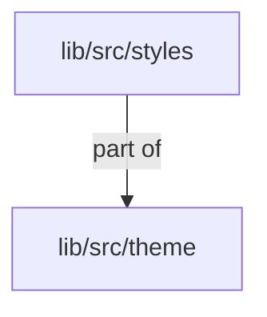
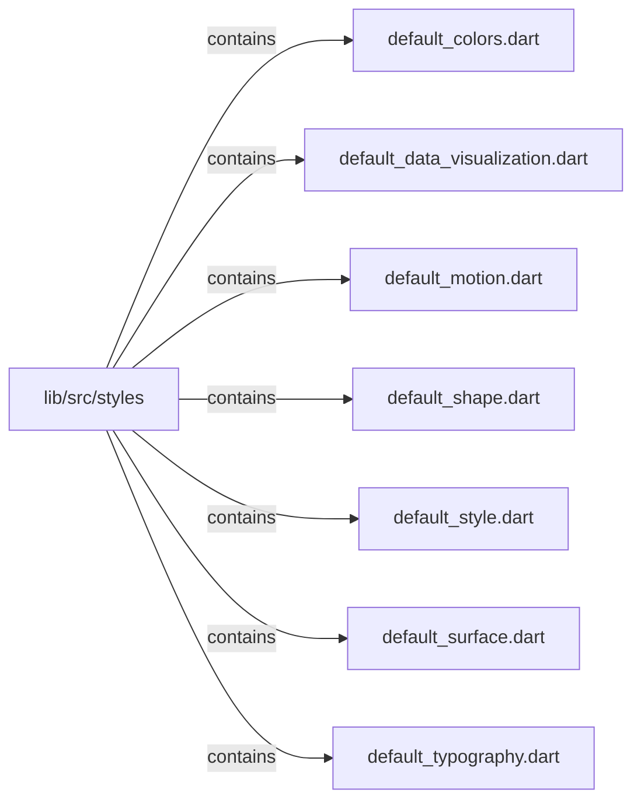

# lib/src/styles：架構分析入口

[上一層](../README.md)

## 範圍

閱讀 `lib/src/styles` 的直接子目錄與 Dart 檔案。結構圖表示實際檔案包含關係；依賴圖表示本層檔案明寫的 directives。每個檔案頁另列直接依賴、宣告、欄位、方法、建構子及行號證據。

## 模組閱讀重點

## 分析入口

`styles/` 目前只有預設風格組裝表 `default_style.dart`。它將色彩、字型、間距、形狀、動態、表面、元件、資料視覺化與幾何 preset 組成 _defaultStyle，經 KlpVisualStyle.defaultStyle 對外取得。此目錄沒有獨立 style registry 或巢狀子目錄。

| 想查的問題 | 符號與來源 |
| --- | --- |
| 預設組合在哪？ | _defaultStyle — `lib/src/styles/default_style.dart:5` |
| 消費入口是哪個符號？ | KlpVisualStyle.defaultStyle — `lib/src/theme/klp_visual_style.dart:49` |
| 明暗如何衍生？ | KlpVisualStyle.forBrightness — `lib/src/theme/klp_visual_style.dart:58` |

重要關係：

- `klp_visual_style.dart` → `default_style.dart` 是 `part`，後者以 `part of` 回指；兩檔同屬一個 Dart library，不能標為雙向 import 循環（`lib/src/theme/klp_visual_style.dart:13`、`lib/src/styles/default_style.dart:1`）。
- `_defaultStyle` → 各 theme preset：組裝值直接列於建構式（`lib/src/styles/default_style.dart:7`），component 使用 inherited、geometry 使用 standard。
- `KlpVisualStyle.defaultStyle` → `_defaultStyle`：公開靜態常數引用組裝表（`lib/src/theme/klp_visual_style.dart:49`）。

part 與 import 均不代表執行先後；這裡描述常數組成關係。

## 本層直接依賴圖

箭頭以本層 Dart 檔案明寫的 directive 彙總到目標所在目錄或外部套件邊界；不遞迴將子目錄依賴算入本層。相同目標的不同 directive 類型分開計數。

| 目標邊界 | 關係 | directive 數 | 第一筆來源證據 |
|---|---|---|---|
| <code>lib/src/theme</code> | part of | 7 | [lib/src/styles/default_colors.dart:1](../../../../lib/src/styles/default_colors.dart#L1) |

## 目錄結構圖

## 子目錄

| 目錄 | 導航 | 來源證據 |
|---|---|---|
| 無 | 目前沒有下一層目錄 | — |

## 本層檔案

| 檔案 | 宣告 | 細節 | 來源證據 |
|---|---|---|---|
| `default_colors.dart` | _defaultColorsLight, _defaultColorsDark, _defaultColorsUltraDark, _defaultColorsTransparent | [架構與 API](default_colors.md) | [lib/src/styles/default_colors.dart:1](../../../../lib/src/styles/default_colors.dart#L1) |
| `default_data_visualization.dart` | _defaultDataVisualizationLight, _defaultDataVisualizationDark, _defaultDataVisualizationUltraDark | [架構與 API](default_data_visualization.md) | [lib/src/styles/default_data_visualization.dart:1](../../../../lib/src/styles/default_data_visualization.dart#L1) |
| `default_motion.dart` | _defaultMotion | [架構與 API](default_motion.md) | [lib/src/styles/default_motion.dart:1](../../../../lib/src/styles/default_motion.dart#L1) |
| `default_shape.dart` | _defaultShape | [架構與 API](default_shape.md) | [lib/src/styles/default_shape.dart:1](../../../../lib/src/styles/default_shape.dart#L1) |
| `default_style.dart` | _defaultStyle | [架構與 API](default_style.md) | [lib/src/styles/default_style.dart:1](../../../../lib/src/styles/default_style.dart#L1) |
| `default_surface.dart` | _defaultSurface | [架構與 API](default_surface.md) | [lib/src/styles/default_surface.dart:1](../../../../lib/src/styles/default_surface.dart#L1) |
| `default_typography.dart` | _sans, _mono, _fallback, _monoFallback, _defaultTypography | [架構與 API](default_typography.md) | [lib/src/styles/default_typography.dart:1](../../../../lib/src/styles/default_typography.dart#L1) |

## 閱讀說明

箭頭只表示來源明寫的靜態關係；import 不等於呼叫。未分析動態呼叫、欄位的實際物件擁有權、狀態轉移或渲染流程；型別未進行語意解析，繼承目標保留原始型別拼寫。public／private 依 Dart 名稱前綴判斷；public 宣告不代表已由 `lib/kallopis.dart` 匯出。

本頁的目錄與檔案由來源清冊產生；`manifest.json` 位於本圖集根目錄，可核對 SHA-256 與覆蓋數。人工模組摘要存於 `tool/architecture_atlas/briefs/`，重新生成時保留。
