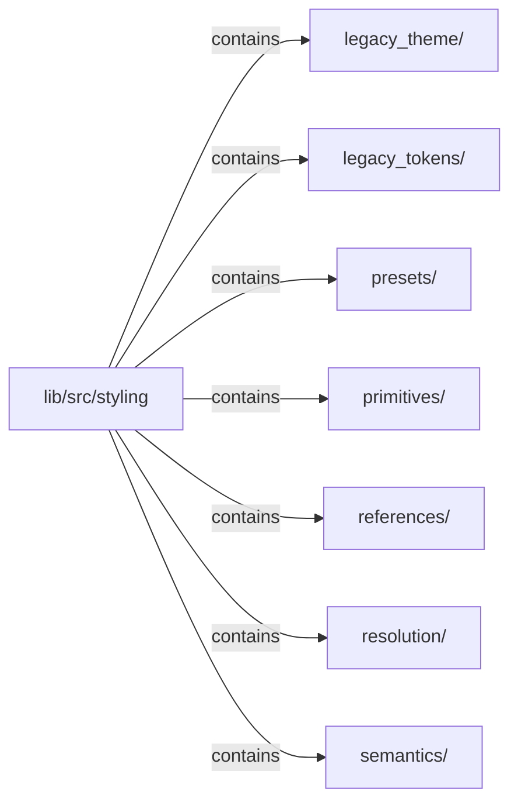

# lib/src/styling：架構分析入口

[上一層](../README.md)

## 範圍

閱讀 `lib/src/styling` 的直接子目錄與 Dart 檔案。結構圖表示實際檔案包含關係；依賴圖表示本層檔案明寫的 directives。每個檔案頁另列直接依賴、宣告、欄位、方法、建構子及行號證據。

## 模組閱讀重點

## 分析入口

新風格資料樣板：`primitives/` 固定量值種類與完整集合；`references/` 是封閉同型參照；`semantics/` 定義用途 owner、名稱與引用公開性；`resolution/internal/` 驗證引用圖並求值。公開型別從 `kallopis_declarative.dart` 匯出，resolver 與結果快照維持 internal。

`KlpDefinition` 將 schema owner 綁定定義 id，`KlpRegistry` 掛載前驗證全量語意。跨 owner 需宣告相依且目標公開，不能覆寫對方用途；實際目標 kind 仍需核對，避免同名假 key。

目前只提供原料及用途引用，沒有 renderer、正式預設風格、狀態混合或無障礙求值政策。八槽原料 schema 尚未凍結，兩套測試資料只證明資料替換，不證明完整視覺穩定性。詳見 [契約樣板](../../styling-contract-prototype.md)。

## 本層直接依賴圖

箭頭以本層 Dart 檔案明寫的 directive 彙總到目標所在目錄或外部套件邊界；不遞迴將子目錄依賴算入本層。相同目標的不同 directive 類型分開計數。

本層檔案未宣告跨目錄依賴；子目錄依賴請循下一層入口閱讀。

| 目標邊界 | 關係 | directive 數 | 第一筆來源證據 |
|---|---|---|---|
| 無 | — | 0 | 來源清單見本層檔案 |

## 目錄結構圖

## 子目錄

| 目錄 | 導航 | 來源證據 |
|---|---|---|
| `legacy_theme/` | [架構入口](legacy_theme/README.md) | [來源目錄](../../../../lib/src/styling/legacy_theme) |
| `legacy_tokens/` | [架構入口](legacy_tokens/README.md) | [來源目錄](../../../../lib/src/styling/legacy_tokens) |
| `presets/` | [架構入口](presets/README.md) | [來源目錄](../../../../lib/src/styling/presets) |
| `primitives/` | [架構入口](primitives/README.md) | [來源目錄](../../../../lib/src/styling/primitives) |
| `references/` | [架構入口](references/README.md) | [來源目錄](../../../../lib/src/styling/references) |
| `resolution/` | [架構入口](resolution/README.md) | [來源目錄](../../../../lib/src/styling/resolution) |
| `semantics/` | [架構入口](semantics/README.md) | [來源目錄](../../../../lib/src/styling/semantics) |

## 本層檔案

| 檔案 | 宣告 | 細節 | 來源證據 |
|---|---|---|---|
| 無 | 本層沒有 Dart 檔案 | — | — |

## 閱讀說明

箭頭只表示來源明寫的靜態關係；import 不等於呼叫。未分析動態呼叫、欄位的實際物件擁有權、狀態轉移或渲染流程；型別未進行語意解析，繼承目標保留原始型別拼寫。public／private 依 Dart 名稱前綴判斷；public 宣告不代表已由 `lib/kallopis.dart` 匯出。

本頁的目錄與檔案由來源清冊產生；`manifest.json` 位於本圖集根目錄，可核對 SHA-256 與覆蓋數。人工模組摘要存於 `tool/architecture_atlas/briefs/`，重新生成時保留。
