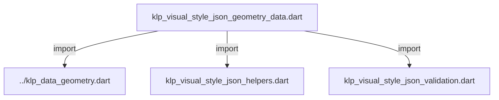

# klp_visual_style_json_geometry_data.dart：直接依賴與宣告架構

[回到目錄](README.md) · [來源檔案](../../../../../../lib/src/styling/legacy_theme/internal/klp_visual_style_json_geometry_data.dart)

## 範圍

核心是 `lib/src/styling/legacy_theme/internal/klp_visual_style_json_geometry_data.dart`。主要視角為該檔案明寫的 import／export／part；輔助視角為本檔宣告及 extends／implements／with／on 關係。只展開一層外部邊界。

## 直接依賴圖

## 依賴證據

| 關係 | 原始 directive | 來源 |
|---|---|---|
| import | <code>import &#x27;../klp_data_geometry.dart&#x27;;</code> | [lib/src/styling/legacy_theme/internal/klp_visual_style_json_geometry_data.dart:1](../../../../../../lib/src/styling/legacy_theme/internal/klp_visual_style_json_geometry_data.dart#L1) |
| import | <code>import &#x27;klp_visual_style_json_helpers.dart&#x27;;</code> | [lib/src/styling/legacy_theme/internal/klp_visual_style_json_geometry_data.dart:2](../../../../../../lib/src/styling/legacy_theme/internal/klp_visual_style_json_geometry_data.dart#L2) |
| import | <code>import &#x27;klp_visual_style_json_validation.dart&#x27;;</code> | [lib/src/styling/legacy_theme/internal/klp_visual_style_json_geometry_data.dart:3](../../../../../../lib/src/styling/legacy_theme/internal/klp_visual_style_json_geometry_data.dart#L3) |

## 宣告關係圖

本檔沒有 class／enum／mixin／extension 宣告；頂層函式、變數與 typedef 見下表。

## 宣告與成員證據

成員包含 public 與 private；簽章取自來源，省略函式本體與欄位初始值。`(inferred)` 表示來源未明寫型別；建構子只顯示參數部分，不含初始化列表。

### _keys

top-level variable · private · [lib/src/styling/legacy_theme/internal/klp_visual_style_json_geometry_data.dart:5](../../../../../../lib/src/styling/legacy_theme/internal/klp_visual_style_json_geometry_data.dart#L5)

<code>const (inferred) _keys</code>

### decodeDataGeometry

FunctionDeclaration · public · [lib/src/styling/legacy_theme/internal/klp_visual_style_json_geometry_data.dart:39](../../../../../../lib/src/styling/legacy_theme/internal/klp_visual_style_json_geometry_data.dart#L39)

<code>KlpDataGeometry decodeDataGeometry(KlpJsonMap json, KlpDataGeometry base)</code>

## 閱讀說明與限制

箭頭只表示來源明寫的靜態關係；import 不等於呼叫。未分析動態呼叫、欄位的實際物件擁有權、狀態轉移或渲染流程；型別未進行語意解析，繼承目標保留原始型別拼寫。public／private 依 Dart 名稱前綴判斷；public 宣告不代表已由 `lib/kallopis.dart` 匯出。

本頁由 `tool/architecture_atlas` 產生；編輯來源或生成工具後重新產生，避免手改本頁。
