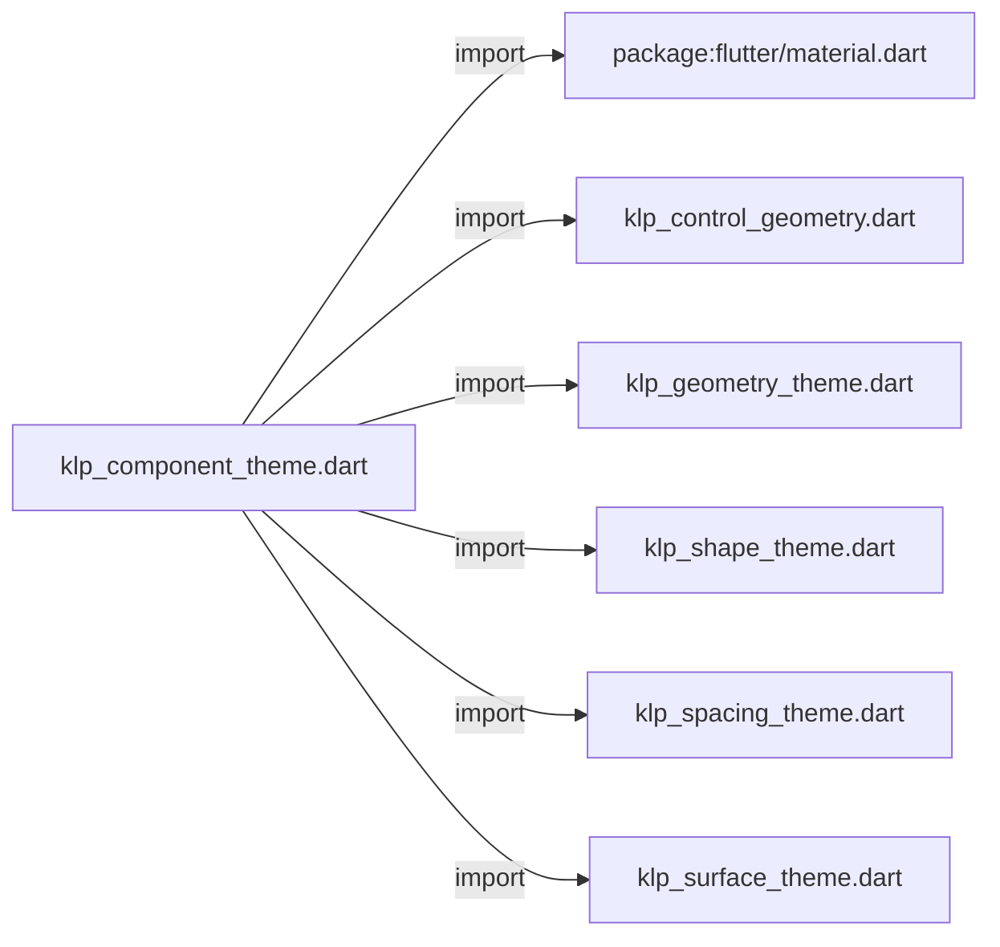
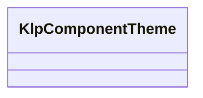
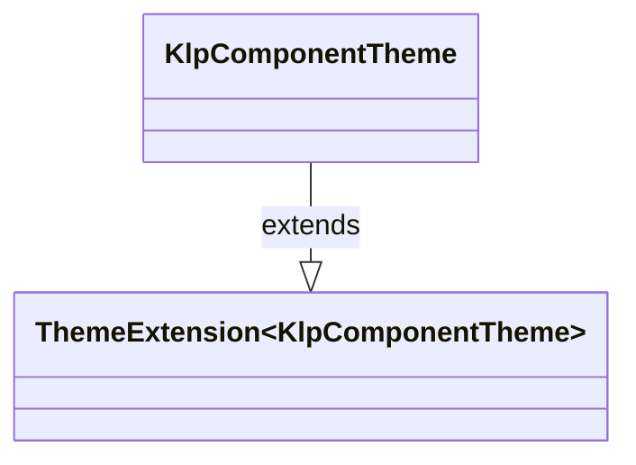

# klp_component_theme.dart：直接依賴與宣告架構

[回到目錄](README.md) · [來源檔案](../../../../../lib/src/styling/legacy_theme/klp_component_theme.dart)

## 範圍

核心是 `lib/src/styling/legacy_theme/klp_component_theme.dart`。主要視角為該檔案明寫的 import／export／part；輔助視角為本檔宣告及 extends／implements／with／on 關係。只展開一層外部邊界。

## 直接依賴圖

## 依賴證據

| 關係 | 原始 directive | 來源 |
|---|---|---|
| import | <code>import &#x27;package:flutter/material.dart&#x27;;</code> | [lib/src/styling/legacy_theme/klp_component_theme.dart:1](../../../../../lib/src/styling/legacy_theme/klp_component_theme.dart#L1) |
| import | <code>import &#x27;klp_control_geometry.dart&#x27;;</code> | [lib/src/styling/legacy_theme/klp_component_theme.dart:3](../../../../../lib/src/styling/legacy_theme/klp_component_theme.dart#L3) |
| import | <code>import &#x27;klp_geometry_theme.dart&#x27;;</code> | [lib/src/styling/legacy_theme/klp_component_theme.dart:4](../../../../../lib/src/styling/legacy_theme/klp_component_theme.dart#L4) |
| import | <code>import &#x27;klp_shape_theme.dart&#x27;;</code> | [lib/src/styling/legacy_theme/klp_component_theme.dart:5](../../../../../lib/src/styling/legacy_theme/klp_component_theme.dart#L5) |
| import | <code>import &#x27;klp_spacing_theme.dart&#x27;;</code> | [lib/src/styling/legacy_theme/klp_component_theme.dart:6](../../../../../lib/src/styling/legacy_theme/klp_component_theme.dart#L6) |
| import | <code>import &#x27;klp_surface_theme.dart&#x27;;</code> | [lib/src/styling/legacy_theme/klp_component_theme.dart:7](../../../../../lib/src/styling/legacy_theme/klp_component_theme.dart#L7) |

## 宣告關係圖

本組節點是本檔宣告；沒有箭頭的宣告未在此圖主張互相依賴。

## 宣告與成員證據

成員包含 public 與 private；簽章取自來源，省略函式本體與欄位初始值。`(inferred)` 表示來源未明寫型別；建構子只顯示參數部分，不含初始化列表。

### KlpComponentTheme

ClassDeclaration · public · [lib/src/styling/legacy_theme/klp_component_theme.dart:9](../../../../../lib/src/styling/legacy_theme/klp_component_theme.dart#L9)

<code>class KlpComponentTheme extends ThemeExtension&lt;KlpComponentTheme&gt;</code>

來源註解摘要：Layer 3：component token。 只有當某個元件**需要偏離** semantic 預設時才在這裡出現。每個欄位都是 nullable， `null` 表示「沿用 semantic」——因此這一層是稀疏的，不是把 semantic 抄一遍。 元件永遠透過 [resolve] 系列方法取值，拿到的一定是已解析的具體數值，元件本身不需要 知道值來自哪一層。這是「風格繼承樹」的落點：primitive → semantic → component， 由下往上找第一個有定義的值。

- `extends` → <code>ThemeExtension&lt;KlpComponentTheme&gt;</code>：[lib/src/styling/legacy_theme/klp_component_theme.dart:18](../../../../../lib/src/styling/legacy_theme/klp_component_theme.dart#L18)

| 成員 | 可見性 | 簽章／型別 | 來源註解摘要 | 證據 |
|---|---|---|---|---|
| constructor <code>KlpComponentTheme</code> | public | <code>const KlpComponentTheme({ this.buttonRadius, this.buttonPaddingX, this.buttonPaddingY, this.buttonHeight, this.buttonBorderWidth, this.fieldRadius, this.fieldPaddingX, this.fieldHeight, this.fieldBorderWidth, this.menuRadius, this.menuPadding, this.menuItemHeight, this.cardRadius, this.cardPadding, this.badgeRadius, this.badgePaddingX, })</code> |  | [lib/src/styling/legacy_theme/klp_component_theme.dart:19](../../../../../lib/src/styling/legacy_theme/klp_component_theme.dart#L19) |
| field <code>buttonRadius</code> | public | <code>final double? buttonRadius</code> |  | [lib/src/styling/legacy_theme/klp_component_theme.dart:38](../../../../../lib/src/styling/legacy_theme/klp_component_theme.dart#L38) |
| field <code>buttonPaddingX</code> | public | <code>final double? buttonPaddingX</code> |  | [lib/src/styling/legacy_theme/klp_component_theme.dart:39](../../../../../lib/src/styling/legacy_theme/klp_component_theme.dart#L39) |
| field <code>buttonPaddingY</code> | public | <code>final double? buttonPaddingY</code> |  | [lib/src/styling/legacy_theme/klp_component_theme.dart:40](../../../../../lib/src/styling/legacy_theme/klp_component_theme.dart#L40) |
| field <code>buttonHeight</code> | public | <code>final double? buttonHeight</code> |  | [lib/src/styling/legacy_theme/klp_component_theme.dart:41](../../../../../lib/src/styling/legacy_theme/klp_component_theme.dart#L41) |
| field <code>buttonBorderWidth</code> | public | <code>final double? buttonBorderWidth</code> |  | [lib/src/styling/legacy_theme/klp_component_theme.dart:42](../../../../../lib/src/styling/legacy_theme/klp_component_theme.dart#L42) |
| field <code>fieldRadius</code> | public | <code>final double? fieldRadius</code> |  | [lib/src/styling/legacy_theme/klp_component_theme.dart:44](../../../../../lib/src/styling/legacy_theme/klp_component_theme.dart#L44) |
| field <code>fieldPaddingX</code> | public | <code>final double? fieldPaddingX</code> |  | [lib/src/styling/legacy_theme/klp_component_theme.dart:45](../../../../../lib/src/styling/legacy_theme/klp_component_theme.dart#L45) |
| field <code>fieldHeight</code> | public | <code>final double? fieldHeight</code> |  | [lib/src/styling/legacy_theme/klp_component_theme.dart:46](../../../../../lib/src/styling/legacy_theme/klp_component_theme.dart#L46) |
| field <code>fieldBorderWidth</code> | public | <code>final double? fieldBorderWidth</code> |  | [lib/src/styling/legacy_theme/klp_component_theme.dart:47](../../../../../lib/src/styling/legacy_theme/klp_component_theme.dart#L47) |
| field <code>menuRadius</code> | public | <code>final double? menuRadius</code> |  | [lib/src/styling/legacy_theme/klp_component_theme.dart:49](../../../../../lib/src/styling/legacy_theme/klp_component_theme.dart#L49) |
| field <code>menuPadding</code> | public | <code>final double? menuPadding</code> |  | [lib/src/styling/legacy_theme/klp_component_theme.dart:50](../../../../../lib/src/styling/legacy_theme/klp_component_theme.dart#L50) |
| field <code>menuItemHeight</code> | public | <code>final double? menuItemHeight</code> |  | [lib/src/styling/legacy_theme/klp_component_theme.dart:51](../../../../../lib/src/styling/legacy_theme/klp_component_theme.dart#L51) |
| field <code>cardRadius</code> | public | <code>final double? cardRadius</code> |  | [lib/src/styling/legacy_theme/klp_component_theme.dart:53](../../../../../lib/src/styling/legacy_theme/klp_component_theme.dart#L53) |
| field <code>cardPadding</code> | public | <code>final double? cardPadding</code> |  | [lib/src/styling/legacy_theme/klp_component_theme.dart:54](../../../../../lib/src/styling/legacy_theme/klp_component_theme.dart#L54) |
| field <code>badgeRadius</code> | public | <code>final double? badgeRadius</code> |  | [lib/src/styling/legacy_theme/klp_component_theme.dart:56](../../../../../lib/src/styling/legacy_theme/klp_component_theme.dart#L56) |
| field <code>badgePaddingX</code> | public | <code>final double? badgePaddingX</code> |  | [lib/src/styling/legacy_theme/klp_component_theme.dart:57](../../../../../lib/src/styling/legacy_theme/klp_component_theme.dart#L57) |
| field <code>inherited</code> | public | <code>static const KlpComponentTheme inherited</code> | 沒有任何偏離，全部沿用 semantic。這是預設，也是應該最常見的狀態—— component token 大量出現代表 semantic 層沒設計好。 | [lib/src/styling/legacy_theme/klp_component_theme.dart:61](../../../../../lib/src/styling/legacy_theme/klp_component_theme.dart#L61) |
| method <code>resolveButtonRadius</code> | public | <code>double resolveButtonRadius(KlpShapeTheme shape)</code> |  | [lib/src/styling/legacy_theme/klp_component_theme.dart:65](../../../../../lib/src/styling/legacy_theme/klp_component_theme.dart#L65) |
| method <code>resolveButtonPaddingX</code> | public | <code>double resolveButtonPaddingX(KlpSpacingTheme s)</code> |  | [lib/src/styling/legacy_theme/klp_component_theme.dart:67](../../../../../lib/src/styling/legacy_theme/klp_component_theme.dart#L67) |
| method <code>resolveButtonPaddingY</code> | public | <code>double resolveButtonPaddingY(KlpSpacingTheme s)</code> |  | [lib/src/styling/legacy_theme/klp_component_theme.dart:69](../../../../../lib/src/styling/legacy_theme/klp_component_theme.dart#L69) |
| method <code>resolveButtonHeight</code> | public | <code>double resolveButtonHeight(KlpControlGeometry geometry)</code> |  | [lib/src/styling/legacy_theme/klp_component_theme.dart:71](../../../../../lib/src/styling/legacy_theme/klp_component_theme.dart#L71) |
| method <code>resolveButtonBorderWidth</code> | public | <code>double resolveButtonBorderWidth(KlpShapeTheme shape, KlpSurfaceTheme _)</code> |  | [lib/src/styling/legacy_theme/klp_component_theme.dart:73](../../../../../lib/src/styling/legacy_theme/klp_component_theme.dart#L73) |
| method <code>resolveFieldRadius</code> | public | <code>double resolveFieldRadius(KlpShapeTheme shape)</code> |  | [lib/src/styling/legacy_theme/klp_component_theme.dart:76](../../../../../lib/src/styling/legacy_theme/klp_component_theme.dart#L76) |
| method <code>resolveFieldPaddingX</code> | public | <code>double resolveFieldPaddingX(KlpSpacingTheme s)</code> |  | [lib/src/styling/legacy_theme/klp_component_theme.dart:78](../../../../../lib/src/styling/legacy_theme/klp_component_theme.dart#L78) |
| method <code>resolveFieldHeight</code> | public | <code>double resolveFieldHeight(KlpSpacingTheme s)</code> |  | [lib/src/styling/legacy_theme/klp_component_theme.dart:80](../../../../../lib/src/styling/legacy_theme/klp_component_theme.dart#L80) |
| method <code>resolveFieldBorderWidth</code> | public | <code>double resolveFieldBorderWidth(KlpShapeTheme shape)</code> |  | [lib/src/styling/legacy_theme/klp_component_theme.dart:82](../../../../../lib/src/styling/legacy_theme/klp_component_theme.dart#L82) |
| method <code>resolveMenuRadius</code> | public | <code>double resolveMenuRadius(KlpShapeTheme shape)</code> |  | [lib/src/styling/legacy_theme/klp_component_theme.dart:85](../../../../../lib/src/styling/legacy_theme/klp_component_theme.dart#L85) |
| method <code>resolveMenuPadding</code> | public | <code>double resolveMenuPadding(KlpSpacingTheme s)</code> |  | [lib/src/styling/legacy_theme/klp_component_theme.dart:86](../../../../../lib/src/styling/legacy_theme/klp_component_theme.dart#L86) |
| method <code>resolveMenuItemHeight</code> | public | <code>double resolveMenuItemHeight(KlpSpacingTheme s)</code> |  | [lib/src/styling/legacy_theme/klp_component_theme.dart:88](../../../../../lib/src/styling/legacy_theme/klp_component_theme.dart#L88) |
| method <code>resolveMenuItemHeightWithGeometry</code> | public | <code>double resolveMenuItemHeightWithGeometry(KlpGeometryTheme geometry)</code> |  | [lib/src/styling/legacy_theme/klp_component_theme.dart:90](../../../../../lib/src/styling/legacy_theme/klp_component_theme.dart#L90) |
| method <code>resolveCardRadius</code> | public | <code>double resolveCardRadius(KlpShapeTheme shape)</code> |  | [lib/src/styling/legacy_theme/klp_component_theme.dart:93](../../../../../lib/src/styling/legacy_theme/klp_component_theme.dart#L93) |
| method <code>resolveCardPadding</code> | public | <code>double resolveCardPadding(KlpSpacingTheme s)</code> |  | [lib/src/styling/legacy_theme/klp_component_theme.dart:94](../../../../../lib/src/styling/legacy_theme/klp_component_theme.dart#L94) |
| method <code>resolveBadgeRadius</code> | public | <code>double resolveBadgeRadius(KlpShapeTheme shape)</code> |  | [lib/src/styling/legacy_theme/klp_component_theme.dart:97](../../../../../lib/src/styling/legacy_theme/klp_component_theme.dart#L97) |
| method <code>resolveBadgePaddingX</code> | public | <code>double resolveBadgePaddingX(KlpSpacingTheme spacing)</code> |  | [lib/src/styling/legacy_theme/klp_component_theme.dart:98](../../../../../lib/src/styling/legacy_theme/klp_component_theme.dart#L98) |
| method <code>copyWith</code> | public | <code>KlpComponentTheme copyWith({ double? buttonRadius, double? buttonPaddingX, double? buttonPaddingY, double? buttonHeight, double? buttonBorderWidth, double? fieldRadius, double? fieldPaddingX, double? fieldHeight, double? fieldBorderWidth, double? menuRadius, double? menuPadding, double? menuItemHeight, double? cardRadius, double? cardPadding, double? badgeRadius, double? badgePaddingX, })</code> |  | [lib/src/styling/legacy_theme/klp_component_theme.dart:101](../../../../../lib/src/styling/legacy_theme/klp_component_theme.dart#L101) |
| method <code>lerp</code> | public | <code>KlpComponentTheme lerp(covariant KlpComponentTheme? other, double t)</code> | **不做內插。** `MaterialApp` 在 theme 變更時會跑一段過場並沿路呼叫 `lerp`。各層若各自內插， 中途會出現「某幾層已經換了、某幾層還沒」的混合狀態——那正是切換深淺色時看起來 「有些元件沒有跟著變」的原因：它們不是沒變，是停在中間值上。 因此整個 token 疊層一律在中點原子性地翻轉，任何時刻都只會是完整的其中一套。 | [lib/src/styling/legacy_theme/klp_component_theme.dart:140](../../../../../lib/src/styling/legacy_theme/klp_component_theme.dart#L140) |
| method <code>==</code> | public | <code>bool operator ==(Object other)</code> |  | [lib/src/styling/legacy_theme/klp_component_theme.dart:153](../../../../../lib/src/styling/legacy_theme/klp_component_theme.dart#L153) |
| getter <code>hashCode</code> | public | <code>int get hashCode</code> |  | [lib/src/styling/legacy_theme/klp_component_theme.dart:174](../../../../../lib/src/styling/legacy_theme/klp_component_theme.dart#L174) |

## 閱讀說明與限制

箭頭只表示來源明寫的靜態關係；import 不等於呼叫。未分析動態呼叫、欄位的實際物件擁有權、狀態轉移或渲染流程；型別未進行語意解析，繼承目標保留原始型別拼寫。public／private 依 Dart 名稱前綴判斷；public 宣告不代表已由 `lib/kallopis.dart` 匯出。

本頁由 `tool/architecture_atlas` 產生；編輯來源或生成工具後重新產生，避免手改本頁。
