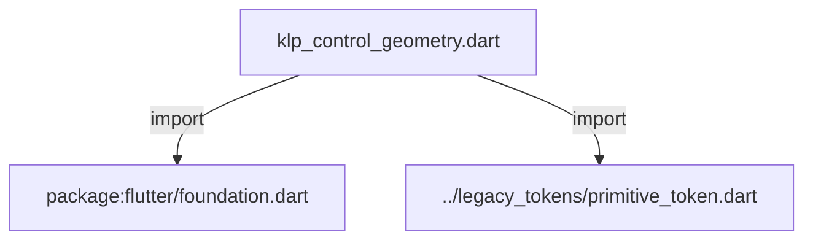
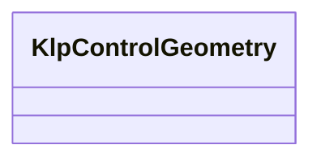

# klp_control_geometry.dart：直接依賴與宣告架構

[回到目錄](README.md) · [來源檔案](../../../../../lib/src/styling/legacy_theme/klp_control_geometry.dart)

## 範圍

核心是 `lib/src/styling/legacy_theme/klp_control_geometry.dart`。主要視角為該檔案明寫的 import／export／part；輔助視角為本檔宣告及 extends／implements／with／on 關係。只展開一層外部邊界。

## 直接依賴圖

## 依賴證據

| 關係 | 原始 directive | 來源 |
|---|---|---|
| import | <code>import &#x27;package:flutter/foundation.dart&#x27;;</code> | [lib/src/styling/legacy_theme/klp_control_geometry.dart:1](../../../../../lib/src/styling/legacy_theme/klp_control_geometry.dart#L1) |
| import | <code>import &#x27;../legacy_tokens/primitive_token.dart&#x27;;</code> | [lib/src/styling/legacy_theme/klp_control_geometry.dart:3](../../../../../lib/src/styling/legacy_theme/klp_control_geometry.dart#L3) |

## 宣告關係圖

本組節點是本檔宣告；沒有箭頭的宣告未在此圖主張互相依賴。

## 宣告與成員證據

成員包含 public 與 private；簽章取自來源，省略函式本體與欄位初始值。`(inferred)` 表示來源未明寫型別；建構子只顯示參數部分，不含初始化列表。

### KlpControlGeometry

ClassDeclaration · public · [lib/src/styling/legacy_theme/klp_control_geometry.dart:5](../../../../../lib/src/styling/legacy_theme/klp_control_geometry.dart#L5)

<code>class KlpControlGeometry</code>

來源註解摘要：表單與互動控制項的精確幾何。

| 成員 | 可見性 | 簽章／型別 | 來源註解摘要 | 證據 |
|---|---|---|---|---|
| constructor <code>KlpControlGeometry</code> | public | <code>const KlpControlGeometry({ this.switchTrackWidth = 36, this.switchTrackHeight = 20, this.switchThumb = 16, this.pageBackgroundHitRadius = KlpScale.space200, this.presenceMarkerExtent = KlpScale.space200, this.colorPickerCursorRadius = KlpScale.space200, this.swatchExtent = KlpScale.space200, this.segmentedProgressHeight = KlpScale.space200, required this.buttonHeightXSmall, required this.buttonHeightSmall, required this.buttonHeight, required this.buttonHeightLarge, required this.buttonHeightXLarge, required this.fieldHeight, required this.selectionControl, required this.selectionIndicatorInset, required this.selectionIcon, required this.toggleWidth, required this.toggleHeight, required this.toggleThumb, required this.toggleInset, required this.segmentedDenseHeight, required this.segmentedDenseInset, required this.segmentedDenseContentInset, required this.segmentedDenseItemHeight, required this.slidingSelectionHeight, required this.slidingSelectionSegmentWidth, required this.slidingSelectionPadding, required this.slidingSelectionIndicatorHeight, required this.scrollbarThickness, required this.sliderTrackHeight, required this.colorPlaneExtent, required this.textFieldIndicatorHeightFactor, required this.textFieldLineHeightFactor, required this.textFieldMinLines, required this.textFieldMaxLines, required this.fileExplorerRowHeightAdjustment, })</code> |  | [lib/src/styling/legacy_theme/klp_control_geometry.dart:8](../../../../../lib/src/styling/legacy_theme/klp_control_geometry.dart#L8) |
| field <code>switchTrackWidth</code> | public | <code>final double switchTrackWidth</code> |  | [lib/src/styling/legacy_theme/klp_control_geometry.dart:50](../../../../../lib/src/styling/legacy_theme/klp_control_geometry.dart#L50) |
| field <code>switchTrackHeight</code> | public | <code>final double switchTrackHeight</code> |  | [lib/src/styling/legacy_theme/klp_control_geometry.dart:51](../../../../../lib/src/styling/legacy_theme/klp_control_geometry.dart#L51) |
| field <code>switchThumb</code> | public | <code>final double switchThumb</code> |  | [lib/src/styling/legacy_theme/klp_control_geometry.dart:52](../../../../../lib/src/styling/legacy_theme/klp_control_geometry.dart#L52) |
| field <code>buttonHeightXSmall</code> | public | <code>final double buttonHeightXSmall</code> |  | [lib/src/styling/legacy_theme/klp_control_geometry.dart:53](../../../../../lib/src/styling/legacy_theme/klp_control_geometry.dart#L53) |
| field <code>buttonHeightSmall</code> | public | <code>final double buttonHeightSmall</code> |  | [lib/src/styling/legacy_theme/klp_control_geometry.dart:54](../../../../../lib/src/styling/legacy_theme/klp_control_geometry.dart#L54) |
| field <code>buttonHeight</code> | public | <code>final double buttonHeight</code> |  | [lib/src/styling/legacy_theme/klp_control_geometry.dart:55](../../../../../lib/src/styling/legacy_theme/klp_control_geometry.dart#L55) |
| field <code>buttonHeightLarge</code> | public | <code>final double buttonHeightLarge</code> |  | [lib/src/styling/legacy_theme/klp_control_geometry.dart:56](../../../../../lib/src/styling/legacy_theme/klp_control_geometry.dart#L56) |
| field <code>buttonHeightXLarge</code> | public | <code>final double buttonHeightXLarge</code> |  | [lib/src/styling/legacy_theme/klp_control_geometry.dart:57](../../../../../lib/src/styling/legacy_theme/klp_control_geometry.dart#L57) |
| field <code>pageBackgroundHitRadius</code> | public | <code>final double pageBackgroundHitRadius</code> |  | [lib/src/styling/legacy_theme/klp_control_geometry.dart:58](../../../../../lib/src/styling/legacy_theme/klp_control_geometry.dart#L58) |
| field <code>presenceMarkerExtent</code> | public | <code>final double presenceMarkerExtent</code> |  | [lib/src/styling/legacy_theme/klp_control_geometry.dart:59](../../../../../lib/src/styling/legacy_theme/klp_control_geometry.dart#L59) |
| field <code>colorPickerCursorRadius</code> | public | <code>final double colorPickerCursorRadius</code> |  | [lib/src/styling/legacy_theme/klp_control_geometry.dart:60](../../../../../lib/src/styling/legacy_theme/klp_control_geometry.dart#L60) |
| field <code>swatchExtent</code> | public | <code>final double swatchExtent</code> |  | [lib/src/styling/legacy_theme/klp_control_geometry.dart:61](../../../../../lib/src/styling/legacy_theme/klp_control_geometry.dart#L61) |
| field <code>segmentedProgressHeight</code> | public | <code>final double segmentedProgressHeight</code> |  | [lib/src/styling/legacy_theme/klp_control_geometry.dart:62](../../../../../lib/src/styling/legacy_theme/klp_control_geometry.dart#L62) |
| field <code>fieldHeight</code> | public | <code>final double fieldHeight</code> |  | [lib/src/styling/legacy_theme/klp_control_geometry.dart:63](../../../../../lib/src/styling/legacy_theme/klp_control_geometry.dart#L63) |
| field <code>selectionControl</code> | public | <code>final double selectionControl</code> |  | [lib/src/styling/legacy_theme/klp_control_geometry.dart:64](../../../../../lib/src/styling/legacy_theme/klp_control_geometry.dart#L64) |
| field <code>selectionIndicatorInset</code> | public | <code>final double selectionIndicatorInset</code> |  | [lib/src/styling/legacy_theme/klp_control_geometry.dart:65](../../../../../lib/src/styling/legacy_theme/klp_control_geometry.dart#L65) |
| field <code>selectionIcon</code> | public | <code>final double selectionIcon</code> |  | [lib/src/styling/legacy_theme/klp_control_geometry.dart:66](../../../../../lib/src/styling/legacy_theme/klp_control_geometry.dart#L66) |
| field <code>toggleWidth</code> | public | <code>final double toggleWidth</code> |  | [lib/src/styling/legacy_theme/klp_control_geometry.dart:67](../../../../../lib/src/styling/legacy_theme/klp_control_geometry.dart#L67) |
| field <code>toggleHeight</code> | public | <code>final double toggleHeight</code> |  | [lib/src/styling/legacy_theme/klp_control_geometry.dart:68](../../../../../lib/src/styling/legacy_theme/klp_control_geometry.dart#L68) |
| field <code>toggleThumb</code> | public | <code>final double toggleThumb</code> |  | [lib/src/styling/legacy_theme/klp_control_geometry.dart:69](../../../../../lib/src/styling/legacy_theme/klp_control_geometry.dart#L69) |
| field <code>toggleInset</code> | public | <code>final double toggleInset</code> |  | [lib/src/styling/legacy_theme/klp_control_geometry.dart:70](../../../../../lib/src/styling/legacy_theme/klp_control_geometry.dart#L70) |
| field <code>segmentedDenseHeight</code> | public | <code>final double segmentedDenseHeight</code> |  | [lib/src/styling/legacy_theme/klp_control_geometry.dart:71](../../../../../lib/src/styling/legacy_theme/klp_control_geometry.dart#L71) |
| field <code>segmentedDenseInset</code> | public | <code>final double segmentedDenseInset</code> |  | [lib/src/styling/legacy_theme/klp_control_geometry.dart:72](../../../../../lib/src/styling/legacy_theme/klp_control_geometry.dart#L72) |
| field <code>segmentedDenseContentInset</code> | public | <code>final double segmentedDenseContentInset</code> |  | [lib/src/styling/legacy_theme/klp_control_geometry.dart:73](../../../../../lib/src/styling/legacy_theme/klp_control_geometry.dart#L73) |
| field <code>segmentedDenseItemHeight</code> | public | <code>final double segmentedDenseItemHeight</code> |  | [lib/src/styling/legacy_theme/klp_control_geometry.dart:74](../../../../../lib/src/styling/legacy_theme/klp_control_geometry.dart#L74) |
| field <code>slidingSelectionHeight</code> | public | <code>final double slidingSelectionHeight</code> |  | [lib/src/styling/legacy_theme/klp_control_geometry.dart:75](../../../../../lib/src/styling/legacy_theme/klp_control_geometry.dart#L75) |
| field <code>slidingSelectionSegmentWidth</code> | public | <code>final double slidingSelectionSegmentWidth</code> |  | [lib/src/styling/legacy_theme/klp_control_geometry.dart:76](../../../../../lib/src/styling/legacy_theme/klp_control_geometry.dart#L76) |
| field <code>slidingSelectionPadding</code> | public | <code>final double slidingSelectionPadding</code> |  | [lib/src/styling/legacy_theme/klp_control_geometry.dart:77](../../../../../lib/src/styling/legacy_theme/klp_control_geometry.dart#L77) |
| field <code>slidingSelectionIndicatorHeight</code> | public | <code>final double slidingSelectionIndicatorHeight</code> |  | [lib/src/styling/legacy_theme/klp_control_geometry.dart:78](../../../../../lib/src/styling/legacy_theme/klp_control_geometry.dart#L78) |
| field <code>scrollbarThickness</code> | public | <code>final double scrollbarThickness</code> |  | [lib/src/styling/legacy_theme/klp_control_geometry.dart:79](../../../../../lib/src/styling/legacy_theme/klp_control_geometry.dart#L79) |
| field <code>sliderTrackHeight</code> | public | <code>final double sliderTrackHeight</code> |  | [lib/src/styling/legacy_theme/klp_control_geometry.dart:80](../../../../../lib/src/styling/legacy_theme/klp_control_geometry.dart#L80) |
| field <code>colorPlaneExtent</code> | public | <code>final double colorPlaneExtent</code> |  | [lib/src/styling/legacy_theme/klp_control_geometry.dart:81](../../../../../lib/src/styling/legacy_theme/klp_control_geometry.dart#L81) |
| field <code>textFieldIndicatorHeightFactor</code> | public | <code>final double textFieldIndicatorHeightFactor</code> |  | [lib/src/styling/legacy_theme/klp_control_geometry.dart:82](../../../../../lib/src/styling/legacy_theme/klp_control_geometry.dart#L82) |
| field <code>textFieldLineHeightFactor</code> | public | <code>final double textFieldLineHeightFactor</code> |  | [lib/src/styling/legacy_theme/klp_control_geometry.dart:83](../../../../../lib/src/styling/legacy_theme/klp_control_geometry.dart#L83) |
| field <code>textFieldMinLines</code> | public | <code>final int textFieldMinLines</code> |  | [lib/src/styling/legacy_theme/klp_control_geometry.dart:84](../../../../../lib/src/styling/legacy_theme/klp_control_geometry.dart#L84) |
| field <code>textFieldMaxLines</code> | public | <code>final int textFieldMaxLines</code> |  | [lib/src/styling/legacy_theme/klp_control_geometry.dart:85](../../../../../lib/src/styling/legacy_theme/klp_control_geometry.dart#L85) |
| field <code>fileExplorerRowHeightAdjustment</code> | public | <code>final double fileExplorerRowHeightAdjustment</code> |  | [lib/src/styling/legacy_theme/klp_control_geometry.dart:86](../../../../../lib/src/styling/legacy_theme/klp_control_geometry.dart#L86) |
| method <code>copyWith</code> | public | <code>KlpControlGeometry copyWith({ double? switchTrackWidth, double? switchTrackHeight, double? switchThumb, double? pageBackgroundHitRadius, double? presenceMarkerExtent, double? colorPickerCursorRadius, double? swatchExtent, double? segmentedProgressHeight, double? buttonHeightXSmall, double? buttonHeightSmall, double? buttonHeight, double? buttonHeightLarge, double? buttonHeightXLarge, double? fieldHeight, double? selectionControl, double? selectionIndicatorInset, double? selectionIcon, double? toggleWidth, double? toggleHeight, double? toggleThumb, double? toggleInset, double? segmentedDenseHeight, double? segmentedDenseInset, double? segmentedDenseContentInset, double? segmentedDenseItemHeight, double? slidingSelectionHeight, double? slidingSelectionSegmentWidth, double? slidingSelectionPadding, double? slidingSelectionIndicatorHeight, double? scrollbarThickness, double? sliderTrackHeight, double? colorPlaneExtent, double? textFieldIndicatorHeightFactor, double? textFieldLineHeightFactor, int? textFieldMinLines, int? textFieldMaxLines, double? fileExplorerRowHeightAdjustment, })</code> |  | [lib/src/styling/legacy_theme/klp_control_geometry.dart:88](../../../../../lib/src/styling/legacy_theme/klp_control_geometry.dart#L88) |
| method <code>==</code> | public | <code>bool operator ==(Object other)</code> |  | [lib/src/styling/legacy_theme/klp_control_geometry.dart:170](../../../../../lib/src/styling/legacy_theme/klp_control_geometry.dart#L170) |
| getter <code>hashCode</code> | public | <code>int get hashCode</code> |  | [lib/src/styling/legacy_theme/klp_control_geometry.dart:212](../../../../../lib/src/styling/legacy_theme/klp_control_geometry.dart#L212) |

## 閱讀說明與限制

箭頭只表示來源明寫的靜態關係；import 不等於呼叫。未分析動態呼叫、欄位的實際物件擁有權、狀態轉移或渲染流程；型別未進行語意解析，繼承目標保留原始型別拼寫。public／private 依 Dart 名稱前綴判斷；public 宣告不代表已由 `lib/kallopis.dart` 匯出。

本頁由 `tool/architecture_atlas` 產生；編輯來源或生成工具後重新產生，避免手改本頁。
