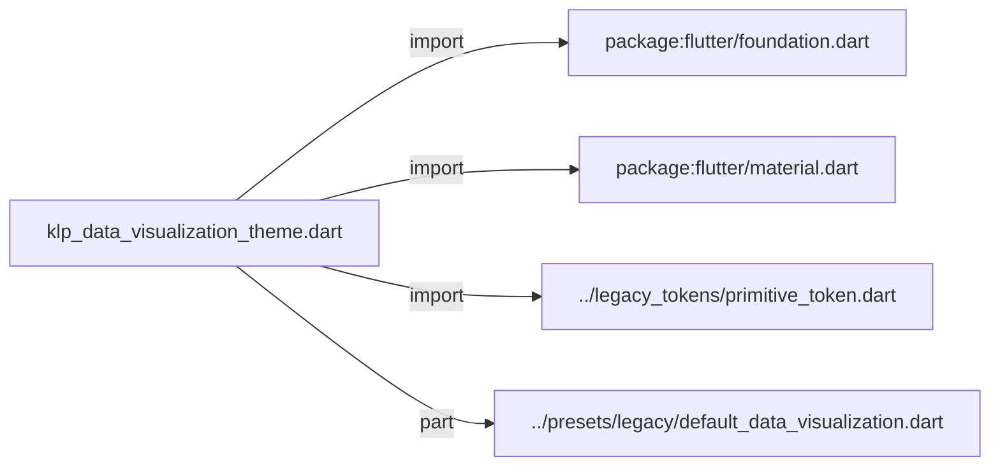
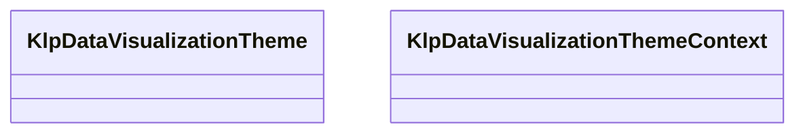
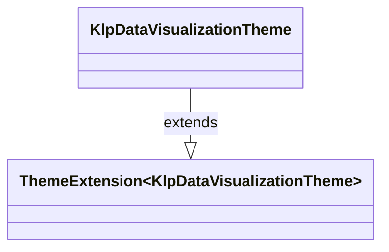
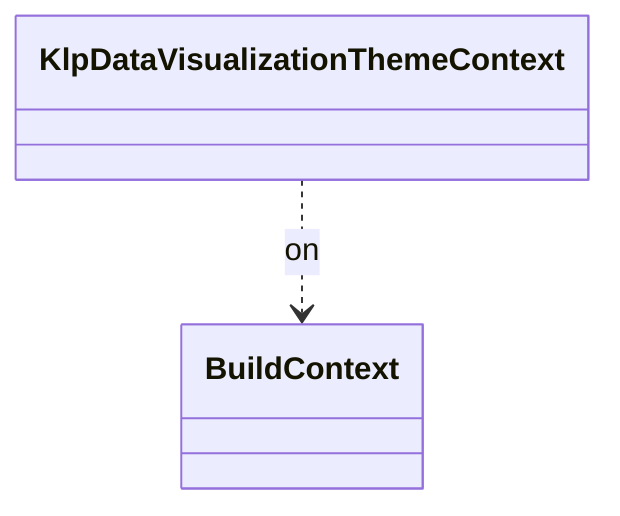

# klp_data_visualization_theme.dart：直接依賴與宣告架構

[回到目錄](README.md) · [來源檔案](../../../../../lib/src/styling/legacy_theme/klp_data_visualization_theme.dart)

## 範圍

核心是 `lib/src/styling/legacy_theme/klp_data_visualization_theme.dart`。主要視角為該檔案明寫的 import／export／part；輔助視角為本檔宣告及 extends／implements／with／on 關係。只展開一層外部邊界。

## 直接依賴圖

## 依賴證據

| 關係 | 原始 directive | 來源 |
|---|---|---|
| import | <code>import &#x27;package:flutter/foundation.dart&#x27;;</code> | [lib/src/styling/legacy_theme/klp_data_visualization_theme.dart:1](../../../../../lib/src/styling/legacy_theme/klp_data_visualization_theme.dart#L1) |
| import | <code>import &#x27;package:flutter/material.dart&#x27;;</code> | [lib/src/styling/legacy_theme/klp_data_visualization_theme.dart:2](../../../../../lib/src/styling/legacy_theme/klp_data_visualization_theme.dart#L2) |
| import | <code>import &#x27;../legacy_tokens/primitive_token.dart&#x27;;</code> | [lib/src/styling/legacy_theme/klp_data_visualization_theme.dart:3](../../../../../lib/src/styling/legacy_theme/klp_data_visualization_theme.dart#L3) |
| part | <code>part &#x27;../presets/legacy/default_data_visualization.dart&#x27;;</code> | [lib/src/styling/legacy_theme/klp_data_visualization_theme.dart:5](../../../../../lib/src/styling/legacy_theme/klp_data_visualization_theme.dart#L5) |

## 宣告關係圖

本組節點是本檔宣告；沒有箭頭的宣告未在此圖主張互相依賴。

## 宣告與成員證據

成員包含 public 與 private；簽章取自來源，省略函式本體與欄位初始值。`(inferred)` 表示來源未明寫型別；建構子只顯示參數部分，不含初始化列表。

### KlpDataVisualizationTheme

ClassDeclaration · public · [lib/src/styling/legacy_theme/klp_data_visualization_theme.dart:7](../../../../../lib/src/styling/legacy_theme/klp_data_visualization_theme.dart#L7)

<code>class KlpDataVisualizationTheme extends ThemeExtension&lt;KlpDataVisualizationTheme&gt;</code>

- `extends` → <code>ThemeExtension&lt;KlpDataVisualizationTheme&gt;</code>：[lib/src/styling/legacy_theme/klp_data_visualization_theme.dart:9](../../../../../lib/src/styling/legacy_theme/klp_data_visualization_theme.dart#L9)

| 成員 | 可見性 | 簽章／型別 | 來源註解摘要 | 證據 |
|---|---|---|---|---|
| constructor <code>KlpDataVisualizationTheme</code> | public | <code>const KlpDataVisualizationTheme({ required this.series, required this.seriesWash, required this.axis, required this.grid, required this.gridStrong, required this.label, required this.value, required this.plotBackground, required this.crosshair, required this.marketUp, required this.marketUpWash, required this.marketDown, required this.marketDownWash, required this.marketFlat, })</code> |  | [lib/src/styling/legacy_theme/klp_data_visualization_theme.dart:10](../../../../../lib/src/styling/legacy_theme/klp_data_visualization_theme.dart#L10) |
| field <code>series</code> | public | <code>final List&lt;Color&gt; series</code> |  | [lib/src/styling/legacy_theme/klp_data_visualization_theme.dart:27](../../../../../lib/src/styling/legacy_theme/klp_data_visualization_theme.dart#L27) |
| field <code>seriesWash</code> | public | <code>final List&lt;Color&gt; seriesWash</code> |  | [lib/src/styling/legacy_theme/klp_data_visualization_theme.dart:28](../../../../../lib/src/styling/legacy_theme/klp_data_visualization_theme.dart#L28) |
| field <code>axis</code> | public | <code>final Color axis</code> |  | [lib/src/styling/legacy_theme/klp_data_visualization_theme.dart:29](../../../../../lib/src/styling/legacy_theme/klp_data_visualization_theme.dart#L29) |
| field <code>grid</code> | public | <code>final Color grid</code> |  | [lib/src/styling/legacy_theme/klp_data_visualization_theme.dart:30](../../../../../lib/src/styling/legacy_theme/klp_data_visualization_theme.dart#L30) |
| field <code>gridStrong</code> | public | <code>final Color gridStrong</code> |  | [lib/src/styling/legacy_theme/klp_data_visualization_theme.dart:31](../../../../../lib/src/styling/legacy_theme/klp_data_visualization_theme.dart#L31) |
| field <code>label</code> | public | <code>final Color label</code> |  | [lib/src/styling/legacy_theme/klp_data_visualization_theme.dart:32](../../../../../lib/src/styling/legacy_theme/klp_data_visualization_theme.dart#L32) |
| field <code>value</code> | public | <code>final Color value</code> |  | [lib/src/styling/legacy_theme/klp_data_visualization_theme.dart:33](../../../../../lib/src/styling/legacy_theme/klp_data_visualization_theme.dart#L33) |
| field <code>plotBackground</code> | public | <code>final Color plotBackground</code> |  | [lib/src/styling/legacy_theme/klp_data_visualization_theme.dart:34](../../../../../lib/src/styling/legacy_theme/klp_data_visualization_theme.dart#L34) |
| field <code>crosshair</code> | public | <code>final Color crosshair</code> |  | [lib/src/styling/legacy_theme/klp_data_visualization_theme.dart:35](../../../../../lib/src/styling/legacy_theme/klp_data_visualization_theme.dart#L35) |
| field <code>marketUp</code> | public | <code>final Color marketUp</code> |  | [lib/src/styling/legacy_theme/klp_data_visualization_theme.dart:36](../../../../../lib/src/styling/legacy_theme/klp_data_visualization_theme.dart#L36) |
| field <code>marketUpWash</code> | public | <code>final Color marketUpWash</code> |  | [lib/src/styling/legacy_theme/klp_data_visualization_theme.dart:37](../../../../../lib/src/styling/legacy_theme/klp_data_visualization_theme.dart#L37) |
| field <code>marketDown</code> | public | <code>final Color marketDown</code> |  | [lib/src/styling/legacy_theme/klp_data_visualization_theme.dart:38](../../../../../lib/src/styling/legacy_theme/klp_data_visualization_theme.dart#L38) |
| field <code>marketDownWash</code> | public | <code>final Color marketDownWash</code> |  | [lib/src/styling/legacy_theme/klp_data_visualization_theme.dart:39](../../../../../lib/src/styling/legacy_theme/klp_data_visualization_theme.dart#L39) |
| field <code>marketFlat</code> | public | <code>final Color marketFlat</code> |  | [lib/src/styling/legacy_theme/klp_data_visualization_theme.dart:40](../../../../../lib/src/styling/legacy_theme/klp_data_visualization_theme.dart#L40) |
| method <code>seriesColor</code> | public | <code>Color seriesColor(int index)</code> |  | [lib/src/styling/legacy_theme/klp_data_visualization_theme.dart:42](../../../../../lib/src/styling/legacy_theme/klp_data_visualization_theme.dart#L42) |
| method <code>seriesWashColor</code> | public | <code>Color seriesWashColor(int index)</code> |  | [lib/src/styling/legacy_theme/klp_data_visualization_theme.dart:47](../../../../../lib/src/styling/legacy_theme/klp_data_visualization_theme.dart#L47) |
| field <code>light</code> | public | <code>static const (inferred) light</code> |  | [lib/src/styling/legacy_theme/klp_data_visualization_theme.dart:52](../../../../../lib/src/styling/legacy_theme/klp_data_visualization_theme.dart#L52) |
| field <code>dark</code> | public | <code>static const (inferred) dark</code> |  | [lib/src/styling/legacy_theme/klp_data_visualization_theme.dart:54](../../../../../lib/src/styling/legacy_theme/klp_data_visualization_theme.dart#L54) |
| field <code>ultraDark</code> | public | <code>static const (inferred) ultraDark</code> |  | [lib/src/styling/legacy_theme/klp_data_visualization_theme.dart:56](../../../../../lib/src/styling/legacy_theme/klp_data_visualization_theme.dart#L56) |
| method <code>copyWith</code> | public | <code>KlpDataVisualizationTheme copyWith({ List&lt;Color&gt;? series, List&lt;Color&gt;? seriesWash, Color? axis, Color? grid, Color? gridStrong, Color? label, Color? value, Color? plotBackground, Color? crosshair, Color? marketUp, Color? marketUpWash, Color? marketDown, Color? marketDownWash, Color? marketFlat, })</code> |  | [lib/src/styling/legacy_theme/klp_data_visualization_theme.dart:58](../../../../../lib/src/styling/legacy_theme/klp_data_visualization_theme.dart#L58) |
| method <code>lerp</code> | public | <code>KlpDataVisualizationTheme lerp( covariant KlpDataVisualizationTheme? other, double t, )</code> | **不做內插。** `MaterialApp` 在 theme 變更時會跑一段過場並沿路呼叫 `lerp`。各層若各自內插， 中途會出現「某幾層已經換了、某幾層還沒」的混合狀態——那正是切換深淺色時看起來 「有些元件沒有跟著變」的原因：它們不是沒變，是停在中間值上。 因此整個 token 疊層一律在中點原子性地翻轉，任何時刻都只會是完整的其中一套。 | [lib/src/styling/legacy_theme/klp_data_visualization_theme.dart:93](../../../../../lib/src/styling/legacy_theme/klp_data_visualization_theme.dart#L93) |
| method <code>==</code> | public | <code>bool operator ==(Object other)</code> |  | [lib/src/styling/legacy_theme/klp_data_visualization_theme.dart:109](../../../../../lib/src/styling/legacy_theme/klp_data_visualization_theme.dart#L109) |
| getter <code>hashCode</code> | public | <code>int get hashCode</code> |  | [lib/src/styling/legacy_theme/klp_data_visualization_theme.dart:128](../../../../../lib/src/styling/legacy_theme/klp_data_visualization_theme.dart#L128) |

### KlpDataVisualizationThemeContext

ExtensionDeclaration · public · [lib/src/styling/legacy_theme/klp_data_visualization_theme.dart:147](../../../../../lib/src/styling/legacy_theme/klp_data_visualization_theme.dart#L147)

<code>extension KlpDataVisualizationThemeContext on BuildContext</code>

- `on` → <code>BuildContext</code>：[lib/src/styling/legacy_theme/klp_data_visualization_theme.dart:147](../../../../../lib/src/styling/legacy_theme/klp_data_visualization_theme.dart#L147)

| 成員 | 可見性 | 簽章／型別 | 來源註解摘要 | 證據 |
|---|---|---|---|---|
| getter <code>klpDataVisualization</code> | public | <code>KlpDataVisualizationTheme get klpDataVisualization</code> |  | [lib/src/styling/legacy_theme/klp_data_visualization_theme.dart:148](../../../../../lib/src/styling/legacy_theme/klp_data_visualization_theme.dart#L148) |

## 閱讀說明與限制

箭頭只表示來源明寫的靜態關係；import 不等於呼叫。未分析動態呼叫、欄位的實際物件擁有權、狀態轉移或渲染流程；型別未進行語意解析，繼承目標保留原始型別拼寫。public／private 依 Dart 名稱前綴判斷；public 宣告不代表已由 `lib/kallopis.dart` 匯出。

本頁由 `tool/architecture_atlas` 產生；編輯來源或生成工具後重新產生，避免手改本頁。
