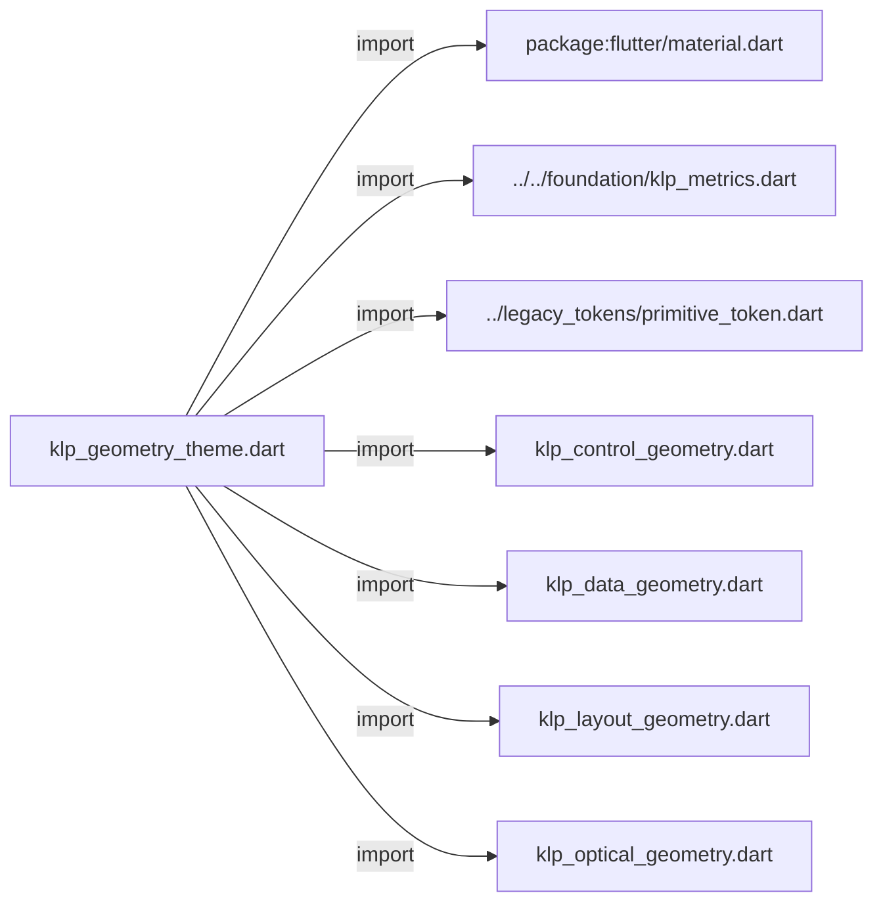
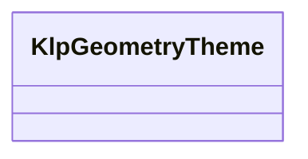
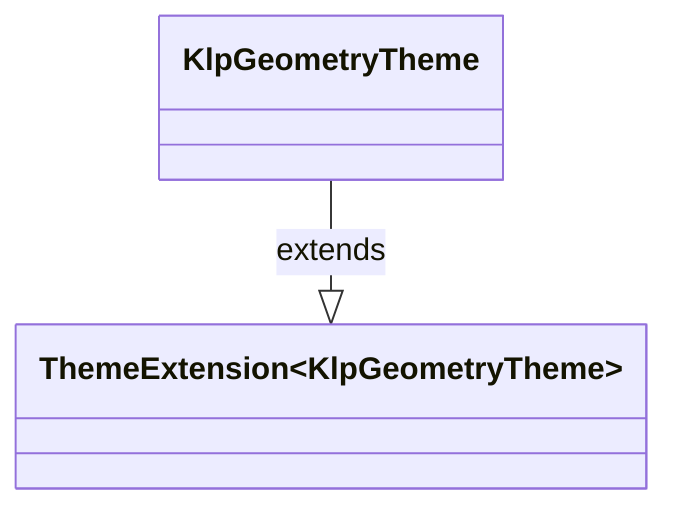

# klp_geometry_theme.dart：直接依賴與宣告架構

[回到目錄](README.md) · [來源檔案](../../../../../lib/src/styling/legacy_theme/klp_geometry_theme.dart)

## 範圍

核心是 `lib/src/styling/legacy_theme/klp_geometry_theme.dart`。主要視角為該檔案明寫的 import／export／part；輔助視角為本檔宣告及 extends／implements／with／on 關係。只展開一層外部邊界。

## 直接依賴圖

## 依賴證據

| 關係 | 原始 directive | 來源 |
|---|---|---|
| import | <code>import &#x27;package:flutter/material.dart&#x27;;</code> | [lib/src/styling/legacy_theme/klp_geometry_theme.dart:1](../../../../../lib/src/styling/legacy_theme/klp_geometry_theme.dart#L1) |
| import | <code>import &#x27;../../foundation/klp_metrics.dart&#x27;;</code> | [lib/src/styling/legacy_theme/klp_geometry_theme.dart:3](../../../../../lib/src/styling/legacy_theme/klp_geometry_theme.dart#L3) |
| import | <code>import &#x27;../legacy_tokens/primitive_token.dart&#x27;;</code> | [lib/src/styling/legacy_theme/klp_geometry_theme.dart:4](../../../../../lib/src/styling/legacy_theme/klp_geometry_theme.dart#L4) |
| import | <code>import &#x27;klp_control_geometry.dart&#x27;;</code> | [lib/src/styling/legacy_theme/klp_geometry_theme.dart:5](../../../../../lib/src/styling/legacy_theme/klp_geometry_theme.dart#L5) |
| import | <code>import &#x27;klp_data_geometry.dart&#x27;;</code> | [lib/src/styling/legacy_theme/klp_geometry_theme.dart:6](../../../../../lib/src/styling/legacy_theme/klp_geometry_theme.dart#L6) |
| import | <code>import &#x27;klp_layout_geometry.dart&#x27;;</code> | [lib/src/styling/legacy_theme/klp_geometry_theme.dart:7](../../../../../lib/src/styling/legacy_theme/klp_geometry_theme.dart#L7) |
| import | <code>import &#x27;klp_optical_geometry.dart&#x27;;</code> | [lib/src/styling/legacy_theme/klp_geometry_theme.dart:8](../../../../../lib/src/styling/legacy_theme/klp_geometry_theme.dart#L8) |

## 宣告關係圖

本組節點是本檔宣告；沒有箭頭的宣告未在此圖主張互相依賴。

## 宣告與成員證據

成員包含 public 與 private；簽章取自來源，省略函式本體與欄位初始值。`(inferred)` 表示來源未明寫型別；建構子只顯示參數部分，不含初始化列表。

### KlpGeometryTheme

ClassDeclaration · public · [lib/src/styling/legacy_theme/klp_geometry_theme.dart:10](../../../../../lib/src/styling/legacy_theme/klp_geometry_theme.dart#L10)

<code>class KlpGeometryTheme extends ThemeExtension&lt;KlpGeometryTheme&gt;</code>

來源註解摘要：不屬於密度尺度的精確元件幾何。

- `extends` → <code>ThemeExtension&lt;KlpGeometryTheme&gt;</code>：[lib/src/styling/legacy_theme/klp_geometry_theme.dart:12](../../../../../lib/src/styling/legacy_theme/klp_geometry_theme.dart#L12)

| 成員 | 可見性 | 簽章／型別 | 來源註解摘要 | 證據 |
|---|---|---|---|---|
| constructor <code>KlpGeometryTheme</code> | public | <code>const KlpGeometryTheme({ required this.control, required this.data, required this.layout, required this.optical, })</code> |  | [lib/src/styling/legacy_theme/klp_geometry_theme.dart:13](../../../../../lib/src/styling/legacy_theme/klp_geometry_theme.dart#L13) |
| field <code>control</code> | public | <code>final KlpControlGeometry control</code> |  | [lib/src/styling/legacy_theme/klp_geometry_theme.dart:20](../../../../../lib/src/styling/legacy_theme/klp_geometry_theme.dart#L20) |
| field <code>data</code> | public | <code>final KlpDataGeometry data</code> |  | [lib/src/styling/legacy_theme/klp_geometry_theme.dart:21](../../../../../lib/src/styling/legacy_theme/klp_geometry_theme.dart#L21) |
| field <code>layout</code> | public | <code>final KlpLayoutGeometry layout</code> |  | [lib/src/styling/legacy_theme/klp_geometry_theme.dart:22](../../../../../lib/src/styling/legacy_theme/klp_geometry_theme.dart#L22) |
| field <code>optical</code> | public | <code>final KlpOpticalGeometry optical</code> |  | [lib/src/styling/legacy_theme/klp_geometry_theme.dart:23](../../../../../lib/src/styling/legacy_theme/klp_geometry_theme.dart#L23) |
| field <code>standard</code> | public | <code>static const KlpGeometryTheme standard</code> |  | [lib/src/styling/legacy_theme/klp_geometry_theme.dart:25](../../../../../lib/src/styling/legacy_theme/klp_geometry_theme.dart#L25) |
| method <code>copyWith</code> | public | <code>KlpGeometryTheme copyWith({ KlpControlGeometry? control, KlpDataGeometry? data, KlpLayoutGeometry? layout, KlpOpticalGeometry? optical, })</code> |  | [lib/src/styling/legacy_theme/klp_geometry_theme.dart:129](../../../../../lib/src/styling/legacy_theme/klp_geometry_theme.dart#L129) |
| method <code>lerp</code> | public | <code>KlpGeometryTheme lerp(covariant KlpGeometryTheme? other, double t)</code> |  | [lib/src/styling/legacy_theme/klp_geometry_theme.dart:142](../../../../../lib/src/styling/legacy_theme/klp_geometry_theme.dart#L142) |
| method <code>==</code> | public | <code>bool operator ==(Object other)</code> |  | [lib/src/styling/legacy_theme/klp_geometry_theme.dart:148](../../../../../lib/src/styling/legacy_theme/klp_geometry_theme.dart#L148) |
| getter <code>hashCode</code> | public | <code>int get hashCode</code> |  | [lib/src/styling/legacy_theme/klp_geometry_theme.dart:157](../../../../../lib/src/styling/legacy_theme/klp_geometry_theme.dart#L157) |

## 閱讀說明與限制

箭頭只表示來源明寫的靜態關係；import 不等於呼叫。未分析動態呼叫、欄位的實際物件擁有權、狀態轉移或渲染流程；型別未進行語意解析，繼承目標保留原始型別拼寫。public／private 依 Dart 名稱前綴判斷；public 宣告不代表已由 `lib/kallopis.dart` 匯出。

本頁由 `tool/architecture_atlas` 產生；編輯來源或生成工具後重新產生，避免手改本頁。
