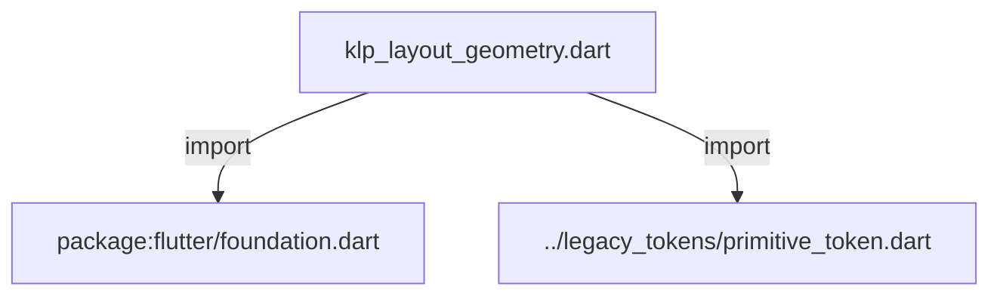
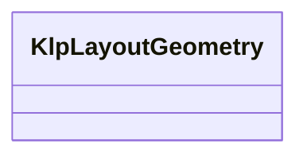

# klp_layout_geometry.dart：直接依賴與宣告架構

[回到目錄](README.md) · [來源檔案](../../../../../lib/src/styling/legacy_theme/klp_layout_geometry.dart)

## 範圍

核心是 `lib/src/styling/legacy_theme/klp_layout_geometry.dart`。主要視角為該檔案明寫的 import／export／part；輔助視角為本檔宣告及 extends／implements／with／on 關係。只展開一層外部邊界。

## 直接依賴圖

## 依賴證據

| 關係 | 原始 directive | 來源 |
|---|---|---|
| import | <code>import &#x27;package:flutter/foundation.dart&#x27;;</code> | [lib/src/styling/legacy_theme/klp_layout_geometry.dart:1](../../../../../lib/src/styling/legacy_theme/klp_layout_geometry.dart#L1) |
| import | <code>import &#x27;../legacy_tokens/primitive_token.dart&#x27;;</code> | [lib/src/styling/legacy_theme/klp_layout_geometry.dart:3](../../../../../lib/src/styling/legacy_theme/klp_layout_geometry.dart#L3) |

## 宣告關係圖

本組節點是本檔宣告；沒有箭頭的宣告未在此圖主張互相依賴。

## 宣告與成員證據

成員包含 public 與 private；簽章取自來源，省略函式本體與欄位初始值。`(inferred)` 表示來源未明寫型別；建構子只顯示參數部分，不含初始化列表。

### KlpLayoutGeometry

ClassDeclaration · public · [lib/src/styling/legacy_theme/klp_layout_geometry.dart:5](../../../../../lib/src/styling/legacy_theme/klp_layout_geometry.dart#L5)

<code>class KlpLayoutGeometry</code>

來源註解摘要：Shell、overlay 與 responsive layout 的精確幾何。

| 成員 | 可見性 | 簽章／型別 | 來源註解摘要 | 證據 |
|---|---|---|---|---|
| constructor <code>KlpLayoutGeometry</code> | public | <code>const KlpLayoutGeometry({ this.drawerWidth = 320, this.drawerHeight = 320, this.resizeHandleExtent = KlpScale.space200, this.overlayViewportInset = KlpScale.space200, this.railDropTargetExtent = KlpScale.space200, this.disclosureIconSize = KlpScale.space200, this.treeLeadingGap = KlpScale.space200, this.tooltipOffsetX = KlpScale.space200, required this.primaryPaneWidth, required this.secondaryPaneWidth, required this.primaryPaneBreakpoint, required this.primaryPaneContentBreakpoint, required this.responsivePaneBreakpoint, required this.secondaryPaneBreakpoint, required this.menuWidth, required this.commandMenuWidth, required this.menuHeaderHeight, required this.menuItemHeight, required this.dialogMaximumWidth, required this.toastMaximumWidth, required this.inlineNoticeBreakpoint, required this.statusBarBreakpoint, required this.settingsDialogMaximumWidth, required this.settingsDialogMaximumHeight, required this.settingsPaneGap, required this.settingsNavigationWidth, required this.settingsNavigationMinimumWidth, required this.settingsNavigationMaximumWidth, required this.settingsContentMaximumWidth, required this.themePreviewTileWidth, required this.windowHeaderHeight, required this.windowHeaderControlSize, required this.windowAppIconSize, required this.windowIdentityGap, })</code> |  | [lib/src/styling/legacy_theme/klp_layout_geometry.dart:8](../../../../../lib/src/styling/legacy_theme/klp_layout_geometry.dart#L8) |
| field <code>drawerWidth</code> | public | <code>final double drawerWidth</code> |  | [lib/src/styling/legacy_theme/klp_layout_geometry.dart:47](../../../../../lib/src/styling/legacy_theme/klp_layout_geometry.dart#L47) |
| field <code>drawerHeight</code> | public | <code>final double drawerHeight</code> |  | [lib/src/styling/legacy_theme/klp_layout_geometry.dart:48](../../../../../lib/src/styling/legacy_theme/klp_layout_geometry.dart#L48) |
| field <code>resizeHandleExtent</code> | public | <code>final double resizeHandleExtent</code> |  | [lib/src/styling/legacy_theme/klp_layout_geometry.dart:49](../../../../../lib/src/styling/legacy_theme/klp_layout_geometry.dart#L49) |
| field <code>overlayViewportInset</code> | public | <code>final double overlayViewportInset</code> |  | [lib/src/styling/legacy_theme/klp_layout_geometry.dart:50](../../../../../lib/src/styling/legacy_theme/klp_layout_geometry.dart#L50) |
| field <code>railDropTargetExtent</code> | public | <code>final double railDropTargetExtent</code> |  | [lib/src/styling/legacy_theme/klp_layout_geometry.dart:51](../../../../../lib/src/styling/legacy_theme/klp_layout_geometry.dart#L51) |
| field <code>disclosureIconSize</code> | public | <code>final double disclosureIconSize</code> |  | [lib/src/styling/legacy_theme/klp_layout_geometry.dart:52](../../../../../lib/src/styling/legacy_theme/klp_layout_geometry.dart#L52) |
| field <code>treeLeadingGap</code> | public | <code>final double treeLeadingGap</code> |  | [lib/src/styling/legacy_theme/klp_layout_geometry.dart:53](../../../../../lib/src/styling/legacy_theme/klp_layout_geometry.dart#L53) |
| field <code>tooltipOffsetX</code> | public | <code>final double tooltipOffsetX</code> |  | [lib/src/styling/legacy_theme/klp_layout_geometry.dart:54](../../../../../lib/src/styling/legacy_theme/klp_layout_geometry.dart#L54) |
| field <code>primaryPaneWidth</code> | public | <code>final double primaryPaneWidth</code> |  | [lib/src/styling/legacy_theme/klp_layout_geometry.dart:55](../../../../../lib/src/styling/legacy_theme/klp_layout_geometry.dart#L55) |
| field <code>secondaryPaneWidth</code> | public | <code>final double secondaryPaneWidth</code> |  | [lib/src/styling/legacy_theme/klp_layout_geometry.dart:56](../../../../../lib/src/styling/legacy_theme/klp_layout_geometry.dart#L56) |
| field <code>primaryPaneBreakpoint</code> | public | <code>final double primaryPaneBreakpoint</code> |  | [lib/src/styling/legacy_theme/klp_layout_geometry.dart:57](../../../../../lib/src/styling/legacy_theme/klp_layout_geometry.dart#L57) |
| field <code>primaryPaneContentBreakpoint</code> | public | <code>final double primaryPaneContentBreakpoint</code> |  | [lib/src/styling/legacy_theme/klp_layout_geometry.dart:58](../../../../../lib/src/styling/legacy_theme/klp_layout_geometry.dart#L58) |
| field <code>responsivePaneBreakpoint</code> | public | <code>final double responsivePaneBreakpoint</code> |  | [lib/src/styling/legacy_theme/klp_layout_geometry.dart:59](../../../../../lib/src/styling/legacy_theme/klp_layout_geometry.dart#L59) |
| field <code>secondaryPaneBreakpoint</code> | public | <code>final double secondaryPaneBreakpoint</code> |  | [lib/src/styling/legacy_theme/klp_layout_geometry.dart:60](../../../../../lib/src/styling/legacy_theme/klp_layout_geometry.dart#L60) |
| field <code>menuWidth</code> | public | <code>final double menuWidth</code> |  | [lib/src/styling/legacy_theme/klp_layout_geometry.dart:62](../../../../../lib/src/styling/legacy_theme/klp_layout_geometry.dart#L62) |
| field <code>commandMenuWidth</code> | public | <code>final double commandMenuWidth</code> |  | [lib/src/styling/legacy_theme/klp_layout_geometry.dart:63](../../../../../lib/src/styling/legacy_theme/klp_layout_geometry.dart#L63) |
| field <code>menuHeaderHeight</code> | public | <code>final double menuHeaderHeight</code> |  | [lib/src/styling/legacy_theme/klp_layout_geometry.dart:64](../../../../../lib/src/styling/legacy_theme/klp_layout_geometry.dart#L64) |
| field <code>menuItemHeight</code> | public | <code>final double menuItemHeight</code> |  | [lib/src/styling/legacy_theme/klp_layout_geometry.dart:65](../../../../../lib/src/styling/legacy_theme/klp_layout_geometry.dart#L65) |
| field <code>dialogMaximumWidth</code> | public | <code>final double dialogMaximumWidth</code> |  | [lib/src/styling/legacy_theme/klp_layout_geometry.dart:66](../../../../../lib/src/styling/legacy_theme/klp_layout_geometry.dart#L66) |
| field <code>toastMaximumWidth</code> | public | <code>final double toastMaximumWidth</code> |  | [lib/src/styling/legacy_theme/klp_layout_geometry.dart:67](../../../../../lib/src/styling/legacy_theme/klp_layout_geometry.dart#L67) |
| field <code>inlineNoticeBreakpoint</code> | public | <code>final double inlineNoticeBreakpoint</code> |  | [lib/src/styling/legacy_theme/klp_layout_geometry.dart:68](../../../../../lib/src/styling/legacy_theme/klp_layout_geometry.dart#L68) |
| field <code>statusBarBreakpoint</code> | public | <code>final double statusBarBreakpoint</code> |  | [lib/src/styling/legacy_theme/klp_layout_geometry.dart:69](../../../../../lib/src/styling/legacy_theme/klp_layout_geometry.dart#L69) |
| field <code>settingsDialogMaximumWidth</code> | public | <code>final double settingsDialogMaximumWidth</code> | Settings modal 的桌面尺寸上限與兩個獨立 pane 之間的間距。 | [lib/src/styling/legacy_theme/klp_layout_geometry.dart:72](../../../../../lib/src/styling/legacy_theme/klp_layout_geometry.dart#L72) |
| field <code>settingsDialogMaximumHeight</code> | public | <code>final double settingsDialogMaximumHeight</code> |  | [lib/src/styling/legacy_theme/klp_layout_geometry.dart:73](../../../../../lib/src/styling/legacy_theme/klp_layout_geometry.dart#L73) |
| field <code>settingsPaneGap</code> | public | <code>final double settingsPaneGap</code> |  | [lib/src/styling/legacy_theme/klp_layout_geometry.dart:74](../../../../../lib/src/styling/legacy_theme/klp_layout_geometry.dart#L74) |
| field <code>settingsNavigationWidth</code> | public | <code>final double settingsNavigationWidth</code> | Settings 寬版導覽欄的預設、最小與最大寬度。 | [lib/src/styling/legacy_theme/klp_layout_geometry.dart:77](../../../../../lib/src/styling/legacy_theme/klp_layout_geometry.dart#L77) |
| field <code>settingsNavigationMinimumWidth</code> | public | <code>final double settingsNavigationMinimumWidth</code> |  | [lib/src/styling/legacy_theme/klp_layout_geometry.dart:78](../../../../../lib/src/styling/legacy_theme/klp_layout_geometry.dart#L78) |
| field <code>settingsNavigationMaximumWidth</code> | public | <code>final double settingsNavigationMaximumWidth</code> |  | [lib/src/styling/legacy_theme/klp_layout_geometry.dart:79](../../../../../lib/src/styling/legacy_theme/klp_layout_geometry.dart#L79) |
| field <code>settingsContentMaximumWidth</code> | public | <code>final double settingsContentMaximumWidth</code> | Settings 內容欄的閱讀寬度上限。 | [lib/src/styling/legacy_theme/klp_layout_geometry.dart:82](../../../../../lib/src/styling/legacy_theme/klp_layout_geometry.dart#L82) |
| field <code>themePreviewTileWidth</code> | public | <code>final double themePreviewTileWidth</code> | 顏色模式預覽磚的預設寬度。 | [lib/src/styling/legacy_theme/klp_layout_geometry.dart:85](../../../../../lib/src/styling/legacy_theme/klp_layout_geometry.dart#L85) |
| field <code>windowHeaderHeight</code> | public | <code>final double windowHeaderHeight</code> | Header 可視表面與版面占位高度。 | [lib/src/styling/legacy_theme/klp_layout_geometry.dart:88](../../../../../lib/src/styling/legacy_theme/klp_layout_geometry.dart#L88) |
| field <code>windowHeaderControlSize</code> | public | <code>final double windowHeaderControlSize</code> | 視窗 Header 內正方形控制按鈕的語意尺寸。 | [lib/src/styling/legacy_theme/klp_layout_geometry.dart:91](../../../../../lib/src/styling/legacy_theme/klp_layout_geometry.dart#L91) |
| field <code>windowAppIconSize</code> | public | <code>final double windowAppIconSize</code> | 視窗 Header 按鈕內部圖示的語意尺寸。 | [lib/src/styling/legacy_theme/klp_layout_geometry.dart:94](../../../../../lib/src/styling/legacy_theme/klp_layout_geometry.dart#L94) |
| field <code>windowIdentityGap</code> | public | <code>final double windowIdentityGap</code> |  | [lib/src/styling/legacy_theme/klp_layout_geometry.dart:95](../../../../../lib/src/styling/legacy_theme/klp_layout_geometry.dart#L95) |
| method <code>copyWith</code> | public | <code>KlpLayoutGeometry copyWith({ double? drawerWidth, double? drawerHeight, double? resizeHandleExtent, double? overlayViewportInset, double? railDropTargetExtent, double? disclosureIconSize, double? treeLeadingGap, double? tooltipOffsetX, double? primaryPaneWidth, double? secondaryPaneWidth, double? primaryPaneBreakpoint, double? primaryPaneContentBreakpoint, double? responsivePaneBreakpoint, double? secondaryPaneBreakpoint, double? menuWidth, double? commandMenuWidth, double? menuHeaderHeight, double? menuItemHeight, double? dialogMaximumWidth, double? toastMaximumWidth, double? inlineNoticeBreakpoint, double? statusBarBreakpoint, double? settingsDialogMaximumWidth, double? settingsDialogMaximumHeight, double? settingsPaneGap, double? settingsNavigationWidth, double? settingsNavigationMinimumWidth, double? settingsNavigationMaximumWidth, double? settingsContentMaximumWidth, double? themePreviewTileWidth, double? windowHeaderHeight, double? windowHeaderControlSize, double? windowAppIconSize, double? windowIdentityGap, })</code> |  | [lib/src/styling/legacy_theme/klp_layout_geometry.dart:97](../../../../../lib/src/styling/legacy_theme/klp_layout_geometry.dart#L97) |
| method <code>==</code> | public | <code>bool operator ==(Object other)</code> |  | [lib/src/styling/legacy_theme/klp_layout_geometry.dart:173](../../../../../lib/src/styling/legacy_theme/klp_layout_geometry.dart#L173) |
| getter <code>hashCode</code> | public | <code>int get hashCode</code> |  | [lib/src/styling/legacy_theme/klp_layout_geometry.dart:216](../../../../../lib/src/styling/legacy_theme/klp_layout_geometry.dart#L216) |

## 閱讀說明與限制

箭頭只表示來源明寫的靜態關係；import 不等於呼叫。未分析動態呼叫、欄位的實際物件擁有權、狀態轉移或渲染流程；型別未進行語意解析，繼承目標保留原始型別拼寫。public／private 依 Dart 名稱前綴判斷；public 宣告不代表已由 `lib/kallopis.dart` 匯出。

本頁由 `tool/architecture_atlas` 產生；編輯來源或生成工具後重新產生，避免手改本頁。
