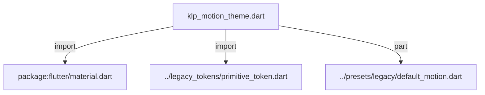
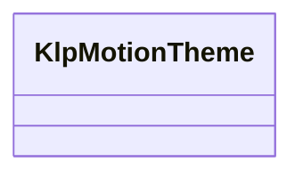
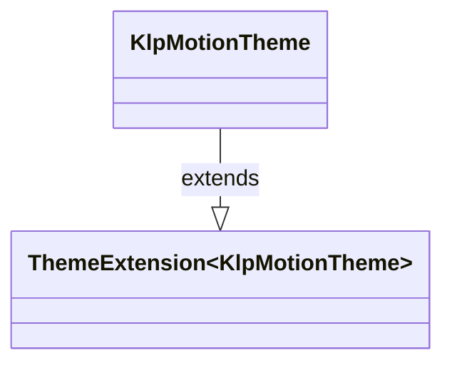

# klp_motion_theme.dart：直接依賴與宣告架構

[回到目錄](README.md) · [來源檔案](../../../../../lib/src/styling/legacy_theme/klp_motion_theme.dart)

## 範圍

核心是 `lib/src/styling/legacy_theme/klp_motion_theme.dart`。主要視角為該檔案明寫的 import／export／part；輔助視角為本檔宣告及 extends／implements／with／on 關係。只展開一層外部邊界。

## 直接依賴圖

## 依賴證據

| 關係 | 原始 directive | 來源 |
|---|---|---|
| import | <code>import &#x27;package:flutter/material.dart&#x27;;</code> | [lib/src/styling/legacy_theme/klp_motion_theme.dart:1](../../../../../lib/src/styling/legacy_theme/klp_motion_theme.dart#L1) |
| import | <code>import &#x27;../legacy_tokens/primitive_token.dart&#x27;;</code> | [lib/src/styling/legacy_theme/klp_motion_theme.dart:3](../../../../../lib/src/styling/legacy_theme/klp_motion_theme.dart#L3) |
| part | <code>part &#x27;../presets/legacy/default_motion.dart&#x27;;</code> | [lib/src/styling/legacy_theme/klp_motion_theme.dart:5](../../../../../lib/src/styling/legacy_theme/klp_motion_theme.dart#L5) |

## 宣告關係圖

本組節點是本檔宣告；沒有箭頭的宣告未在此圖主張互相依賴。

## 宣告與成員證據

成員包含 public 與 private；簽章取自來源，省略函式本體與欄位初始值。`(inferred)` 表示來源未明寫型別；建構子只顯示參數部分，不含初始化列表。

### KlpMotionTheme

ClassDeclaration · public · [lib/src/styling/legacy_theme/klp_motion_theme.dart:7](../../../../../lib/src/styling/legacy_theme/klp_motion_theme.dart#L7)

<code>class KlpMotionTheme extends ThemeExtension&lt;KlpMotionTheme&gt;</code>

來源註解摘要：Layer 2：motion 的 semantic token。 每個欄位描述**一種過場的角色**，不是某個元件的動畫。元件要動畫時讀這裡的角色， 不自己寫 `Duration(milliseconds: 140)`——寫死的 duration 是風格不對齊最難察覺的來源， 因為它不會出錯，只會讓兩個看起來一樣的元件動得不一樣快。

- `extends` → <code>ThemeExtension&lt;KlpMotionTheme&gt;</code>：[lib/src/styling/legacy_theme/klp_motion_theme.dart:13](../../../../../lib/src/styling/legacy_theme/klp_motion_theme.dart#L13)

| 成員 | 可見性 | 簽章／型別 | 來源註解摘要 | 證據 |
|---|---|---|---|---|
| constructor <code>KlpMotionTheme</code> | public | <code>const KlpMotionTheme({ required this.themeTransition, required this.styleTransition, required this.stateTransition, required this.overlayEnter, required this.overlayExit, required this.toastDwell, required this.tooltipDelay, this.tooltipDwell = const Duration(milliseconds: 4000), this.spinnerCycle = const Duration(milliseconds: 1000), required this.longPressThreshold, required this.standard, required this.emphasized, })</code> |  | [lib/src/styling/legacy_theme/klp_motion_theme.dart:14](../../../../../lib/src/styling/legacy_theme/klp_motion_theme.dart#L14) |
| field <code>themeTransition</code> | public | <code>final Duration themeTransition</code> | 明暗主題切換。預設瞬間完成——整個畫面漸變會讓切換感覺遲鈍。 | [lib/src/styling/legacy_theme/klp_motion_theme.dart:30](../../../../../lib/src/styling/legacy_theme/klp_motion_theme.dart#L30) |
| field <code>styleTransition</code> | public | <code>final Duration styleTransition</code> | 強調色等樣式變更。 | [lib/src/styling/legacy_theme/klp_motion_theme.dart:33](../../../../../lib/src/styling/legacy_theme/klp_motion_theme.dart#L33) |
| field <code>stateTransition</code> | public | <code>final Duration stateTransition</code> | hover／focus／pressed 等互動狀態變化。這是使用者最常看到的過場。 | [lib/src/styling/legacy_theme/klp_motion_theme.dart:36](../../../../../lib/src/styling/legacy_theme/klp_motion_theme.dart#L36) |
| field <code>overlayEnter</code> | public | <code>final Duration overlayEnter</code> | 選單、彈出層、對話框進場。 | [lib/src/styling/legacy_theme/klp_motion_theme.dart:39](../../../../../lib/src/styling/legacy_theme/klp_motion_theme.dart#L39) |
| field <code>overlayExit</code> | public | <code>final Duration overlayExit</code> | 同上，退場。退場比進場快是通用慣例——使用者已經決定要關掉了。 | [lib/src/styling/legacy_theme/klp_motion_theme.dart:42](../../../../../lib/src/styling/legacy_theme/klp_motion_theme.dart#L42) |
| field <code>toastDwell</code> | public | <code>final Duration toastDwell</code> | Toast 停留時間。 | [lib/src/styling/legacy_theme/klp_motion_theme.dart:45](../../../../../lib/src/styling/legacy_theme/klp_motion_theme.dart#L45) |
| field <code>tooltipDelay</code> | public | <code>final Duration tooltipDelay</code> | 游標停留多久才顯示 tooltip。 | [lib/src/styling/legacy_theme/klp_motion_theme.dart:48](../../../../../lib/src/styling/legacy_theme/klp_motion_theme.dart#L48) |
| field <code>tooltipDwell</code> | public | <code>final Duration tooltipDwell</code> |  | [lib/src/styling/legacy_theme/klp_motion_theme.dart:49](../../../../../lib/src/styling/legacy_theme/klp_motion_theme.dart#L49) |
| field <code>spinnerCycle</code> | public | <code>final Duration spinnerCycle</code> |  | [lib/src/styling/legacy_theme/klp_motion_theme.dart:50](../../../../../lib/src/styling/legacy_theme/klp_motion_theme.dart#L50) |
| field <code>longPressThreshold</code> | public | <code>final Duration longPressThreshold</code> | 長按判定門檻。這不是動畫，但同屬「時間」這個維度，而且**是無障礙參數**—— 行動不便的使用者需要更長的門檻。放進 theme 才能整體調整。 | [lib/src/styling/legacy_theme/klp_motion_theme.dart:54](../../../../../lib/src/styling/legacy_theme/klp_motion_theme.dart#L54) |
| field <code>standard</code> | public | <code>final Curve standard</code> |  | [lib/src/styling/legacy_theme/klp_motion_theme.dart:56](../../../../../lib/src/styling/legacy_theme/klp_motion_theme.dart#L56) |
| field <code>emphasized</code> | public | <code>final Curve emphasized</code> |  | [lib/src/styling/legacy_theme/klp_motion_theme.dart:57](../../../../../lib/src/styling/legacy_theme/klp_motion_theme.dart#L57) |
| field <code>standardMotion</code> | public | <code>static const KlpMotionTheme standardMotion</code> |  | [lib/src/styling/legacy_theme/klp_motion_theme.dart:59](../../../../../lib/src/styling/legacy_theme/klp_motion_theme.dart#L59) |
| method <code>reduced</code> | public | <code>KlpMotionTheme reduced()</code> | 尊重系統的「減少動態效果」設定。無障礙規則屬於庫的責任，不該由每個消費者各自實作 ——那必然會有人漏掉。 | [lib/src/styling/legacy_theme/klp_motion_theme.dart:61](../../../../../lib/src/styling/legacy_theme/klp_motion_theme.dart#L61) |
| method <code>copyWith</code> | public | <code>KlpMotionTheme copyWith({ Duration? themeTransition, Duration? styleTransition, Duration? stateTransition, Duration? overlayEnter, Duration? overlayExit, Duration? toastDwell, Duration? tooltipDelay, Duration? tooltipDwell, Duration? spinnerCycle, Duration? longPressThreshold, Curve? standard, Curve? emphasized, })</code> |  | [lib/src/styling/legacy_theme/klp_motion_theme.dart:69](../../../../../lib/src/styling/legacy_theme/klp_motion_theme.dart#L69) |
| method <code>lerp</code> | public | <code>KlpMotionTheme lerp(covariant KlpMotionTheme? other, double t)</code> |  | [lib/src/styling/legacy_theme/klp_motion_theme.dart:100](../../../../../lib/src/styling/legacy_theme/klp_motion_theme.dart#L100) |
| method <code>==</code> | public | <code>bool operator ==(Object other)</code> |  | [lib/src/styling/legacy_theme/klp_motion_theme.dart:108](../../../../../lib/src/styling/legacy_theme/klp_motion_theme.dart#L108) |
| getter <code>hashCode</code> | public | <code>int get hashCode</code> |  | [lib/src/styling/legacy_theme/klp_motion_theme.dart:125](../../../../../lib/src/styling/legacy_theme/klp_motion_theme.dart#L125) |

## 閱讀說明與限制

箭頭只表示來源明寫的靜態關係；import 不等於呼叫。未分析動態呼叫、欄位的實際物件擁有權、狀態轉移或渲染流程；型別未進行語意解析，繼承目標保留原始型別拼寫。public／private 依 Dart 名稱前綴判斷；public 宣告不代表已由 `lib/kallopis.dart` 匯出。

本頁由 `tool/architecture_atlas` 產生；編輯來源或生成工具後重新產生，避免手改本頁。
