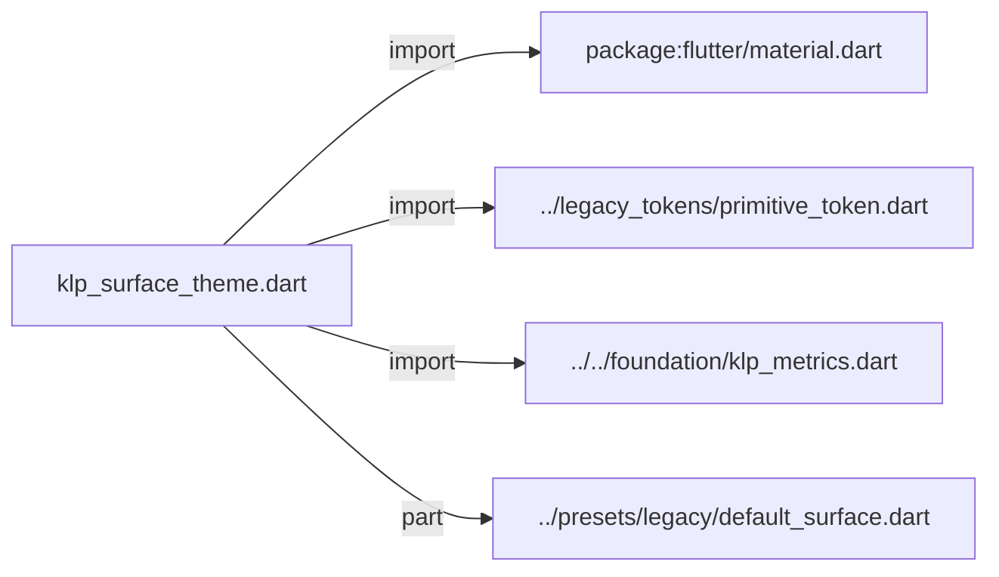
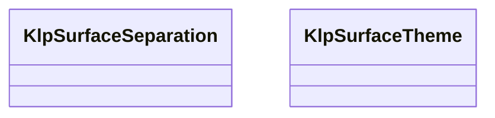
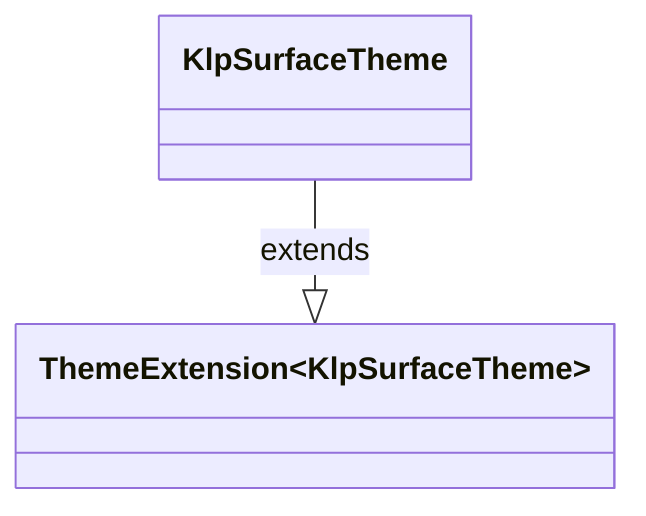

# klp_surface_theme.dart：直接依賴與宣告架構

[回到目錄](README.md) · [來源檔案](../../../../../lib/src/styling/legacy_theme/klp_surface_theme.dart)

## 範圍

核心是 `lib/src/styling/legacy_theme/klp_surface_theme.dart`。主要視角為該檔案明寫的 import／export／part；輔助視角為本檔宣告及 extends／implements／with／on 關係。只展開一層外部邊界。

## 直接依賴圖

## 依賴證據

| 關係 | 原始 directive | 來源 |
|---|---|---|
| import | <code>import &#x27;package:flutter/material.dart&#x27;;</code> | [lib/src/styling/legacy_theme/klp_surface_theme.dart:1](../../../../../lib/src/styling/legacy_theme/klp_surface_theme.dart#L1) |
| import | <code>import &#x27;../legacy_tokens/primitive_token.dart&#x27;;</code> | [lib/src/styling/legacy_theme/klp_surface_theme.dart:3](../../../../../lib/src/styling/legacy_theme/klp_surface_theme.dart#L3) |
| import | <code>import &#x27;../../foundation/klp_metrics.dart&#x27;;</code> | [lib/src/styling/legacy_theme/klp_surface_theme.dart:4](../../../../../lib/src/styling/legacy_theme/klp_surface_theme.dart#L4) |
| part | <code>part &#x27;../presets/legacy/default_surface.dart&#x27;;</code> | [lib/src/styling/legacy_theme/klp_surface_theme.dart:6](../../../../../lib/src/styling/legacy_theme/klp_surface_theme.dart#L6) |

## 宣告關係圖

本組節點是本檔宣告；沒有箭頭的宣告未在此圖主張互相依賴。

## 宣告與成員證據

成員包含 public 與 private；簽章取自來源，省略函式本體與欄位初始值。`(inferred)` 表示來源未明寫型別；建構子只顯示參數部分，不含初始化列表。

### KlpSurfaceSeparation

EnumDeclaration · public · [lib/src/styling/legacy_theme/klp_surface_theme.dart:8](../../../../../lib/src/styling/legacy_theme/klp_surface_theme.dart#L8)

<code>enum KlpSurfaceSeparation</code>

來源註解摘要：表面的分層手法：純色階層 (tone)、實線邊框 (outline)、霧化透明 (frosted)、原生 Box 漸層 (gradient) 或傳統陰影 (shadow)。 多種手法各有適用場景。不推薦單純依賴陰影；現代介面更推崇純色階明度差、 清晰邊框、壓克力霧化或微漸層光澤。

| 成員 | 可見性 | 簽章／型別 | 來源註解摘要 | 證據 |
|---|---|---|---|---|
| enum value <code>tone</code> | public | <code>tone</code> | 單調特殊顏色 / 表面色階分層（純色明度階梯，無邊框無陰影）。 | [lib/src/styling/legacy_theme/klp_surface_theme.dart:13](../../../../../lib/src/styling/legacy_theme/klp_surface_theme.dart#L13) |
| enum value <code>outline</code> | public | <code>outline</code> | 用實線邊框分層，不使用陰影（推薦之清晰結構手法）。 | [lib/src/styling/legacy_theme/klp_surface_theme.dart:16](../../../../../lib/src/styling/legacy_theme/klp_surface_theme.dart#L16) |
| enum value <code>frosted</code> | public | <code>frosted</code> | 霧化透明 / 毛玻璃分層（BackdropFilter 搭配半透明表面）。 | [lib/src/styling/legacy_theme/klp_surface_theme.dart:19](../../../../../lib/src/styling/legacy_theme/klp_surface_theme.dart#L19) |
| enum value <code>gradient</code> | public | <code>gradient</code> | 原生 Box 漸層與微光分層。 | [lib/src/styling/legacy_theme/klp_surface_theme.dart:22](../../../../../lib/src/styling/legacy_theme/klp_surface_theme.dart#L22) |
| enum value <code>shadow</code> | public | <code>shadow</code> | 用陰影分層（不推薦之傳統做法，僅為相容性保留）。 | [lib/src/styling/legacy_theme/klp_surface_theme.dart:25](../../../../../lib/src/styling/legacy_theme/klp_surface_theme.dart#L25) |

### KlpSurfaceTheme

ClassDeclaration · public · [lib/src/styling/legacy_theme/klp_surface_theme.dart:29](../../../../../lib/src/styling/legacy_theme/klp_surface_theme.dart#L29)

<code>class KlpSurfaceTheme extends ThemeExtension&lt;KlpSurfaceTheme&gt;</code>

來源註解摘要：Layer 2：表面分層與陰影的 semantic token。

- `extends` → <code>ThemeExtension&lt;KlpSurfaceTheme&gt;</code>：[lib/src/styling/legacy_theme/klp_surface_theme.dart:31](../../../../../lib/src/styling/legacy_theme/klp_surface_theme.dart#L31)

| 成員 | 可見性 | 簽章／型別 | 來源註解摘要 | 證據 |
|---|---|---|---|---|
| constructor <code>KlpSurfaceTheme</code> | public | <code>const KlpSurfaceTheme({ required this.separation, required this.overlayBlur, required this.overlaySpread, required this.overlayOffsetY, required this.overlayShadowOpacity, required this.scrimOpacity, required this.selectionWashOpacity, required this.focusWashOpacity, required this.statusFillOpacity, required this.pressProgressOpacity, required this.diffFillOpacity, required this.gridLineOpacity, required this.veilOpacity, required this.statusRowOpacity, required this.statusRowSelectedOpacity, required this.statusRowOpacityDark, required this.statusRowSelectedOpacityDark, required this.frostedOpacity, required this.frostedVeilOpacity, this.backdropBlurSigma = 12, this.dragOpacity = KlpScale.opacity820, this.dragSourceOpacity = KlpScale.opacity350, this.themePreviewDisabledOpacity = KlpScale.opacity620, this.listStatusOpacity = KlpScale.opacity140, this.listStatusSelectedOpacity = KlpScale.opacity320, this.accentSoftOpacityLight = KlpScale.opacity160, this.accentSoftOpacityDark = KlpScale.opacity220, this.windowPaneOpacityLight = KlpTransparency.lightPaneOpacity, this.windowPaneOpacityDark = KlpTransparency.darkPaneOpacity, this.invalidFillOpacity = KlpScale.opacity180, })</code> |  | [lib/src/styling/legacy_theme/klp_surface_theme.dart:32](../../../../../lib/src/styling/legacy_theme/klp_surface_theme.dart#L32) |
| field <code>separation</code> | public | <code>final KlpSurfaceSeparation separation</code> |  | [lib/src/styling/legacy_theme/klp_surface_theme.dart:65](../../../../../lib/src/styling/legacy_theme/klp_surface_theme.dart#L65) |
| field <code>overlayBlur</code> | public | <code>final double overlayBlur</code> |  | [lib/src/styling/legacy_theme/klp_surface_theme.dart:67](../../../../../lib/src/styling/legacy_theme/klp_surface_theme.dart#L67) |
| field <code>overlaySpread</code> | public | <code>final double overlaySpread</code> |  | [lib/src/styling/legacy_theme/klp_surface_theme.dart:68](../../../../../lib/src/styling/legacy_theme/klp_surface_theme.dart#L68) |
| field <code>overlayOffsetY</code> | public | <code>final double overlayOffsetY</code> |  | [lib/src/styling/legacy_theme/klp_surface_theme.dart:69](../../../../../lib/src/styling/legacy_theme/klp_surface_theme.dart#L69) |
| field <code>overlayShadowOpacity</code> | public | <code>final double overlayShadowOpacity</code> |  | [lib/src/styling/legacy_theme/klp_surface_theme.dart:70](../../../../../lib/src/styling/legacy_theme/klp_surface_theme.dart#L70) |
| field <code>scrimOpacity</code> | public | <code>final double scrimOpacity</code> |  | [lib/src/styling/legacy_theme/klp_surface_theme.dart:72](../../../../../lib/src/styling/legacy_theme/klp_surface_theme.dart#L72) |
| field <code>selectionWashOpacity</code> | public | <code>final double selectionWashOpacity</code> | 一般互動狀態的背景高亮強度。用前景色以低 alpha 疊上，因此亮態壓暗、暗態壓亮， 且底下表面原本的階層差不會被蓋掉。 Explorer 與表單不使用這層，改以低／高對比虛線區分 hover 與選取。 | [lib/src/styling/legacy_theme/klp_surface_theme.dart:78](../../../../../lib/src/styling/legacy_theme/klp_surface_theme.dart#L78) |
| field <code>focusWashOpacity</code> | public | <code>final double focusWashOpacity</code> | 鍵盤聚焦時的高亮強度。 必須比 [selectionWashOpacity] 強：hover 與 focus 若同強度，鍵盤使用者在 滑鼠同時停在別處時就分不出焦點在哪。也不能借用其他角色的透明度——借用會在 調整那個角色時靜默失去同步。 | [lib/src/styling/legacy_theme/klp_surface_theme.dart:85](../../../../../lib/src/styling/legacy_theme/klp_surface_theme.dart#L85) |
| field <code>statusFillOpacity</code> | public | <code>final double statusFillOpacity</code> | 語意色當底時的疊層強度（danger 按鈕、狀態晶片）。 | [lib/src/styling/legacy_theme/klp_surface_theme.dart:88](../../../../../lib/src/styling/legacy_theme/klp_surface_theme.dart#L88) |
| field <code>pressProgressOpacity</code> | public | <code>final double pressProgressOpacity</code> | 長按進度條的疊層強度。 | [lib/src/styling/legacy_theme/klp_surface_theme.dart:91](../../../../../lib/src/styling/legacy_theme/klp_surface_theme.dart#L91) |
| field <code>diffFillOpacity</code> | public | <code>final double diffFillOpacity</code> | 差異檢視中整行增刪底色的強度。 | [lib/src/styling/legacy_theme/klp_surface_theme.dart:94](../../../../../lib/src/styling/legacy_theme/klp_surface_theme.dart#L94) |
| field <code>gridLineOpacity</code> | public | <code>final double gridLineOpacity</code> | 資料格線由前景色推導時的強度。 | [lib/src/styling/legacy_theme/klp_surface_theme.dart:97](../../../../../lib/src/styling/legacy_theme/klp_surface_theme.dart#L97) |
| field <code>veilOpacity</code> | public | <code>final double veilOpacity</code> | 載入／禁用時蓋在內容上的遮罩強度。 | [lib/src/styling/legacy_theme/klp_surface_theme.dart:100](../../../../../lib/src/styling/legacy_theme/klp_surface_theme.dart#L100) |
| field <code>statusRowOpacity</code> | public | <code>final double statusRowOpacity</code> | 資料列以語意色染底時的強度。亮暗兩態分開，因為同一個 alpha 疊在深底與淺底上 讀起來的強度差很多。 | [lib/src/styling/legacy_theme/klp_surface_theme.dart:104](../../../../../lib/src/styling/legacy_theme/klp_surface_theme.dart#L104) |
| field <code>statusRowSelectedOpacity</code> | public | <code>final double statusRowSelectedOpacity</code> | 同上，選取中的資料列。 | [lib/src/styling/legacy_theme/klp_surface_theme.dart:107](../../../../../lib/src/styling/legacy_theme/klp_surface_theme.dart#L107) |
| field <code>statusRowOpacityDark</code> | public | <code>final double statusRowOpacityDark</code> | 同 [statusRowOpacity]，暗態。 | [lib/src/styling/legacy_theme/klp_surface_theme.dart:110](../../../../../lib/src/styling/legacy_theme/klp_surface_theme.dart#L110) |
| field <code>statusRowSelectedOpacityDark</code> | public | <code>final double statusRowSelectedOpacityDark</code> | 同 [statusRowSelectedOpacity]，暗態。 | [lib/src/styling/legacy_theme/klp_surface_theme.dart:113](../../../../../lib/src/styling/legacy_theme/klp_surface_theme.dart#L113) |
| field <code>frostedOpacity</code> | public | <code>final double frostedOpacity</code> | 霧化表面本身的透明度。 | [lib/src/styling/legacy_theme/klp_surface_theme.dart:116](../../../../../lib/src/styling/legacy_theme/klp_surface_theme.dart#L116) |
| field <code>frostedVeilOpacity</code> | public | <code>final double frostedVeilOpacity</code> | 霧化套在透明表面上時借用的底色強度。 | [lib/src/styling/legacy_theme/klp_surface_theme.dart:119](../../../../../lib/src/styling/legacy_theme/klp_surface_theme.dart#L119) |
| field <code>backdropBlurSigma</code> | public | <code>final double backdropBlurSigma</code> |  | [lib/src/styling/legacy_theme/klp_surface_theme.dart:120](../../../../../lib/src/styling/legacy_theme/klp_surface_theme.dart#L120) |
| field <code>dragOpacity</code> | public | <code>final double dragOpacity</code> |  | [lib/src/styling/legacy_theme/klp_surface_theme.dart:121](../../../../../lib/src/styling/legacy_theme/klp_surface_theme.dart#L121) |
| field <code>dragSourceOpacity</code> | public | <code>final double dragSourceOpacity</code> | 拖曳期間原位置內容的保留強度。 | [lib/src/styling/legacy_theme/klp_surface_theme.dart:124](../../../../../lib/src/styling/legacy_theme/klp_surface_theme.dart#L124) |
| field <code>themePreviewDisabledOpacity</code> | public | <code>final double themePreviewDisabledOpacity</code> | 主題預覽選項停用時保留的內容強度。 | [lib/src/styling/legacy_theme/klp_surface_theme.dart:127](../../../../../lib/src/styling/legacy_theme/klp_surface_theme.dart#L127) |
| field <code>listStatusOpacity</code> | public | <code>final double listStatusOpacity</code> |  | [lib/src/styling/legacy_theme/klp_surface_theme.dart:128](../../../../../lib/src/styling/legacy_theme/klp_surface_theme.dart#L128) |
| field <code>listStatusSelectedOpacity</code> | public | <code>final double listStatusSelectedOpacity</code> |  | [lib/src/styling/legacy_theme/klp_surface_theme.dart:129](../../../../../lib/src/styling/legacy_theme/klp_surface_theme.dart#L129) |
| field <code>accentSoftOpacityLight</code> | public | <code>final double accentSoftOpacityLight</code> |  | [lib/src/styling/legacy_theme/klp_surface_theme.dart:130](../../../../../lib/src/styling/legacy_theme/klp_surface_theme.dart#L130) |
| field <code>accentSoftOpacityDark</code> | public | <code>final double accentSoftOpacityDark</code> |  | [lib/src/styling/legacy_theme/klp_surface_theme.dart:131](../../../../../lib/src/styling/legacy_theme/klp_surface_theme.dart#L131) |
| field <code>windowPaneOpacityLight</code> | public | <code>final double windowPaneOpacityLight</code> |  | [lib/src/styling/legacy_theme/klp_surface_theme.dart:132](../../../../../lib/src/styling/legacy_theme/klp_surface_theme.dart#L132) |
| field <code>windowPaneOpacityDark</code> | public | <code>final double windowPaneOpacityDark</code> |  | [lib/src/styling/legacy_theme/klp_surface_theme.dart:133](../../../../../lib/src/styling/legacy_theme/klp_surface_theme.dart#L133) |
| field <code>invalidFillOpacity</code> | public | <code>final double invalidFillOpacity</code> |  | [lib/src/styling/legacy_theme/klp_surface_theme.dart:134](../../../../../lib/src/styling/legacy_theme/klp_surface_theme.dart#L134) |
| getter <code>usesShadow</code> | public | <code>bool get usesShadow</code> |  | [lib/src/styling/legacy_theme/klp_surface_theme.dart:136](../../../../../lib/src/styling/legacy_theme/klp_surface_theme.dart#L136) |
| method <code>overlayShadow</code> | public | <code>List&lt;BoxShadow&gt; overlayShadow(Color shadowColor)</code> | 依分層手法產生浮層陰影。`outline` 風格回傳空清單——元件不需要知道現在是哪種風格。 | [lib/src/styling/legacy_theme/klp_surface_theme.dart:138](../../../../../lib/src/styling/legacy_theme/klp_surface_theme.dart#L138) |
| field <code>elevated</code> | public | <code>static const KlpSurfaceTheme elevated</code> |  | [lib/src/styling/legacy_theme/klp_surface_theme.dart:151](../../../../../lib/src/styling/legacy_theme/klp_surface_theme.dart#L151) |
| method <code>copyWith</code> | public | <code>KlpSurfaceTheme copyWith({ KlpSurfaceSeparation? separation, double? overlayBlur, double? overlaySpread, double? overlayOffsetY, double? overlayShadowOpacity, double? scrimOpacity, double? selectionWashOpacity, double? focusWashOpacity, double? statusFillOpacity, double? pressProgressOpacity, double? diffFillOpacity, double? gridLineOpacity, double? veilOpacity, double? statusRowOpacity, double? statusRowSelectedOpacity, double? statusRowOpacityDark, double? statusRowSelectedOpacityDark, double? frostedOpacity, double? frostedVeilOpacity, double? backdropBlurSigma, double? dragOpacity, double? dragSourceOpacity, double? themePreviewDisabledOpacity, double? listStatusOpacity, double? listStatusSelectedOpacity, double? accentSoftOpacityLight, double? accentSoftOpacityDark, double? windowPaneOpacityLight, double? windowPaneOpacityDark, double? invalidFillOpacity, })</code> |  | [lib/src/styling/legacy_theme/klp_surface_theme.dart:153](../../../../../lib/src/styling/legacy_theme/klp_surface_theme.dart#L153) |
| method <code>lerp</code> | public | <code>KlpSurfaceTheme lerp(covariant KlpSurfaceTheme? other, double t)</code> | **不做內插。** `MaterialApp` 在 theme 變更時會跑一段過場並沿路呼叫 `lerp`。各層若各自內插， 中途會出現「某幾層已經換了、某幾層還沒」的混合狀態——那正是切換深淺色時看起來 「有些元件沒有跟著變」的原因：它們不是沒變，是停在中間值上。 因此整個 token 疊層一律在中點原子性地翻轉，任何時刻都只會是完整的其中一套。 | [lib/src/styling/legacy_theme/klp_surface_theme.dart:228](../../../../../lib/src/styling/legacy_theme/klp_surface_theme.dart#L228) |
| method <code>==</code> | public | <code>bool operator ==(Object other)</code> |  | [lib/src/styling/legacy_theme/klp_surface_theme.dart:241](../../../../../lib/src/styling/legacy_theme/klp_surface_theme.dart#L241) |
| getter <code>hashCode</code> | public | <code>int get hashCode</code> |  | [lib/src/styling/legacy_theme/klp_surface_theme.dart:276](../../../../../lib/src/styling/legacy_theme/klp_surface_theme.dart#L276) |

## 閱讀說明與限制

箭頭只表示來源明寫的靜態關係；import 不等於呼叫。未分析動態呼叫、欄位的實際物件擁有權、狀態轉移或渲染流程；型別未進行語意解析，繼承目標保留原始型別拼寫。public／private 依 Dart 名稱前綴判斷；public 宣告不代表已由 `lib/kallopis.dart` 匯出。

本頁由 `tool/architecture_atlas` 產生；編輯來源或生成工具後重新產生，避免手改本頁。
