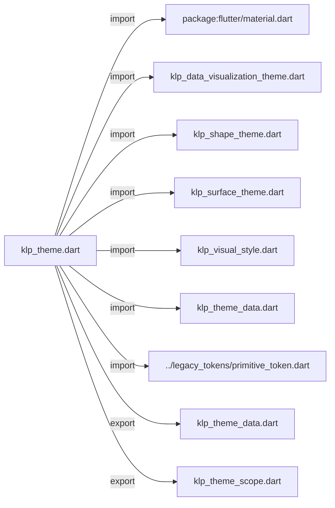
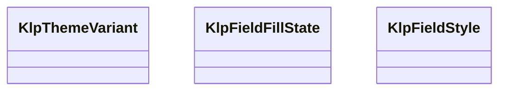

# klp_theme.dart：直接依賴與宣告架構

[回到目錄](README.md) · [來源檔案](../../../../../lib/src/styling/legacy_theme/klp_theme.dart)

## 範圍

核心是 `lib/src/styling/legacy_theme/klp_theme.dart`。主要視角為該檔案明寫的 import／export／part；輔助視角為本檔宣告及 extends／implements／with／on 關係。只展開一層外部邊界。

## 直接依賴圖

## 依賴證據

| 關係 | 原始 directive | 來源 |
|---|---|---|
| import | <code>import &#x27;package:flutter/material.dart&#x27;;</code> | [lib/src/styling/legacy_theme/klp_theme.dart:1](../../../../../lib/src/styling/legacy_theme/klp_theme.dart#L1) |
| import | <code>import &#x27;klp_data_visualization_theme.dart&#x27;;</code> | [lib/src/styling/legacy_theme/klp_theme.dart:3](../../../../../lib/src/styling/legacy_theme/klp_theme.dart#L3) |
| import | <code>import &#x27;klp_shape_theme.dart&#x27;;</code> | [lib/src/styling/legacy_theme/klp_theme.dart:4](../../../../../lib/src/styling/legacy_theme/klp_theme.dart#L4) |
| import | <code>import &#x27;klp_surface_theme.dart&#x27;;</code> | [lib/src/styling/legacy_theme/klp_theme.dart:5](../../../../../lib/src/styling/legacy_theme/klp_theme.dart#L5) |
| import | <code>import &#x27;klp_visual_style.dart&#x27;;</code> | [lib/src/styling/legacy_theme/klp_theme.dart:6](../../../../../lib/src/styling/legacy_theme/klp_theme.dart#L6) |
| import | <code>import &#x27;klp_theme_data.dart&#x27;;</code> | [lib/src/styling/legacy_theme/klp_theme.dart:7](../../../../../lib/src/styling/legacy_theme/klp_theme.dart#L7) |
| import | <code>import &#x27;../legacy_tokens/primitive_token.dart&#x27;;</code> | [lib/src/styling/legacy_theme/klp_theme.dart:8](../../../../../lib/src/styling/legacy_theme/klp_theme.dart#L8) |
| export | <code>export &#x27;klp_theme_data.dart&#x27;;</code> | [lib/src/styling/legacy_theme/klp_theme.dart:12](../../../../../lib/src/styling/legacy_theme/klp_theme.dart#L12) |
| export | <code>export &#x27;klp_theme_scope.dart&#x27;;</code> | [lib/src/styling/legacy_theme/klp_theme.dart:13](../../../../../lib/src/styling/legacy_theme/klp_theme.dart#L13) |

## 宣告關係圖

本組節點是本檔宣告；沒有箭頭的宣告未在此圖主張互相依賴。

## 宣告與成員證據

成員包含 public 與 private；簽章取自來源，省略函式本體與欄位初始值。`(inferred)` 表示來源未明寫型別；建構子只顯示參數部分，不含初始化列表。

### KlpThemeVariant

EnumDeclaration · public · [lib/src/styling/legacy_theme/klp_theme.dart:15](../../../../../lib/src/styling/legacy_theme/klp_theme.dart#L15)

<code>enum KlpThemeVariant</code>

來源註解摘要：內建的 [KlpThemeData] 預設變體。[transparent] 目前解析為 [KlpThemeData.dark] 的色彩再疊加透明度，不是一份獨立的色票——它描述的是「視窗背景可透」這個 額外能力，而不是第四種配色。

| 成員 | 可見性 | 簽章／型別 | 來源註解摘要 | 證據 |
|---|---|---|---|---|
| enum value <code>light</code> | public | <code>light</code> |  | [lib/src/styling/legacy_theme/klp_theme.dart:18](../../../../../lib/src/styling/legacy_theme/klp_theme.dart#L18) |
| enum value <code>dark</code> | public | <code>dark</code> |  | [lib/src/styling/legacy_theme/klp_theme.dart:18](../../../../../lib/src/styling/legacy_theme/klp_theme.dart#L18) |
| enum value <code>ultraDark</code> | public | <code>ultraDark</code> |  | [lib/src/styling/legacy_theme/klp_theme.dart:18](../../../../../lib/src/styling/legacy_theme/klp_theme.dart#L18) |
| enum value <code>transparent</code> | public | <code>transparent</code> |  | [lib/src/styling/legacy_theme/klp_theme.dart:18](../../../../../lib/src/styling/legacy_theme/klp_theme.dart#L18) |

### KlpFieldFillState

EnumDeclaration · public · [lib/src/styling/legacy_theme/klp_theme.dart:20](../../../../../lib/src/styling/legacy_theme/klp_theme.dart#L20)

<code>enum KlpFieldFillState</code>

來源註解摘要：輸入欄位底色要跟隨的互動狀態。 刻意把 [rest] 與 [hovered] 分開列舉，即使兩者目前解析成同一個顏色 （見 [KlpFieldStyle.colorFor]）——這是為了讓「hover 不改底色」這件事有 名字可以在程式碼裡明確表達，而不是省略 hovered 這個 case 導致日後被誤判 為漏寫。

| 成員 | 可見性 | 簽章／型別 | 來源註解摘要 | 證據 |
|---|---|---|---|---|
| enum value <code>rest</code> | public | <code>rest</code> |  | [lib/src/styling/legacy_theme/klp_theme.dart:26](../../../../../lib/src/styling/legacy_theme/klp_theme.dart#L26) |
| enum value <code>hovered</code> | public | <code>hovered</code> |  | [lib/src/styling/legacy_theme/klp_theme.dart:26](../../../../../lib/src/styling/legacy_theme/klp_theme.dart#L26) |
| enum value <code>focused</code> | public | <code>focused</code> |  | [lib/src/styling/legacy_theme/klp_theme.dart:26](../../../../../lib/src/styling/legacy_theme/klp_theme.dart#L26) |
| enum value <code>selected</code> | public | <code>selected</code> |  | [lib/src/styling/legacy_theme/klp_theme.dart:26](../../../../../lib/src/styling/legacy_theme/klp_theme.dart#L26) |
| enum value <code>disabled</code> | public | <code>disabled</code> |  | [lib/src/styling/legacy_theme/klp_theme.dart:26](../../../../../lib/src/styling/legacy_theme/klp_theme.dart#L26) |
| enum value <code>error</code> | public | <code>error</code> |  | [lib/src/styling/legacy_theme/klp_theme.dart:26](../../../../../lib/src/styling/legacy_theme/klp_theme.dart#L26) |

### KlpFieldStyle

ClassDeclaration · public · [lib/src/styling/legacy_theme/klp_theme.dart:28](../../../../../lib/src/styling/legacy_theme/klp_theme.dart#L28)

<code>abstract final class KlpFieldStyle</code>

來源註解摘要：輸入欄位的邊框與底色查表工具。

| 成員 | 可見性 | 簽章／型別 | 來源註解摘要 | 證據 |
|---|---|---|---|---|
| method <code>borderFor</code> | public | <code>static OutlineInputBorder borderFor(KlpShapeTheme shape)</code> | 需要 shape token，因此不能是無參數的 getter——欄位圓角屬於風格。 | [lib/src/styling/legacy_theme/klp_theme.dart:30](../../../../../lib/src/styling/legacy_theme/klp_theme.dart#L30) |
| method <code>colorFor</code> | public | <code>static Color colorFor( KlpThemeData tokens, KlpFieldFillState state, { KlpSurfaceTheme surface = KlpSurfaceTheme.elevated, })</code> | 欄位底色。 **hover 以高亮底色表達，不畫邊框。** 欄位本來就有自己的底色，狀態直接反映在 那個底色上，不必在外面再包一層框——包框會讓欄位在 hover 時尺寸感改變， 也讓同一個狀態在欄位與其他元件長得不一樣。 高亮是把前景色以低 alpha 疊上去，因此亮態壓暗、暗態提亮，且不必知道底下 實際是哪個表面。 | [lib/src/styling/legacy_theme/klp_theme.dart:37](../../../../../lib/src/styling/legacy_theme/klp_theme.dart#L37) |
| method <code>resolveInputColor</code> | public | <code>static Color resolveInputColor( KlpThemeData tokens, Set&lt;WidgetState&gt; states, { KlpSurfaceTheme surface = KlpSurfaceTheme.elevated, })</code> |  | [lib/src/styling/legacy_theme/klp_theme.dart:70](../../../../../lib/src/styling/legacy_theme/klp_theme.dart#L70) |
| method <code>inputFill</code> | public | <code>static WidgetStateColor inputFill( KlpThemeData tokens, { bool error = false, KlpSurfaceTheme surface = KlpSurfaceTheme.elevated, })</code> |  | [lib/src/styling/legacy_theme/klp_theme.dart:91](../../../../../lib/src/styling/legacy_theme/klp_theme.dart#L91) |

### buildKlpTheme

FunctionDeclaration · public · [lib/src/styling/legacy_theme/klp_theme.dart:104](../../../../../lib/src/styling/legacy_theme/klp_theme.dart#L104)

<code>ThemeData buildKlpTheme( Brightness brightness, { KlpAccent? accent, KlpVisualStyle? style, })</code>

來源註解摘要：由一套視覺風格建出 `ThemeData`。 色彩的來源規則刻意是**明確的，不做推測**： - 不給 [style]：依 [brightness] 取內建 preset，套用 defaultStyle 風格。 - 給了 [style]：**`style.colors` 就是色彩，[brightness] 不再干涉。** 曾經試過「偵測消費者有沒有動過色彩，沒動過才依 brightness 挑」，那是行不通的： Dart 會把欄位值相同的 `const` 實例正規化成同一個物件，因此一組剛好等於內建 preset 的自訂色盤會被誤判為未修改，然後被靜默換掉。**能被靜默搞錯的推測就不要做。** [accent] 為 `null` 時保留色彩層原本的 interaction 色；給定值才覆寫它。

### buildKlpThemeVariant

FunctionDeclaration · public · [lib/src/styling/legacy_theme/klp_theme.dart:130](../../../../../lib/src/styling/legacy_theme/klp_theme.dart#L130)

<code>ThemeData buildKlpThemeVariant( KlpThemeVariant variant, { KlpAccent? accent, bool transparencyEnabled = false, KlpVisualStyle? style, })</code>

### _buildKlpThemeData

FunctionDeclaration · private · [lib/src/styling/legacy_theme/klp_theme.dart:165](../../../../../lib/src/styling/legacy_theme/klp_theme.dart#L165)

<code>ThemeData _buildKlpThemeData( KlpThemeData baseTokens, { KlpAccent? accent, bool transparencyEnabled = false, KlpVisualStyle style = KlpVisualStyle.defaultStyle, })</code>

## 閱讀說明與限制

箭頭只表示來源明寫的靜態關係；import 不等於呼叫。未分析動態呼叫、欄位的實際物件擁有權、狀態轉移或渲染流程；型別未進行語意解析，繼承目標保留原始型別拼寫。public／private 依 Dart 名稱前綴判斷；public 宣告不代表已由 `lib/kallopis.dart` 匯出。

本頁由 `tool/architecture_atlas` 產生；編輯來源或生成工具後重新產生，避免手改本頁。
