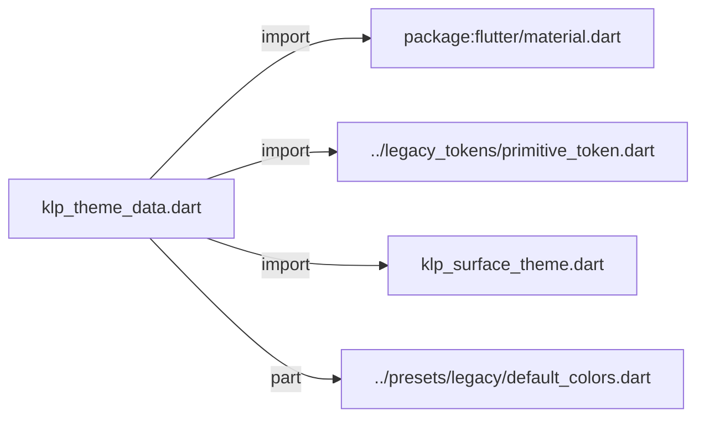
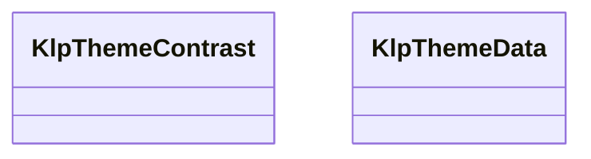
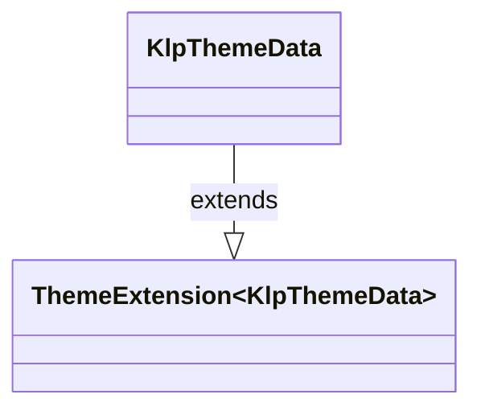

# klp_theme_data.dart：直接依賴與宣告架構

[回到目錄](README.md) · [來源檔案](../../../../../lib/src/styling/legacy_theme/klp_theme_data.dart)

## 範圍

核心是 `lib/src/styling/legacy_theme/klp_theme_data.dart`。主要視角為該檔案明寫的 import／export／part；輔助視角為本檔宣告及 extends／implements／with／on 關係。只展開一層外部邊界。

## 直接依賴圖

## 依賴證據

| 關係 | 原始 directive | 來源 |
|---|---|---|
| import | <code>import &#x27;package:flutter/material.dart&#x27;;</code> | [lib/src/styling/legacy_theme/klp_theme_data.dart:1](../../../../../lib/src/styling/legacy_theme/klp_theme_data.dart#L1) |
| import | <code>import &#x27;../legacy_tokens/primitive_token.dart&#x27;;</code> | [lib/src/styling/legacy_theme/klp_theme_data.dart:3](../../../../../lib/src/styling/legacy_theme/klp_theme_data.dart#L3) |
| import | <code>import &#x27;klp_surface_theme.dart&#x27;;</code> | [lib/src/styling/legacy_theme/klp_theme_data.dart:4](../../../../../lib/src/styling/legacy_theme/klp_theme_data.dart#L4) |
| part | <code>part &#x27;../presets/legacy/default_colors.dart&#x27;;</code> | [lib/src/styling/legacy_theme/klp_theme_data.dart:6](../../../../../lib/src/styling/legacy_theme/klp_theme_data.dart#L6) |

## 宣告關係圖

本組節點是本檔宣告；沒有箭頭的宣告未在此圖主張互相依賴。

## 宣告與成員證據

成員包含 public 與 private；簽章取自來源，省略函式本體與欄位初始值。`(inferred)` 表示來源未明寫型別；建構子只顯示參數部分，不含初始化列表。

### KlpThemeContrast

ClassDeclaration · public · [lib/src/styling/legacy_theme/klp_theme_data.dart:8](../../../../../lib/src/styling/legacy_theme/klp_theme_data.dart#L8)

<code>abstract final class KlpThemeContrast</code>

來源註解摘要：依任意背景色算出可讀的前景色，用於背景色由使用者資料決定（而非固定 theme token）的場合，例如彩色標籤或頭像底色。 不要拿它取代 semantic token——theme 內部的文字／背景配對已經照顏色系統 設計好對比，這個類別只服務「背景色本身就是可變資料」這種例外情境。

| 成員 | 可見性 | 簽章／型別 | 來源註解摘要 | 證據 |
|---|---|---|---|---|
| method <code>isDarkBackground</code> | public | <code>static bool isDarkBackground(Color background)</code> | 判斷背景屬於哪一階梯： - 500 以下（含 500，如 ink50 ~ ink500）：深色文字 - 600 以上（含 600，如 ink600 ~ ink950）：淺色文字 - 透明背景不構成獨立深色階層，回傳 false | [lib/src/styling/legacy_theme/klp_theme_data.dart:14](../../../../../lib/src/styling/legacy_theme/klp_theme_data.dart#L14) |
| method <code>foregroundFor</code> | public | <code>static Color foregroundFor(Color background)</code> | 依據背景顏色階梯（500 以下為深色 ink900，600 以上為淺色 ink50）決定前景文字色。 | [lib/src/styling/legacy_theme/klp_theme_data.dart:26](../../../../../lib/src/styling/legacy_theme/klp_theme_data.dart#L26) |

### KlpThemeData

ClassDeclaration · public · [lib/src/styling/legacy_theme/klp_theme_data.dart:32](../../../../../lib/src/styling/legacy_theme/klp_theme_data.dart#L32)

<code>class KlpThemeData extends ThemeExtension&lt;KlpThemeData&gt;</code>

來源註解摘要：Layer 2：semantic 色彩 token（`ThemeExtension`）。 這是消費者實際覆寫外觀時要動的層——每個欄位是一個色彩的**用途** （`surface`、`text`、`accent`……），不是某個固定的十六進位值，因此同一份 元件程式碼換一套 [KlpThemeData] 就能整體變色。透過 `context.klpColors` 取用，不要在元件裡直接建構或持有它的實例。

- `extends` → <code>ThemeExtension&lt;KlpThemeData&gt;</code>：[lib/src/styling/legacy_theme/klp_theme_data.dart:39](../../../../../lib/src/styling/legacy_theme/klp_theme_data.dart#L39)

| 成員 | 可見性 | 簽章／型別 | 來源註解摘要 | 證據 |
|---|---|---|---|---|
| constructor <code>KlpThemeData</code> | public | <code>const KlpThemeData({ required this.app, required this.surface, required this.surfaceInset, required this.surfaceMuted, required this.component, required this.stageSurface, required this.overlay, required this.surfaceRaised, required this.modalScrim, required this.guide, required this.divider, Color? pagePattern, required this.text, required this.textMuted, required this.textFaint, required this.border, required this.borderStrong, Color? brand, required this.accent, required this.accentSoft, required this.interaction, required this.interactionSoft, required this.success, required this.warning, required this.danger, required this.info, this.clear = KlpPalette.transparent, this.onStatus = KlpPalette.pureWhite, this.onLightBackground = KlpPalette.ink900, this.onDarkBackground = KlpPalette.ink50, this.mutedOnLightBackground = KlpPalette.ink550, this.mutedOnDarkBackground = KlpPalette.ink300, this.faintOnBackground = KlpPalette.ink400, })</code> |  | [lib/src/styling/legacy_theme/klp_theme_data.dart:40](../../../../../lib/src/styling/legacy_theme/klp_theme_data.dart#L40) |
| field <code>app</code> | public | <code>final Color app</code> |  | [lib/src/styling/legacy_theme/klp_theme_data.dart:77](../../../../../lib/src/styling/legacy_theme/klp_theme_data.dart#L77) |
| field <code>surface</code> | public | <code>final Color surface</code> |  | [lib/src/styling/legacy_theme/klp_theme_data.dart:78](../../../../../lib/src/styling/legacy_theme/klp_theme_data.dart#L78) |
| field <code>surfaceInset</code> | public | <code>final Color surfaceInset</code> |  | [lib/src/styling/legacy_theme/klp_theme_data.dart:79](../../../../../lib/src/styling/legacy_theme/klp_theme_data.dart#L79) |
| field <code>surfaceMuted</code> | public | <code>final Color surfaceMuted</code> |  | [lib/src/styling/legacy_theme/klp_theme_data.dart:80](../../../../../lib/src/styling/legacy_theme/klp_theme_data.dart#L80) |
| field <code>component</code> | public | <code>final Color component</code> |  | [lib/src/styling/legacy_theme/klp_theme_data.dart:81](../../../../../lib/src/styling/legacy_theme/klp_theme_data.dart#L81) |
| field <code>stageSurface</code> | public | <code>final Color stageSurface</code> |  | [lib/src/styling/legacy_theme/klp_theme_data.dart:82](../../../../../lib/src/styling/legacy_theme/klp_theme_data.dart#L82) |
| field <code>overlay</code> | public | <code>final Color overlay</code> |  | [lib/src/styling/legacy_theme/klp_theme_data.dart:83](../../../../../lib/src/styling/legacy_theme/klp_theme_data.dart#L83) |
| field <code>surfaceRaised</code> | public | <code>final Color surfaceRaised</code> |  | [lib/src/styling/legacy_theme/klp_theme_data.dart:84](../../../../../lib/src/styling/legacy_theme/klp_theme_data.dart#L84) |
| field <code>modalScrim</code> | public | <code>final Color modalScrim</code> |  | [lib/src/styling/legacy_theme/klp_theme_data.dart:85](../../../../../lib/src/styling/legacy_theme/klp_theme_data.dart#L85) |
| field <code>guide</code> | public | <code>final Color guide</code> |  | [lib/src/styling/legacy_theme/klp_theme_data.dart:86](../../../../../lib/src/styling/legacy_theme/klp_theme_data.dart#L86) |
| field <code>divider</code> | public | <code>final Color divider</code> |  | [lib/src/styling/legacy_theme/klp_theme_data.dart:87](../../../../../lib/src/styling/legacy_theme/klp_theme_data.dart#L87) |
| field <code>pagePattern</code> | public | <code>final Color pagePattern</code> |  | [lib/src/styling/legacy_theme/klp_theme_data.dart:88](../../../../../lib/src/styling/legacy_theme/klp_theme_data.dart#L88) |
| field <code>text</code> | public | <code>final Color text</code> |  | [lib/src/styling/legacy_theme/klp_theme_data.dart:89](../../../../../lib/src/styling/legacy_theme/klp_theme_data.dart#L89) |
| field <code>textMuted</code> | public | <code>final Color textMuted</code> |  | [lib/src/styling/legacy_theme/klp_theme_data.dart:90](../../../../../lib/src/styling/legacy_theme/klp_theme_data.dart#L90) |
| field <code>textFaint</code> | public | <code>final Color textFaint</code> |  | [lib/src/styling/legacy_theme/klp_theme_data.dart:91](../../../../../lib/src/styling/legacy_theme/klp_theme_data.dart#L91) |
| field <code>border</code> | public | <code>final Color border</code> |  | [lib/src/styling/legacy_theme/klp_theme_data.dart:92](../../../../../lib/src/styling/legacy_theme/klp_theme_data.dart#L92) |
| field <code>borderStrong</code> | public | <code>final Color borderStrong</code> |  | [lib/src/styling/legacy_theme/klp_theme_data.dart:93](../../../../../lib/src/styling/legacy_theme/klp_theme_data.dart#L93) |
| field <code>brand</code> | public | <code>final Color brand</code> | 產品識別的主題色；不自動覆寫操作用途的 [accent] 或 [interaction]。 | [lib/src/styling/legacy_theme/klp_theme_data.dart:96](../../../../../lib/src/styling/legacy_theme/klp_theme_data.dart#L96) |
| field <code>accent</code> | public | <code>final Color accent</code> |  | [lib/src/styling/legacy_theme/klp_theme_data.dart:98](../../../../../lib/src/styling/legacy_theme/klp_theme_data.dart#L98) |
| field <code>accentSoft</code> | public | <code>final Color accentSoft</code> |  | [lib/src/styling/legacy_theme/klp_theme_data.dart:99](../../../../../lib/src/styling/legacy_theme/klp_theme_data.dart#L99) |
| field <code>interaction</code> | public | <code>final Color interaction</code> |  | [lib/src/styling/legacy_theme/klp_theme_data.dart:100](../../../../../lib/src/styling/legacy_theme/klp_theme_data.dart#L100) |
| field <code>interactionSoft</code> | public | <code>final Color interactionSoft</code> |  | [lib/src/styling/legacy_theme/klp_theme_data.dart:101](../../../../../lib/src/styling/legacy_theme/klp_theme_data.dart#L101) |
| field <code>success</code> | public | <code>final Color success</code> |  | [lib/src/styling/legacy_theme/klp_theme_data.dart:102](../../../../../lib/src/styling/legacy_theme/klp_theme_data.dart#L102) |
| field <code>warning</code> | public | <code>final Color warning</code> |  | [lib/src/styling/legacy_theme/klp_theme_data.dart:103](../../../../../lib/src/styling/legacy_theme/klp_theme_data.dart#L103) |
| field <code>danger</code> | public | <code>final Color danger</code> |  | [lib/src/styling/legacy_theme/klp_theme_data.dart:104](../../../../../lib/src/styling/legacy_theme/klp_theme_data.dart#L104) |
| field <code>info</code> | public | <code>final Color info</code> |  | [lib/src/styling/legacy_theme/klp_theme_data.dart:105](../../../../../lib/src/styling/legacy_theme/klp_theme_data.dart#L105) |
| field <code>clear</code> | public | <code>final Color clear</code> | 完全透明色。名稱避開既有的 static [transparent] 視窗 preset。 | [lib/src/styling/legacy_theme/klp_theme_data.dart:108](../../../../../lib/src/styling/legacy_theme/klp_theme_data.dart#L108) |
| field <code>onStatus</code> | public | <code>final Color onStatus</code> |  | [lib/src/styling/legacy_theme/klp_theme_data.dart:109](../../../../../lib/src/styling/legacy_theme/klp_theme_data.dart#L109) |
| field <code>onLightBackground</code> | public | <code>final Color onLightBackground</code> |  | [lib/src/styling/legacy_theme/klp_theme_data.dart:110](../../../../../lib/src/styling/legacy_theme/klp_theme_data.dart#L110) |
| field <code>onDarkBackground</code> | public | <code>final Color onDarkBackground</code> |  | [lib/src/styling/legacy_theme/klp_theme_data.dart:111](../../../../../lib/src/styling/legacy_theme/klp_theme_data.dart#L111) |
| field <code>mutedOnLightBackground</code> | public | <code>final Color mutedOnLightBackground</code> |  | [lib/src/styling/legacy_theme/klp_theme_data.dart:112](../../../../../lib/src/styling/legacy_theme/klp_theme_data.dart#L112) |
| field <code>mutedOnDarkBackground</code> | public | <code>final Color mutedOnDarkBackground</code> |  | [lib/src/styling/legacy_theme/klp_theme_data.dart:113](../../../../../lib/src/styling/legacy_theme/klp_theme_data.dart#L113) |
| field <code>faintOnBackground</code> | public | <code>final Color faintOnBackground</code> |  | [lib/src/styling/legacy_theme/klp_theme_data.dart:114](../../../../../lib/src/styling/legacy_theme/klp_theme_data.dart#L114) |
| getter <code>onInteraction</code> | public | <code>Color get onInteraction</code> |  | [lib/src/styling/legacy_theme/klp_theme_data.dart:116](../../../../../lib/src/styling/legacy_theme/klp_theme_data.dart#L116) |
| getter <code>selection</code> | public | <code>Color get selection</code> |  | [lib/src/styling/legacy_theme/klp_theme_data.dart:120](../../../../../lib/src/styling/legacy_theme/klp_theme_data.dart#L120) |
| getter <code>onSelection</code> | public | <code>Color get onSelection</code> |  | [lib/src/styling/legacy_theme/klp_theme_data.dart:122](../../../../../lib/src/styling/legacy_theme/klp_theme_data.dart#L122) |
| getter <code>selectionBackground</code> | public | <code>Color get selectionBackground</code> |  | [lib/src/styling/legacy_theme/klp_theme_data.dart:124](../../../../../lib/src/styling/legacy_theme/klp_theme_data.dart#L124) |
| getter <code>selectionForeground</code> | public | <code>Color get selectionForeground</code> |  | [lib/src/styling/legacy_theme/klp_theme_data.dart:126](../../../../../lib/src/styling/legacy_theme/klp_theme_data.dart#L126) |
| method <code>selectionWashWith</code> | public | <code>Color selectionWashWith(double opacity)</code> | 選取狀態的半透明壓深層。強度來自 [KlpSurfaceTheme.selectionWashOpacity]； 此處的預設值只在沒有 theme 可讀時使用。 **不要在這裡另訂一份強度**——同一條規則兩份實作必然靜默分岔。 | [lib/src/styling/legacy_theme/klp_theme_data.dart:128](../../../../../lib/src/styling/legacy_theme/klp_theme_data.dart#L128) |
| getter <code>selectionWash</code> | public | <code>Color get selectionWash</code> |  | [lib/src/styling/legacy_theme/klp_theme_data.dart:133](../../../../../lib/src/styling/legacy_theme/klp_theme_data.dart#L133) |
| method <code>onBackground</code> | public | <code>KlpThemeData onBackground(Color background)</code> | 依據背景顏色階梯（500 以下為深色文字，600 以上為淺色文字）產生適用於該背景的文字色彩 token。 若背景為透明，則延續當前（上層）的文字與階層設定。 | [lib/src/styling/legacy_theme/klp_theme_data.dart:135](../../../../../lib/src/styling/legacy_theme/klp_theme_data.dart#L135) |
| method <code>withWindowTransparency</code> | public | <code>KlpThemeData withWindowTransparency( Brightness brightness, { KlpSurfaceTheme surfaceTheme = KlpSurfaceTheme.elevated, })</code> |  | [lib/src/styling/legacy_theme/klp_theme_data.dart:149](../../../../../lib/src/styling/legacy_theme/klp_theme_data.dart#L149) |
| field <code>light</code> | public | <code>static const KlpThemeData light</code> | 亮態。**每個角色都落在 ink 色梯上**，沒有例外——一旦有欄位用梯外的顏色， 調整色梯時它就會原地不動，而畫面上只會顯示為「某一塊怪怪的」。 | [lib/src/styling/legacy_theme/klp_theme_data.dart:166](../../../../../lib/src/styling/legacy_theme/klp_theme_data.dart#L166) |
| field <code>dark</code> | public | <code>static const KlpThemeData dark</code> | 暗態：整條梯翻轉；輔助文字使用 ink400，確保石墨表面仍達 3:1。 | [lib/src/styling/legacy_theme/klp_theme_data.dart:169](../../../../../lib/src/styling/legacy_theme/klp_theme_data.dart#L169) |
| field <code>ultraDark</code> | public | <code>static const KlpThemeData ultraDark</code> | 全暗態：比 dark 再往下一階，給 OLED 與長時間閱讀用。 | [lib/src/styling/legacy_theme/klp_theme_data.dart:172](../../../../../lib/src/styling/legacy_theme/klp_theme_data.dart#L172) |
| field <code>transparent</code> | public | <code>static final KlpThemeData transparent</code> |  | [lib/src/styling/legacy_theme/klp_theme_data.dart:174](../../../../../lib/src/styling/legacy_theme/klp_theme_data.dart#L174) |
| method <code>copyWith</code> | public | <code>KlpThemeData copyWith({ Color? app, Color? surface, Color? surfaceInset, Color? surfaceMuted, Color? component, Color? stageSurface, Color? overlay, Color? surfaceRaised, Color? modalScrim, Color? guide, Color? divider, Color? pagePattern, Color? text, Color? textMuted, Color? textFaint, Color? border, Color? borderStrong, Color? brand, Color? accent, Color? accentSoft, Color? interaction, Color? interactionSoft, Color? success, Color? warning, Color? danger, Color? info, Color? clear, Color? onStatus, Color? onLightBackground, Color? onDarkBackground, Color? mutedOnLightBackground, Color? mutedOnDarkBackground, Color? faintOnBackground, })</code> |  | [lib/src/styling/legacy_theme/klp_theme_data.dart:176](../../../../../lib/src/styling/legacy_theme/klp_theme_data.dart#L176) |
| method <code>lerp</code> | public | <code>KlpThemeData lerp(covariant KlpThemeData? other, double t)</code> | **不做內插。** `MaterialApp` 在 theme 變更時會跑一段過場並沿路呼叫 `lerp`。各層若各自內插， 中途會出現「某幾層已經換了、某幾層還沒」的混合狀態——那正是切換深淺色時看起來 「有些元件沒有跟著變」的原因：它們不是沒變，是停在中間值上。 因此整個 token 疊層一律在中點原子性地翻轉，任何時刻都只會是完整的其中一套。 | [lib/src/styling/legacy_theme/klp_theme_data.dart:251](../../../../../lib/src/styling/legacy_theme/klp_theme_data.dart#L251) |
| method <code>==</code> | public | <code>bool operator ==(Object other)</code> |  | [lib/src/styling/legacy_theme/klp_theme_data.dart:264](../../../../../lib/src/styling/legacy_theme/klp_theme_data.dart#L264) |
| getter <code>hashCode</code> | public | <code>int get hashCode</code> |  | [lib/src/styling/legacy_theme/klp_theme_data.dart:302](../../../../../lib/src/styling/legacy_theme/klp_theme_data.dart#L302) |

## 閱讀說明與限制

箭頭只表示來源明寫的靜態關係；import 不等於呼叫。未分析動態呼叫、欄位的實際物件擁有權、狀態轉移或渲染流程；型別未進行語意解析，繼承目標保留原始型別拼寫。public／private 依 Dart 名稱前綴判斷；public 宣告不代表已由 `lib/kallopis.dart` 匯出。

本頁由 `tool/architecture_atlas` 產生；編輯來源或生成工具後重新產生，避免手改本頁。
