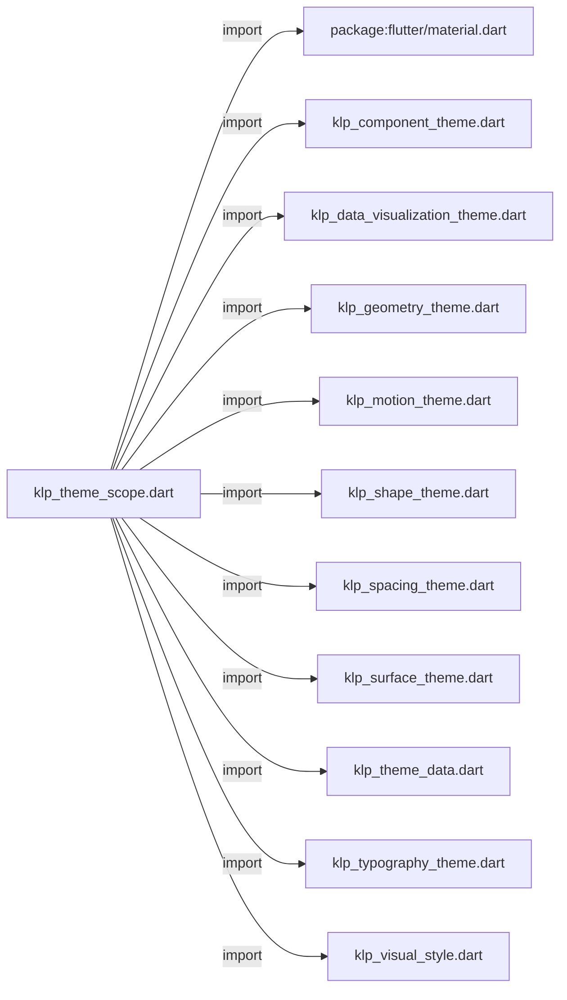
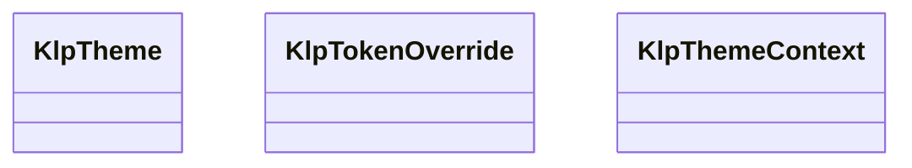
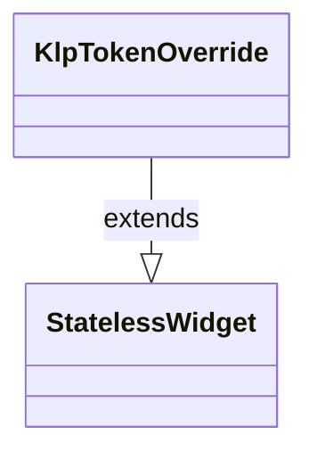
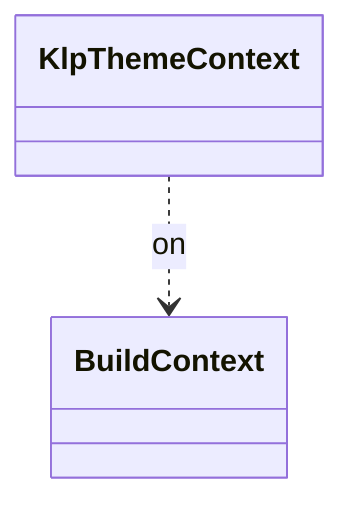

# klp_theme_scope.dart：直接依賴與宣告架構

[回到目錄](README.md) · [來源檔案](../../../../../lib/src/styling/legacy_theme/klp_theme_scope.dart)

## 範圍

核心是 `lib/src/styling/legacy_theme/klp_theme_scope.dart`。主要視角為該檔案明寫的 import／export／part；輔助視角為本檔宣告及 extends／implements／with／on 關係。只展開一層外部邊界。

## 直接依賴圖

## 依賴證據

| 關係 | 原始 directive | 來源 |
|---|---|---|
| import | <code>import &#x27;package:flutter/material.dart&#x27;;</code> | [lib/src/styling/legacy_theme/klp_theme_scope.dart:1](../../../../../lib/src/styling/legacy_theme/klp_theme_scope.dart#L1) |
| import | <code>import &#x27;klp_component_theme.dart&#x27;;</code> | [lib/src/styling/legacy_theme/klp_theme_scope.dart:3](../../../../../lib/src/styling/legacy_theme/klp_theme_scope.dart#L3) |
| import | <code>import &#x27;klp_data_visualization_theme.dart&#x27;;</code> | [lib/src/styling/legacy_theme/klp_theme_scope.dart:4](../../../../../lib/src/styling/legacy_theme/klp_theme_scope.dart#L4) |
| import | <code>import &#x27;klp_geometry_theme.dart&#x27;;</code> | [lib/src/styling/legacy_theme/klp_theme_scope.dart:5](../../../../../lib/src/styling/legacy_theme/klp_theme_scope.dart#L5) |
| import | <code>import &#x27;klp_motion_theme.dart&#x27;;</code> | [lib/src/styling/legacy_theme/klp_theme_scope.dart:6](../../../../../lib/src/styling/legacy_theme/klp_theme_scope.dart#L6) |
| import | <code>import &#x27;klp_shape_theme.dart&#x27;;</code> | [lib/src/styling/legacy_theme/klp_theme_scope.dart:7](../../../../../lib/src/styling/legacy_theme/klp_theme_scope.dart#L7) |
| import | <code>import &#x27;klp_spacing_theme.dart&#x27;;</code> | [lib/src/styling/legacy_theme/klp_theme_scope.dart:8](../../../../../lib/src/styling/legacy_theme/klp_theme_scope.dart#L8) |
| import | <code>import &#x27;klp_surface_theme.dart&#x27;;</code> | [lib/src/styling/legacy_theme/klp_theme_scope.dart:9](../../../../../lib/src/styling/legacy_theme/klp_theme_scope.dart#L9) |
| import | <code>import &#x27;klp_theme_data.dart&#x27;;</code> | [lib/src/styling/legacy_theme/klp_theme_scope.dart:10](../../../../../lib/src/styling/legacy_theme/klp_theme_scope.dart#L10) |
| import | <code>import &#x27;klp_typography_theme.dart&#x27;;</code> | [lib/src/styling/legacy_theme/klp_theme_scope.dart:11](../../../../../lib/src/styling/legacy_theme/klp_theme_scope.dart#L11) |
| import | <code>import &#x27;klp_visual_style.dart&#x27;;</code> | [lib/src/styling/legacy_theme/klp_theme_scope.dart:12](../../../../../lib/src/styling/legacy_theme/klp_theme_scope.dart#L12) |

## 宣告關係圖

本組節點是本檔宣告；沒有箭頭的宣告未在此圖主張互相依賴。

## 宣告與成員證據

成員包含 public 與 private；簽章取自來源，省略函式本體與欄位初始值。`(inferred)` 表示來源未明寫型別；建構子只顯示參數部分，不含初始化列表。

### KlpTheme

ClassDeclaration · public · [lib/src/styling/legacy_theme/klp_theme_scope.dart:14](../../../../../lib/src/styling/legacy_theme/klp_theme_scope.dart#L14)

<code>class KlpTheme</code>

來源註解摘要：元件取得所有 token 的唯一入口。 元件寫 `context.klp.space.base`，不寫 `KlpSpace.md` 之類的編譯期常數——後者換 theme 時不會跟著變，而且不會有任何錯誤訊息告訴你它沒變。 每個 getter 在對應的 `ThemeExtension` 缺席時回退到預設值而非拋錯：庫被放進一個沒有 設定 Kallopis theme 的 app 時應該仍能渲染，只是長成預設風格。

| 成員 | 可見性 | 簽章／型別 | 來源註解摘要 | 證據 |
|---|---|---|---|---|
| field <code>_opaqueAlpha</code> | private | <code>static const double _opaqueAlpha</code> |  | [lib/src/styling/legacy_theme/klp_theme_scope.dart:23](../../../../../lib/src/styling/legacy_theme/klp_theme_scope.dart#L23) |
| constructor <code>KlpTheme</code> | public | <code>const KlpTheme({ required this.color, required this.type, required this.space, required this.shape, required this.motion, required this.surface, required this.component, this.dataVisualization = KlpDataVisualizationTheme.light, this.geometry = KlpGeometryTheme.standard, })</code> |  | [lib/src/styling/legacy_theme/klp_theme_scope.dart:25](../../../../../lib/src/styling/legacy_theme/klp_theme_scope.dart#L25) |
| field <code>color</code> | public | <code>final KlpThemeData color</code> |  | [lib/src/styling/legacy_theme/klp_theme_scope.dart:37](../../../../../lib/src/styling/legacy_theme/klp_theme_scope.dart#L37) |
| field <code>type</code> | public | <code>final KlpTypographyTheme type</code> |  | [lib/src/styling/legacy_theme/klp_theme_scope.dart:38](../../../../../lib/src/styling/legacy_theme/klp_theme_scope.dart#L38) |
| field <code>space</code> | public | <code>final KlpSpacingTheme space</code> |  | [lib/src/styling/legacy_theme/klp_theme_scope.dart:39](../../../../../lib/src/styling/legacy_theme/klp_theme_scope.dart#L39) |
| field <code>shape</code> | public | <code>final KlpShapeTheme shape</code> |  | [lib/src/styling/legacy_theme/klp_theme_scope.dart:40](../../../../../lib/src/styling/legacy_theme/klp_theme_scope.dart#L40) |
| field <code>motion</code> | public | <code>final KlpMotionTheme motion</code> |  | [lib/src/styling/legacy_theme/klp_theme_scope.dart:41](../../../../../lib/src/styling/legacy_theme/klp_theme_scope.dart#L41) |
| field <code>surface</code> | public | <code>final KlpSurfaceTheme surface</code> |  | [lib/src/styling/legacy_theme/klp_theme_scope.dart:42](../../../../../lib/src/styling/legacy_theme/klp_theme_scope.dart#L42) |
| field <code>component</code> | public | <code>final KlpComponentTheme component</code> |  | [lib/src/styling/legacy_theme/klp_theme_scope.dart:43](../../../../../lib/src/styling/legacy_theme/klp_theme_scope.dart#L43) |
| field <code>dataVisualization</code> | public | <code>final KlpDataVisualizationTheme dataVisualization</code> |  | [lib/src/styling/legacy_theme/klp_theme_scope.dart:44](../../../../../lib/src/styling/legacy_theme/klp_theme_scope.dart#L44) |
| field <code>geometry</code> | public | <code>final KlpGeometryTheme geometry</code> |  | [lib/src/styling/legacy_theme/klp_theme_scope.dart:45](../../../../../lib/src/styling/legacy_theme/klp_theme_scope.dart#L45) |
| method <code>of</code> | public | <code>static KlpTheme of(BuildContext context)</code> |  | [lib/src/styling/legacy_theme/klp_theme_scope.dart:47](../../../../../lib/src/styling/legacy_theme/klp_theme_scope.dart#L47) |
| method <code>styleOf</code> | public | <code>static KlpVisualStyle styleOf(BuildContext context)</code> |  | [lib/src/styling/legacy_theme/klp_theme_scope.dart:73](../../../../../lib/src/styling/legacy_theme/klp_theme_scope.dart#L73) |
| getter <code>buttonRadius</code> | public | <code>double get buttonRadius</code> |  | [lib/src/styling/legacy_theme/klp_theme_scope.dart:92](../../../../../lib/src/styling/legacy_theme/klp_theme_scope.dart#L92) |
| getter <code>buttonHeightXSmall</code> | public | <code>double get buttonHeightXSmall</code> |  | [lib/src/styling/legacy_theme/klp_theme_scope.dart:93](../../../../../lib/src/styling/legacy_theme/klp_theme_scope.dart#L93) |
| getter <code>buttonHeightSmall</code> | public | <code>double get buttonHeightSmall</code> |  | [lib/src/styling/legacy_theme/klp_theme_scope.dart:94](../../../../../lib/src/styling/legacy_theme/klp_theme_scope.dart#L94) |
| getter <code>buttonHeight</code> | public | <code>double get buttonHeight</code> |  | [lib/src/styling/legacy_theme/klp_theme_scope.dart:95](../../../../../lib/src/styling/legacy_theme/klp_theme_scope.dart#L95) |
| getter <code>buttonHeightLarge</code> | public | <code>double get buttonHeightLarge</code> |  | [lib/src/styling/legacy_theme/klp_theme_scope.dart:96](../../../../../lib/src/styling/legacy_theme/klp_theme_scope.dart#L96) |
| getter <code>buttonHeightXLarge</code> | public | <code>double get buttonHeightXLarge</code> |  | [lib/src/styling/legacy_theme/klp_theme_scope.dart:97](../../../../../lib/src/styling/legacy_theme/klp_theme_scope.dart#L97) |
| getter <code>buttonBorderWidth</code> | public | <code>double get buttonBorderWidth</code> |  | [lib/src/styling/legacy_theme/klp_theme_scope.dart:98](../../../../../lib/src/styling/legacy_theme/klp_theme_scope.dart#L98) |
| getter <code>buttonInsets</code> | public | <code>EdgeInsets get buttonInsets</code> |  | [lib/src/styling/legacy_theme/klp_theme_scope.dart:100](../../../../../lib/src/styling/legacy_theme/klp_theme_scope.dart#L100) |
| getter <code>fieldRadius</code> | public | <code>double get fieldRadius</code> |  | [lib/src/styling/legacy_theme/klp_theme_scope.dart:105](../../../../../lib/src/styling/legacy_theme/klp_theme_scope.dart#L105) |
| getter <code>fieldHeight</code> | public | <code>double get fieldHeight</code> |  | [lib/src/styling/legacy_theme/klp_theme_scope.dart:106](../../../../../lib/src/styling/legacy_theme/klp_theme_scope.dart#L106) |
| getter <code>fieldBorderWidth</code> | public | <code>double get fieldBorderWidth</code> |  | [lib/src/styling/legacy_theme/klp_theme_scope.dart:107](../../../../../lib/src/styling/legacy_theme/klp_theme_scope.dart#L107) |
| getter <code>fieldPaddingX</code> | public | <code>double get fieldPaddingX</code> |  | [lib/src/styling/legacy_theme/klp_theme_scope.dart:108](../../../../../lib/src/styling/legacy_theme/klp_theme_scope.dart#L108) |
| getter <code>menuRadius</code> | public | <code>double get menuRadius</code> |  | [lib/src/styling/legacy_theme/klp_theme_scope.dart:110](../../../../../lib/src/styling/legacy_theme/klp_theme_scope.dart#L110) |
| getter <code>menuPadding</code> | public | <code>double get menuPadding</code> |  | [lib/src/styling/legacy_theme/klp_theme_scope.dart:111](../../../../../lib/src/styling/legacy_theme/klp_theme_scope.dart#L111) |
| getter <code>menuItemHeight</code> | public | <code>double get menuItemHeight</code> |  | [lib/src/styling/legacy_theme/klp_theme_scope.dart:112](../../../../../lib/src/styling/legacy_theme/klp_theme_scope.dart#L112) |
| getter <code>cardRadius</code> | public | <code>double get cardRadius</code> |  | [lib/src/styling/legacy_theme/klp_theme_scope.dart:115](../../../../../lib/src/styling/legacy_theme/klp_theme_scope.dart#L115) |
| getter <code>cardPadding</code> | public | <code>double get cardPadding</code> |  | [lib/src/styling/legacy_theme/klp_theme_scope.dart:116](../../../../../lib/src/styling/legacy_theme/klp_theme_scope.dart#L116) |
| getter <code>badgeRadius</code> | public | <code>double get badgeRadius</code> |  | [lib/src/styling/legacy_theme/klp_theme_scope.dart:118](../../../../../lib/src/styling/legacy_theme/klp_theme_scope.dart#L118) |
| getter <code>badgePaddingX</code> | public | <code>double get badgePaddingX</code> |  | [lib/src/styling/legacy_theme/klp_theme_scope.dart:119](../../../../../lib/src/styling/legacy_theme/klp_theme_scope.dart#L119) |
| getter <code>overlayShadow</code> | public | <code>List&lt;BoxShadow&gt; get overlayShadow</code> |  | [lib/src/styling/legacy_theme/klp_theme_scope.dart:121](../../../../../lib/src/styling/legacy_theme/klp_theme_scope.dart#L121) |
| getter <code>selectionWash</code> | public | <code>Color get selectionWash</code> | hover／focus 的半透明中性高亮。 **全庫唯一的 hover 表達方式。** 混合比例來自 surface 層，因此不同風格的 互動對比可以不同。先前 explorer 與表單走另一套虛線框，同一個狀態兩種畫法， 消費者無從預期——那條路徑已經移除。 | [lib/src/styling/legacy_theme/klp_theme_scope.dart:123](../../../../../lib/src/styling/legacy_theme/klp_theme_scope.dart#L123) |
| getter <code>selectedWash</code> | public | <code>Color get selectedWash</code> | 一般互動元件的 selected 半透明選取色。 色相跟隨 interaction semantic token，透明度則沿用 surface 層的 wash 強度， 讓不同 preset 能完整決定狀態視覺，消費端不必自行混色。 | [lib/src/styling/legacy_theme/klp_theme_scope.dart:131](../../../../../lib/src/styling/legacy_theme/klp_theme_scope.dart#L131) |
| getter <code>primary</code> | public | <code>Color get primary</code> | 產品主要動作的不透明主題色。品牌識別是唯一可由消費產品設定的色彩入口。 | [lib/src/styling/legacy_theme/klp_theme_scope.dart:138](../../../../../lib/src/styling/legacy_theme/klp_theme_scope.dart#L138) |
| getter <code>onPrimary</code> | public | <code>Color get onPrimary</code> | 依 primary 背景的 8-bit sRGB luma 選擇淺色或深色前景。 0–159 使用淺色字，160–255 使用深色字。 | [lib/src/styling/legacy_theme/klp_theme_scope.dart:141](../../../../../lib/src/styling/legacy_theme/klp_theme_scope.dart#L141) |
| method <code>primaryForegroundFor</code> | public | <code>Color primaryForegroundFor(Color background)</code> | 依實際繪製的 primary 狀態背景解析前景，確保 hover／selected 混色後仍遵守門檻。 | [lib/src/styling/legacy_theme/klp_theme_scope.dart:146](../../../../../lib/src/styling/legacy_theme/klp_theme_scope.dart#L146) |
| getter <code>isDark</code> | public | <code>bool get isDark</code> | 目前是不是暗色主題。 由主表面的相對亮度推導，而不是讀 `Theme.of(context).brightness`：後者是 Material 自己的狀態，與這個庫的色彩層各自獨立——消費者只覆寫 [KlpThemeData] 而沒同步 Material 的 brightness 時，兩者就會給出相反的答案。 **元件不得自己寫 `computeLuminance() &lt; 0.5`**：那會讓「什麼算暗色」這條規則 散成好幾份，各自的門檻還可能不同。 | [lib/src/styling/legacy_theme/klp_theme_scope.dart:156](../../../../../lib/src/styling/legacy_theme/klp_theme_scope.dart#L156) |
| method <code>byBrightness</code> | public | <code>T byBrightness&lt;T&gt;({required T light, required T dark})</code> | 依目前明暗挑一個值。兩個分支都必須是 token，不是字面值。 | [lib/src/styling/legacy_theme/klp_theme_scope.dart:166](../../../../../lib/src/styling/legacy_theme/klp_theme_scope.dart#L166) |

### KlpTokenOverride

ClassDeclaration · public · [lib/src/styling/legacy_theme/klp_theme_scope.dart:171](../../../../../lib/src/styling/legacy_theme/klp_theme_scope.dart#L171)

<code>class KlpTokenOverride extends StatelessWidget</code>

來源註解摘要：用一組覆寫過的色彩 token 包住子樹。 「把 [KlpThemeData] 換掉、其餘 extension 原封不動」這件事原本在 `KlpSurface`、 `KlpPanelFrame`、`KlpStageFrame`、`KlpAppScreen` 各寫了一份完全相同的 `Theme.of(context).copyWith(extensions: ...)`。四份實作只要有一份漏掉 `where((ext) =&gt; ext is! KlpThemeData)`，該子樹就會拿到兩個色彩層，而且不會報錯。

- `extends` → <code>StatelessWidget</code>：[lib/src/styling/legacy_theme/klp_theme_scope.dart:177](../../../../../lib/src/styling/legacy_theme/klp_theme_scope.dart#L177)

| 成員 | 可見性 | 簽章／型別 | 來源註解摘要 | 證據 |
|---|---|---|---|---|
| constructor <code>KlpTokenOverride</code> | public | <code>const KlpTokenOverride({ super.key, required this.colors, required this.child, })</code> |  | [lib/src/styling/legacy_theme/klp_theme_scope.dart:178](../../../../../lib/src/styling/legacy_theme/klp_theme_scope.dart#L178) |
| field <code>colors</code> | public | <code>final KlpThemeData colors</code> | 要套用到子樹的色彩層。 | [lib/src/styling/legacy_theme/klp_theme_scope.dart:185](../../../../../lib/src/styling/legacy_theme/klp_theme_scope.dart#L185) |
| field <code>child</code> | public | <code>final Widget child</code> |  | [lib/src/styling/legacy_theme/klp_theme_scope.dart:187](../../../../../lib/src/styling/legacy_theme/klp_theme_scope.dart#L187) |
| method <code>build</code> | public | <code>Widget build(BuildContext context)</code> |  | [lib/src/styling/legacy_theme/klp_theme_scope.dart:189](../../../../../lib/src/styling/legacy_theme/klp_theme_scope.dart#L189) |

### KlpThemeContext

ExtensionDeclaration · public · [lib/src/styling/legacy_theme/klp_theme_scope.dart:205](../../../../../lib/src/styling/legacy_theme/klp_theme_scope.dart#L205)

<code>extension KlpThemeContext on BuildContext</code>

來源註解摘要：讓元件寫 `context.klp.space.base`。

- `on` → <code>BuildContext</code>：[lib/src/styling/legacy_theme/klp_theme_scope.dart:206](../../../../../lib/src/styling/legacy_theme/klp_theme_scope.dart#L206)

| 成員 | 可見性 | 簽章／型別 | 來源註解摘要 | 證據 |
|---|---|---|---|---|
| getter <code>klp</code> | public | <code>KlpTheme get klp</code> | 全部 token 層。新程式碼一律用這個。 | [lib/src/styling/legacy_theme/klp_theme_scope.dart:207](../../../../../lib/src/styling/legacy_theme/klp_theme_scope.dart#L207) |
| getter <code>klpColors</code> | public | <code>KlpThemeData get klpColors</code> | 只取色彩層的捷徑。色彩是最常單獨使用的一層，因此保留這個縮寫， 但它不是取得其他 token 的途徑——間距、圓角、動畫都必須經由 [klp]。 **它委派給 [klp]，不自己解析。** 先前這裡有一份獨立的 `extension&lt;KlpThemeData&gt;() ?? KlpThemeData.light`，與 [KlpTheme.of] 裡的那份 是同一條規則的兩份實作——改了其中一份的回退行為，另一份不會報錯，只是不一致。 | [lib/src/styling/legacy_theme/klp_theme_scope.dart:210](../../../../../lib/src/styling/legacy_theme/klp_theme_scope.dart#L210) |

## 閱讀說明與限制

箭頭只表示來源明寫的靜態關係；import 不等於呼叫。未分析動態呼叫、欄位的實際物件擁有權、狀態轉移或渲染流程；型別未進行語意解析，繼承目標保留原始型別拼寫。public／private 依 Dart 名稱前綴判斷；public 宣告不代表已由 `lib/kallopis.dart` 匯出。

本頁由 `tool/architecture_atlas` 產生；編輯來源或生成工具後重新產生，避免手改本頁。
