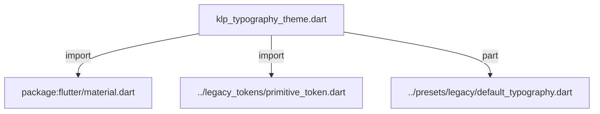
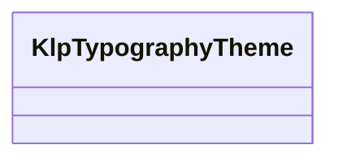
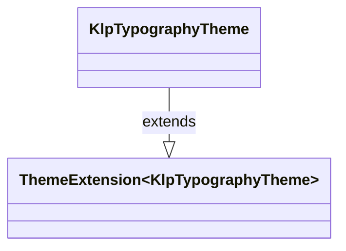

# klp_typography_theme.dart：直接依賴與宣告架構

[回到目錄](README.md) · [來源檔案](../../../../../lib/src/styling/legacy_theme/klp_typography_theme.dart)

## 範圍

核心是 `lib/src/styling/legacy_theme/klp_typography_theme.dart`。主要視角為該檔案明寫的 import／export／part；輔助視角為本檔宣告及 extends／implements／with／on 關係。只展開一層外部邊界。

## 直接依賴圖

## 依賴證據

| 關係 | 原始 directive | 來源 |
|---|---|---|
| import | <code>import &#x27;package:flutter/material.dart&#x27;;</code> | [lib/src/styling/legacy_theme/klp_typography_theme.dart:1](../../../../../lib/src/styling/legacy_theme/klp_typography_theme.dart#L1) |
| import | <code>import &#x27;../legacy_tokens/primitive_token.dart&#x27;;</code> | [lib/src/styling/legacy_theme/klp_typography_theme.dart:3](../../../../../lib/src/styling/legacy_theme/klp_typography_theme.dart#L3) |
| part | <code>part &#x27;../presets/legacy/default_typography.dart&#x27;;</code> | [lib/src/styling/legacy_theme/klp_typography_theme.dart:5](../../../../../lib/src/styling/legacy_theme/klp_typography_theme.dart#L5) |

## 宣告關係圖

本組節點是本檔宣告；沒有箭頭的宣告未在此圖主張互相依賴。

## 宣告與成員證據

成員包含 public 與 private；簽章取自來源，省略函式本體與欄位初始值。`(inferred)` 表示來源未明寫型別；建構子只顯示參數部分，不含初始化列表。

### KlpTypographyTheme

ClassDeclaration · public · [lib/src/styling/legacy_theme/klp_typography_theme.dart:7](../../../../../lib/src/styling/legacy_theme/klp_typography_theme.dart#L7)

<code>class KlpTypographyTheme extends ThemeExtension&lt;KlpTypographyTheme&gt;</code>

來源註解摘要：Layer 2：字體的 semantic token。 字體家族本身是 theme 的一部分——有些風格全域使用等寬字，有些只在程式碼與路徑使用。 元件讀 `body`／`label`／`code` 這些**角色**，不指定家族，因此換 theme 時字體會整體 跟著換，不會只換一半。

- `extends` → <code>ThemeExtension&lt;KlpTypographyTheme&gt;</code>：[lib/src/styling/legacy_theme/klp_typography_theme.dart:13](../../../../../lib/src/styling/legacy_theme/klp_typography_theme.dart#L13)

| 成員 | 可見性 | 簽章／型別 | 來源註解摘要 | 證據 |
|---|---|---|---|---|
| constructor <code>KlpTypographyTheme</code> | public | <code>const KlpTypographyTheme({ required this.sansFamily, required this.sansFallback, required this.monoFamily, required this.monoFallback, required this.uiFamily, required this.bodyFamily, required this.codeFamily, this.micro = KlpScale.font100, required this.caption, this.sub = KlpScale.font300, required this.body, this.lead = KlpScale.font500, this.h4 = KlpScale.font600, this.h3 = KlpScale.font700, this.h2 = KlpScale.font800, this.h1 = KlpScale.font900, required this.label, required this.section, required this.headingSmall, required this.heading, required this.title, required this.display, this.microLeading = KlpScale.leading120, required this.captionLeading, this.subLeading = KlpScale.leading142, required this.bodyLeading, this.leadLeading = KlpScale.leading155, this.h4Leading = KlpScale.leading127, this.h3Leading = KlpScale.leading128, this.h2Leading = KlpScale.leading122, this.h1Leading = KlpScale.leading116, required this.headingLeading, required this.displayLeading, required this.codeLeading, required this.readingLeading, required this.labelLeading, required this.labelTracking, required this.displayTracking, required this.regular, required this.medium, this.semiBold = KlpScale.weight600, this.bold = KlpScale.weight700, this.extraBold = KlpScale.weight800, required this.strong, })</code> |  | [lib/src/styling/legacy_theme/klp_typography_theme.dart:14](../../../../../lib/src/styling/legacy_theme/klp_typography_theme.dart#L14) |
| field <code>sansFamily</code> | public | <code>final String sansFamily</code> |  | [lib/src/styling/legacy_theme/klp_typography_theme.dart:63](../../../../../lib/src/styling/legacy_theme/klp_typography_theme.dart#L63) |
| field <code>sansFallback</code> | public | <code>final List&lt;String&gt; sansFallback</code> |  | [lib/src/styling/legacy_theme/klp_typography_theme.dart:64](../../../../../lib/src/styling/legacy_theme/klp_typography_theme.dart#L64) |
| field <code>monoFamily</code> | public | <code>final String monoFamily</code> |  | [lib/src/styling/legacy_theme/klp_typography_theme.dart:65](../../../../../lib/src/styling/legacy_theme/klp_typography_theme.dart#L65) |
| field <code>monoFallback</code> | public | <code>final List&lt;String&gt; monoFallback</code> |  | [lib/src/styling/legacy_theme/klp_typography_theme.dart:66](../../../../../lib/src/styling/legacy_theme/klp_typography_theme.dart#L66) |
| field <code>uiFamily</code> | public | <code>final String uiFamily</code> |  | [lib/src/styling/legacy_theme/klp_typography_theme.dart:69](../../../../../lib/src/styling/legacy_theme/klp_typography_theme.dart#L69) |
| field <code>bodyFamily</code> | public | <code>final String bodyFamily</code> |  | [lib/src/styling/legacy_theme/klp_typography_theme.dart:70](../../../../../lib/src/styling/legacy_theme/klp_typography_theme.dart#L70) |
| field <code>codeFamily</code> | public | <code>final String codeFamily</code> |  | [lib/src/styling/legacy_theme/klp_typography_theme.dart:71](../../../../../lib/src/styling/legacy_theme/klp_typography_theme.dart#L71) |
| field <code>micro</code> | public | <code>final double micro</code> |  | [lib/src/styling/legacy_theme/klp_typography_theme.dart:74](../../../../../lib/src/styling/legacy_theme/klp_typography_theme.dart#L74) |
| field <code>caption</code> | public | <code>final double caption</code> |  | [lib/src/styling/legacy_theme/klp_typography_theme.dart:75](../../../../../lib/src/styling/legacy_theme/klp_typography_theme.dart#L75) |
| field <code>sub</code> | public | <code>final double sub</code> |  | [lib/src/styling/legacy_theme/klp_typography_theme.dart:76](../../../../../lib/src/styling/legacy_theme/klp_typography_theme.dart#L76) |
| field <code>body</code> | public | <code>final double body</code> |  | [lib/src/styling/legacy_theme/klp_typography_theme.dart:77](../../../../../lib/src/styling/legacy_theme/klp_typography_theme.dart#L77) |
| field <code>lead</code> | public | <code>final double lead</code> |  | [lib/src/styling/legacy_theme/klp_typography_theme.dart:78](../../../../../lib/src/styling/legacy_theme/klp_typography_theme.dart#L78) |
| field <code>h4</code> | public | <code>final double h4</code> |  | [lib/src/styling/legacy_theme/klp_typography_theme.dart:79](../../../../../lib/src/styling/legacy_theme/klp_typography_theme.dart#L79) |
| field <code>h3</code> | public | <code>final double h3</code> |  | [lib/src/styling/legacy_theme/klp_typography_theme.dart:80](../../../../../lib/src/styling/legacy_theme/klp_typography_theme.dart#L80) |
| field <code>h2</code> | public | <code>final double h2</code> |  | [lib/src/styling/legacy_theme/klp_typography_theme.dart:81](../../../../../lib/src/styling/legacy_theme/klp_typography_theme.dart#L81) |
| field <code>h1</code> | public | <code>final double h1</code> |  | [lib/src/styling/legacy_theme/klp_typography_theme.dart:82](../../../../../lib/src/styling/legacy_theme/klp_typography_theme.dart#L82) |
| field <code>display</code> | public | <code>final double display</code> |  | [lib/src/styling/legacy_theme/klp_typography_theme.dart:83](../../../../../lib/src/styling/legacy_theme/klp_typography_theme.dart#L83) |
| field <code>label</code> | public | <code>final double label</code> |  | [lib/src/styling/legacy_theme/klp_typography_theme.dart:86](../../../../../lib/src/styling/legacy_theme/klp_typography_theme.dart#L86) |
| field <code>section</code> | public | <code>final double section</code> |  | [lib/src/styling/legacy_theme/klp_typography_theme.dart:87](../../../../../lib/src/styling/legacy_theme/klp_typography_theme.dart#L87) |
| field <code>headingSmall</code> | public | <code>final double headingSmall</code> |  | [lib/src/styling/legacy_theme/klp_typography_theme.dart:88](../../../../../lib/src/styling/legacy_theme/klp_typography_theme.dart#L88) |
| field <code>heading</code> | public | <code>final double heading</code> |  | [lib/src/styling/legacy_theme/klp_typography_theme.dart:89](../../../../../lib/src/styling/legacy_theme/klp_typography_theme.dart#L89) |
| field <code>title</code> | public | <code>final double title</code> |  | [lib/src/styling/legacy_theme/klp_typography_theme.dart:90](../../../../../lib/src/styling/legacy_theme/klp_typography_theme.dart#L90) |
| field <code>microLeading</code> | public | <code>final double microLeading</code> |  | [lib/src/styling/legacy_theme/klp_typography_theme.dart:93](../../../../../lib/src/styling/legacy_theme/klp_typography_theme.dart#L93) |
| field <code>captionLeading</code> | public | <code>final double captionLeading</code> |  | [lib/src/styling/legacy_theme/klp_typography_theme.dart:94](../../../../../lib/src/styling/legacy_theme/klp_typography_theme.dart#L94) |
| field <code>subLeading</code> | public | <code>final double subLeading</code> |  | [lib/src/styling/legacy_theme/klp_typography_theme.dart:95](../../../../../lib/src/styling/legacy_theme/klp_typography_theme.dart#L95) |
| field <code>bodyLeading</code> | public | <code>final double bodyLeading</code> |  | [lib/src/styling/legacy_theme/klp_typography_theme.dart:96](../../../../../lib/src/styling/legacy_theme/klp_typography_theme.dart#L96) |
| field <code>leadLeading</code> | public | <code>final double leadLeading</code> |  | [lib/src/styling/legacy_theme/klp_typography_theme.dart:97](../../../../../lib/src/styling/legacy_theme/klp_typography_theme.dart#L97) |
| field <code>h4Leading</code> | public | <code>final double h4Leading</code> |  | [lib/src/styling/legacy_theme/klp_typography_theme.dart:98](../../../../../lib/src/styling/legacy_theme/klp_typography_theme.dart#L98) |
| field <code>h3Leading</code> | public | <code>final double h3Leading</code> |  | [lib/src/styling/legacy_theme/klp_typography_theme.dart:99](../../../../../lib/src/styling/legacy_theme/klp_typography_theme.dart#L99) |
| field <code>h2Leading</code> | public | <code>final double h2Leading</code> |  | [lib/src/styling/legacy_theme/klp_typography_theme.dart:100](../../../../../lib/src/styling/legacy_theme/klp_typography_theme.dart#L100) |
| field <code>h1Leading</code> | public | <code>final double h1Leading</code> |  | [lib/src/styling/legacy_theme/klp_typography_theme.dart:101](../../../../../lib/src/styling/legacy_theme/klp_typography_theme.dart#L101) |
| field <code>displayLeading</code> | public | <code>final double displayLeading</code> |  | [lib/src/styling/legacy_theme/klp_typography_theme.dart:102](../../../../../lib/src/styling/legacy_theme/klp_typography_theme.dart#L102) |
| field <code>headingLeading</code> | public | <code>final double headingLeading</code> |  | [lib/src/styling/legacy_theme/klp_typography_theme.dart:104](../../../../../lib/src/styling/legacy_theme/klp_typography_theme.dart#L104) |
| field <code>codeLeading</code> | public | <code>final double codeLeading</code> |  | [lib/src/styling/legacy_theme/klp_typography_theme.dart:105](../../../../../lib/src/styling/legacy_theme/klp_typography_theme.dart#L105) |
| field <code>readingLeading</code> | public | <code>final double readingLeading</code> |  | [lib/src/styling/legacy_theme/klp_typography_theme.dart:106](../../../../../lib/src/styling/legacy_theme/klp_typography_theme.dart#L106) |
| field <code>labelLeading</code> | public | <code>final double labelLeading</code> |  | [lib/src/styling/legacy_theme/klp_typography_theme.dart:107](../../../../../lib/src/styling/legacy_theme/klp_typography_theme.dart#L107) |
| field <code>labelTracking</code> | public | <code>final double labelTracking</code> |  | [lib/src/styling/legacy_theme/klp_typography_theme.dart:110](../../../../../lib/src/styling/legacy_theme/klp_typography_theme.dart#L110) |
| field <code>displayTracking</code> | public | <code>final double displayTracking</code> |  | [lib/src/styling/legacy_theme/klp_typography_theme.dart:111](../../../../../lib/src/styling/legacy_theme/klp_typography_theme.dart#L111) |
| field <code>regular</code> | public | <code>final FontWeight regular</code> |  | [lib/src/styling/legacy_theme/klp_typography_theme.dart:114](../../../../../lib/src/styling/legacy_theme/klp_typography_theme.dart#L114) |
| field <code>medium</code> | public | <code>final FontWeight medium</code> |  | [lib/src/styling/legacy_theme/klp_typography_theme.dart:115](../../../../../lib/src/styling/legacy_theme/klp_typography_theme.dart#L115) |
| field <code>semiBold</code> | public | <code>final FontWeight semiBold</code> |  | [lib/src/styling/legacy_theme/klp_typography_theme.dart:116](../../../../../lib/src/styling/legacy_theme/klp_typography_theme.dart#L116) |
| field <code>bold</code> | public | <code>final FontWeight bold</code> |  | [lib/src/styling/legacy_theme/klp_typography_theme.dart:117](../../../../../lib/src/styling/legacy_theme/klp_typography_theme.dart#L117) |
| field <code>extraBold</code> | public | <code>final FontWeight extraBold</code> |  | [lib/src/styling/legacy_theme/klp_typography_theme.dart:118](../../../../../lib/src/styling/legacy_theme/klp_typography_theme.dart#L118) |
| field <code>strong</code> | public | <code>final FontWeight strong</code> |  | [lib/src/styling/legacy_theme/klp_typography_theme.dart:119](../../../../../lib/src/styling/legacy_theme/klp_typography_theme.dart#L119) |
| field <code>proportional</code> | public | <code>static const KlpTypographyTheme proportional</code> | 現代風：完整 10 階字級排版系統。 | [lib/src/styling/legacy_theme/klp_typography_theme.dart:122](../../../../../lib/src/styling/legacy_theme/klp_typography_theme.dart#L122) |
| method <code>fallbackFor</code> | public | <code>List&lt;String&gt; fallbackFor(String family)</code> |  | [lib/src/styling/legacy_theme/klp_typography_theme.dart:124](../../../../../lib/src/styling/legacy_theme/klp_typography_theme.dart#L124) |
| method <code>copyWith</code> | public | <code>KlpTypographyTheme copyWith({ String? sansFamily, List&lt;String&gt;? sansFallback, String? monoFamily, List&lt;String&gt;? monoFallback, String? uiFamily, String? bodyFamily, String? codeFamily, double? micro, double? caption, double? sub, double? body, double? lead, double? h4, double? h3, double? h2, double? h1, double? display, double? label, double? section, double? headingSmall, double? heading, double? title, double? microLeading, double? captionLeading, double? subLeading, double? bodyLeading, double? leadLeading, double? h4Leading, double? h3Leading, double? h2Leading, double? h1Leading, double? displayLeading, double? headingLeading, double? codeLeading, double? readingLeading, double? labelLeading, double? labelTracking, double? displayTracking, FontWeight? regular, FontWeight? medium, FontWeight? semiBold, FontWeight? bold, FontWeight? extraBold, FontWeight? strong, })</code> |  | [lib/src/styling/legacy_theme/klp_typography_theme.dart:129](../../../../../lib/src/styling/legacy_theme/klp_typography_theme.dart#L129) |
| method <code>lerp</code> | public | <code>KlpTypographyTheme lerp(covariant KlpTypographyTheme? other, double t)</code> |  | [lib/src/styling/legacy_theme/klp_typography_theme.dart:224](../../../../../lib/src/styling/legacy_theme/klp_typography_theme.dart#L224) |
| method <code>==</code> | public | <code>bool operator ==(Object other)</code> |  | [lib/src/styling/legacy_theme/klp_typography_theme.dart:230](../../../../../lib/src/styling/legacy_theme/klp_typography_theme.dart#L230) |
| getter <code>hashCode</code> | public | <code>int get hashCode</code> |  | [lib/src/styling/legacy_theme/klp_typography_theme.dart:279](../../../../../lib/src/styling/legacy_theme/klp_typography_theme.dart#L279) |

## 閱讀說明與限制

箭頭只表示來源明寫的靜態關係；import 不等於呼叫。未分析動態呼叫、欄位的實際物件擁有權、狀態轉移或渲染流程；型別未進行語意解析，繼承目標保留原始型別拼寫。public／private 依 Dart 名稱前綴判斷；public 宣告不代表已由 `lib/kallopis.dart` 匯出。

本頁由 `tool/architecture_atlas` 產生；編輯來源或生成工具後重新產生，避免手改本頁。
