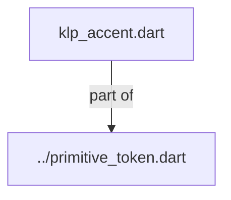
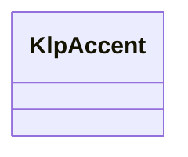

# klp_accent.dart：直接依賴與宣告架構

[回到目錄](README.md) · [來源檔案](../../../../../../lib/src/styling/legacy_tokens/internal/klp_accent.dart)

## 範圍

核心是 `lib/src/styling/legacy_tokens/internal/klp_accent.dart`。主要視角為該檔案明寫的 import／export／part；輔助視角為本檔宣告及 extends／implements／with／on 關係。只展開一層外部邊界。

## 直接依賴圖

## 依賴證據

| 關係 | 原始 directive | 來源 |
|---|---|---|
| part of | <code>part of &#x27;../primitive_token.dart&#x27;;</code> | [lib/src/styling/legacy_tokens/internal/klp_accent.dart:1](../../../../../../lib/src/styling/legacy_tokens/internal/klp_accent.dart#L1) |

## 宣告關係圖

本組節點是本檔宣告；沒有箭頭的宣告未在此圖主張互相依賴。

## 宣告與成員證據

成員包含 public 與 private；簽章取自來源，省略函式本體與欄位初始值。`(inferred)` 表示來源未明寫型別；建構子只顯示參數部分，不含初始化列表。

### KlpAccent

EnumDeclaration · public · [lib/src/styling/legacy_tokens/internal/klp_accent.dart:3](../../../../../../lib/src/styling/legacy_tokens/internal/klp_accent.dart#L3)

<code>enum KlpAccent</code>

來源註解摘要：可選的強調色。 每個值都對著 ink 色梯的表面重新校準過，對比 ≥ 4.70——刻意留 0.2 的餘裕， **調整色梯時不會立刻踩線**。原本的值全部卡在 4.5 邊緣，色梯換掉後五個彩色全數 掉出 AA，而那不會有任何徵兆：顏色看起來還是好的，只是讀不清楚。

| 成員 | 可見性 | 簽章／型別 | 來源註解摘要 | 證據 |
|---|---|---|---|---|
| enum value <code>ink</code> | public | <code>ink</code> |  | [lib/src/styling/legacy_tokens/internal/klp_accent.dart:10](../../../../../../lib/src/styling/legacy_tokens/internal/klp_accent.dart#L10) |
| enum value <code>terracotta</code> | public | <code>terracotta</code> |  | [lib/src/styling/legacy_tokens/internal/klp_accent.dart:11](../../../../../../lib/src/styling/legacy_tokens/internal/klp_accent.dart#L11) |
| enum value <code>ochre</code> | public | <code>ochre</code> |  | [lib/src/styling/legacy_tokens/internal/klp_accent.dart:12](../../../../../../lib/src/styling/legacy_tokens/internal/klp_accent.dart#L12) |
| enum value <code>olive</code> | public | <code>olive</code> |  | [lib/src/styling/legacy_tokens/internal/klp_accent.dart:13](../../../../../../lib/src/styling/legacy_tokens/internal/klp_accent.dart#L13) |
| enum value <code>slate</code> | public | <code>slate</code> |  | [lib/src/styling/legacy_tokens/internal/klp_accent.dart:14](../../../../../../lib/src/styling/legacy_tokens/internal/klp_accent.dart#L14) |
| enum value <code>crimson</code> | public | <code>crimson</code> |  | [lib/src/styling/legacy_tokens/internal/klp_accent.dart:15](../../../../../../lib/src/styling/legacy_tokens/internal/klp_accent.dart#L15) |
| constructor <code>KlpAccent</code> | public | <code>const KlpAccent({required this.light, required this.dark})</code> |  | [lib/src/styling/legacy_tokens/internal/klp_accent.dart:17](../../../../../../lib/src/styling/legacy_tokens/internal/klp_accent.dart#L17) |
| field <code>light</code> | public | <code>final Color light</code> |  | [lib/src/styling/legacy_tokens/internal/klp_accent.dart:19](../../../../../../lib/src/styling/legacy_tokens/internal/klp_accent.dart#L19) |
| field <code>dark</code> | public | <code>final Color dark</code> |  | [lib/src/styling/legacy_tokens/internal/klp_accent.dart:20](../../../../../../lib/src/styling/legacy_tokens/internal/klp_accent.dart#L20) |
| method <code>resolve</code> | public | <code>Color resolve(Brightness brightness)</code> |  | [lib/src/styling/legacy_tokens/internal/klp_accent.dart:22](../../../../../../lib/src/styling/legacy_tokens/internal/klp_accent.dart#L22) |
| method <code>parse</code> | public | <code>static KlpAccent parse(String? value)</code> |  | [lib/src/styling/legacy_tokens/internal/klp_accent.dart:27](../../../../../../lib/src/styling/legacy_tokens/internal/klp_accent.dart#L27) |

## 閱讀說明與限制

箭頭只表示來源明寫的靜態關係；import 不等於呼叫。未分析動態呼叫、欄位的實際物件擁有權、狀態轉移或渲染流程；型別未進行語意解析，繼承目標保留原始型別拼寫。public／private 依 Dart 名稱前綴判斷；public 宣告不代表已由 `lib/kallopis.dart` 匯出。

本頁由 `tool/architecture_atlas` 產生；編輯來源或生成工具後重新產生，避免手改本頁。
