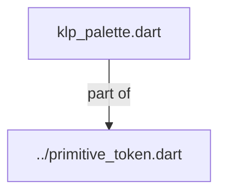
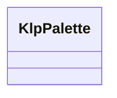

# klp_palette.dart：直接依賴與宣告架構

[回到目錄](README.md) · [來源檔案](../../../../../../lib/src/styling/legacy_tokens/internal/klp_palette.dart)

## 範圍

核心是 `lib/src/styling/legacy_tokens/internal/klp_palette.dart`。主要視角為該檔案明寫的 import／export／part；輔助視角為本檔宣告及 extends／implements／with／on 關係。只展開一層外部邊界。

## 直接依賴圖

## 依賴證據

| 關係 | 原始 directive | 來源 |
|---|---|---|
| part of | <code>part of &#x27;../primitive_token.dart&#x27;;</code> | [lib/src/styling/legacy_tokens/internal/klp_palette.dart:1](../../../../../../lib/src/styling/legacy_tokens/internal/klp_palette.dart#L1) |

## 宣告關係圖

本組節點是本檔宣告；沒有箭頭的宣告未在此圖主張互相依賴。

## 宣告與成員證據

成員包含 public 與 private；簽章取自來源，省略函式本體與欄位初始值。`(inferred)` 表示來源未明寫型別；建構子只顯示參數部分，不含初始化列表。

### KlpPalette

ClassDeclaration · public · [lib/src/styling/legacy_tokens/internal/klp_palette.dart:3](../../../../../../lib/src/styling/legacy_tokens/internal/klp_palette.dart#L3)

<code>abstract final class KlpPalette</code>

來源註解摘要：Kallopis primitive 色彩字彙表，不承載產品或元件語意。

| 成員 | 可見性 | 簽章／型別 | 來源註解摘要 | 證據 |
|---|---|---|---|---|
| field <code>transparent</code> | public | <code>static const Color transparent</code> |  | [lib/src/styling/legacy_tokens/internal/klp_palette.dart:5](../../../../../../lib/src/styling/legacy_tokens/internal/klp_palette.dart#L5) |
| field <code>ink50</code> | public | <code>static const Color ink50</code> |  | [lib/src/styling/legacy_tokens/internal/klp_palette.dart:6](../../../../../../lib/src/styling/legacy_tokens/internal/klp_palette.dart#L6) |
| field <code>ink100</code> | public | <code>static const Color ink100</code> |  | [lib/src/styling/legacy_tokens/internal/klp_palette.dart:7](../../../../../../lib/src/styling/legacy_tokens/internal/klp_palette.dart#L7) |
| field <code>ink150</code> | public | <code>static const Color ink150</code> |  | [lib/src/styling/legacy_tokens/internal/klp_palette.dart:8](../../../../../../lib/src/styling/legacy_tokens/internal/klp_palette.dart#L8) |
| field <code>ink200</code> | public | <code>static const Color ink200</code> |  | [lib/src/styling/legacy_tokens/internal/klp_palette.dart:9](../../../../../../lib/src/styling/legacy_tokens/internal/klp_palette.dart#L9) |
| field <code>ink250</code> | public | <code>static const Color ink250</code> |  | [lib/src/styling/legacy_tokens/internal/klp_palette.dart:10](../../../../../../lib/src/styling/legacy_tokens/internal/klp_palette.dart#L10) |
| field <code>ink300</code> | public | <code>static const Color ink300</code> |  | [lib/src/styling/legacy_tokens/internal/klp_palette.dart:11](../../../../../../lib/src/styling/legacy_tokens/internal/klp_palette.dart#L11) |
| field <code>ink350</code> | public | <code>static const Color ink350</code> |  | [lib/src/styling/legacy_tokens/internal/klp_palette.dart:12](../../../../../../lib/src/styling/legacy_tokens/internal/klp_palette.dart#L12) |
| field <code>ink400</code> | public | <code>static const Color ink400</code> |  | [lib/src/styling/legacy_tokens/internal/klp_palette.dart:13](../../../../../../lib/src/styling/legacy_tokens/internal/klp_palette.dart#L13) |
| field <code>ink450</code> | public | <code>static const Color ink450</code> |  | [lib/src/styling/legacy_tokens/internal/klp_palette.dart:14](../../../../../../lib/src/styling/legacy_tokens/internal/klp_palette.dart#L14) |
| field <code>ink500</code> | public | <code>static const Color ink500</code> |  | [lib/src/styling/legacy_tokens/internal/klp_palette.dart:15](../../../../../../lib/src/styling/legacy_tokens/internal/klp_palette.dart#L15) |
| field <code>ink550</code> | public | <code>static const Color ink550</code> |  | [lib/src/styling/legacy_tokens/internal/klp_palette.dart:16](../../../../../../lib/src/styling/legacy_tokens/internal/klp_palette.dart#L16) |
| field <code>ink600</code> | public | <code>static const Color ink600</code> |  | [lib/src/styling/legacy_tokens/internal/klp_palette.dart:17](../../../../../../lib/src/styling/legacy_tokens/internal/klp_palette.dart#L17) |
| field <code>ink650</code> | public | <code>static const Color ink650</code> |  | [lib/src/styling/legacy_tokens/internal/klp_palette.dart:18](../../../../../../lib/src/styling/legacy_tokens/internal/klp_palette.dart#L18) |
| field <code>ink700</code> | public | <code>static const Color ink700</code> |  | [lib/src/styling/legacy_tokens/internal/klp_palette.dart:19](../../../../../../lib/src/styling/legacy_tokens/internal/klp_palette.dart#L19) |
| field <code>ink750</code> | public | <code>static const Color ink750</code> |  | [lib/src/styling/legacy_tokens/internal/klp_palette.dart:20](../../../../../../lib/src/styling/legacy_tokens/internal/klp_palette.dart#L20) |
| field <code>ink800</code> | public | <code>static const Color ink800</code> |  | [lib/src/styling/legacy_tokens/internal/klp_palette.dart:21](../../../../../../lib/src/styling/legacy_tokens/internal/klp_palette.dart#L21) |
| field <code>ink850</code> | public | <code>static const Color ink850</code> |  | [lib/src/styling/legacy_tokens/internal/klp_palette.dart:22](../../../../../../lib/src/styling/legacy_tokens/internal/klp_palette.dart#L22) |
| field <code>ink900</code> | public | <code>static const Color ink900</code> |  | [lib/src/styling/legacy_tokens/internal/klp_palette.dart:23](../../../../../../lib/src/styling/legacy_tokens/internal/klp_palette.dart#L23) |
| field <code>ink950</code> | public | <code>static const Color ink950</code> |  | [lib/src/styling/legacy_tokens/internal/klp_palette.dart:24](../../../../../../lib/src/styling/legacy_tokens/internal/klp_palette.dart#L24) |
| field <code>warmNeutral25</code> | public | <code>static const Color warmNeutral25</code> |  | [lib/src/styling/legacy_tokens/internal/klp_palette.dart:25](../../../../../../lib/src/styling/legacy_tokens/internal/klp_palette.dart#L25) |
| field <code>warmNeutral50</code> | public | <code>static const Color warmNeutral50</code> |  | [lib/src/styling/legacy_tokens/internal/klp_palette.dart:26](../../../../../../lib/src/styling/legacy_tokens/internal/klp_palette.dart#L26) |
| field <code>warmNeutral100</code> | public | <code>static const Color warmNeutral100</code> |  | [lib/src/styling/legacy_tokens/internal/klp_palette.dart:27](../../../../../../lib/src/styling/legacy_tokens/internal/klp_palette.dart#L27) |
| field <code>warmNeutral200</code> | public | <code>static const Color warmNeutral200</code> |  | [lib/src/styling/legacy_tokens/internal/klp_palette.dart:28](../../../../../../lib/src/styling/legacy_tokens/internal/klp_palette.dart#L28) |
| field <code>warmNeutral300</code> | public | <code>static const Color warmNeutral300</code> |  | [lib/src/styling/legacy_tokens/internal/klp_palette.dart:29](../../../../../../lib/src/styling/legacy_tokens/internal/klp_palette.dart#L29) |
| field <code>warmNeutral400</code> | public | <code>static const Color warmNeutral400</code> |  | [lib/src/styling/legacy_tokens/internal/klp_palette.dart:30](../../../../../../lib/src/styling/legacy_tokens/internal/klp_palette.dart#L30) |
| field <code>warmNeutral450</code> | public | <code>static const Color warmNeutral450</code> |  | [lib/src/styling/legacy_tokens/internal/klp_palette.dart:31](../../../../../../lib/src/styling/legacy_tokens/internal/klp_palette.dart#L31) |
| field <code>warmNeutral500</code> | public | <code>static const Color warmNeutral500</code> |  | [lib/src/styling/legacy_tokens/internal/klp_palette.dart:32](../../../../../../lib/src/styling/legacy_tokens/internal/klp_palette.dart#L32) |
| field <code>warmNeutral600</code> | public | <code>static const Color warmNeutral600</code> |  | [lib/src/styling/legacy_tokens/internal/klp_palette.dart:33](../../../../../../lib/src/styling/legacy_tokens/internal/klp_palette.dart#L33) |
| field <code>warmNeutral700</code> | public | <code>static const Color warmNeutral700</code> |  | [lib/src/styling/legacy_tokens/internal/klp_palette.dart:34](../../../../../../lib/src/styling/legacy_tokens/internal/klp_palette.dart#L34) |
| field <code>warmNeutral750</code> | public | <code>static const Color warmNeutral750</code> |  | [lib/src/styling/legacy_tokens/internal/klp_palette.dart:35](../../../../../../lib/src/styling/legacy_tokens/internal/klp_palette.dart#L35) |
| field <code>warmNeutral800</code> | public | <code>static const Color warmNeutral800</code> |  | [lib/src/styling/legacy_tokens/internal/klp_palette.dart:36](../../../../../../lib/src/styling/legacy_tokens/internal/klp_palette.dart#L36) |
| field <code>warmNeutral900</code> | public | <code>static const Color warmNeutral900</code> |  | [lib/src/styling/legacy_tokens/internal/klp_palette.dart:37](../../../../../../lib/src/styling/legacy_tokens/internal/klp_palette.dart#L37) |
| field <code>sand50</code> | public | <code>static const Color sand50</code> |  | [lib/src/styling/legacy_tokens/internal/klp_palette.dart:38](../../../../../../lib/src/styling/legacy_tokens/internal/klp_palette.dart#L38) |
| field <code>sand300</code> | public | <code>static const Color sand300</code> |  | [lib/src/styling/legacy_tokens/internal/klp_palette.dart:39](../../../../../../lib/src/styling/legacy_tokens/internal/klp_palette.dart#L39) |
| field <code>sand500</code> | public | <code>static const Color sand500</code> |  | [lib/src/styling/legacy_tokens/internal/klp_palette.dart:40](../../../../../../lib/src/styling/legacy_tokens/internal/klp_palette.dart#L40) |
| field <code>sand800</code> | public | <code>static const Color sand800</code> |  | [lib/src/styling/legacy_tokens/internal/klp_palette.dart:41](../../../../../../lib/src/styling/legacy_tokens/internal/klp_palette.dart#L41) |
| field <code>sand900</code> | public | <code>static const Color sand900</code> |  | [lib/src/styling/legacy_tokens/internal/klp_palette.dart:42](../../../../../../lib/src/styling/legacy_tokens/internal/klp_palette.dart#L42) |
| field <code>gold50</code> | public | <code>static const Color gold50</code> |  | [lib/src/styling/legacy_tokens/internal/klp_palette.dart:43](../../../../../../lib/src/styling/legacy_tokens/internal/klp_palette.dart#L43) |
| field <code>gold300</code> | public | <code>static const Color gold300</code> |  | [lib/src/styling/legacy_tokens/internal/klp_palette.dart:44](../../../../../../lib/src/styling/legacy_tokens/internal/klp_palette.dart#L44) |
| field <code>gold500</code> | public | <code>static const Color gold500</code> |  | [lib/src/styling/legacy_tokens/internal/klp_palette.dart:45](../../../../../../lib/src/styling/legacy_tokens/internal/klp_palette.dart#L45) |
| field <code>gold800</code> | public | <code>static const Color gold800</code> |  | [lib/src/styling/legacy_tokens/internal/klp_palette.dart:46](../../../../../../lib/src/styling/legacy_tokens/internal/klp_palette.dart#L46) |
| field <code>gold900</code> | public | <code>static const Color gold900</code> |  | [lib/src/styling/legacy_tokens/internal/klp_palette.dart:47](../../../../../../lib/src/styling/legacy_tokens/internal/klp_palette.dart#L47) |
| field <code>ochre50</code> | public | <code>static const Color ochre50</code> |  | [lib/src/styling/legacy_tokens/internal/klp_palette.dart:48](../../../../../../lib/src/styling/legacy_tokens/internal/klp_palette.dart#L48) |
| field <code>ochre300</code> | public | <code>static const Color ochre300</code> |  | [lib/src/styling/legacy_tokens/internal/klp_palette.dart:49](../../../../../../lib/src/styling/legacy_tokens/internal/klp_palette.dart#L49) |
| field <code>ochre500</code> | public | <code>static const Color ochre500</code> |  | [lib/src/styling/legacy_tokens/internal/klp_palette.dart:50](../../../../../../lib/src/styling/legacy_tokens/internal/klp_palette.dart#L50) |
| field <code>ochre800</code> | public | <code>static const Color ochre800</code> |  | [lib/src/styling/legacy_tokens/internal/klp_palette.dart:51](../../../../../../lib/src/styling/legacy_tokens/internal/klp_palette.dart#L51) |
| field <code>ochre900</code> | public | <code>static const Color ochre900</code> |  | [lib/src/styling/legacy_tokens/internal/klp_palette.dart:52](../../../../../../lib/src/styling/legacy_tokens/internal/klp_palette.dart#L52) |
| field <code>terracotta50</code> | public | <code>static const Color terracotta50</code> |  | [lib/src/styling/legacy_tokens/internal/klp_palette.dart:53](../../../../../../lib/src/styling/legacy_tokens/internal/klp_palette.dart#L53) |
| field <code>terracotta300</code> | public | <code>static const Color terracotta300</code> |  | [lib/src/styling/legacy_tokens/internal/klp_palette.dart:54](../../../../../../lib/src/styling/legacy_tokens/internal/klp_palette.dart#L54) |
| field <code>terracotta500</code> | public | <code>static const Color terracotta500</code> |  | [lib/src/styling/legacy_tokens/internal/klp_palette.dart:55](../../../../../../lib/src/styling/legacy_tokens/internal/klp_palette.dart#L55) |
| field <code>terracotta800</code> | public | <code>static const Color terracotta800</code> |  | [lib/src/styling/legacy_tokens/internal/klp_palette.dart:56](../../../../../../lib/src/styling/legacy_tokens/internal/klp_palette.dart#L56) |
| field <code>terracotta900</code> | public | <code>static const Color terracotta900</code> |  | [lib/src/styling/legacy_tokens/internal/klp_palette.dart:57](../../../../../../lib/src/styling/legacy_tokens/internal/klp_palette.dart#L57) |
| field <code>clay50</code> | public | <code>static const Color clay50</code> |  | [lib/src/styling/legacy_tokens/internal/klp_palette.dart:58](../../../../../../lib/src/styling/legacy_tokens/internal/klp_palette.dart#L58) |
| field <code>clay300</code> | public | <code>static const Color clay300</code> |  | [lib/src/styling/legacy_tokens/internal/klp_palette.dart:59](../../../../../../lib/src/styling/legacy_tokens/internal/klp_palette.dart#L59) |
| field <code>clay500</code> | public | <code>static const Color clay500</code> |  | [lib/src/styling/legacy_tokens/internal/klp_palette.dart:60](../../../../../../lib/src/styling/legacy_tokens/internal/klp_palette.dart#L60) |
| field <code>clay800</code> | public | <code>static const Color clay800</code> |  | [lib/src/styling/legacy_tokens/internal/klp_palette.dart:61](../../../../../../lib/src/styling/legacy_tokens/internal/klp_palette.dart#L61) |
| field <code>clay900</code> | public | <code>static const Color clay900</code> |  | [lib/src/styling/legacy_tokens/internal/klp_palette.dart:62](../../../../../../lib/src/styling/legacy_tokens/internal/klp_palette.dart#L62) |
| field <code>umber50</code> | public | <code>static const Color umber50</code> |  | [lib/src/styling/legacy_tokens/internal/klp_palette.dart:63](../../../../../../lib/src/styling/legacy_tokens/internal/klp_palette.dart#L63) |
| field <code>umber300</code> | public | <code>static const Color umber300</code> |  | [lib/src/styling/legacy_tokens/internal/klp_palette.dart:64](../../../../../../lib/src/styling/legacy_tokens/internal/klp_palette.dart#L64) |
| field <code>umber500</code> | public | <code>static const Color umber500</code> |  | [lib/src/styling/legacy_tokens/internal/klp_palette.dart:65](../../../../../../lib/src/styling/legacy_tokens/internal/klp_palette.dart#L65) |
| field <code>umber800</code> | public | <code>static const Color umber800</code> |  | [lib/src/styling/legacy_tokens/internal/klp_palette.dart:66](../../../../../../lib/src/styling/legacy_tokens/internal/klp_palette.dart#L66) |
| field <code>umber900</code> | public | <code>static const Color umber900</code> |  | [lib/src/styling/legacy_tokens/internal/klp_palette.dart:67](../../../../../../lib/src/styling/legacy_tokens/internal/klp_palette.dart#L67) |
| field <code>green100</code> | public | <code>static const Color green100</code> |  | [lib/src/styling/legacy_tokens/internal/klp_palette.dart:68](../../../../../../lib/src/styling/legacy_tokens/internal/klp_palette.dart#L68) |
| field <code>green400</code> | public | <code>static const Color green400</code> |  | [lib/src/styling/legacy_tokens/internal/klp_palette.dart:69](../../../../../../lib/src/styling/legacy_tokens/internal/klp_palette.dart#L69) |
| field <code>green500</code> | public | <code>static const Color green500</code> |  | [lib/src/styling/legacy_tokens/internal/klp_palette.dart:70](../../../../../../lib/src/styling/legacy_tokens/internal/klp_palette.dart#L70) |
| field <code>green600</code> | public | <code>static const Color green600</code> |  | [lib/src/styling/legacy_tokens/internal/klp_palette.dart:71](../../../../../../lib/src/styling/legacy_tokens/internal/klp_palette.dart#L71) |
| field <code>green800</code> | public | <code>static const Color green800</code> |  | [lib/src/styling/legacy_tokens/internal/klp_palette.dart:72](../../../../../../lib/src/styling/legacy_tokens/internal/klp_palette.dart#L72) |
| field <code>green900</code> | public | <code>static const Color green900</code> |  | [lib/src/styling/legacy_tokens/internal/klp_palette.dart:73](../../../../../../lib/src/styling/legacy_tokens/internal/klp_palette.dart#L73) |
| field <code>red100</code> | public | <code>static const Color red100</code> |  | [lib/src/styling/legacy_tokens/internal/klp_palette.dart:74](../../../../../../lib/src/styling/legacy_tokens/internal/klp_palette.dart#L74) |
| field <code>red300</code> | public | <code>static const Color red300</code> |  | [lib/src/styling/legacy_tokens/internal/klp_palette.dart:75](../../../../../../lib/src/styling/legacy_tokens/internal/klp_palette.dart#L75) |
| field <code>red400</code> | public | <code>static const Color red400</code> |  | [lib/src/styling/legacy_tokens/internal/klp_palette.dart:76](../../../../../../lib/src/styling/legacy_tokens/internal/klp_palette.dart#L76) |
| field <code>red600</code> | public | <code>static const Color red600</code> |  | [lib/src/styling/legacy_tokens/internal/klp_palette.dart:77](../../../../../../lib/src/styling/legacy_tokens/internal/klp_palette.dart#L77) |
| field <code>red800</code> | public | <code>static const Color red800</code> |  | [lib/src/styling/legacy_tokens/internal/klp_palette.dart:78](../../../../../../lib/src/styling/legacy_tokens/internal/klp_palette.dart#L78) |
| field <code>red900</code> | public | <code>static const Color red900</code> |  | [lib/src/styling/legacy_tokens/internal/klp_palette.dart:79](../../../../../../lib/src/styling/legacy_tokens/internal/klp_palette.dart#L79) |
| field <code>amber500</code> | public | <code>static const Color amber500</code> |  | [lib/src/styling/legacy_tokens/internal/klp_palette.dart:80](../../../../../../lib/src/styling/legacy_tokens/internal/klp_palette.dart#L80) |
| field <code>blue500</code> | public | <code>static const Color blue500</code> |  | [lib/src/styling/legacy_tokens/internal/klp_palette.dart:81](../../../../../../lib/src/styling/legacy_tokens/internal/klp_palette.dart#L81) |
| field <code>scrim</code> | public | <code>static const Color scrim</code> |  | [lib/src/styling/legacy_tokens/internal/klp_palette.dart:82](../../../../../../lib/src/styling/legacy_tokens/internal/klp_palette.dart#L82) |
| field <code>line</code> | public | <code>static const Color line</code> |  | [lib/src/styling/legacy_tokens/internal/klp_palette.dart:83](../../../../../../lib/src/styling/legacy_tokens/internal/klp_palette.dart#L83) |
| field <code>transparentSurface</code> | public | <code>static const Color transparentSurface</code> |  | [lib/src/styling/legacy_tokens/internal/klp_palette.dart:84](../../../../../../lib/src/styling/legacy_tokens/internal/klp_palette.dart#L84) |
| field <code>transparentSurfaceInset</code> | public | <code>static const Color transparentSurfaceInset</code> |  | [lib/src/styling/legacy_tokens/internal/klp_palette.dart:85](../../../../../../lib/src/styling/legacy_tokens/internal/klp_palette.dart#L85) |
| field <code>pureWhite</code> | public | <code>static const Color pureWhite</code> |  | [lib/src/styling/legacy_tokens/internal/klp_palette.dart:86](../../../../../../lib/src/styling/legacy_tokens/internal/klp_palette.dart#L86) |
| field <code>pureBlack</code> | public | <code>static const Color pureBlack</code> |  | [lib/src/styling/legacy_tokens/internal/klp_palette.dart:87](../../../../../../lib/src/styling/legacy_tokens/internal/klp_palette.dart#L87) |

## 閱讀說明與限制

箭頭只表示來源明寫的靜態關係；import 不等於呼叫。未分析動態呼叫、欄位的實際物件擁有權、狀態轉移或渲染流程；型別未進行語意解析，繼承目標保留原始型別拼寫。public／private 依 Dart 名稱前綴判斷；public 宣告不代表已由 `lib/kallopis.dart` 匯出。

本頁由 `tool/architecture_atlas` 產生；編輯來源或生成工具後重新產生，避免手改本頁。
