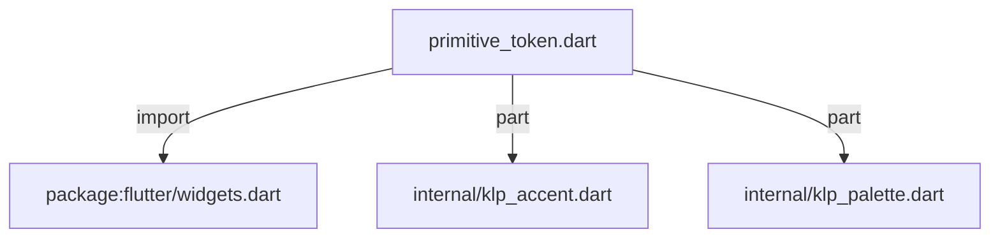
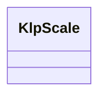

# primitive_token.dart：直接依賴與宣告架構

[回到目錄](README.md) · [來源檔案](../../../../../lib/src/styling/legacy_tokens/primitive_token.dart)

## 範圍

核心是 `lib/src/styling/legacy_tokens/primitive_token.dart`。主要視角為該檔案明寫的 import／export／part；輔助視角為本檔宣告及 extends／implements／with／on 關係。只展開一層外部邊界。

## 直接依賴圖

## 依賴證據

| 關係 | 原始 directive | 來源 |
|---|---|---|
| import | <code>import &#x27;package:flutter/widgets.dart&#x27;;</code> | [lib/src/styling/legacy_tokens/primitive_token.dart:1](../../../../../lib/src/styling/legacy_tokens/primitive_token.dart#L1) |
| part | <code>part &#x27;internal/klp_accent.dart&#x27;;</code> | [lib/src/styling/legacy_tokens/primitive_token.dart:3](../../../../../lib/src/styling/legacy_tokens/primitive_token.dart#L3) |
| part | <code>part &#x27;internal/klp_palette.dart&#x27;;</code> | [lib/src/styling/legacy_tokens/primitive_token.dart:4](../../../../../lib/src/styling/legacy_tokens/primitive_token.dart#L4) |

## 宣告關係圖

本組節點是本檔宣告；沒有箭頭的宣告未在此圖主張互相依賴。

## 宣告與成員證據

成員包含 public 與 private；簽章取自來源，省略函式本體與欄位初始值。`(inferred)` 表示來源未明寫型別；建構子只顯示參數部分，不含初始化列表。

### KlpScale

ClassDeclaration · public · [lib/src/styling/legacy_tokens/primitive_token.dart:6](../../../../../lib/src/styling/legacy_tokens/primitive_token.dart#L6)

<code>abstract final class KlpScale</code>

來源註解摘要：Layer 1：primitive token（原始階梯）。 這一層只有數值，**沒有語意**——`space400` 不知道自己會被用在哪裡。任何「這個位置該用 多少」的判斷都屬於 layer 2（semantic）或 layer 3（component）。 primitive 刻意維持 `static const` 且**不可被消費者覆寫**：它是設計語言的字彙表，不是 設定項。消費者要調整外觀，覆寫的是 semantic 或 component token（兩者都是 `ThemeExtension`），而不是重新定義「4 是多少」。 命名採數值階梯而非 t-shirt size，因為 t-shirt size 本身就是一種語意宣稱 （「md 是預設」），那屬於 layer 2。

| 成員 | 可見性 | 簽章／型別 | 來源註解摘要 | 證據 |
|---|---|---|---|---|
| field <code>space0</code> | public | <code>static const double space0</code> |  | [lib/src/styling/legacy_tokens/primitive_token.dart:19](../../../../../lib/src/styling/legacy_tokens/primitive_token.dart#L19) |
| field <code>space50</code> | public | <code>static const double space50</code> |  | [lib/src/styling/legacy_tokens/primitive_token.dart:20](../../../../../lib/src/styling/legacy_tokens/primitive_token.dart#L20) |
| field <code>space100</code> | public | <code>static const double space100</code> |  | [lib/src/styling/legacy_tokens/primitive_token.dart:21](../../../../../lib/src/styling/legacy_tokens/primitive_token.dart#L21) |
| field <code>space200</code> | public | <code>static const double space200</code> |  | [lib/src/styling/legacy_tokens/primitive_token.dart:22](../../../../../lib/src/styling/legacy_tokens/primitive_token.dart#L22) |
| field <code>space250</code> | public | <code>static const double space250</code> |  | [lib/src/styling/legacy_tokens/primitive_token.dart:23](../../../../../lib/src/styling/legacy_tokens/primitive_token.dart#L23) |
| field <code>space300</code> | public | <code>static const double space300</code> |  | [lib/src/styling/legacy_tokens/primitive_token.dart:24](../../../../../lib/src/styling/legacy_tokens/primitive_token.dart#L24) |
| field <code>space400</code> | public | <code>static const double space400</code> |  | [lib/src/styling/legacy_tokens/primitive_token.dart:25](../../../../../lib/src/styling/legacy_tokens/primitive_token.dart#L25) |
| field <code>space600</code> | public | <code>static const double space600</code> |  | [lib/src/styling/legacy_tokens/primitive_token.dart:26](../../../../../lib/src/styling/legacy_tokens/primitive_token.dart#L26) |
| field <code>space800</code> | public | <code>static const double space800</code> |  | [lib/src/styling/legacy_tokens/primitive_token.dart:27](../../../../../lib/src/styling/legacy_tokens/primitive_token.dart#L27) |
| field <code>space1000</code> | public | <code>static const double space1000</code> |  | [lib/src/styling/legacy_tokens/primitive_token.dart:28](../../../../../lib/src/styling/legacy_tokens/primitive_token.dart#L28) |
| field <code>space1200</code> | public | <code>static const double space1200</code> |  | [lib/src/styling/legacy_tokens/primitive_token.dart:29](../../../../../lib/src/styling/legacy_tokens/primitive_token.dart#L29) |
| field <code>space1600</code> | public | <code>static const double space1600</code> |  | [lib/src/styling/legacy_tokens/primitive_token.dart:30](../../../../../lib/src/styling/legacy_tokens/primitive_token.dart#L30) |
| field <code>space2400</code> | public | <code>static const double space2400</code> |  | [lib/src/styling/legacy_tokens/primitive_token.dart:31](../../../../../lib/src/styling/legacy_tokens/primitive_token.dart#L31) |
| field <code>radius0</code> | public | <code>static const double radius0</code> |  | [lib/src/styling/legacy_tokens/primitive_token.dart:34](../../../../../lib/src/styling/legacy_tokens/primitive_token.dart#L34) |
| field <code>radius50</code> | public | <code>static const double radius50</code> |  | [lib/src/styling/legacy_tokens/primitive_token.dart:35](../../../../../lib/src/styling/legacy_tokens/primitive_token.dart#L35) |
| field <code>radius100</code> | public | <code>static const double radius100</code> |  | [lib/src/styling/legacy_tokens/primitive_token.dart:36](../../../../../lib/src/styling/legacy_tokens/primitive_token.dart#L36) |
| field <code>radius150</code> | public | <code>static const double radius150</code> |  | [lib/src/styling/legacy_tokens/primitive_token.dart:37](../../../../../lib/src/styling/legacy_tokens/primitive_token.dart#L37) |
| field <code>radius200</code> | public | <code>static const double radius200</code> |  | [lib/src/styling/legacy_tokens/primitive_token.dart:38](../../../../../lib/src/styling/legacy_tokens/primitive_token.dart#L38) |
| field <code>radius250</code> | public | <code>static const double radius250</code> |  | [lib/src/styling/legacy_tokens/primitive_token.dart:39](../../../../../lib/src/styling/legacy_tokens/primitive_token.dart#L39) |
| field <code>radius300</code> | public | <code>static const double radius300</code> |  | [lib/src/styling/legacy_tokens/primitive_token.dart:40](../../../../../lib/src/styling/legacy_tokens/primitive_token.dart#L40) |
| field <code>radius400</code> | public | <code>static const double radius400</code> |  | [lib/src/styling/legacy_tokens/primitive_token.dart:41](../../../../../lib/src/styling/legacy_tokens/primitive_token.dart#L41) |
| field <code>radiusFull</code> | public | <code>static const double radiusFull</code> |  | [lib/src/styling/legacy_tokens/primitive_token.dart:42](../../../../../lib/src/styling/legacy_tokens/primitive_token.dart#L42) |
| field <code>stroke0</code> | public | <code>static const double stroke0</code> |  | [lib/src/styling/legacy_tokens/primitive_token.dart:45](../../../../../lib/src/styling/legacy_tokens/primitive_token.dart#L45) |
| field <code>stroke100</code> | public | <code>static const double stroke100</code> |  | [lib/src/styling/legacy_tokens/primitive_token.dart:46](../../../../../lib/src/styling/legacy_tokens/primitive_token.dart#L46) |
| field <code>stroke200</code> | public | <code>static const double stroke200</code> |  | [lib/src/styling/legacy_tokens/primitive_token.dart:47](../../../../../lib/src/styling/legacy_tokens/primitive_token.dart#L47) |
| field <code>font100</code> | public | <code>static const double font100</code> |  | [lib/src/styling/legacy_tokens/primitive_token.dart:50](../../../../../lib/src/styling/legacy_tokens/primitive_token.dart#L50) |
| field <code>font200</code> | public | <code>static const double font200</code> |  | [lib/src/styling/legacy_tokens/primitive_token.dart:51](../../../../../lib/src/styling/legacy_tokens/primitive_token.dart#L51) |
| field <code>font300</code> | public | <code>static const double font300</code> |  | [lib/src/styling/legacy_tokens/primitive_token.dart:52](../../../../../lib/src/styling/legacy_tokens/primitive_token.dart#L52) |
| field <code>font400</code> | public | <code>static const double font400</code> |  | [lib/src/styling/legacy_tokens/primitive_token.dart:53](../../../../../lib/src/styling/legacy_tokens/primitive_token.dart#L53) |
| field <code>font500</code> | public | <code>static const double font500</code> |  | [lib/src/styling/legacy_tokens/primitive_token.dart:54](../../../../../lib/src/styling/legacy_tokens/primitive_token.dart#L54) |
| field <code>font600</code> | public | <code>static const double font600</code> |  | [lib/src/styling/legacy_tokens/primitive_token.dart:55](../../../../../lib/src/styling/legacy_tokens/primitive_token.dart#L55) |
| field <code>font700</code> | public | <code>static const double font700</code> |  | [lib/src/styling/legacy_tokens/primitive_token.dart:56](../../../../../lib/src/styling/legacy_tokens/primitive_token.dart#L56) |
| field <code>font800</code> | public | <code>static const double font800</code> |  | [lib/src/styling/legacy_tokens/primitive_token.dart:57](../../../../../lib/src/styling/legacy_tokens/primitive_token.dart#L57) |
| field <code>font900</code> | public | <code>static const double font900</code> |  | [lib/src/styling/legacy_tokens/primitive_token.dart:58](../../../../../lib/src/styling/legacy_tokens/primitive_token.dart#L58) |
| field <code>font1000</code> | public | <code>static const double font1000</code> |  | [lib/src/styling/legacy_tokens/primitive_token.dart:59](../../../../../lib/src/styling/legacy_tokens/primitive_token.dart#L59) |
| field <code>leading100</code> | public | <code>static const double leading100</code> |  | [lib/src/styling/legacy_tokens/primitive_token.dart:62](../../../../../lib/src/styling/legacy_tokens/primitive_token.dart#L62) |
| field <code>leading116</code> | public | <code>static const double leading116</code> |  | [lib/src/styling/legacy_tokens/primitive_token.dart:63](../../../../../lib/src/styling/legacy_tokens/primitive_token.dart#L63) |
| field <code>leading120</code> | public | <code>static const double leading120</code> |  | [lib/src/styling/legacy_tokens/primitive_token.dart:64](../../../../../lib/src/styling/legacy_tokens/primitive_token.dart#L64) |
| field <code>leading122</code> | public | <code>static const double leading122</code> |  | [lib/src/styling/legacy_tokens/primitive_token.dart:65](../../../../../lib/src/styling/legacy_tokens/primitive_token.dart#L65) |
| field <code>leading127</code> | public | <code>static const double leading127</code> |  | [lib/src/styling/legacy_tokens/primitive_token.dart:66](../../../../../lib/src/styling/legacy_tokens/primitive_token.dart#L66) |
| field <code>leading128</code> | public | <code>static const double leading128</code> |  | [lib/src/styling/legacy_tokens/primitive_token.dart:67](../../../../../lib/src/styling/legacy_tokens/primitive_token.dart#L67) |
| field <code>leading133</code> | public | <code>static const double leading133</code> |  | [lib/src/styling/legacy_tokens/primitive_token.dart:68](../../../../../lib/src/styling/legacy_tokens/primitive_token.dart#L68) |
| field <code>leading142</code> | public | <code>static const double leading142</code> |  | [lib/src/styling/legacy_tokens/primitive_token.dart:69](../../../../../lib/src/styling/legacy_tokens/primitive_token.dart#L69) |
| field <code>leading150</code> | public | <code>static const double leading150</code> |  | [lib/src/styling/legacy_tokens/primitive_token.dart:70](../../../../../lib/src/styling/legacy_tokens/primitive_token.dart#L70) |
| field <code>leading155</code> | public | <code>static const double leading155</code> |  | [lib/src/styling/legacy_tokens/primitive_token.dart:71](../../../../../lib/src/styling/legacy_tokens/primitive_token.dart#L71) |
| field <code>leading150Legacy</code> | public | <code>static const double leading150Legacy</code> |  | [lib/src/styling/legacy_tokens/primitive_token.dart:72](../../../../../lib/src/styling/legacy_tokens/primitive_token.dart#L72) |
| field <code>leading200</code> | public | <code>static const double leading200</code> |  | [lib/src/styling/legacy_tokens/primitive_token.dart:73](../../../../../lib/src/styling/legacy_tokens/primitive_token.dart#L73) |
| field <code>leading300</code> | public | <code>static const double leading300</code> |  | [lib/src/styling/legacy_tokens/primitive_token.dart:74](../../../../../lib/src/styling/legacy_tokens/primitive_token.dart#L74) |
| field <code>leading350</code> | public | <code>static const double leading350</code> |  | [lib/src/styling/legacy_tokens/primitive_token.dart:75](../../../../../lib/src/styling/legacy_tokens/primitive_token.dart#L75) |
| field <code>leading400</code> | public | <code>static const double leading400</code> |  | [lib/src/styling/legacy_tokens/primitive_token.dart:76](../../../../../lib/src/styling/legacy_tokens/primitive_token.dart#L76) |
| field <code>leading450</code> | public | <code>static const double leading450</code> |  | [lib/src/styling/legacy_tokens/primitive_token.dart:77](../../../../../lib/src/styling/legacy_tokens/primitive_token.dart#L77) |
| field <code>leading500</code> | public | <code>static const double leading500</code> |  | [lib/src/styling/legacy_tokens/primitive_token.dart:78](../../../../../lib/src/styling/legacy_tokens/primitive_token.dart#L78) |
| field <code>leading550</code> | public | <code>static const double leading550</code> |  | [lib/src/styling/legacy_tokens/primitive_token.dart:79](../../../../../lib/src/styling/legacy_tokens/primitive_token.dart#L79) |
| field <code>leading650</code> | public | <code>static const double leading650</code> |  | [lib/src/styling/legacy_tokens/primitive_token.dart:80](../../../../../lib/src/styling/legacy_tokens/primitive_token.dart#L80) |
| field <code>tracking0</code> | public | <code>static const double tracking0</code> |  | [lib/src/styling/legacy_tokens/primitive_token.dart:83](../../../../../lib/src/styling/legacy_tokens/primitive_token.dart#L83) |
| field <code>trackingTight</code> | public | <code>static const double trackingTight</code> |  | [lib/src/styling/legacy_tokens/primitive_token.dart:84](../../../../../lib/src/styling/legacy_tokens/primitive_token.dart#L84) |
| field <code>trackingWide</code> | public | <code>static const double trackingWide</code> |  | [lib/src/styling/legacy_tokens/primitive_token.dart:85](../../../../../lib/src/styling/legacy_tokens/primitive_token.dart#L85) |
| field <code>trackingWider</code> | public | <code>static const double trackingWider</code> |  | [lib/src/styling/legacy_tokens/primitive_token.dart:86](../../../../../lib/src/styling/legacy_tokens/primitive_token.dart#L86) |
| field <code>weight400</code> | public | <code>static const FontWeight weight400</code> |  | [lib/src/styling/legacy_tokens/primitive_token.dart:89](../../../../../lib/src/styling/legacy_tokens/primitive_token.dart#L89) |
| field <code>weight500</code> | public | <code>static const FontWeight weight500</code> |  | [lib/src/styling/legacy_tokens/primitive_token.dart:90](../../../../../lib/src/styling/legacy_tokens/primitive_token.dart#L90) |
| field <code>weight600</code> | public | <code>static const FontWeight weight600</code> |  | [lib/src/styling/legacy_tokens/primitive_token.dart:91](../../../../../lib/src/styling/legacy_tokens/primitive_token.dart#L91) |
| field <code>weight700</code> | public | <code>static const FontWeight weight700</code> |  | [lib/src/styling/legacy_tokens/primitive_token.dart:92](../../../../../lib/src/styling/legacy_tokens/primitive_token.dart#L92) |
| field <code>weight800</code> | public | <code>static const FontWeight weight800</code> |  | [lib/src/styling/legacy_tokens/primitive_token.dart:93](../../../../../lib/src/styling/legacy_tokens/primitive_token.dart#L93) |
| field <code>duration0</code> | public | <code>static const Duration duration0</code> |  | [lib/src/styling/legacy_tokens/primitive_token.dart:97](../../../../../lib/src/styling/legacy_tokens/primitive_token.dart#L97) |
| field <code>duration100</code> | public | <code>static const Duration duration100</code> |  | [lib/src/styling/legacy_tokens/primitive_token.dart:98](../../../../../lib/src/styling/legacy_tokens/primitive_token.dart#L98) |
| field <code>duration150</code> | public | <code>static const Duration duration150</code> |  | [lib/src/styling/legacy_tokens/primitive_token.dart:99](../../../../../lib/src/styling/legacy_tokens/primitive_token.dart#L99) |
| field <code>duration400</code> | public | <code>static const Duration duration400</code> |  | [lib/src/styling/legacy_tokens/primitive_token.dart:100](../../../../../lib/src/styling/legacy_tokens/primitive_token.dart#L100) |
| field <code>duration500</code> | public | <code>static const Duration duration500</code> |  | [lib/src/styling/legacy_tokens/primitive_token.dart:101](../../../../../lib/src/styling/legacy_tokens/primitive_token.dart#L101) |
| field <code>easeStandard</code> | public | <code>static const Curve easeStandard</code> |  | [lib/src/styling/legacy_tokens/primitive_token.dart:104](../../../../../lib/src/styling/legacy_tokens/primitive_token.dart#L104) |
| field <code>easeEmphasized</code> | public | <code>static const Curve easeEmphasized</code> |  | [lib/src/styling/legacy_tokens/primitive_token.dart:105](../../../../../lib/src/styling/legacy_tokens/primitive_token.dart#L105) |
| field <code>opacity100</code> | public | <code>static const double opacity100</code> |  | [lib/src/styling/legacy_tokens/primitive_token.dart:108](../../../../../lib/src/styling/legacy_tokens/primitive_token.dart#L108) |
| field <code>opacity120</code> | public | <code>static const double opacity120</code> |  | [lib/src/styling/legacy_tokens/primitive_token.dart:109](../../../../../lib/src/styling/legacy_tokens/primitive_token.dart#L109) |
| field <code>opacity140</code> | public | <code>static const double opacity140</code> |  | [lib/src/styling/legacy_tokens/primitive_token.dart:110](../../../../../lib/src/styling/legacy_tokens/primitive_token.dart#L110) |
| field <code>opacity160</code> | public | <code>static const double opacity160</code> |  | [lib/src/styling/legacy_tokens/primitive_token.dart:111](../../../../../lib/src/styling/legacy_tokens/primitive_token.dart#L111) |
| field <code>opacity180</code> | public | <code>static const double opacity180</code> |  | [lib/src/styling/legacy_tokens/primitive_token.dart:112](../../../../../lib/src/styling/legacy_tokens/primitive_token.dart#L112) |
| field <code>opacity220</code> | public | <code>static const double opacity220</code> |  | [lib/src/styling/legacy_tokens/primitive_token.dart:113](../../../../../lib/src/styling/legacy_tokens/primitive_token.dart#L113) |
| field <code>opacity280</code> | public | <code>static const double opacity280</code> |  | [lib/src/styling/legacy_tokens/primitive_token.dart:114](../../../../../lib/src/styling/legacy_tokens/primitive_token.dart#L114) |
| field <code>opacity320</code> | public | <code>static const double opacity320</code> |  | [lib/src/styling/legacy_tokens/primitive_token.dart:115](../../../../../lib/src/styling/legacy_tokens/primitive_token.dart#L115) |
| field <code>opacity350</code> | public | <code>static const double opacity350</code> | 拖曳來源在原位置保留的預設不透明度。 | [lib/src/styling/legacy_tokens/primitive_token.dart:118](../../../../../lib/src/styling/legacy_tokens/primitive_token.dart#L118) |
| field <code>opacity440</code> | public | <code>static const double opacity440</code> |  | [lib/src/styling/legacy_tokens/primitive_token.dart:119](../../../../../lib/src/styling/legacy_tokens/primitive_token.dart#L119) |
| field <code>opacity480</code> | public | <code>static const double opacity480</code> |  | [lib/src/styling/legacy_tokens/primitive_token.dart:120](../../../../../lib/src/styling/legacy_tokens/primitive_token.dart#L120) |
| field <code>opacity550</code> | public | <code>static const double opacity550</code> |  | [lib/src/styling/legacy_tokens/primitive_token.dart:121](../../../../../lib/src/styling/legacy_tokens/primitive_token.dart#L121) |
| field <code>opacity620</code> | public | <code>static const double opacity620</code> |  | [lib/src/styling/legacy_tokens/primitive_token.dart:122](../../../../../lib/src/styling/legacy_tokens/primitive_token.dart#L122) |
| field <code>opacity720</code> | public | <code>static const double opacity720</code> |  | [lib/src/styling/legacy_tokens/primitive_token.dart:123](../../../../../lib/src/styling/legacy_tokens/primitive_token.dart#L123) |
| field <code>opacity780</code> | public | <code>static const double opacity780</code> |  | [lib/src/styling/legacy_tokens/primitive_token.dart:124](../../../../../lib/src/styling/legacy_tokens/primitive_token.dart#L124) |
| field <code>opacity820</code> | public | <code>static const double opacity820</code> |  | [lib/src/styling/legacy_tokens/primitive_token.dart:125](../../../../../lib/src/styling/legacy_tokens/primitive_token.dart#L125) |

### _inkAccentLight

top-level variable · private · [lib/src/styling/legacy_tokens/primitive_token.dart:128](../../../../../lib/src/styling/legacy_tokens/primitive_token.dart#L128)

<code>const Color _inkAccentLight</code>

### _inkAccentDark

top-level variable · private · [lib/src/styling/legacy_tokens/primitive_token.dart:129](../../../../../lib/src/styling/legacy_tokens/primitive_token.dart#L129)

<code>const Color _inkAccentDark</code>

### _terracottaAccentLight

top-level variable · private · [lib/src/styling/legacy_tokens/primitive_token.dart:130](../../../../../lib/src/styling/legacy_tokens/primitive_token.dart#L130)

<code>const Color _terracottaAccentLight</code>

### _terracottaAccentDark

top-level variable · private · [lib/src/styling/legacy_tokens/primitive_token.dart:131](../../../../../lib/src/styling/legacy_tokens/primitive_token.dart#L131)

<code>const Color _terracottaAccentDark</code>

### _ochreAccentLight

top-level variable · private · [lib/src/styling/legacy_tokens/primitive_token.dart:132](../../../../../lib/src/styling/legacy_tokens/primitive_token.dart#L132)

<code>const Color _ochreAccentLight</code>

### _ochreAccentDark

top-level variable · private · [lib/src/styling/legacy_tokens/primitive_token.dart:133](../../../../../lib/src/styling/legacy_tokens/primitive_token.dart#L133)

<code>const Color _ochreAccentDark</code>

### _oliveAccentLight

top-level variable · private · [lib/src/styling/legacy_tokens/primitive_token.dart:134](../../../../../lib/src/styling/legacy_tokens/primitive_token.dart#L134)

<code>const Color _oliveAccentLight</code>

### _oliveAccentDark

top-level variable · private · [lib/src/styling/legacy_tokens/primitive_token.dart:135](../../../../../lib/src/styling/legacy_tokens/primitive_token.dart#L135)

<code>const Color _oliveAccentDark</code>

### _slateAccentLight

top-level variable · private · [lib/src/styling/legacy_tokens/primitive_token.dart:136](../../../../../lib/src/styling/legacy_tokens/primitive_token.dart#L136)

<code>const Color _slateAccentLight</code>

### _slateAccentDark

top-level variable · private · [lib/src/styling/legacy_tokens/primitive_token.dart:137](../../../../../lib/src/styling/legacy_tokens/primitive_token.dart#L137)

<code>const Color _slateAccentDark</code>

### _crimsonAccentLight

top-level variable · private · [lib/src/styling/legacy_tokens/primitive_token.dart:138](../../../../../lib/src/styling/legacy_tokens/primitive_token.dart#L138)

<code>const Color _crimsonAccentLight</code>

### _crimsonAccentDark

top-level variable · private · [lib/src/styling/legacy_tokens/primitive_token.dart:139](../../../../../lib/src/styling/legacy_tokens/primitive_token.dart#L139)

<code>const Color _crimsonAccentDark</code>

## 閱讀說明與限制

箭頭只表示來源明寫的靜態關係；import 不等於呼叫。未分析動態呼叫、欄位的實際物件擁有權、狀態轉移或渲染流程；型別未進行語意解析，繼承目標保留原始型別拼寫。public／private 依 Dart 名稱前綴判斷；public 宣告不代表已由 `lib/kallopis.dart` 匯出。

本頁由 `tool/architecture_atlas` 產生；編輯來源或生成工具後重新產生，避免手改本頁。
