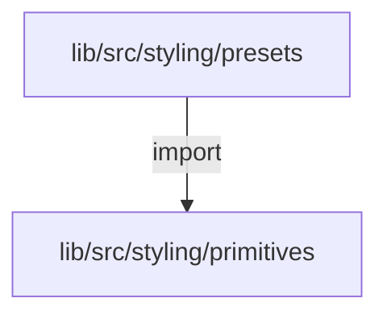
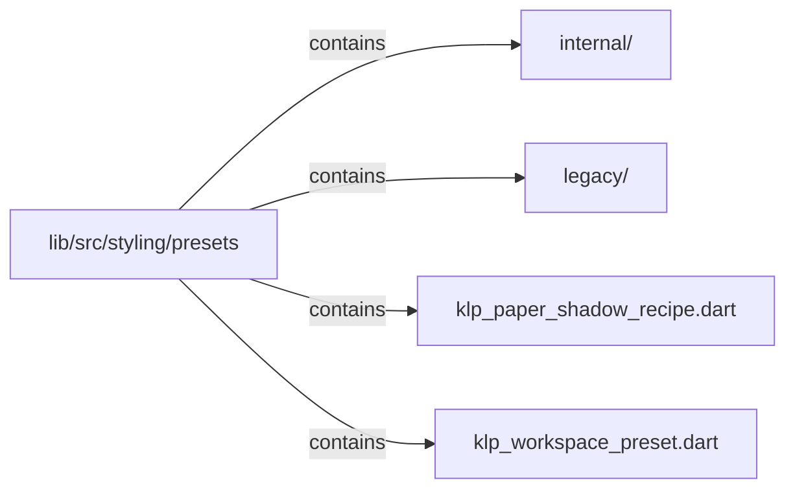

# lib/src/styling/presets：架構分析入口

[上一層](../README.md)

## 範圍

閱讀 `lib/src/styling/presets` 的直接子目錄與 Dart 檔案。結構圖表示實際檔案包含關係；依賴圖表示本層檔案明寫的 directives。每個檔案頁另列直接依賴、宣告、欄位、方法、建構子及行號證據。

## 本層直接依賴圖

箭頭以本層 Dart 檔案明寫的 directive 彙總到目標所在目錄或外部套件邊界；不遞迴將子目錄依賴算入本層。相同目標的不同 directive 類型分開計數。

| 目標邊界 | 關係 | directive 數 | 第一筆來源證據 |
|---|---|---|---|
| <code>lib/src/styling/primitives</code> | import | 2 | [lib/src/styling/presets/klp_workspace_preset.dart:1](../../../../../lib/src/styling/presets/klp_workspace_preset.dart#L1) |

### 同目錄依賴

| 來源 → 目標 | 關係 | 證據 |
|---|---|---|
| <code>klp_workspace_preset.dart → klp_paper_shadow_recipe.dart</code> | import | [lib/src/styling/presets/klp_workspace_preset.dart:3](../../../../../lib/src/styling/presets/klp_workspace_preset.dart#L3) |

## 目錄結構圖

## 子目錄

| 目錄 | 導航 | 來源證據 |
|---|---|---|
| `internal/` | [架構入口](internal/README.md) | [來源目錄](../../../../../lib/src/styling/presets/internal) |
| `legacy/` | [架構入口](legacy/README.md) | [來源目錄](../../../../../lib/src/styling/presets/legacy) |

## 本層檔案

| 檔案 | 宣告 | 細節 | 來源證據 |
|---|---|---|---|
| `klp_paper_shadow_recipe.dart` | KlpPaperShadowRecipe | [架構與 API](klp_paper_shadow_recipe.md) | [lib/src/styling/presets/klp_paper_shadow_recipe.dart:1](../../../../../lib/src/styling/presets/klp_paper_shadow_recipe.dart#L1) |
| `klp_workspace_preset.dart` | KlpWorkspaceTone, KlpWorkspacePreset | [架構與 API](klp_workspace_preset.md) | [lib/src/styling/presets/klp_workspace_preset.dart:1](../../../../../lib/src/styling/presets/klp_workspace_preset.dart#L1) |

## 閱讀說明

箭頭只表示來源明寫的靜態關係；import 不等於呼叫。未分析動態呼叫、欄位的實際物件擁有權、狀態轉移或渲染流程；型別未進行語意解析，繼承目標保留原始型別拼寫。public／private 依 Dart 名稱前綴判斷；public 宣告不代表已由 `lib/kallopis.dart` 匯出。

本頁的目錄與檔案由來源清冊產生；`manifest.json` 位於本圖集根目錄，可核對 SHA-256 與覆蓋數。人工模組摘要存於 `tool/architecture_atlas/briefs/`，重新生成時保留。
