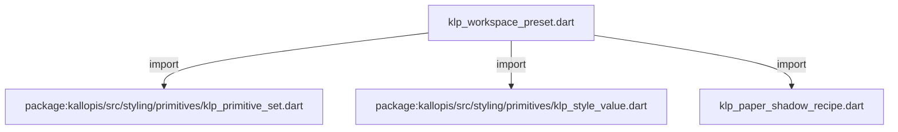
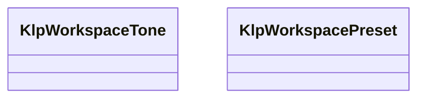

# klp_workspace_preset.dart：直接依賴與宣告架構

[回到目錄](README.md) · [來源檔案](../../../../../lib/src/styling/presets/klp_workspace_preset.dart)

## 範圍

核心是 `lib/src/styling/presets/klp_workspace_preset.dart`。主要視角為該檔案明寫的 import／export／part；輔助視角為本檔宣告及 extends／implements／with／on 關係。只展開一層外部邊界。

## 直接依賴圖

## 依賴證據

| 關係 | 原始 directive | 來源 |
|---|---|---|
| import | <code>import &#x27;package:kallopis/src/styling/primitives/klp_primitive_set.dart&#x27;;</code> | [lib/src/styling/presets/klp_workspace_preset.dart:1](../../../../../lib/src/styling/presets/klp_workspace_preset.dart#L1) |
| import | <code>import &#x27;package:kallopis/src/styling/primitives/klp_style_value.dart&#x27;;</code> | [lib/src/styling/presets/klp_workspace_preset.dart:2](../../../../../lib/src/styling/presets/klp_workspace_preset.dart#L2) |
| import | <code>import &#x27;klp_paper_shadow_recipe.dart&#x27;;</code> | [lib/src/styling/presets/klp_workspace_preset.dart:3](../../../../../lib/src/styling/presets/klp_workspace_preset.dart#L3) |

## 宣告關係圖

本組節點是本檔宣告；沒有箭頭的宣告未在此圖主張互相依賴。

## 宣告與成員證據

成員包含 public 與 private；簽章取自來源，省略函式本體與欄位初始值。`(inferred)` 表示來源未明寫型別；建構子只顯示參數部分，不含初始化列表。

### KlpWorkspaceTone

EnumDeclaration · public · [lib/src/styling/presets/klp_workspace_preset.dart:5](../../../../../lib/src/styling/presets/klp_workspace_preset.dart#L5)

<code>enum KlpWorkspaceTone</code>

來源註解摘要：工作區框架的可選色調；各選項仍建立完整原料集合。

| 成員 | 可見性 | 簽章／型別 | 來源註解摘要 | 證據 |
|---|---|---|---|---|
| enum value <code>warm</code> | public | <code>warm</code> |  | [lib/src/styling/presets/klp_workspace_preset.dart:6](../../../../../lib/src/styling/presets/klp_workspace_preset.dart#L6) |
| enum value <code>neutral</code> | public | <code>neutral</code> |  | [lib/src/styling/presets/klp_workspace_preset.dart:6](../../../../../lib/src/styling/presets/klp_workspace_preset.dart#L6) |

### KlpWorkspacePreset

ClassDeclaration · public · [lib/src/styling/presets/klp_workspace_preset.dart:8](../../../../../lib/src/styling/presets/klp_workspace_preset.dart#L8)

<code>final class KlpWorkspacePreset</code>

來源註解摘要：顏色、padding、圓角與陰影採風格 v1.0.0；其他尺寸維持原規格。

| 成員 | 可見性 | 簽章／型別 | 來源註解摘要 | 證據 |
|---|---|---|---|---|
| field <code>styleVersion</code> | public | <code>static const (inferred) styleVersion</code> |  | [lib/src/styling/presets/klp_workspace_preset.dart:10](../../../../../lib/src/styling/presets/klp_workspace_preset.dart#L10) |
| method <code>light</code> | public | <code>static KlpPrimitiveSet light({KlpWorkspaceTone tone = KlpWorkspaceTone.warm})</code> |  | [lib/src/styling/presets/klp_workspace_preset.dart:11](../../../../../lib/src/styling/presets/klp_workspace_preset.dart#L11) |
| method <code>dark</code> | public | <code>static KlpPrimitiveSet dark({KlpWorkspaceTone tone = KlpWorkspaceTone.warm})</code> |  | [lib/src/styling/presets/klp_workspace_preset.dart:12](../../../../../lib/src/styling/presets/klp_workspace_preset.dart#L12) |
| method <code>_create</code> | private | <code>static KlpPrimitiveSet _create(bool dark, KlpWorkspaceTone tone)</code> |  | [lib/src/styling/presets/klp_workspace_preset.dart:13](../../../../../lib/src/styling/presets/klp_workspace_preset.dart#L13) |
| method <code>_colors</code> | private | <code>static List&lt;KlpColor&gt; _colors(bool dark, KlpWorkspaceTone tone)</code> |  | [lib/src/styling/presets/klp_workspace_preset.dart:27](../../../../../lib/src/styling/presets/klp_workspace_preset.dart#L27) |

## 閱讀說明與限制

箭頭只表示來源明寫的靜態關係；import 不等於呼叫。未分析動態呼叫、欄位的實際物件擁有權、狀態轉移或渲染流程；型別未進行語意解析，繼承目標保留原始型別拼寫。public／private 依 Dart 名稱前綴判斷；public 宣告不代表已由 `lib/kallopis.dart` 匯出。

本頁由 `tool/architecture_atlas` 產生；編輯來源或生成工具後重新產生，避免手改本頁。
