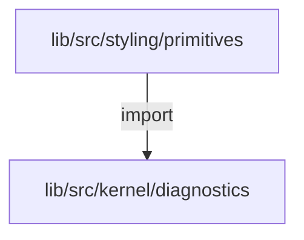
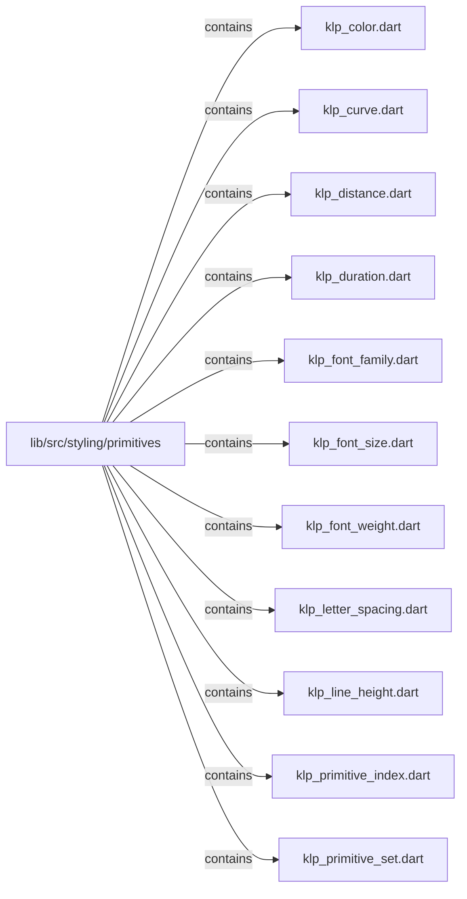
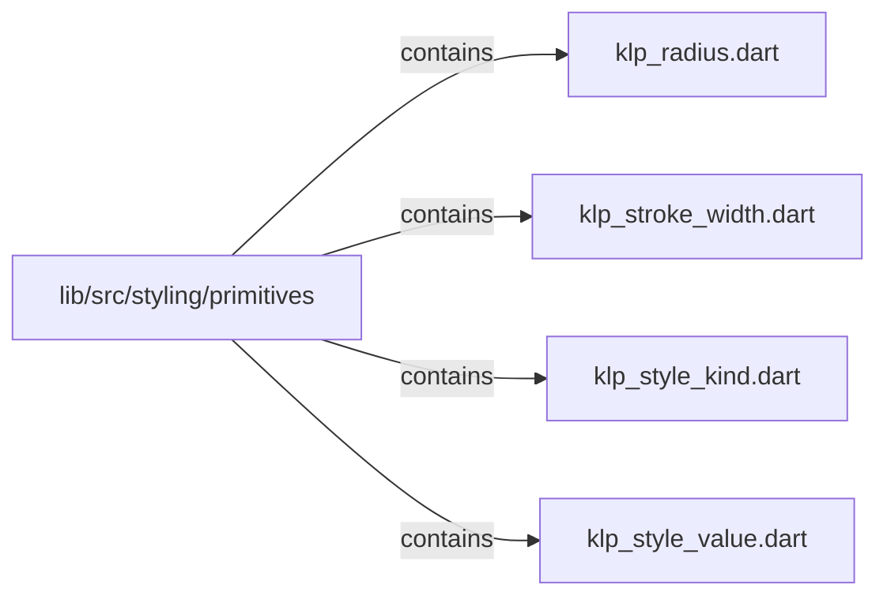

# lib/src/styling/primitives：架構分析入口

[上一層](../README.md)

## 範圍

閱讀 `lib/src/styling/primitives` 的直接子目錄與 Dart 檔案。結構圖表示實際檔案包含關係；依賴圖表示本層檔案明寫的 directives。每個檔案頁另列直接依賴、宣告、欄位、方法、建構子及行號證據。

## 本層直接依賴圖

箭頭以本層 Dart 檔案明寫的 directive 彙總到目標所在目錄或外部套件邊界；不遞迴將子目錄依賴算入本層。相同目標的不同 directive 類型分開計數。

| 目標邊界 | 關係 | directive 數 | 第一筆來源證據 |
|---|---|---|---|
| <code>lib/src/kernel/diagnostics</code> | import | 2 | [lib/src/styling/primitives/klp_primitive_set.dart:1](../../../../../lib/src/styling/primitives/klp_primitive_set.dart#L1) |

### 同目錄依賴

| 來源 → 目標 | 關係 | 證據 |
|---|---|---|
| <code>klp_color.dart → klp_style_value.dart</code> | part of | [lib/src/styling/primitives/klp_color.dart:1](../../../../../lib/src/styling/primitives/klp_color.dart#L1) |
| <code>klp_curve.dart → klp_style_value.dart</code> | part of | [lib/src/styling/primitives/klp_curve.dart:1](../../../../../lib/src/styling/primitives/klp_curve.dart#L1) |
| <code>klp_distance.dart → klp_style_value.dart</code> | part of | [lib/src/styling/primitives/klp_distance.dart:1](../../../../../lib/src/styling/primitives/klp_distance.dart#L1) |
| <code>klp_duration.dart → klp_style_value.dart</code> | part of | [lib/src/styling/primitives/klp_duration.dart:1](../../../../../lib/src/styling/primitives/klp_duration.dart#L1) |
| <code>klp_font_family.dart → klp_style_value.dart</code> | part of | [lib/src/styling/primitives/klp_font_family.dart:1](../../../../../lib/src/styling/primitives/klp_font_family.dart#L1) |
| <code>klp_font_size.dart → klp_style_value.dart</code> | part of | [lib/src/styling/primitives/klp_font_size.dart:1](../../../../../lib/src/styling/primitives/klp_font_size.dart#L1) |
| <code>klp_font_weight.dart → klp_style_value.dart</code> | part of | [lib/src/styling/primitives/klp_font_weight.dart:1](../../../../../lib/src/styling/primitives/klp_font_weight.dart#L1) |
| <code>klp_letter_spacing.dart → klp_style_value.dart</code> | part of | [lib/src/styling/primitives/klp_letter_spacing.dart:1](../../../../../lib/src/styling/primitives/klp_letter_spacing.dart#L1) |
| <code>klp_line_height.dart → klp_style_value.dart</code> | part of | [lib/src/styling/primitives/klp_line_height.dart:1](../../../../../lib/src/styling/primitives/klp_line_height.dart#L1) |
| <code>klp_primitive_set.dart → klp_primitive_index.dart</code> | import | [lib/src/styling/primitives/klp_primitive_set.dart:2](../../../../../lib/src/styling/primitives/klp_primitive_set.dart#L2) |
| <code>klp_primitive_set.dart → klp_style_kind.dart</code> | import | [lib/src/styling/primitives/klp_primitive_set.dart:3](../../../../../lib/src/styling/primitives/klp_primitive_set.dart#L3) |
| <code>klp_primitive_set.dart → klp_style_value.dart</code> | import | [lib/src/styling/primitives/klp_primitive_set.dart:4](../../../../../lib/src/styling/primitives/klp_primitive_set.dart#L4) |
| <code>klp_radius.dart → klp_style_value.dart</code> | part of | [lib/src/styling/primitives/klp_radius.dart:1](../../../../../lib/src/styling/primitives/klp_radius.dart#L1) |
| <code>klp_stroke_width.dart → klp_style_value.dart</code> | part of | [lib/src/styling/primitives/klp_stroke_width.dart:1](../../../../../lib/src/styling/primitives/klp_stroke_width.dart#L1) |
| <code>klp_style_kind.dart → klp_style_value.dart</code> | import | [lib/src/styling/primitives/klp_style_kind.dart:1](../../../../../lib/src/styling/primitives/klp_style_kind.dart#L1) |
| <code>klp_style_value.dart → klp_distance.dart</code> | part | [lib/src/styling/primitives/klp_style_value.dart:3](../../../../../lib/src/styling/primitives/klp_style_value.dart#L3) |
| <code>klp_style_value.dart → klp_radius.dart</code> | part | [lib/src/styling/primitives/klp_style_value.dart:4](../../../../../lib/src/styling/primitives/klp_style_value.dart#L4) |
| <code>klp_style_value.dart → klp_stroke_width.dart</code> | part | [lib/src/styling/primitives/klp_style_value.dart:5](../../../../../lib/src/styling/primitives/klp_style_value.dart#L5) |
| <code>klp_style_value.dart → klp_font_size.dart</code> | part | [lib/src/styling/primitives/klp_style_value.dart:6](../../../../../lib/src/styling/primitives/klp_style_value.dart#L6) |
| <code>klp_style_value.dart → klp_font_weight.dart</code> | part | [lib/src/styling/primitives/klp_style_value.dart:7](../../../../../lib/src/styling/primitives/klp_style_value.dart#L7) |
| <code>klp_style_value.dart → klp_line_height.dart</code> | part | [lib/src/styling/primitives/klp_style_value.dart:8](../../../../../lib/src/styling/primitives/klp_style_value.dart#L8) |
| <code>klp_style_value.dart → klp_letter_spacing.dart</code> | part | [lib/src/styling/primitives/klp_style_value.dart:9](../../../../../lib/src/styling/primitives/klp_style_value.dart#L9) |
| <code>klp_style_value.dart → klp_duration.dart</code> | part | [lib/src/styling/primitives/klp_style_value.dart:10](../../../../../lib/src/styling/primitives/klp_style_value.dart#L10) |
| <code>klp_style_value.dart → klp_color.dart</code> | part | [lib/src/styling/primitives/klp_style_value.dart:11](../../../../../lib/src/styling/primitives/klp_style_value.dart#L11) |
| <code>klp_style_value.dart → klp_font_family.dart</code> | part | [lib/src/styling/primitives/klp_style_value.dart:12](../../../../../lib/src/styling/primitives/klp_style_value.dart#L12) |
| <code>klp_style_value.dart → klp_curve.dart</code> | part | [lib/src/styling/primitives/klp_style_value.dart:13](../../../../../lib/src/styling/primitives/klp_style_value.dart#L13) |

## 目錄結構圖

## 子目錄

| 目錄 | 導航 | 來源證據 |
|---|---|---|
| 無 | 目前沒有下一層目錄 | — |

## 本層檔案

| 檔案 | 宣告 | 細節 | 來源證據 |
|---|---|---|---|
| `klp_color.dart` | KlpColor | [架構與 API](klp_color.md) | [lib/src/styling/primitives/klp_color.dart:1](../../../../../lib/src/styling/primitives/klp_color.dart#L1) |
| `klp_curve.dart` | KlpCurve | [架構與 API](klp_curve.md) | [lib/src/styling/primitives/klp_curve.dart:1](../../../../../lib/src/styling/primitives/klp_curve.dart#L1) |
| `klp_distance.dart` | KlpDistance | [架構與 API](klp_distance.md) | [lib/src/styling/primitives/klp_distance.dart:1](../../../../../lib/src/styling/primitives/klp_distance.dart#L1) |
| `klp_duration.dart` | KlpDuration | [架構與 API](klp_duration.md) | [lib/src/styling/primitives/klp_duration.dart:1](../../../../../lib/src/styling/primitives/klp_duration.dart#L1) |
| `klp_font_family.dart` | KlpFontFamily | [架構與 API](klp_font_family.md) | [lib/src/styling/primitives/klp_font_family.dart:1](../../../../../lib/src/styling/primitives/klp_font_family.dart#L1) |
| `klp_font_size.dart` | KlpFontSize | [架構與 API](klp_font_size.md) | [lib/src/styling/primitives/klp_font_size.dart:1](../../../../../lib/src/styling/primitives/klp_font_size.dart#L1) |
| `klp_font_weight.dart` | KlpFontWeight | [架構與 API](klp_font_weight.md) | [lib/src/styling/primitives/klp_font_weight.dart:1](../../../../../lib/src/styling/primitives/klp_font_weight.dart#L1) |
| `klp_letter_spacing.dart` | KlpLetterSpacing | [架構與 API](klp_letter_spacing.md) | [lib/src/styling/primitives/klp_letter_spacing.dart:1](../../../../../lib/src/styling/primitives/klp_letter_spacing.dart#L1) |
| `klp_line_height.dart` | KlpLineHeight | [架構與 API](klp_line_height.md) | [lib/src/styling/primitives/klp_line_height.dart:1](../../../../../lib/src/styling/primitives/klp_line_height.dart#L1) |
| `klp_primitive_index.dart` | KlpPrimitiveIndex | [架構與 API](klp_primitive_index.md) | [lib/src/styling/primitives/klp_primitive_index.dart:1](../../../../../lib/src/styling/primitives/klp_primitive_index.dart#L1) |
| `klp_primitive_set.dart` | KlpPrimitiveSet | [架構與 API](klp_primitive_set.md) | [lib/src/styling/primitives/klp_primitive_set.dart:1](../../../../../lib/src/styling/primitives/klp_primitive_set.dart#L1) |
| `klp_radius.dart` | KlpRadius | [架構與 API](klp_radius.md) | [lib/src/styling/primitives/klp_radius.dart:1](../../../../../lib/src/styling/primitives/klp_radius.dart#L1) |
| `klp_stroke_width.dart` | KlpStrokeWidth | [架構與 API](klp_stroke_width.md) | [lib/src/styling/primitives/klp_stroke_width.dart:1](../../../../../lib/src/styling/primitives/klp_stroke_width.dart#L1) |
| `klp_style_kind.dart` | KlpStyleKind | [架構與 API](klp_style_kind.md) | [lib/src/styling/primitives/klp_style_kind.dart:1](../../../../../lib/src/styling/primitives/klp_style_kind.dart#L1) |
| `klp_style_value.dart` | KlpStyleValue | [架構與 API](klp_style_value.md) | [lib/src/styling/primitives/klp_style_value.dart:1](../../../../../lib/src/styling/primitives/klp_style_value.dart#L1) |

## 閱讀說明

箭頭只表示來源明寫的靜態關係；import 不等於呼叫。未分析動態呼叫、欄位的實際物件擁有權、狀態轉移或渲染流程；型別未進行語意解析，繼承目標保留原始型別拼寫。public／private 依 Dart 名稱前綴判斷；public 宣告不代表已由 `lib/kallopis.dart` 匯出。

本頁的目錄與檔案由來源清冊產生；`manifest.json` 位於本圖集根目錄，可核對 SHA-256 與覆蓋數。人工模組摘要存於 `tool/architecture_atlas/briefs/`，重新生成時保留。
