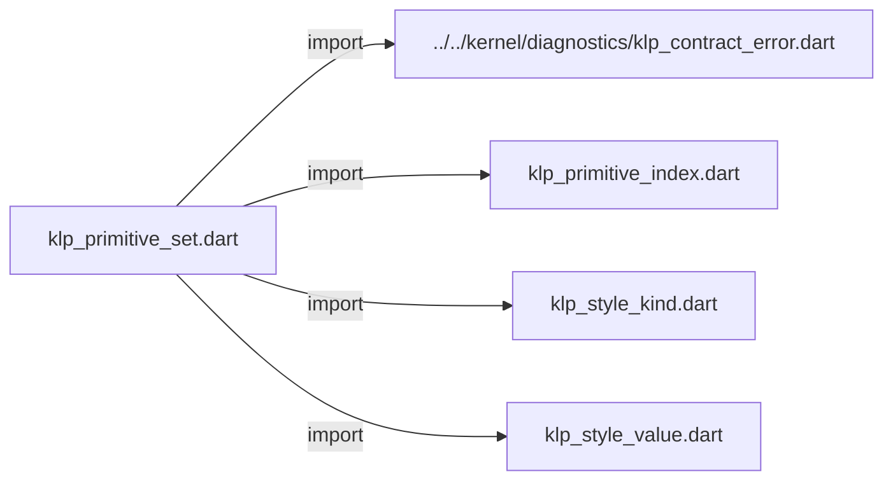
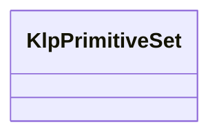

# klp_primitive_set.dart：直接依賴與宣告架構

[回到目錄](README.md) · [來源檔案](../../../../../lib/src/styling/primitives/klp_primitive_set.dart)

## 範圍

核心是 `lib/src/styling/primitives/klp_primitive_set.dart`。主要視角為該檔案明寫的 import／export／part；輔助視角為本檔宣告及 extends／implements／with／on 關係。只展開一層外部邊界。

## 直接依賴圖

## 依賴證據

| 關係 | 原始 directive | 來源 |
|---|---|---|
| import | <code>import &#x27;../../kernel/diagnostics/klp_contract_error.dart&#x27;;</code> | [lib/src/styling/primitives/klp_primitive_set.dart:1](../../../../../lib/src/styling/primitives/klp_primitive_set.dart#L1) |
| import | <code>import &#x27;klp_primitive_index.dart&#x27;;</code> | [lib/src/styling/primitives/klp_primitive_set.dart:2](../../../../../lib/src/styling/primitives/klp_primitive_set.dart#L2) |
| import | <code>import &#x27;klp_style_kind.dart&#x27;;</code> | [lib/src/styling/primitives/klp_primitive_set.dart:3](../../../../../lib/src/styling/primitives/klp_primitive_set.dart#L3) |
| import | <code>import &#x27;klp_style_value.dart&#x27;;</code> | [lib/src/styling/primitives/klp_primitive_set.dart:4](../../../../../lib/src/styling/primitives/klp_primitive_set.dart#L4) |

## 宣告關係圖

本組節點是本檔宣告；沒有箭頭的宣告未在此圖主張互相依賴。

## 宣告與成員證據

成員包含 public 與 private；簽章取自來源，省略函式本體與欄位初始值。`(inferred)` 表示來源未明寫型別；建構子只顯示參數部分，不含初始化列表。

### KlpPrimitiveSet

ClassDeclaration · public · [lib/src/styling/primitives/klp_primitive_set.dart:6](../../../../../lib/src/styling/primitives/klp_primitive_set.dart#L6)

<code>final class KlpPrimitiveSet</code>

來源註解摘要：固定種類各八槽的完整原料試作，尚未承諾穩定 schema。 每一欄都必須完整提供，沒有局部覆寫或未知種類的輸入出口。

| 成員 | 可見性 | 簽章／型別 | 來源註解摘要 | 證據 |
|---|---|---|---|---|
| field <code>colors</code> | public | <code>final List&lt;KlpColor&gt; colors</code> |  | [lib/src/styling/primitives/klp_primitive_set.dart:10](../../../../../lib/src/styling/primitives/klp_primitive_set.dart#L10) |
| field <code>distances</code> | public | <code>final List&lt;KlpDistance&gt; distances</code> |  | [lib/src/styling/primitives/klp_primitive_set.dart:11](../../../../../lib/src/styling/primitives/klp_primitive_set.dart#L11) |
| field <code>radii</code> | public | <code>final List&lt;KlpRadius&gt; radii</code> |  | [lib/src/styling/primitives/klp_primitive_set.dart:12](../../../../../lib/src/styling/primitives/klp_primitive_set.dart#L12) |
| field <code>strokeWidths</code> | public | <code>final List&lt;KlpStrokeWidth&gt; strokeWidths</code> |  | [lib/src/styling/primitives/klp_primitive_set.dart:13](../../../../../lib/src/styling/primitives/klp_primitive_set.dart#L13) |
| field <code>fontSizes</code> | public | <code>final List&lt;KlpFontSize&gt; fontSizes</code> |  | [lib/src/styling/primitives/klp_primitive_set.dart:14](../../../../../lib/src/styling/primitives/klp_primitive_set.dart#L14) |
| field <code>fontWeights</code> | public | <code>final List&lt;KlpFontWeight&gt; fontWeights</code> |  | [lib/src/styling/primitives/klp_primitive_set.dart:15](../../../../../lib/src/styling/primitives/klp_primitive_set.dart#L15) |
| field <code>lineHeights</code> | public | <code>final List&lt;KlpLineHeight&gt; lineHeights</code> |  | [lib/src/styling/primitives/klp_primitive_set.dart:16](../../../../../lib/src/styling/primitives/klp_primitive_set.dart#L16) |
| field <code>letterSpacings</code> | public | <code>final List&lt;KlpLetterSpacing&gt; letterSpacings</code> |  | [lib/src/styling/primitives/klp_primitive_set.dart:17](../../../../../lib/src/styling/primitives/klp_primitive_set.dart#L17) |
| field <code>durations</code> | public | <code>final List&lt;KlpDuration&gt; durations</code> |  | [lib/src/styling/primitives/klp_primitive_set.dart:18](../../../../../lib/src/styling/primitives/klp_primitive_set.dart#L18) |
| field <code>fontFamilies</code> | public | <code>final List&lt;KlpFontFamily&gt; fontFamilies</code> |  | [lib/src/styling/primitives/klp_primitive_set.dart:19](../../../../../lib/src/styling/primitives/klp_primitive_set.dart#L19) |
| field <code>curves</code> | public | <code>final List&lt;KlpCurve&gt; curves</code> |  | [lib/src/styling/primitives/klp_primitive_set.dart:20](../../../../../lib/src/styling/primitives/klp_primitive_set.dart#L20) |
| constructor <code>KlpPrimitiveSet</code> | public | <code>KlpPrimitiveSet({ required List&lt;KlpColor&gt; colors, required List&lt;KlpDistance&gt; distances, required List&lt;KlpRadius&gt; radii, required List&lt;KlpStrokeWidth&gt; strokeWidths, required List&lt;KlpFontSize&gt; fontSizes, required List&lt;KlpFontWeight&gt; fontWeights, required List&lt;KlpLineHeight&gt; lineHeights, required List&lt;KlpLetterSpacing&gt; letterSpacings, required List&lt;KlpDuration&gt; durations, required List&lt;KlpFontFamily&gt; fontFamilies, required List&lt;KlpCurve&gt; curves, })</code> |  | [lib/src/styling/primitives/klp_primitive_set.dart:22](../../../../../lib/src/styling/primitives/klp_primitive_set.dart#L22) |
| method <code>read</code> | public | <code>T read&lt;T extends KlpStyleValue&gt;( KlpStyleKind&lt;T&gt; kind, KlpPrimitiveIndex index, )</code> |  | [lib/src/styling/primitives/klp_primitive_set.dart:46](../../../../../lib/src/styling/primitives/klp_primitive_set.dart#L46) |
| method <code>_copySlots</code> | private | <code>static List&lt;T&gt; _copySlots&lt;T extends KlpStyleValue&gt;( List&lt;T&gt; values, String path, )</code> |  | [lib/src/styling/primitives/klp_primitive_set.dart:70](../../../../../lib/src/styling/primitives/klp_primitive_set.dart#L70) |

## 閱讀說明與限制

箭頭只表示來源明寫的靜態關係；import 不等於呼叫。未分析動態呼叫、欄位的實際物件擁有權、狀態轉移或渲染流程；型別未進行語意解析，繼承目標保留原始型別拼寫。public／private 依 Dart 名稱前綴判斷；public 宣告不代表已由 `lib/kallopis.dart` 匯出。

本頁由 `tool/architecture_atlas` 產生；編輯來源或生成工具後重新產生，避免手改本頁。
