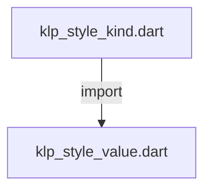
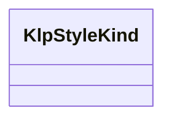

# klp_style_kind.dart：直接依賴與宣告架構

[回到目錄](README.md) · [來源檔案](../../../../../lib/src/styling/primitives/klp_style_kind.dart)

## 範圍

核心是 `lib/src/styling/primitives/klp_style_kind.dart`。主要視角為該檔案明寫的 import／export／part；輔助視角為本檔宣告及 extends／implements／with／on 關係。只展開一層外部邊界。

## 直接依賴圖

## 依賴證據

| 關係 | 原始 directive | 來源 |
|---|---|---|
| import | <code>import &#x27;klp_style_value.dart&#x27;;</code> | [lib/src/styling/primitives/klp_style_kind.dart:1](../../../../../lib/src/styling/primitives/klp_style_kind.dart#L1) |

## 宣告關係圖

本組節點是本檔宣告；沒有箭頭的宣告未在此圖主張互相依賴。

## 宣告與成員證據

成員包含 public 與 private；簽章取自來源，省略函式本體與欄位初始值。`(inferred)` 表示來源未明寫型別；建構子只顯示參數部分，不含初始化列表。

### KlpStyleKind

ClassDeclaration · public · [lib/src/styling/primitives/klp_style_kind.dart:3](../../../../../lib/src/styling/primitives/klp_style_kind.dart#L3)

<code>final class KlpStyleKind&lt;T extends KlpStyleValue&gt;</code>

來源註解摘要：型別種類由本庫固定提供，消費端不能建立新的種類。

| 成員 | 可見性 | 簽章／型別 | 來源註解摘要 | 證據 |
|---|---|---|---|---|
| field <code>name</code> | public | <code>final String name</code> |  | [lib/src/styling/primitives/klp_style_kind.dart:6](../../../../../lib/src/styling/primitives/klp_style_kind.dart#L6) |
| field <code>color</code> | public | <code>static const KlpStyleKind&lt;KlpColor&gt; color</code> |  | [lib/src/styling/primitives/klp_style_kind.dart:8](../../../../../lib/src/styling/primitives/klp_style_kind.dart#L8) |
| field <code>distance</code> | public | <code>static const KlpStyleKind&lt;KlpDistance&gt; distance</code> |  | [lib/src/styling/primitives/klp_style_kind.dart:9](../../../../../lib/src/styling/primitives/klp_style_kind.dart#L9) |
| field <code>radius</code> | public | <code>static const KlpStyleKind&lt;KlpRadius&gt; radius</code> |  | [lib/src/styling/primitives/klp_style_kind.dart:10](../../../../../lib/src/styling/primitives/klp_style_kind.dart#L10) |
| field <code>strokeWidth</code> | public | <code>static const KlpStyleKind&lt;KlpStrokeWidth&gt; strokeWidth</code> |  | [lib/src/styling/primitives/klp_style_kind.dart:11](../../../../../lib/src/styling/primitives/klp_style_kind.dart#L11) |
| field <code>fontSize</code> | public | <code>static const KlpStyleKind&lt;KlpFontSize&gt; fontSize</code> |  | [lib/src/styling/primitives/klp_style_kind.dart:12](../../../../../lib/src/styling/primitives/klp_style_kind.dart#L12) |
| field <code>fontWeight</code> | public | <code>static const KlpStyleKind&lt;KlpFontWeight&gt; fontWeight</code> |  | [lib/src/styling/primitives/klp_style_kind.dart:13](../../../../../lib/src/styling/primitives/klp_style_kind.dart#L13) |
| field <code>lineHeight</code> | public | <code>static const KlpStyleKind&lt;KlpLineHeight&gt; lineHeight</code> |  | [lib/src/styling/primitives/klp_style_kind.dart:14](../../../../../lib/src/styling/primitives/klp_style_kind.dart#L14) |
| field <code>letterSpacing</code> | public | <code>static const KlpStyleKind&lt;KlpLetterSpacing&gt; letterSpacing</code> |  | [lib/src/styling/primitives/klp_style_kind.dart:15](../../../../../lib/src/styling/primitives/klp_style_kind.dart#L15) |
| field <code>duration</code> | public | <code>static const KlpStyleKind&lt;KlpDuration&gt; duration</code> |  | [lib/src/styling/primitives/klp_style_kind.dart:16](../../../../../lib/src/styling/primitives/klp_style_kind.dart#L16) |
| field <code>fontFamily</code> | public | <code>static const KlpStyleKind&lt;KlpFontFamily&gt; fontFamily</code> |  | [lib/src/styling/primitives/klp_style_kind.dart:17](../../../../../lib/src/styling/primitives/klp_style_kind.dart#L17) |
| field <code>curve</code> | public | <code>static const KlpStyleKind&lt;KlpCurve&gt; curve</code> |  | [lib/src/styling/primitives/klp_style_kind.dart:18](../../../../../lib/src/styling/primitives/klp_style_kind.dart#L18) |
| constructor <code>_</code> | private | <code>const KlpStyleKind._(this.name)</code> |  | [lib/src/styling/primitives/klp_style_kind.dart:20](../../../../../lib/src/styling/primitives/klp_style_kind.dart#L20) |
| method <code>accepts</code> | public | <code>bool accepts(KlpStyleValue value)</code> |  | [lib/src/styling/primitives/klp_style_kind.dart:22](../../../../../lib/src/styling/primitives/klp_style_kind.dart#L22) |

## 閱讀說明與限制

箭頭只表示來源明寫的靜態關係；import 不等於呼叫。未分析動態呼叫、欄位的實際物件擁有權、狀態轉移或渲染流程；型別未進行語意解析，繼承目標保留原始型別拼寫。public／private 依 Dart 名稱前綴判斷；public 宣告不代表已由 `lib/kallopis.dart` 匯出。

本頁由 `tool/architecture_atlas` 產生；編輯來源或生成工具後重新產生，避免手改本頁。
