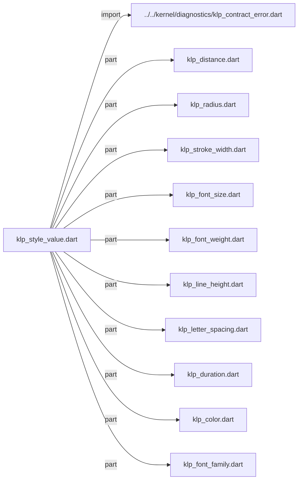
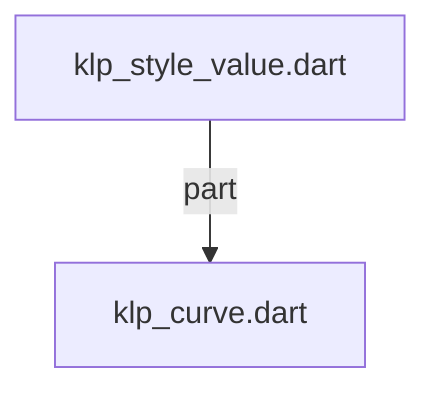
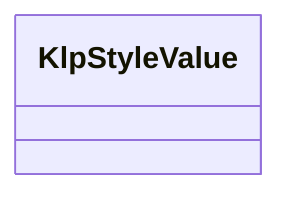

# klp_style_value.dart：直接依賴與宣告架構

[回到目錄](README.md) · [來源檔案](../../../../../lib/src/styling/primitives/klp_style_value.dart)

## 範圍

核心是 `lib/src/styling/primitives/klp_style_value.dart`。主要視角為該檔案明寫的 import／export／part；輔助視角為本檔宣告及 extends／implements／with／on 關係。只展開一層外部邊界。

## 直接依賴圖

## 依賴證據

| 關係 | 原始 directive | 來源 |
|---|---|---|
| import | <code>import &#x27;../../kernel/diagnostics/klp_contract_error.dart&#x27;;</code> | [lib/src/styling/primitives/klp_style_value.dart:1](../../../../../lib/src/styling/primitives/klp_style_value.dart#L1) |
| part | <code>part &#x27;klp_distance.dart&#x27;;</code> | [lib/src/styling/primitives/klp_style_value.dart:3](../../../../../lib/src/styling/primitives/klp_style_value.dart#L3) |
| part | <code>part &#x27;klp_radius.dart&#x27;;</code> | [lib/src/styling/primitives/klp_style_value.dart:4](../../../../../lib/src/styling/primitives/klp_style_value.dart#L4) |
| part | <code>part &#x27;klp_stroke_width.dart&#x27;;</code> | [lib/src/styling/primitives/klp_style_value.dart:5](../../../../../lib/src/styling/primitives/klp_style_value.dart#L5) |
| part | <code>part &#x27;klp_font_size.dart&#x27;;</code> | [lib/src/styling/primitives/klp_style_value.dart:6](../../../../../lib/src/styling/primitives/klp_style_value.dart#L6) |
| part | <code>part &#x27;klp_font_weight.dart&#x27;;</code> | [lib/src/styling/primitives/klp_style_value.dart:7](../../../../../lib/src/styling/primitives/klp_style_value.dart#L7) |
| part | <code>part &#x27;klp_line_height.dart&#x27;;</code> | [lib/src/styling/primitives/klp_style_value.dart:8](../../../../../lib/src/styling/primitives/klp_style_value.dart#L8) |
| part | <code>part &#x27;klp_letter_spacing.dart&#x27;;</code> | [lib/src/styling/primitives/klp_style_value.dart:9](../../../../../lib/src/styling/primitives/klp_style_value.dart#L9) |
| part | <code>part &#x27;klp_duration.dart&#x27;;</code> | [lib/src/styling/primitives/klp_style_value.dart:10](../../../../../lib/src/styling/primitives/klp_style_value.dart#L10) |
| part | <code>part &#x27;klp_color.dart&#x27;;</code> | [lib/src/styling/primitives/klp_style_value.dart:11](../../../../../lib/src/styling/primitives/klp_style_value.dart#L11) |
| part | <code>part &#x27;klp_font_family.dart&#x27;;</code> | [lib/src/styling/primitives/klp_style_value.dart:12](../../../../../lib/src/styling/primitives/klp_style_value.dart#L12) |
| part | <code>part &#x27;klp_curve.dart&#x27;;</code> | [lib/src/styling/primitives/klp_style_value.dart:13](../../../../../lib/src/styling/primitives/klp_style_value.dart#L13) |

## 宣告關係圖

本組節點是本檔宣告；沒有箭頭的宣告未在此圖主張互相依賴。

## 宣告與成員證據

成員包含 public 與 private；簽章取自來源，省略函式本體與欄位初始值。`(inferred)` 表示來源未明寫型別；建構子只顯示參數部分，不含初始化列表。

### KlpStyleValue

ClassDeclaration · public · [lib/src/styling/primitives/klp_style_value.dart:15](../../../../../lib/src/styling/primitives/klp_style_value.dart#L15)

<code>sealed class KlpStyleValue</code>

來源註解摘要：封閉的中立風格值集合，不允許外部加入新種類。

| 成員 | 可見性 | 簽章／型別 | 來源註解摘要 | 證據 |
|---|---|---|---|---|
| constructor <code>KlpStyleValue</code> | public | <code>const KlpStyleValue()</code> |  | [lib/src/styling/primitives/klp_style_value.dart:17](../../../../../lib/src/styling/primitives/klp_style_value.dart#L17) |

## 閱讀說明與限制

箭頭只表示來源明寫的靜態關係；import 不等於呼叫。未分析動態呼叫、欄位的實際物件擁有權、狀態轉移或渲染流程；型別未進行語意解析，繼承目標保留原始型別拼寫。public／private 依 Dart 名稱前綴判斷；public 宣告不代表已由 `lib/kallopis.dart` 匯出。

本頁由 `tool/architecture_atlas` 產生；編輯來源或生成工具後重新產生，避免手改本頁。
