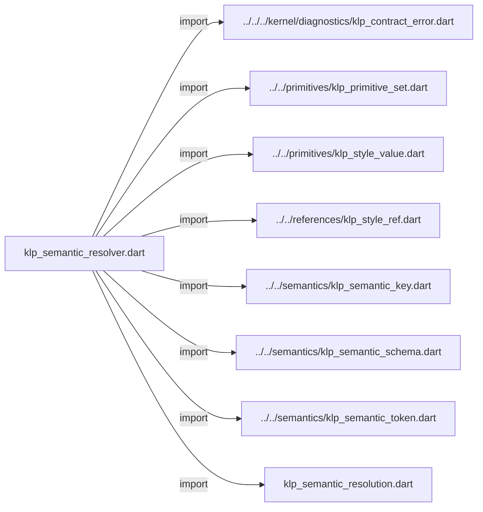
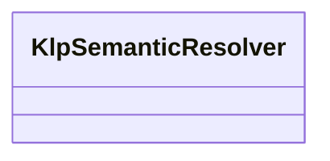

# klp_semantic_resolver.dart：直接依賴與宣告架構

[回到目錄](README.md) · [來源檔案](../../../../../../lib/src/styling/resolution/internal/klp_semantic_resolver.dart)

## 範圍

核心是 `lib/src/styling/resolution/internal/klp_semantic_resolver.dart`。主要視角為該檔案明寫的 import／export／part；輔助視角為本檔宣告及 extends／implements／with／on 關係。只展開一層外部邊界。

## 直接依賴圖

## 依賴證據

| 關係 | 原始 directive | 來源 |
|---|---|---|
| import | <code>import &#x27;../../../kernel/diagnostics/klp_contract_error.dart&#x27;;</code> | [lib/src/styling/resolution/internal/klp_semantic_resolver.dart:1](../../../../../../lib/src/styling/resolution/internal/klp_semantic_resolver.dart#L1) |
| import | <code>import &#x27;../../primitives/klp_primitive_set.dart&#x27;;</code> | [lib/src/styling/resolution/internal/klp_semantic_resolver.dart:2](../../../../../../lib/src/styling/resolution/internal/klp_semantic_resolver.dart#L2) |
| import | <code>import &#x27;../../primitives/klp_style_value.dart&#x27;;</code> | [lib/src/styling/resolution/internal/klp_semantic_resolver.dart:3](../../../../../../lib/src/styling/resolution/internal/klp_semantic_resolver.dart#L3) |
| import | <code>import &#x27;../../references/klp_style_ref.dart&#x27;;</code> | [lib/src/styling/resolution/internal/klp_semantic_resolver.dart:4](../../../../../../lib/src/styling/resolution/internal/klp_semantic_resolver.dart#L4) |
| import | <code>import &#x27;../../semantics/klp_semantic_key.dart&#x27;;</code> | [lib/src/styling/resolution/internal/klp_semantic_resolver.dart:5](../../../../../../lib/src/styling/resolution/internal/klp_semantic_resolver.dart#L5) |
| import | <code>import &#x27;../../semantics/klp_semantic_schema.dart&#x27;;</code> | [lib/src/styling/resolution/internal/klp_semantic_resolver.dart:6](../../../../../../lib/src/styling/resolution/internal/klp_semantic_resolver.dart#L6) |
| import | <code>import &#x27;../../semantics/klp_semantic_token.dart&#x27;;</code> | [lib/src/styling/resolution/internal/klp_semantic_resolver.dart:7](../../../../../../lib/src/styling/resolution/internal/klp_semantic_resolver.dart#L7) |
| import | <code>import &#x27;klp_semantic_resolution.dart&#x27;;</code> | [lib/src/styling/resolution/internal/klp_semantic_resolver.dart:8](../../../../../../lib/src/styling/resolution/internal/klp_semantic_resolver.dart#L8) |

## 宣告關係圖

本組節點是本檔宣告；沒有箭頭的宣告未在此圖主張互相依賴。

## 宣告與成員證據

成員包含 public 與 private；簽章取自來源，省略函式本體與欄位初始值。`(inferred)` 表示來源未明寫型別；建構子只顯示參數部分，不含初始化列表。

### KlpSemanticResolver

ClassDeclaration · public · [lib/src/styling/resolution/internal/klp_semantic_resolver.dart:10](../../../../../../lib/src/styling/resolution/internal/klp_semantic_resolver.dart#L10)

<code>final class KlpSemanticResolver</code>

來源註解摘要：掛載前編譯完整引用圖；求值只執行本庫封閉的參照規則。

| 成員 | 可見性 | 簽章／型別 | 來源註解摘要 | 證據 |
|---|---|---|---|---|
| field <code>_schemas</code> | private | <code>final Map&lt;String, KlpSemanticSchema&gt; _schemas</code> |  | [lib/src/styling/resolution/internal/klp_semantic_resolver.dart:13](../../../../../../lib/src/styling/resolution/internal/klp_semantic_resolver.dart#L13) |
| field <code>_tokens</code> | private | <code>final Map&lt;(String, String), KlpSemanticToken&lt;KlpStyleValue&gt;&gt; _tokens</code> |  | [lib/src/styling/resolution/internal/klp_semantic_resolver.dart:14](../../../../../../lib/src/styling/resolution/internal/klp_semantic_resolver.dart#L14) |
| field <code>_order</code> | private | <code>final List&lt;KlpSemanticToken&lt;KlpStyleValue&gt;&gt; _order</code> |  | [lib/src/styling/resolution/internal/klp_semantic_resolver.dart:15](../../../../../../lib/src/styling/resolution/internal/klp_semantic_resolver.dart#L15) |
| constructor <code>KlpSemanticResolver</code> | public | <code>KlpSemanticResolver(Iterable&lt;KlpSemanticSchema&gt; schemas)</code> |  | [lib/src/styling/resolution/internal/klp_semantic_resolver.dart:17](../../../../../../lib/src/styling/resolution/internal/klp_semantic_resolver.dart#L17) |
| method <code>resolve</code> | public | <code>KlpSemanticResolution resolve(KlpPrimitiveSet primitives)</code> |  | [lib/src/styling/resolution/internal/klp_semantic_resolver.dart:35](../../../../../../lib/src/styling/resolution/internal/klp_semantic_resolver.dart#L35) |
| method <code>validateUsage</code> | public | <code>void validateUsage(String owner, KlpSemanticKey&lt;KlpStyleValue&gt; key)</code> | 模板直接使用 token 時，沿用與 token 引用相同的所有權檢查。 | [lib/src/styling/resolution/internal/klp_semantic_resolver.dart:47](../../../../../../lib/src/styling/resolution/internal/klp_semantic_resolver.dart#L47) |
| method <code>_visitSchema</code> | private | <code>void _visitSchema(String owner, List&lt;String&gt; path, Set&lt;String&gt; complete)</code> |  | [lib/src/styling/resolution/internal/klp_semantic_resolver.dart:52](../../../../../../lib/src/styling/resolution/internal/klp_semantic_resolver.dart#L52) |
| method <code>_visitToken</code> | private | <code>void _visitToken(KlpSemanticToken&lt;KlpStyleValue&gt; token, List&lt;(String, String)&gt; path, Set&lt;(String, String)&gt; complete)</code> |  | [lib/src/styling/resolution/internal/klp_semantic_resolver.dart:66](../../../../../../lib/src/styling/resolution/internal/klp_semantic_resolver.dart#L66) |
| method <code>_requireReference</code> | private | <code>KlpSemanticToken&lt;KlpStyleValue&gt; _requireReference(String owner, KlpSemanticKey&lt;KlpStyleValue&gt; key, String source)</code> |  | [lib/src/styling/resolution/internal/klp_semantic_resolver.dart:83](../../../../../../lib/src/styling/resolution/internal/klp_semantic_resolver.dart#L83) |

## 閱讀說明與限制

箭頭只表示來源明寫的靜態關係；import 不等於呼叫。未分析動態呼叫、欄位的實際物件擁有權、狀態轉移或渲染流程；型別未進行語意解析，繼承目標保留原始型別拼寫。public／private 依 Dart 名稱前綴判斷；public 宣告不代表已由 `lib/kallopis.dart` 匯出。

本頁由 `tool/architecture_atlas` 產生；編輯來源或生成工具後重新產生，避免手改本頁。
