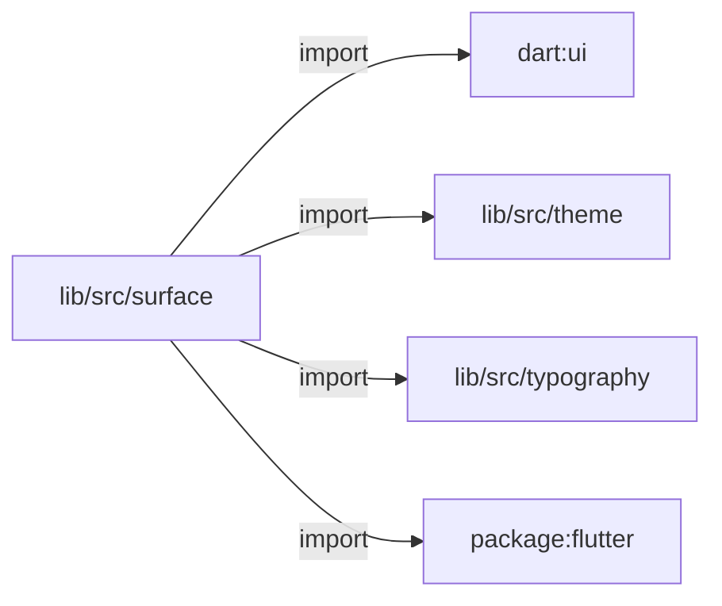
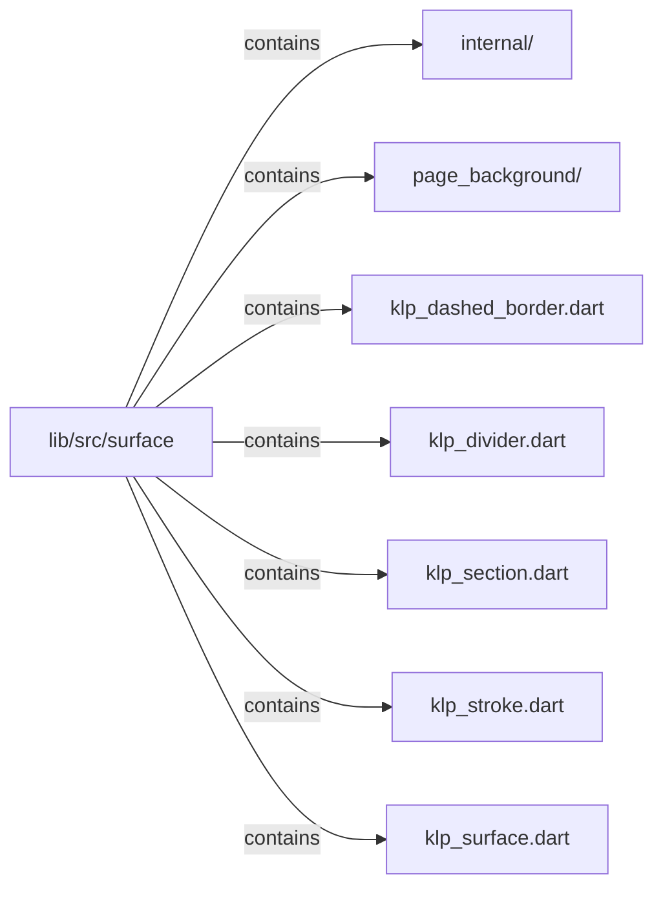

# lib/src/surface：架構分析入口

[上一層](../README.md)

## 範圍

閱讀 `lib/src/surface` 的直接子目錄與 Dart 檔案。結構圖表示實際檔案包含關係；依賴圖表示本層檔案明寫的 directives。每個檔案頁另列直接依賴、宣告、欄位、方法、建構子及行號證據。

## 模組閱讀重點

## 分析入口

此目錄提供通用表面、線條、區段與頁面背景；背景入口拆為 widget、recipe、painter 與 editor。`internal/` 的 recipe core／periodic／custom 歸 recipe library，paint operations 歸 painter library；不是獨立服務。若問題是背景如何畫出來，應沿 widget 建構 painter 的實際路徑閱讀。

| 想回答的問題 | 精確符號與來源 |
| --- | --- |
| 一般表面與語意 tone 在哪裡？ | `KlpSurface`、`KlpSurfaceTone`：lib/src/surface/klp_surface.dart:25、9 |
| 背景如何接上 CustomPainter？ | `KlpPageBackground.build`：lib/src/surface/klp_page_background.dart:37；`KlpPageBackgroundPainter`：lib/src/surface/klp_page_background_painter.dart:40 |
| recipe 與 painter 的內部所有權在哪裡？ | part directives：lib/src/surface/klp_page_background_recipe.dart:5；lib/src/surface/klp_page_background_painter.dart:6 |

重要依賴：`klp_page_background.dart:40–44` 建構 `CustomPaint`／`KlpPageBackgroundPainter` 並傳入 recipe 與 viewport；:45–50 將 theme 值組成 `KlpPageBackgroundVisuals`。這是實際畫面組合與值傳遞，與單純 import 關係不同。

## 本層直接依賴圖

箭頭以本層 Dart 檔案明寫的 directive 彙總到目標所在目錄或外部套件邊界；不遞迴將子目錄依賴算入本層。相同目標的不同 directive 類型分開計數。

| 目標邊界 | 關係 | directive 數 | 第一筆來源證據 |
|---|---|---|---|
| <code>dart:ui</code> | import | 1 | [lib/src/surface/klp_surface.dart:1](../../../../lib/src/surface/klp_surface.dart#L1) |
| <code>lib/src/theme</code> | import | 5 | [lib/src/surface/klp_dashed_border.dart:3](../../../../lib/src/surface/klp_dashed_border.dart#L3) |
| <code>lib/src/typography</code> | import | 1 | [lib/src/surface/klp_section.dart:3](../../../../lib/src/surface/klp_section.dart#L3) |
| <code>package:flutter</code> | import | 5 | [lib/src/surface/klp_dashed_border.dart:1](../../../../lib/src/surface/klp_dashed_border.dart#L1) |

### 同目錄依賴

| 來源 → 目標 | 關係 | 證據 |
|---|---|---|
| <code>klp_dashed_border.dart → klp_stroke.dart</code> | import | [lib/src/surface/klp_dashed_border.dart:4](../../../../lib/src/surface/klp_dashed_border.dart#L4) |

## 目錄結構圖

## 子目錄

| 目錄 | 導航 | 來源證據 |
|---|---|---|
| `internal/` | [架構入口](internal/README.md) | [來源目錄](../../../../lib/src/surface/internal) |
| `page_background/` | [架構入口](page_background/README.md) | [來源目錄](../../../../lib/src/surface/page_background) |

## 本層檔案

| 檔案 | 宣告 | 細節 | 來源證據 |
|---|---|---|---|
| `klp_dashed_border.dart` | KlpDashedBorder, KlpDashedDivider, _KlpDashedDividerPainter | [架構與 API](klp_dashed_border.md) | [lib/src/surface/klp_dashed_border.dart:1](../../../../lib/src/surface/klp_dashed_border.dart#L1) |
| `klp_divider.dart` | KlpDivider | [架構與 API](klp_divider.md) | [lib/src/surface/klp_divider.dart:1](../../../../lib/src/surface/klp_divider.dart#L1) |
| `klp_section.dart` | KlpSection | [架構與 API](klp_section.md) | [lib/src/surface/klp_section.dart:1](../../../../lib/src/surface/klp_section.dart#L1) |
| `klp_stroke.dart` | KlpStrokeRole, KlpStrokeState, KlpStrokeFrame, _KlpLatentStrokePainter | [架構與 API](klp_stroke.md) | [lib/src/surface/klp_stroke.dart:1](../../../../lib/src/surface/klp_stroke.dart#L1) |
| `klp_surface.dart` | KlpSurfaceTone, KlpSurface | [架構與 API](klp_surface.md) | [lib/src/surface/klp_surface.dart:1](../../../../lib/src/surface/klp_surface.dart#L1) |

## 閱讀說明

箭頭只表示來源明寫的靜態關係；import 不等於呼叫。未分析動態呼叫、欄位的實際物件擁有權、狀態轉移或渲染流程；型別未進行語意解析，繼承目標保留原始型別拼寫。public／private 依 Dart 名稱前綴判斷；public 宣告不代表已由 `lib/kallopis.dart` 匯出。

本頁的目錄與檔案由來源清冊產生；`manifest.json` 位於本圖集根目錄，可核對 SHA-256 與覆蓋數。人工模組摘要存於 `tool/architecture_atlas/briefs/`，重新生成時保留。
