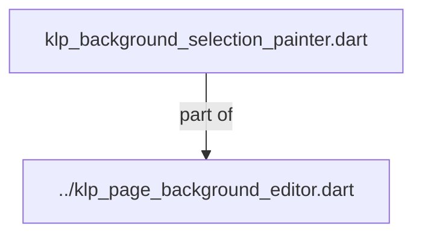
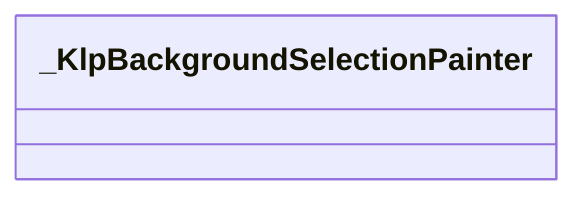
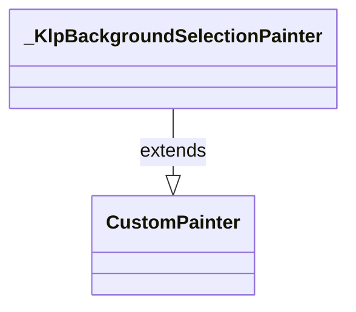

# klp_background_selection_painter.dart：直接依賴與宣告架構

[回到目錄](README.md) · [來源檔案](../../../../../../lib/src/surface/page_background/internal/klp_background_selection_painter.dart)

## 範圍

核心是 `lib/src/surface/page_background/internal/klp_background_selection_painter.dart`。主要視角為該檔案明寫的 import／export／part；輔助視角為本檔宣告及 extends／implements／with／on 關係。只展開一層外部邊界。

## 直接依賴圖

## 依賴證據

| 關係 | 原始 directive | 來源 |
|---|---|---|
| part of | <code>part of &#x27;../klp_page_background_editor.dart&#x27;;</code> | [lib/src/surface/page_background/internal/klp_background_selection_painter.dart:1](../../../../../../lib/src/surface/page_background/internal/klp_background_selection_painter.dart#L1) |

## 宣告關係圖

本組節點是本檔宣告；沒有箭頭的宣告未在此圖主張互相依賴。

## 宣告與成員證據

成員包含 public 與 private；簽章取自來源，省略函式本體與欄位初始值。`(inferred)` 表示來源未明寫型別；建構子只顯示參數部分，不含初始化列表。

### _KlpBackgroundSelectionPainter

ClassDeclaration · private · [lib/src/surface/page_background/internal/klp_background_selection_painter.dart:3](../../../../../../lib/src/surface/page_background/internal/klp_background_selection_painter.dart#L3)

<code>class _KlpBackgroundSelectionPainter extends CustomPainter</code>

- `extends` → <code>CustomPainter</code>：[lib/src/surface/page_background/internal/klp_background_selection_painter.dart:3](../../../../../../lib/src/surface/page_background/internal/klp_background_selection_painter.dart#L3)

| 成員 | 可見性 | 簽章／型別 | 來源註解摘要 | 證據 |
|---|---|---|---|---|
| constructor <code>_KlpBackgroundSelectionPainter</code> | private | <code>const _KlpBackgroundSelectionPainter({ required this.recipe, required this.viewport, required this.selection, required this.color, required this.guideColor, required this.width, required this.snapSpacing, })</code> |  | [lib/src/surface/page_background/internal/klp_background_selection_painter.dart:4](../../../../../../lib/src/surface/page_background/internal/klp_background_selection_painter.dart#L4) |
| field <code>recipe</code> | public | <code>final KlpCustomPageBackgroundRecipe recipe</code> |  | [lib/src/surface/page_background/internal/klp_background_selection_painter.dart:14](../../../../../../lib/src/surface/page_background/internal/klp_background_selection_painter.dart#L14) |
| field <code>viewport</code> | public | <code>final KlpPageBackgroundViewport viewport</code> |  | [lib/src/surface/page_background/internal/klp_background_selection_painter.dart:15](../../../../../../lib/src/surface/page_background/internal/klp_background_selection_painter.dart#L15) |
| field <code>selection</code> | public | <code>final KlpPageBackgroundSelection? selection</code> |  | [lib/src/surface/page_background/internal/klp_background_selection_painter.dart:16](../../../../../../lib/src/surface/page_background/internal/klp_background_selection_painter.dart#L16) |
| field <code>color</code> | public | <code>final Color color</code> |  | [lib/src/surface/page_background/internal/klp_background_selection_painter.dart:17](../../../../../../lib/src/surface/page_background/internal/klp_background_selection_painter.dart#L17) |
| field <code>guideColor</code> | public | <code>final Color guideColor</code> |  | [lib/src/surface/page_background/internal/klp_background_selection_painter.dart:18](../../../../../../lib/src/surface/page_background/internal/klp_background_selection_painter.dart#L18) |
| field <code>width</code> | public | <code>final double width</code> |  | [lib/src/surface/page_background/internal/klp_background_selection_painter.dart:19](../../../../../../lib/src/surface/page_background/internal/klp_background_selection_painter.dart#L19) |
| field <code>snapSpacing</code> | public | <code>final double snapSpacing</code> |  | [lib/src/surface/page_background/internal/klp_background_selection_painter.dart:20](../../../../../../lib/src/surface/page_background/internal/klp_background_selection_painter.dart#L20) |
| method <code>paint</code> | public | <code>void paint(Canvas canvas, Size size)</code> |  | [lib/src/surface/page_background/internal/klp_background_selection_painter.dart:22](../../../../../../lib/src/surface/page_background/internal/klp_background_selection_painter.dart#L22) |
| method <code>_paintCoordinateGrid</code> | private | <code>void _paintCoordinateGrid(Canvas canvas, Size size)</code> |  | [lib/src/surface/page_background/internal/klp_background_selection_painter.dart:53](../../../../../../lib/src/surface/page_background/internal/klp_background_selection_painter.dart#L53) |
| method <code>shouldRepaint</code> | public | <code>bool shouldRepaint(covariant _KlpBackgroundSelectionPainter oldDelegate)</code> |  | [lib/src/surface/page_background/internal/klp_background_selection_painter.dart:74](../../../../../../lib/src/surface/page_background/internal/klp_background_selection_painter.dart#L74) |

### _selectionExists

FunctionDeclaration · private · [lib/src/surface/page_background/internal/klp_background_selection_painter.dart:86](../../../../../../lib/src/surface/page_background/internal/klp_background_selection_painter.dart#L86)

<code>bool _selectionExists(KlpPageBackgroundSelection selection, KlpCustomPageBackgroundRecipe recipe)</code>

### _distanceToSegment

FunctionDeclaration · private · [lib/src/surface/page_background/internal/klp_background_selection_painter.dart:93](../../../../../../lib/src/surface/page_background/internal/klp_background_selection_painter.dart#L93)

<code>double _distanceToSegment(Offset point, Offset start, Offset end)</code>

## 閱讀說明與限制

箭頭只表示來源明寫的靜態關係；import 不等於呼叫。未分析動態呼叫、欄位的實際物件擁有權、狀態轉移或渲染流程；型別未進行語意解析，繼承目標保留原始型別拼寫。public／private 依 Dart 名稱前綴判斷；public 宣告不代表已由 `lib/kallopis.dart` 匯出。

本頁由 `tool/architecture_atlas` 產生；編輯來源或生成工具後重新產生，避免手改本頁。
