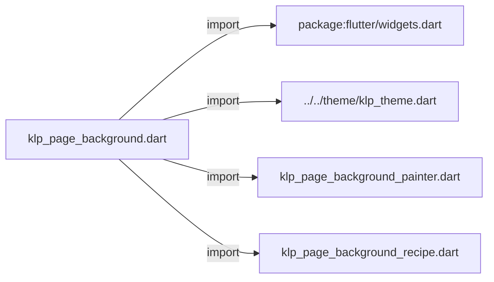
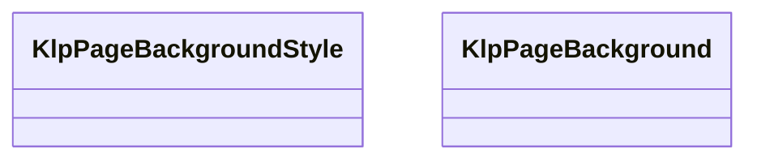
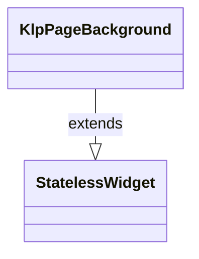

# klp_page_background.dart：直接依賴與宣告架構

[回到目錄](README.md) · [來源檔案](../../../../../lib/src/surface/page_background/klp_page_background.dart)

## 範圍

核心是 `lib/src/surface/page_background/klp_page_background.dart`。主要視角為該檔案明寫的 import／export／part；輔助視角為本檔宣告及 extends／implements／with／on 關係。只展開一層外部邊界。

## 直接依賴圖

## 依賴證據

| 關係 | 原始 directive | 來源 |
|---|---|---|
| import | <code>import &#x27;package:flutter/widgets.dart&#x27;;</code> | [lib/src/surface/page_background/klp_page_background.dart:4](../../../../../lib/src/surface/page_background/klp_page_background.dart#L4) |
| import | <code>import &#x27;../../theme/klp_theme.dart&#x27;;</code> | [lib/src/surface/page_background/klp_page_background.dart:6](../../../../../lib/src/surface/page_background/klp_page_background.dart#L6) |
| import | <code>import &#x27;klp_page_background_painter.dart&#x27;;</code> | [lib/src/surface/page_background/klp_page_background.dart:7](../../../../../lib/src/surface/page_background/klp_page_background.dart#L7) |
| import | <code>import &#x27;klp_page_background_recipe.dart&#x27;;</code> | [lib/src/surface/page_background/klp_page_background.dart:8](../../../../../lib/src/surface/page_background/klp_page_background.dart#L8) |

## 宣告關係圖

本組節點是本檔宣告；沒有箭頭的宣告未在此圖主張互相依賴。

## 宣告與成員證據

成員包含 public 與 private；簽章取自來源，省略函式本體與欄位初始值。`(inferred)` 表示來源未明寫型別；建構子只顯示參數部分，不含初始化列表。

### KlpPageBackgroundStyle

EnumDeclaration · public · [lib/src/surface/page_background/klp_page_background.dart:10](../../../../../lib/src/surface/page_background/klp_page_background.dart#L10)

<code>enum KlpPageBackgroundStyle</code>

來源註解摘要：頁面的內建向量背景樣式。

| 成員 | 可見性 | 簽章／型別 | 來源註解摘要 | 證據 |
|---|---|---|---|---|
| enum value <code>plain</code> | public | <code>plain</code> |  | [lib/src/surface/page_background/klp_page_background.dart:11](../../../../../lib/src/surface/page_background/klp_page_background.dart#L11) |
| enum value <code>ruled</code> | public | <code>ruled</code> |  | [lib/src/surface/page_background/klp_page_background.dart:11](../../../../../lib/src/surface/page_background/klp_page_background.dart#L11) |
| enum value <code>dots</code> | public | <code>dots</code> |  | [lib/src/surface/page_background/klp_page_background.dart:11](../../../../../lib/src/surface/page_background/klp_page_background.dart#L11) |
| enum value <code>grid</code> | public | <code>grid</code> |  | [lib/src/surface/page_background/klp_page_background.dart:11](../../../../../lib/src/surface/page_background/klp_page_background.dart#L11) |

### KlpPageBackground

ClassDeclaration · public · [lib/src/surface/page_background/klp_page_background.dart:13](../../../../../lib/src/surface/page_background/klp_page_background.dart#L13)

<code>final class KlpPageBackground extends StatelessWidget</code>

來源註解摘要：在 [child] 下方繪製由 Kallopis theme 控制的頁面背景。

- `extends` → <code>StatelessWidget</code>：[lib/src/surface/page_background/klp_page_background.dart:14](../../../../../lib/src/surface/page_background/klp_page_background.dart#L14)

| 成員 | 可見性 | 簽章／型別 | 來源註解摘要 | 證據 |
|---|---|---|---|---|
| constructor <code>KlpPageBackground</code> | public | <code>const KlpPageBackground({ super.key, required KlpPageBackgroundStyle style, required this.child, })</code> |  | [lib/src/surface/page_background/klp_page_background.dart:15](../../../../../lib/src/surface/page_background/klp_page_background.dart#L15) |
| constructor <code>recipe</code> | public | <code>const KlpPageBackground.recipe({ super.key, required this.recipe, required this.child, this.viewport, })</code> |  | [lib/src/surface/page_background/klp_page_background.dart:23](../../../../../lib/src/surface/page_background/klp_page_background.dart#L23) |
| field <code>_style</code> | private | <code>final KlpPageBackgroundStyle? _style</code> |  | [lib/src/surface/page_background/klp_page_background.dart:30](../../../../../lib/src/surface/page_background/klp_page_background.dart#L30) |
| getter <code>style</code> | public | <code>KlpPageBackgroundStyle get style</code> |  | [lib/src/surface/page_background/klp_page_background.dart:31](../../../../../lib/src/surface/page_background/klp_page_background.dart#L31) |
| field <code>recipe</code> | public | <code>final KlpPageBackgroundRecipe? recipe</code> |  | [lib/src/surface/page_background/klp_page_background.dart:32](../../../../../lib/src/surface/page_background/klp_page_background.dart#L32) |
| field <code>viewport</code> | public | <code>final KlpPageBackgroundViewport? viewport</code> |  | [lib/src/surface/page_background/klp_page_background.dart:33](../../../../../lib/src/surface/page_background/klp_page_background.dart#L33) |
| field <code>child</code> | public | <code>final Widget child</code> |  | [lib/src/surface/page_background/klp_page_background.dart:34](../../../../../lib/src/surface/page_background/klp_page_background.dart#L34) |
| method <code>build</code> | public | <code>Widget build(BuildContext context)</code> |  | [lib/src/surface/page_background/klp_page_background.dart:36](../../../../../lib/src/surface/page_background/klp_page_background.dart#L36) |
| method <code>_recipeFor</code> | private | <code>KlpPageBackgroundRecipe _recipeFor(KlpPageBackgroundStyle style)</code> |  | [lib/src/surface/page_background/klp_page_background.dart:57](../../../../../lib/src/surface/page_background/klp_page_background.dart#L57) |

## 閱讀說明與限制

箭頭只表示來源明寫的靜態關係；import 不等於呼叫。未分析動態呼叫、欄位的實際物件擁有權、狀態轉移或渲染流程；型別未進行語意解析，繼承目標保留原始型別拼寫。public／private 依 Dart 名稱前綴判斷；public 宣告不代表已由 `lib/kallopis.dart` 匯出。

本頁由 `tool/architecture_atlas` 產生；編輯來源或生成工具後重新產生，避免手改本頁。
