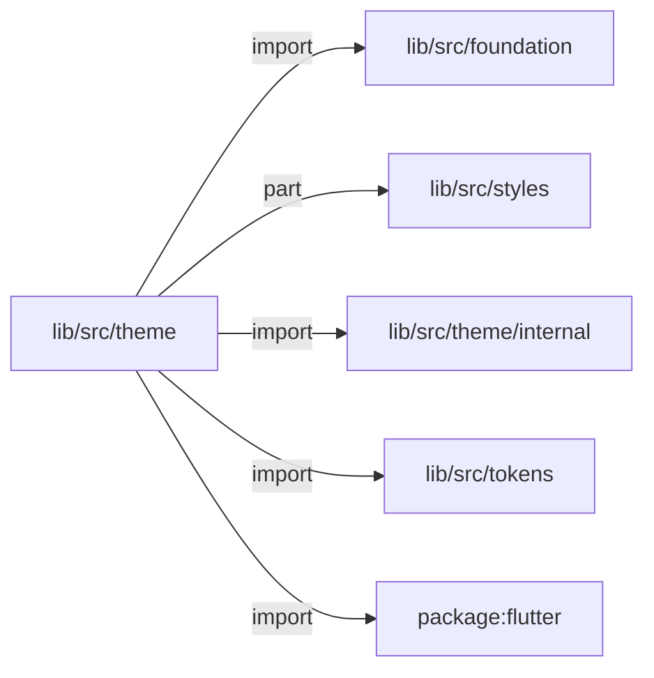
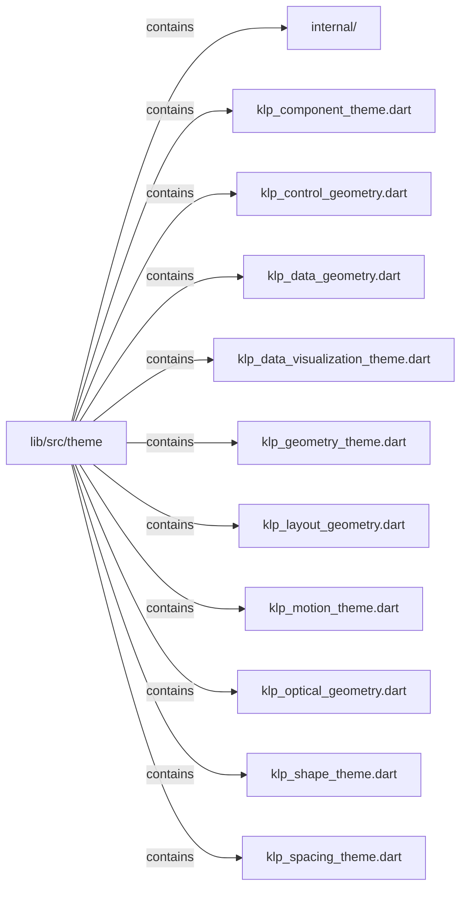
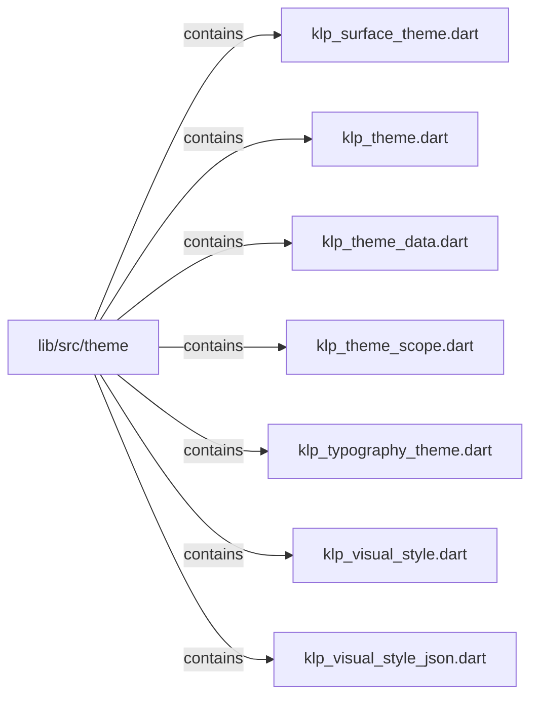

# lib/src/theme：架構分析入口

[上一層](../README.md)

## 範圍

閱讀 `lib/src/theme` 的直接子目錄與 Dart 檔案。結構圖表示實際檔案包含關係；依賴圖表示本層檔案明寫的 directives。每個檔案頁另列直接依賴、宣告、欄位、方法、建構子及行號證據。

## 模組閱讀重點

## 分析入口

`theme/` 同時容納 semantic／component 模型、KlpVisualStyle 組合、Flutter ThemeData 建構、context.klp 存取，以及 JSON 編解碼。先從 buildKlpTheme 與 KlpTheme.of 追蹤「組裝 → 讀取」，再依需要進入各 ThemeExtension。`internal/` 將 JSON 欄位分為 colors、typography、spacing、effects、surface、components、data visualization、geometry，以及 helpers／validation；geometry 再拆 control、data、layout／optical，encode 有獨立檔。

| 想查的問題 | 符號與來源 |
| --- | --- |
| 如何建立 Flutter 主題？ | buildKlpTheme／buildKlpThemeVariant — `lib/src/theme/klp_theme.dart:530`、`lib/src/theme/klp_theme.dart:544` |
| 元件從哪取得與覆寫 token？ | KlpTheme／KlpTokenOverride — `lib/src/theme/klp_theme_scope.dart:22`、`lib/src/theme/klp_theme_scope.dart:177` |
| 風格組合包含哪些層？ | KlpVisualStyle — `lib/src/theme/klp_visual_style.dart:23` |
| JSON 如何接受局部覆寫？ | KlpVisualStyleJson.decode — `lib/src/theme/klp_visual_style_json.dart:51` |

重要關係：

- `KlpVisualStyleJson.decode` → internal 各欄位 decoder：先拒絕未知 key、驗證版本；缺少的子 map 沿用 base（`lib/src/theme/klp_visual_style_json.dart:55`、`lib/src/theme/klp_visual_style_json.dart:68`）。
- `KlpTokenOverride.build` → Flutter `Theme.copyWith`：替換 KlpThemeData，保留其他 extensions（`lib/src/theme/klp_theme_scope.dart:189`）。
- 實際檔案雙向 import：`klp_theme.dart ↔ klp_visual_style.dart`（`lib/src/theme/klp_theme.dart:6`、`lib/src/theme/klp_visual_style.dart:10`）；不能把目前實作描述為嚴格單向層。styles 的 part 關係另當 library 組成閱讀。

這是目前靜態模組結構；import 不代表主題求值或建構的先後。

## 本層直接依賴圖

箭頭以本層 Dart 檔案明寫的 directive 彙總到目標所在目錄或外部套件邊界；不遞迴將子目錄依賴算入本層。相同目標的不同 directive 類型分開計數。

| 目標邊界 | 關係 | directive 數 | 第一筆來源證據 |
|---|---|---|---|
| <code>lib/src/foundation</code> | import | 2 | [lib/src/theme/klp_geometry_theme.dart:3](../../../../lib/src/theme/klp_geometry_theme.dart#L3) |
| <code>lib/src/styles</code> | part | 7 | [lib/src/theme/klp_data_visualization_theme.dart:5](../../../../lib/src/theme/klp_data_visualization_theme.dart#L5) |
| <code>lib/src/theme/internal</code> | import | 12 | [lib/src/theme/klp_visual_style_json.dart:2](../../../../lib/src/theme/klp_visual_style_json.dart#L2) |
| <code>lib/src/tokens</code> | import | 11 | [lib/src/theme/klp_control_geometry.dart:3](../../../../lib/src/theme/klp_control_geometry.dart#L3) |
| <code>package:flutter</code> | import | 17 | [lib/src/theme/klp_component_theme.dart:1](../../../../lib/src/theme/klp_component_theme.dart#L1) |

### 同目錄依賴

| 來源 → 目標 | 關係 | 證據 |
|---|---|---|
| <code>klp_component_theme.dart → klp_control_geometry.dart</code> | import | [lib/src/theme/klp_component_theme.dart:3](../../../../lib/src/theme/klp_component_theme.dart#L3) |
| <code>klp_component_theme.dart → klp_geometry_theme.dart</code> | import | [lib/src/theme/klp_component_theme.dart:4](../../../../lib/src/theme/klp_component_theme.dart#L4) |
| <code>klp_component_theme.dart → klp_shape_theme.dart</code> | import | [lib/src/theme/klp_component_theme.dart:5](../../../../lib/src/theme/klp_component_theme.dart#L5) |
| <code>klp_component_theme.dart → klp_spacing_theme.dart</code> | import | [lib/src/theme/klp_component_theme.dart:6](../../../../lib/src/theme/klp_component_theme.dart#L6) |
| <code>klp_component_theme.dart → klp_surface_theme.dart</code> | import | [lib/src/theme/klp_component_theme.dart:7](../../../../lib/src/theme/klp_component_theme.dart#L7) |
| <code>klp_geometry_theme.dart → klp_control_geometry.dart</code> | import | [lib/src/theme/klp_geometry_theme.dart:5](../../../../lib/src/theme/klp_geometry_theme.dart#L5) |
| <code>klp_geometry_theme.dart → klp_data_geometry.dart</code> | import | [lib/src/theme/klp_geometry_theme.dart:6](../../../../lib/src/theme/klp_geometry_theme.dart#L6) |
| <code>klp_geometry_theme.dart → klp_layout_geometry.dart</code> | import | [lib/src/theme/klp_geometry_theme.dart:7](../../../../lib/src/theme/klp_geometry_theme.dart#L7) |
| <code>klp_geometry_theme.dart → klp_optical_geometry.dart</code> | import | [lib/src/theme/klp_geometry_theme.dart:8](../../../../lib/src/theme/klp_geometry_theme.dart#L8) |
| <code>klp_theme.dart → klp_data_visualization_theme.dart</code> | import | [lib/src/theme/klp_theme.dart:3](../../../../lib/src/theme/klp_theme.dart#L3) |
| <code>klp_theme.dart → klp_shape_theme.dart</code> | import | [lib/src/theme/klp_theme.dart:4](../../../../lib/src/theme/klp_theme.dart#L4) |
| <code>klp_theme.dart → klp_surface_theme.dart</code> | import | [lib/src/theme/klp_theme.dart:5](../../../../lib/src/theme/klp_theme.dart#L5) |
| <code>klp_theme.dart → klp_visual_style.dart</code> | import | [lib/src/theme/klp_theme.dart:6](../../../../lib/src/theme/klp_theme.dart#L6) |
| <code>klp_theme.dart → klp_theme_data.dart</code> | import | [lib/src/theme/klp_theme.dart:7](../../../../lib/src/theme/klp_theme.dart#L7) |
| <code>klp_theme.dart → klp_theme_data.dart</code> | export | [lib/src/theme/klp_theme.dart:12](../../../../lib/src/theme/klp_theme.dart#L12) |
| <code>klp_theme.dart → klp_theme_scope.dart</code> | export | [lib/src/theme/klp_theme.dart:13](../../../../lib/src/theme/klp_theme.dart#L13) |
| <code>klp_theme_data.dart → klp_surface_theme.dart</code> | import | [lib/src/theme/klp_theme_data.dart:4](../../../../lib/src/theme/klp_theme_data.dart#L4) |
| <code>klp_theme_scope.dart → klp_component_theme.dart</code> | import | [lib/src/theme/klp_theme_scope.dart:3](../../../../lib/src/theme/klp_theme_scope.dart#L3) |
| <code>klp_theme_scope.dart → klp_data_visualization_theme.dart</code> | import | [lib/src/theme/klp_theme_scope.dart:4](../../../../lib/src/theme/klp_theme_scope.dart#L4) |
| <code>klp_theme_scope.dart → klp_geometry_theme.dart</code> | import | [lib/src/theme/klp_theme_scope.dart:5](../../../../lib/src/theme/klp_theme_scope.dart#L5) |
| <code>klp_theme_scope.dart → klp_motion_theme.dart</code> | import | [lib/src/theme/klp_theme_scope.dart:6](../../../../lib/src/theme/klp_theme_scope.dart#L6) |
| <code>klp_theme_scope.dart → klp_shape_theme.dart</code> | import | [lib/src/theme/klp_theme_scope.dart:7](../../../../lib/src/theme/klp_theme_scope.dart#L7) |
| <code>klp_theme_scope.dart → klp_spacing_theme.dart</code> | import | [lib/src/theme/klp_theme_scope.dart:8](../../../../lib/src/theme/klp_theme_scope.dart#L8) |
| <code>klp_theme_scope.dart → klp_surface_theme.dart</code> | import | [lib/src/theme/klp_theme_scope.dart:9](../../../../lib/src/theme/klp_theme_scope.dart#L9) |
| <code>klp_theme_scope.dart → klp_theme_data.dart</code> | import | [lib/src/theme/klp_theme_scope.dart:10](../../../../lib/src/theme/klp_theme_scope.dart#L10) |
| <code>klp_theme_scope.dart → klp_typography_theme.dart</code> | import | [lib/src/theme/klp_theme_scope.dart:11](../../../../lib/src/theme/klp_theme_scope.dart#L11) |
| <code>klp_theme_scope.dart → klp_visual_style.dart</code> | import | [lib/src/theme/klp_theme_scope.dart:12](../../../../lib/src/theme/klp_theme_scope.dart#L12) |
| <code>klp_visual_style.dart → klp_component_theme.dart</code> | import | [lib/src/theme/klp_visual_style.dart:3](../../../../lib/src/theme/klp_visual_style.dart#L3) |
| <code>klp_visual_style.dart → klp_data_visualization_theme.dart</code> | import | [lib/src/theme/klp_visual_style.dart:4](../../../../lib/src/theme/klp_visual_style.dart#L4) |
| <code>klp_visual_style.dart → klp_geometry_theme.dart</code> | import | [lib/src/theme/klp_visual_style.dart:5](../../../../lib/src/theme/klp_visual_style.dart#L5) |
| <code>klp_visual_style.dart → klp_motion_theme.dart</code> | import | [lib/src/theme/klp_visual_style.dart:6](../../../../lib/src/theme/klp_visual_style.dart#L6) |
| <code>klp_visual_style.dart → klp_shape_theme.dart</code> | import | [lib/src/theme/klp_visual_style.dart:7](../../../../lib/src/theme/klp_visual_style.dart#L7) |
| <code>klp_visual_style.dart → klp_spacing_theme.dart</code> | import | [lib/src/theme/klp_visual_style.dart:8](../../../../lib/src/theme/klp_visual_style.dart#L8) |
| <code>klp_visual_style.dart → klp_surface_theme.dart</code> | import | [lib/src/theme/klp_visual_style.dart:9](../../../../lib/src/theme/klp_visual_style.dart#L9) |
| <code>klp_visual_style.dart → klp_theme_data.dart</code> | import | [lib/src/theme/klp_visual_style.dart:10](../../../../lib/src/theme/klp_visual_style.dart#L10) |
| <code>klp_visual_style.dart → klp_typography_theme.dart</code> | import | [lib/src/theme/klp_visual_style.dart:11](../../../../lib/src/theme/klp_visual_style.dart#L11) |
| <code>klp_visual_style_json.dart → klp_visual_style.dart</code> | import | [lib/src/theme/klp_visual_style_json.dart:1](../../../../lib/src/theme/klp_visual_style_json.dart#L1) |

## 目錄結構圖

## 子目錄

| 目錄 | 導航 | 來源證據 |
|---|---|---|
| `internal/` | [架構入口](internal/README.md) | [來源目錄](../../../../lib/src/theme/internal) |

## 本層檔案

| 檔案 | 宣告 | 細節 | 來源證據 |
|---|---|---|---|
| `klp_component_theme.dart` | KlpComponentTheme | [架構與 API](klp_component_theme.md) | [lib/src/theme/klp_component_theme.dart:1](../../../../lib/src/theme/klp_component_theme.dart#L1) |
| `klp_control_geometry.dart` | KlpControlGeometry | [架構與 API](klp_control_geometry.md) | [lib/src/theme/klp_control_geometry.dart:1](../../../../lib/src/theme/klp_control_geometry.dart#L1) |
| `klp_data_geometry.dart` | KlpDataGeometry | [架構與 API](klp_data_geometry.md) | [lib/src/theme/klp_data_geometry.dart:1](../../../../lib/src/theme/klp_data_geometry.dart#L1) |
| `klp_data_visualization_theme.dart` | KlpDataVisualizationTheme, KlpDataVisualizationThemeContext | [架構與 API](klp_data_visualization_theme.md) | [lib/src/theme/klp_data_visualization_theme.dart:1](../../../../lib/src/theme/klp_data_visualization_theme.dart#L1) |
| `klp_geometry_theme.dart` | KlpGeometryTheme | [架構與 API](klp_geometry_theme.md) | [lib/src/theme/klp_geometry_theme.dart:1](../../../../lib/src/theme/klp_geometry_theme.dart#L1) |
| `klp_layout_geometry.dart` | KlpLayoutGeometry | [架構與 API](klp_layout_geometry.md) | [lib/src/theme/klp_layout_geometry.dart:1](../../../../lib/src/theme/klp_layout_geometry.dart#L1) |
| `klp_motion_theme.dart` | KlpMotionTheme | [架構與 API](klp_motion_theme.md) | [lib/src/theme/klp_motion_theme.dart:1](../../../../lib/src/theme/klp_motion_theme.dart#L1) |
| `klp_optical_geometry.dart` | KlpOpticalGeometry | [架構與 API](klp_optical_geometry.md) | [lib/src/theme/klp_optical_geometry.dart:1](../../../../lib/src/theme/klp_optical_geometry.dart#L1) |
| `klp_shape_theme.dart` | KlpShapeTheme | [架構與 API](klp_shape_theme.md) | [lib/src/theme/klp_shape_theme.dart:1](../../../../lib/src/theme/klp_shape_theme.dart#L1) |
| `klp_spacing_theme.dart` | KlpSpacingTheme | [架構與 API](klp_spacing_theme.md) | [lib/src/theme/klp_spacing_theme.dart:1](../../../../lib/src/theme/klp_spacing_theme.dart#L1) |
| `klp_surface_theme.dart` | KlpSurfaceSeparation, KlpSurfaceTheme | [架構與 API](klp_surface_theme.md) | [lib/src/theme/klp_surface_theme.dart:1](../../../../lib/src/theme/klp_surface_theme.dart#L1) |
| `klp_theme.dart` | KlpThemeVariant, KlpFieldFillState, KlpFieldStyle, buildKlpTheme, buildKlpThemeVariant, _buildKlpThemeData | [架構與 API](klp_theme.md) | [lib/src/theme/klp_theme.dart:1](../../../../lib/src/theme/klp_theme.dart#L1) |
| `klp_theme_data.dart` | KlpThemeContrast, KlpThemeData | [架構與 API](klp_theme_data.md) | [lib/src/theme/klp_theme_data.dart:1](../../../../lib/src/theme/klp_theme_data.dart#L1) |
| `klp_theme_scope.dart` | KlpTheme, KlpTokenOverride, KlpThemeContext | [架構與 API](klp_theme_scope.md) | [lib/src/theme/klp_theme_scope.dart:1](../../../../lib/src/theme/klp_theme_scope.dart#L1) |
| `klp_typography_theme.dart` | KlpTypographyTheme | [架構與 API](klp_typography_theme.md) | [lib/src/theme/klp_typography_theme.dart:1](../../../../lib/src/theme/klp_typography_theme.dart#L1) |
| `klp_visual_style.dart` | KlpVisualStyle | [架構與 API](klp_visual_style.md) | [lib/src/theme/klp_visual_style.dart:1](../../../../lib/src/theme/klp_visual_style.dart#L1) |
| `klp_visual_style_json.dart` | KlpVisualStyleJson | [架構與 API](klp_visual_style_json.md) | [lib/src/theme/klp_visual_style_json.dart:1](../../../../lib/src/theme/klp_visual_style_json.dart#L1) |

## 閱讀說明

箭頭只表示來源明寫的靜態關係；import 不等於呼叫。未分析動態呼叫、欄位的實際物件擁有權、狀態轉移或渲染流程；型別未進行語意解析，繼承目標保留原始型別拼寫。public／private 依 Dart 名稱前綴判斷；public 宣告不代表已由 `lib/kallopis.dart` 匯出。

本頁的目錄與檔案由來源清冊產生；`manifest.json` 位於本圖集根目錄，可核對 SHA-256 與覆蓋數。人工模組摘要存於 `tool/architecture_atlas/briefs/`，重新生成時保留。
