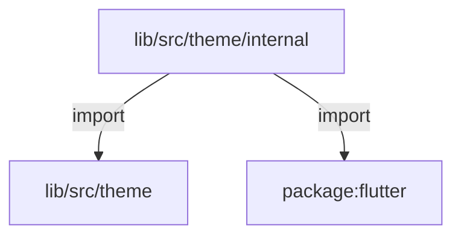
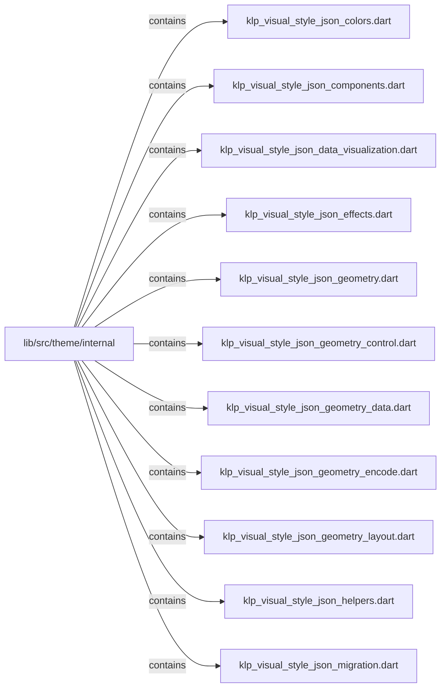
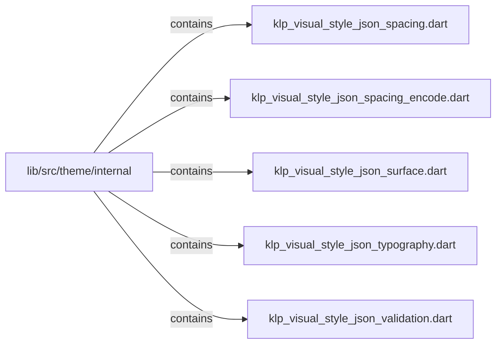

# lib/src/theme/internal：架構分析入口

[上一層](../README.md)

## 範圍

閱讀 `lib/src/theme/internal` 的直接子目錄與 Dart 檔案。結構圖表示實際檔案包含關係；依賴圖表示本層檔案明寫的 directives。每個檔案頁另列直接依賴、宣告、欄位、方法、建構子及行號證據。

## 本層直接依賴圖

箭頭以本層 Dart 檔案明寫的 directive 彙總到目標所在目錄或外部套件邊界；不遞迴將子目錄依賴算入本層。相同目標的不同 directive 類型分開計數。

| 目標邊界 | 關係 | directive 數 | 第一筆來源證據 |
|---|---|---|---|
| <code>lib/src/theme</code> | import | 16 | [lib/src/theme/internal/klp_visual_style_json_colors.dart:1](../../../../../lib/src/theme/internal/klp_visual_style_json_colors.dart#L1) |
| <code>package:flutter</code> | import | 1 | [lib/src/theme/internal/klp_visual_style_json_helpers.dart:1](../../../../../lib/src/theme/internal/klp_visual_style_json_helpers.dart#L1) |

### 同目錄依賴

| 來源 → 目標 | 關係 | 證據 |
|---|---|---|
| <code>klp_visual_style_json_colors.dart → klp_visual_style_json_helpers.dart</code> | import | [lib/src/theme/internal/klp_visual_style_json_colors.dart:2](../../../../../lib/src/theme/internal/klp_visual_style_json_colors.dart#L2) |
| <code>klp_visual_style_json_components.dart → klp_visual_style_json_helpers.dart</code> | import | [lib/src/theme/internal/klp_visual_style_json_components.dart:2](../../../../../lib/src/theme/internal/klp_visual_style_json_components.dart#L2) |
| <code>klp_visual_style_json_components.dart → klp_visual_style_json_validation.dart</code> | import | [lib/src/theme/internal/klp_visual_style_json_components.dart:3](../../../../../lib/src/theme/internal/klp_visual_style_json_components.dart#L3) |
| <code>klp_visual_style_json_data_visualization.dart → klp_visual_style_json_helpers.dart</code> | import | [lib/src/theme/internal/klp_visual_style_json_data_visualization.dart:2](../../../../../lib/src/theme/internal/klp_visual_style_json_data_visualization.dart#L2) |
| <code>klp_visual_style_json_effects.dart → klp_visual_style_json_helpers.dart</code> | import | [lib/src/theme/internal/klp_visual_style_json_effects.dart:3](../../../../../lib/src/theme/internal/klp_visual_style_json_effects.dart#L3) |
| <code>klp_visual_style_json_effects.dart → klp_visual_style_json_validation.dart</code> | import | [lib/src/theme/internal/klp_visual_style_json_effects.dart:4](../../../../../lib/src/theme/internal/klp_visual_style_json_effects.dart#L4) |
| <code>klp_visual_style_json_geometry.dart → klp_visual_style_json_geometry_control.dart</code> | import | [lib/src/theme/internal/klp_visual_style_json_geometry.dart:2](../../../../../lib/src/theme/internal/klp_visual_style_json_geometry.dart#L2) |
| <code>klp_visual_style_json_geometry.dart → klp_visual_style_json_geometry_data.dart</code> | import | [lib/src/theme/internal/klp_visual_style_json_geometry.dart:3](../../../../../lib/src/theme/internal/klp_visual_style_json_geometry.dart#L3) |
| <code>klp_visual_style_json_geometry.dart → klp_visual_style_json_geometry_layout.dart</code> | import | [lib/src/theme/internal/klp_visual_style_json_geometry.dart:4](../../../../../lib/src/theme/internal/klp_visual_style_json_geometry.dart#L4) |
| <code>klp_visual_style_json_geometry.dart → klp_visual_style_json_helpers.dart</code> | import | [lib/src/theme/internal/klp_visual_style_json_geometry.dart:5](../../../../../lib/src/theme/internal/klp_visual_style_json_geometry.dart#L5) |
| <code>klp_visual_style_json_geometry_control.dart → klp_visual_style_json_helpers.dart</code> | import | [lib/src/theme/internal/klp_visual_style_json_geometry_control.dart:2](../../../../../lib/src/theme/internal/klp_visual_style_json_geometry_control.dart#L2) |
| <code>klp_visual_style_json_geometry_control.dart → klp_visual_style_json_validation.dart</code> | import | [lib/src/theme/internal/klp_visual_style_json_geometry_control.dart:3](../../../../../lib/src/theme/internal/klp_visual_style_json_geometry_control.dart#L3) |
| <code>klp_visual_style_json_geometry_data.dart → klp_visual_style_json_helpers.dart</code> | import | [lib/src/theme/internal/klp_visual_style_json_geometry_data.dart:2](../../../../../lib/src/theme/internal/klp_visual_style_json_geometry_data.dart#L2) |
| <code>klp_visual_style_json_geometry_data.dart → klp_visual_style_json_validation.dart</code> | import | [lib/src/theme/internal/klp_visual_style_json_geometry_data.dart:3](../../../../../lib/src/theme/internal/klp_visual_style_json_geometry_data.dart#L3) |
| <code>klp_visual_style_json_geometry_encode.dart → klp_visual_style_json_helpers.dart</code> | import | [lib/src/theme/internal/klp_visual_style_json_geometry_encode.dart:2](../../../../../lib/src/theme/internal/klp_visual_style_json_geometry_encode.dart#L2) |
| <code>klp_visual_style_json_geometry_layout.dart → klp_visual_style_json_helpers.dart</code> | import | [lib/src/theme/internal/klp_visual_style_json_geometry_layout.dart:3](../../../../../lib/src/theme/internal/klp_visual_style_json_geometry_layout.dart#L3) |
| <code>klp_visual_style_json_geometry_layout.dart → klp_visual_style_json_validation.dart</code> | import | [lib/src/theme/internal/klp_visual_style_json_geometry_layout.dart:4](../../../../../lib/src/theme/internal/klp_visual_style_json_geometry_layout.dart#L4) |
| <code>klp_visual_style_json_migration.dart → klp_visual_style_json_helpers.dart</code> | import | [lib/src/theme/internal/klp_visual_style_json_migration.dart:2](../../../../../lib/src/theme/internal/klp_visual_style_json_migration.dart#L2) |
| <code>klp_visual_style_json_migration.dart → klp_visual_style_json_validation.dart</code> | import | [lib/src/theme/internal/klp_visual_style_json_migration.dart:3](../../../../../lib/src/theme/internal/klp_visual_style_json_migration.dart#L3) |
| <code>klp_visual_style_json_spacing.dart → klp_visual_style_json_helpers.dart</code> | import | [lib/src/theme/internal/klp_visual_style_json_spacing.dart:2](../../../../../lib/src/theme/internal/klp_visual_style_json_spacing.dart#L2) |
| <code>klp_visual_style_json_spacing.dart → klp_visual_style_json_validation.dart</code> | import | [lib/src/theme/internal/klp_visual_style_json_spacing.dart:3](../../../../../lib/src/theme/internal/klp_visual_style_json_spacing.dart#L3) |
| <code>klp_visual_style_json_spacing_encode.dart → klp_visual_style_json_helpers.dart</code> | import | [lib/src/theme/internal/klp_visual_style_json_spacing_encode.dart:2](../../../../../lib/src/theme/internal/klp_visual_style_json_spacing_encode.dart#L2) |
| <code>klp_visual_style_json_surface.dart → klp_visual_style_json_helpers.dart</code> | import | [lib/src/theme/internal/klp_visual_style_json_surface.dart:2](../../../../../lib/src/theme/internal/klp_visual_style_json_surface.dart#L2) |
| <code>klp_visual_style_json_surface.dart → klp_visual_style_json_validation.dart</code> | import | [lib/src/theme/internal/klp_visual_style_json_surface.dart:3](../../../../../lib/src/theme/internal/klp_visual_style_json_surface.dart#L3) |
| <code>klp_visual_style_json_typography.dart → klp_visual_style_json_helpers.dart</code> | import | [lib/src/theme/internal/klp_visual_style_json_typography.dart:2](../../../../../lib/src/theme/internal/klp_visual_style_json_typography.dart#L2) |
| <code>klp_visual_style_json_typography.dart → klp_visual_style_json_validation.dart</code> | import | [lib/src/theme/internal/klp_visual_style_json_typography.dart:3](../../../../../lib/src/theme/internal/klp_visual_style_json_typography.dart#L3) |
| <code>klp_visual_style_json_validation.dart → klp_visual_style_json_helpers.dart</code> | import | [lib/src/theme/internal/klp_visual_style_json_validation.dart:1](../../../../../lib/src/theme/internal/klp_visual_style_json_validation.dart#L1) |

## 目錄結構圖

## 子目錄

| 目錄 | 導航 | 來源證據 |
|---|---|---|
| 無 | 目前沒有下一層目錄 | — |

## 本層檔案

| 檔案 | 宣告 | 細節 | 來源證據 |
|---|---|---|---|
| `klp_visual_style_json_colors.dart` | _keys, decodeColors, encodeColors | [架構與 API](klp_visual_style_json_colors.md) | [lib/src/theme/internal/klp_visual_style_json_colors.dart:1](../../../../../lib/src/theme/internal/klp_visual_style_json_colors.dart#L1) |
| `klp_visual_style_json_components.dart` | _keys, decodeComponents, encodeComponents | [架構與 API](klp_visual_style_json_components.md) | [lib/src/theme/internal/klp_visual_style_json_components.dart:1](../../../../../lib/src/theme/internal/klp_visual_style_json_components.dart#L1) |
| `klp_visual_style_json_data_visualization.dart` | _keys, decodeDataVisualization, encodeDataVisualization | [架構與 API](klp_visual_style_json_data_visualization.md) | [lib/src/theme/internal/klp_visual_style_json_data_visualization.dart:1](../../../../../lib/src/theme/internal/klp_visual_style_json_data_visualization.dart#L1) |
| `klp_visual_style_json_effects.dart` | _shapeKeys, _motionKeys, decodeShape, encodeShape, decodeMotion, encodeMotion | [架構與 API](klp_visual_style_json_effects.md) | [lib/src/theme/internal/klp_visual_style_json_effects.dart:1](../../../../../lib/src/theme/internal/klp_visual_style_json_effects.dart#L1) |
| `klp_visual_style_json_geometry.dart` | _keys, decodeGeometry | [架構與 API](klp_visual_style_json_geometry.md) | [lib/src/theme/internal/klp_visual_style_json_geometry.dart:1](../../../../../lib/src/theme/internal/klp_visual_style_json_geometry.dart#L1) |
| `klp_visual_style_json_geometry_control.dart` | _keys, decodeControlGeometry | [架構與 API](klp_visual_style_json_geometry_control.md) | [lib/src/theme/internal/klp_visual_style_json_geometry_control.dart:1](../../../../../lib/src/theme/internal/klp_visual_style_json_geometry_control.dart#L1) |
| `klp_visual_style_json_geometry_data.dart` | _keys, decodeDataGeometry | [架構與 API](klp_visual_style_json_geometry_data.md) | [lib/src/theme/internal/klp_visual_style_json_geometry_data.dart:1](../../../../../lib/src/theme/internal/klp_visual_style_json_geometry_data.dart#L1) |
| `klp_visual_style_json_geometry_encode.dart` | encodeGeometry | [架構與 API](klp_visual_style_json_geometry_encode.md) | [lib/src/theme/internal/klp_visual_style_json_geometry_encode.dart:1](../../../../../lib/src/theme/internal/klp_visual_style_json_geometry_encode.dart#L1) |
| `klp_visual_style_json_geometry_layout.dart` | _layoutKeys, _opticalKeys, decodeLayoutGeometry, decodeOpticalGeometry | [架構與 API](klp_visual_style_json_geometry_layout.md) | [lib/src/theme/internal/klp_visual_style_json_geometry_layout.dart:1](../../../../../lib/src/theme/internal/klp_visual_style_json_geometry_layout.dart#L1) |
| `klp_visual_style_json_helpers.dart` | KlpJsonMap, jsonError, jsonPath, rejectUnknown, expectMap, readMap, readString, readStrings, _expectString, readDouble, readNullableDouble, expectDouble, readInt, readColor, expectColor, encodeColor, readColors, readDuration, readFontWeight, readCurve, encodeCurve, readEnum | [架構與 API](klp_visual_style_json_helpers.md) | [lib/src/theme/internal/klp_visual_style_json_helpers.dart:1](../../../../../lib/src/theme/internal/klp_visual_style_json_helpers.dart#L1) |
| `klp_visual_style_json_migration.dart` | migrateLegacySpacing, migrateLegacyDimensions | [架構與 API](klp_visual_style_json_migration.md) | [lib/src/theme/internal/klp_visual_style_json_migration.dart:1](../../../../../lib/src/theme/internal/klp_visual_style_json_migration.dart#L1) |
| `klp_visual_style_json_spacing.dart` | _keys, decodeSpacing | [架構與 API](klp_visual_style_json_spacing.md) | [lib/src/theme/internal/klp_visual_style_json_spacing.dart:1](../../../../../lib/src/theme/internal/klp_visual_style_json_spacing.dart#L1) |
| `klp_visual_style_json_spacing_encode.dart` | encodeSpacing | [架構與 API](klp_visual_style_json_spacing_encode.md) | [lib/src/theme/internal/klp_visual_style_json_spacing_encode.dart:1](../../../../../lib/src/theme/internal/klp_visual_style_json_spacing_encode.dart#L1) |
| `klp_visual_style_json_surface.dart` | _keys, decodeSurface, encodeSurface | [架構與 API](klp_visual_style_json_surface.md) | [lib/src/theme/internal/klp_visual_style_json_surface.dart:1](../../../../../lib/src/theme/internal/klp_visual_style_json_surface.dart#L1) |
| `klp_visual_style_json_typography.dart` | _stringKeys, _numberKeys, _weightKeys, decodeTypography, encodeTypography | [架構與 API](klp_visual_style_json_typography.md) | [lib/src/theme/internal/klp_visual_style_json_typography.dart:1](../../../../../lib/src/theme/internal/klp_visual_style_json_typography.dart#L1) |
| `klp_visual_style_json_validation.dart` | readNullableNonNegativeDouble, readNonNegativeDouble, readPositiveDouble, readOpacity, readPositiveInt, encodeDuration | [架構與 API](klp_visual_style_json_validation.md) | [lib/src/theme/internal/klp_visual_style_json_validation.dart:1](../../../../../lib/src/theme/internal/klp_visual_style_json_validation.dart#L1) |

## 閱讀說明

箭頭只表示來源明寫的靜態關係；import 不等於呼叫。未分析動態呼叫、欄位的實際物件擁有權、狀態轉移或渲染流程；型別未進行語意解析，繼承目標保留原始型別拼寫。public／private 依 Dart 名稱前綴判斷；public 宣告不代表已由 `lib/kallopis.dart` 匯出。

本頁的目錄與檔案由來源清冊產生；`manifest.json` 位於本圖集根目錄，可核對 SHA-256 與覆蓋數。人工模組摘要存於 `tool/architecture_atlas/briefs/`，重新生成時保留。
