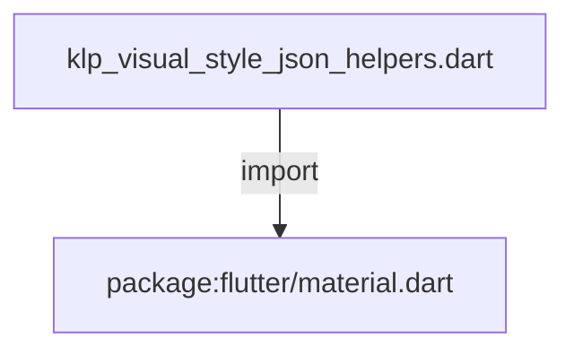

# klp_visual_style_json_helpers.dart：直接依賴與宣告架構

[回到目錄](README.md) · [來源檔案](../../../../../lib/src/theme/internal/klp_visual_style_json_helpers.dart)

## 範圍

核心是 `lib/src/theme/internal/klp_visual_style_json_helpers.dart`。主要視角為該檔案明寫的 import／export／part；輔助視角為本檔宣告及 extends／implements／with／on 關係。只展開一層外部邊界。

## 直接依賴圖

## 依賴證據

| 關係 | 原始 directive | 來源 |
|---|---|---|
| import | <code>import &#x27;package:flutter/material.dart&#x27;;</code> | [lib/src/theme/internal/klp_visual_style_json_helpers.dart:1](../../../../../lib/src/theme/internal/klp_visual_style_json_helpers.dart#L1) |

## 宣告關係圖

本檔沒有 class／enum／mixin／extension 宣告；頂層函式、變數與 typedef 見下表。

## 宣告與成員證據

成員包含 public 與 private；簽章取自來源，省略函式本體與欄位初始值。`(inferred)` 表示來源未明寫型別；建構子只顯示參數部分，不含初始化列表。

### KlpJsonMap

GenericTypeAlias · public · [lib/src/theme/internal/klp_visual_style_json_helpers.dart:3](../../../../../lib/src/theme/internal/klp_visual_style_json_helpers.dart#L3)

<code>typedef KlpJsonMap = Map&lt;String, Object?&gt;;</code>

### jsonError

FunctionDeclaration · public · [lib/src/theme/internal/klp_visual_style_json_helpers.dart:5](../../../../../lib/src/theme/internal/klp_visual_style_json_helpers.dart#L5)

<code>Never jsonError(String path, String message)</code>

### jsonPath

FunctionDeclaration · public · [lib/src/theme/internal/klp_visual_style_json_helpers.dart:9](../../../../../lib/src/theme/internal/klp_visual_style_json_helpers.dart#L9)

<code>String jsonPath(String parent, String key)</code>

### rejectUnknown

FunctionDeclaration · public · [lib/src/theme/internal/klp_visual_style_json_helpers.dart:12](../../../../../lib/src/theme/internal/klp_visual_style_json_helpers.dart#L12)

<code>void rejectUnknown(KlpJsonMap json, Set&lt;String&gt; known, String path)</code>

### expectMap

FunctionDeclaration · public · [lib/src/theme/internal/klp_visual_style_json_helpers.dart:20](../../../../../lib/src/theme/internal/klp_visual_style_json_helpers.dart#L20)

<code>KlpJsonMap expectMap(Object? value, String path)</code>

### readMap

FunctionDeclaration · public · [lib/src/theme/internal/klp_visual_style_json_helpers.dart:31](../../../../../lib/src/theme/internal/klp_visual_style_json_helpers.dart#L31)

<code>KlpJsonMap? readMap(KlpJsonMap json, String key, String path)</code>

### readString

FunctionDeclaration · public · [lib/src/theme/internal/klp_visual_style_json_helpers.dart:36](../../../../../lib/src/theme/internal/klp_visual_style_json_helpers.dart#L36)

<code>String readString(KlpJsonMap json, String key, String path, String fallback)</code>

### readStrings

FunctionDeclaration · public · [lib/src/theme/internal/klp_visual_style_json_helpers.dart:43](../../../../../lib/src/theme/internal/klp_visual_style_json_helpers.dart#L43)

<code>List&lt;String&gt; readStrings( KlpJsonMap json, String key, String path, List&lt;String&gt; fallback, )</code>

### _expectString

FunctionDeclaration · private · [lib/src/theme/internal/klp_visual_style_json_helpers.dart:59](../../../../../lib/src/theme/internal/klp_visual_style_json_helpers.dart#L59)

<code>String _expectString(Object? value, String path)</code>

### readDouble

FunctionDeclaration · public · [lib/src/theme/internal/klp_visual_style_json_helpers.dart:64](../../../../../lib/src/theme/internal/klp_visual_style_json_helpers.dart#L64)

<code>double readDouble(KlpJsonMap json, String key, String path, double fallback)</code>

### readNullableDouble

FunctionDeclaration · public · [lib/src/theme/internal/klp_visual_style_json_helpers.dart:69](../../../../../lib/src/theme/internal/klp_visual_style_json_helpers.dart#L69)

<code>double? readNullableDouble( KlpJsonMap json, String key, String path, double? fallback, )</code>

### expectDouble

FunctionDeclaration · public · [lib/src/theme/internal/klp_visual_style_json_helpers.dart:80](../../../../../lib/src/theme/internal/klp_visual_style_json_helpers.dart#L80)

<code>double expectDouble(Object? value, String path)</code>

### readInt

FunctionDeclaration · public · [lib/src/theme/internal/klp_visual_style_json_helpers.dart:87](../../../../../lib/src/theme/internal/klp_visual_style_json_helpers.dart#L87)

<code>int readInt(KlpJsonMap json, String key, String path, int fallback)</code>

### readColor

FunctionDeclaration · public · [lib/src/theme/internal/klp_visual_style_json_helpers.dart:94](../../../../../lib/src/theme/internal/klp_visual_style_json_helpers.dart#L94)

<code>Color readColor(KlpJsonMap json, String key, String path, Color fallback)</code>

### expectColor

FunctionDeclaration · public · [lib/src/theme/internal/klp_visual_style_json_helpers.dart:99](../../../../../lib/src/theme/internal/klp_visual_style_json_helpers.dart#L99)

<code>Color expectColor(Object? value, String path)</code>

### encodeColor

FunctionDeclaration · public · [lib/src/theme/internal/klp_visual_style_json_helpers.dart:108](../../../../../lib/src/theme/internal/klp_visual_style_json_helpers.dart#L108)

<code>String encodeColor(Color color)</code>

### readColors

FunctionDeclaration · public · [lib/src/theme/internal/klp_visual_style_json_helpers.dart:113](../../../../../lib/src/theme/internal/klp_visual_style_json_helpers.dart#L113)

<code>List&lt;Color&gt; readColors( KlpJsonMap json, String key, String path, List&lt;Color&gt; fallback, )</code>

### readDuration

FunctionDeclaration · public · [lib/src/theme/internal/klp_visual_style_json_helpers.dart:128](../../../../../lib/src/theme/internal/klp_visual_style_json_helpers.dart#L128)

<code>Duration readDuration( KlpJsonMap json, String key, String path, Duration fallback, )</code>

### readFontWeight

FunctionDeclaration · public · [lib/src/theme/internal/klp_visual_style_json_helpers.dart:145](../../../../../lib/src/theme/internal/klp_visual_style_json_helpers.dart#L145)

<code>FontWeight readFontWeight( KlpJsonMap json, String key, String path, FontWeight fallback, )</code>

### readCurve

FunctionDeclaration · public · [lib/src/theme/internal/klp_visual_style_json_helpers.dart:159](../../../../../lib/src/theme/internal/klp_visual_style_json_helpers.dart#L159)

<code>Curve readCurve(KlpJsonMap json, String key, String path, Curve fallback)</code>

### encodeCurve

FunctionDeclaration · public · [lib/src/theme/internal/klp_visual_style_json_helpers.dart:178](../../../../../lib/src/theme/internal/klp_visual_style_json_helpers.dart#L178)

<code>List&lt;double&gt; encodeCurve(Curve curve, String path)</code>

### readEnum

FunctionDeclaration · public · [lib/src/theme/internal/klp_visual_style_json_helpers.dart:183](../../../../../lib/src/theme/internal/klp_visual_style_json_helpers.dart#L183)

<code>T readEnum&lt;T extends Enum&gt;( KlpJsonMap json, String key, String path, T fallback, List&lt;T&gt; values, )</code>

## 閱讀說明與限制

箭頭只表示來源明寫的靜態關係；import 不等於呼叫。未分析動態呼叫、欄位的實際物件擁有權、狀態轉移或渲染流程；型別未進行語意解析，繼承目標保留原始型別拼寫。public／private 依 Dart 名稱前綴判斷；public 宣告不代表已由 `lib/kallopis.dart` 匯出。

本頁由 `tool/architecture_atlas` 產生；編輯來源或生成工具後重新產生，避免手改本頁。
