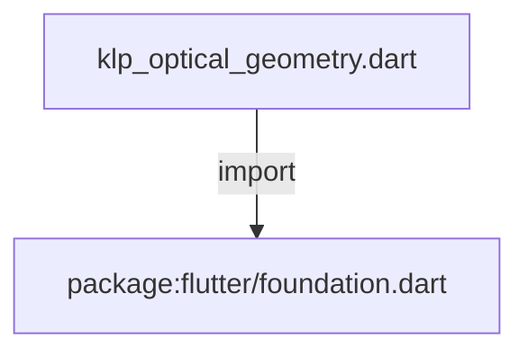
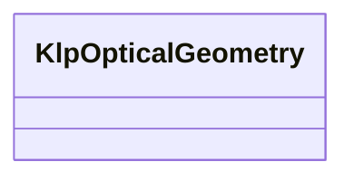

# klp_optical_geometry.dart：直接依賴與宣告架構

[回到目錄](README.md) · [來源檔案](../../../../lib/src/theme/klp_optical_geometry.dart)

## 範圍

核心是 `lib/src/theme/klp_optical_geometry.dart`。主要視角為該檔案明寫的 import／export／part；輔助視角為本檔宣告及 extends／implements／with／on 關係。只展開一層外部邊界。

## 直接依賴圖

## 依賴證據

| 關係 | 原始 directive | 來源 |
|---|---|---|
| import | <code>import &#x27;package:flutter/foundation.dart&#x27;;</code> | [lib/src/theme/klp_optical_geometry.dart:1](../../../../lib/src/theme/klp_optical_geometry.dart#L1) |

## 宣告關係圖

本組節點是本檔宣告；沒有箭頭的宣告未在此圖主張互相依賴。

## 宣告與成員證據

成員包含 public 與 private；簽章取自來源，省略函式本體與欄位初始值。`(inferred)` 表示來源未明寫型別；建構子只顯示參數部分，不含初始化列表。

### KlpOpticalGeometry

ClassDeclaration · public · [lib/src/theme/klp_optical_geometry.dart:3](../../../../lib/src/theme/klp_optical_geometry.dart#L3)

<code>class KlpOpticalGeometry</code>

來源註解摘要：不改變配置語意、只校正視覺重心的幾何值。

| 成員 | 可見性 | 簽章／型別 | 來源註解摘要 | 證據 |
|---|---|---|---|---|
| constructor <code>KlpOpticalGeometry</code> | public | <code>const KlpOpticalGeometry({ required this.menuIconOffsetY, required this.railBadgeInset, required this.statusIconOffsetY, required this.monoBaselineOffsetY, required this.uiBaselineOffsetY, })</code> |  | [lib/src/theme/klp_optical_geometry.dart:6](../../../../lib/src/theme/klp_optical_geometry.dart#L6) |
| field <code>menuIconOffsetY</code> | public | <code>final double menuIconOffsetY</code> |  | [lib/src/theme/klp_optical_geometry.dart:14](../../../../lib/src/theme/klp_optical_geometry.dart#L14) |
| field <code>railBadgeInset</code> | public | <code>final double railBadgeInset</code> |  | [lib/src/theme/klp_optical_geometry.dart:15](../../../../lib/src/theme/klp_optical_geometry.dart#L15) |
| field <code>statusIconOffsetY</code> | public | <code>final double statusIconOffsetY</code> |  | [lib/src/theme/klp_optical_geometry.dart:16](../../../../lib/src/theme/klp_optical_geometry.dart#L16) |
| field <code>monoBaselineOffsetY</code> | public | <code>final double monoBaselineOffsetY</code> |  | [lib/src/theme/klp_optical_geometry.dart:17](../../../../lib/src/theme/klp_optical_geometry.dart#L17) |
| field <code>uiBaselineOffsetY</code> | public | <code>final double uiBaselineOffsetY</code> |  | [lib/src/theme/klp_optical_geometry.dart:18](../../../../lib/src/theme/klp_optical_geometry.dart#L18) |
| method <code>==</code> | public | <code>bool operator ==(Object other)</code> |  | [lib/src/theme/klp_optical_geometry.dart:20](../../../../lib/src/theme/klp_optical_geometry.dart#L20) |
| getter <code>hashCode</code> | public | <code>int get hashCode</code> |  | [lib/src/theme/klp_optical_geometry.dart:30](../../../../lib/src/theme/klp_optical_geometry.dart#L30) |

## 閱讀說明與限制

箭頭只表示來源明寫的靜態關係；import 不等於呼叫。未分析動態呼叫、欄位的實際物件擁有權、狀態轉移或渲染流程；型別未進行語意解析，繼承目標保留原始型別拼寫。public／private 依 Dart 名稱前綴判斷；public 宣告不代表已由 `lib/kallopis.dart` 匯出。

本頁由 `tool/architecture_atlas` 產生；編輯來源或生成工具後重新產生，避免手改本頁。
