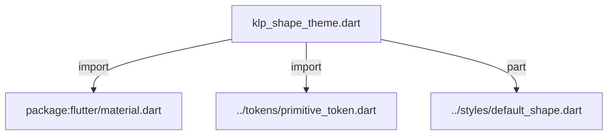
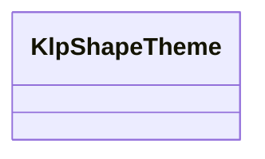
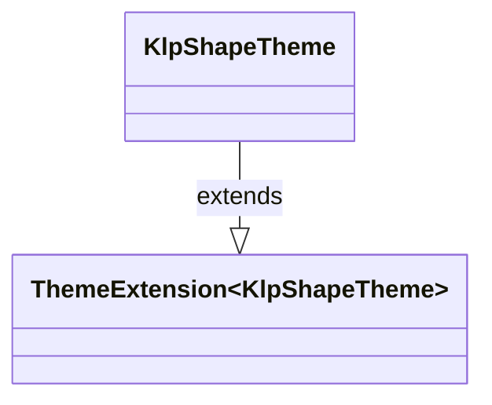

# klp_shape_theme.dart：直接依賴與宣告架構

[回到目錄](README.md) · [來源檔案](../../../../lib/src/theme/klp_shape_theme.dart)

## 範圍

核心是 `lib/src/theme/klp_shape_theme.dart`。主要視角為該檔案明寫的 import／export／part；輔助視角為本檔宣告及 extends／implements／with／on 關係。只展開一層外部邊界。

## 直接依賴圖

## 依賴證據

| 關係 | 原始 directive | 來源 |
|---|---|---|
| import | <code>import &#x27;package:flutter/material.dart&#x27;;</code> | [lib/src/theme/klp_shape_theme.dart:1](../../../../lib/src/theme/klp_shape_theme.dart#L1) |
| import | <code>import &#x27;../tokens/primitive_token.dart&#x27;;</code> | [lib/src/theme/klp_shape_theme.dart:3](../../../../lib/src/theme/klp_shape_theme.dart#L3) |
| part | <code>part &#x27;../styles/default_shape.dart&#x27;;</code> | [lib/src/theme/klp_shape_theme.dart:5](../../../../lib/src/theme/klp_shape_theme.dart#L5) |

## 宣告關係圖

本組節點是本檔宣告；沒有箭頭的宣告未在此圖主張互相依賴。

## 宣告與成員證據

成員包含 public 與 private；簽章取自來源，省略函式本體與欄位初始值。`(inferred)` 表示來源未明寫型別；建構子只顯示參數部分，不含初始化列表。

### KlpShapeTheme

ClassDeclaration · public · [lib/src/theme/klp_shape_theme.dart:7](../../../../lib/src/theme/klp_shape_theme.dart#L7)

<code>class KlpShapeTheme extends ThemeExtension&lt;KlpShapeTheme&gt;</code>

來源註解摘要：Layer 2：形狀（圓角與線寬）的 semantic token。 欄位以**使用位置的角色**命名而非尺寸命名：`control` 而不是 `sm`。消費者調整 `control` 時，所有控制項一起改變，不需要知道哪些元件恰好用了 `sm`。

- `extends` → <code>ThemeExtension&lt;KlpShapeTheme&gt;</code>：[lib/src/theme/klp_shape_theme.dart:12](../../../../lib/src/theme/klp_shape_theme.dart#L12)

| 成員 | 可見性 | 簽章／型別 | 來源註解摘要 | 證據 |
|---|---|---|---|---|
| constructor <code>KlpShapeTheme</code> | public | <code>const KlpShapeTheme({ required this.none, this.sm = KlpScale.radius50, required this.control, this.controlInner = 7, this.toggleTrack = 4, required this.card, required this.panel, required this.pill, required this.hairline, required this.stroke, required this.dashedLength, required this.dashedGap, required this.dashedOpacity, })</code> |  | [lib/src/theme/klp_shape_theme.dart:13](../../../../lib/src/theme/klp_shape_theme.dart#L13) |
| field <code>none</code> | public | <code>final double none</code> |  | [lib/src/theme/klp_shape_theme.dart:29](../../../../lib/src/theme/klp_shape_theme.dart#L29) |
| field <code>sm</code> | public | <code>final double sm</code> | Checkbox、極小標籤 (radius-sm: 2px)。 | [lib/src/theme/klp_shape_theme.dart:32](../../../../lib/src/theme/klp_shape_theme.dart#L32) |
| field <code>control</code> | public | <code>final double control</code> | 按鈕、輸入框等標準操作元件 (radius-md: 6px~8px)。 | [lib/src/theme/klp_shape_theme.dart:35](../../../../lib/src/theme/klp_shape_theme.dart#L35) |
| field <code>controlInner</code> | public | <code>final double controlInner</code> |  | [lib/src/theme/klp_shape_theme.dart:36](../../../../lib/src/theme/klp_shape_theme.dart#L36) |
| field <code>toggleTrack</code> | public | <code>final double toggleTrack</code> |  | [lib/src/theme/klp_shape_theme.dart:37](../../../../lib/src/theme/klp_shape_theme.dart#L37) |
| field <code>card</code> | public | <code>final double card</code> | 卡片、清單項目等內容容器 (radius-md: 6px~8px)。 | [lib/src/theme/klp_shape_theme.dart:40](../../../../lib/src/theme/klp_shape_theme.dart#L40) |
| field <code>panel</code> | public | <code>final double panel</code> | 面板、對話框等大面積容器 (radius-lg: 12px~16px)。 | [lib/src/theme/klp_shape_theme.dart:43](../../../../lib/src/theme/klp_shape_theme.dart#L43) |
| field <code>pill</code> | public | <code>final double pill</code> | 膠囊形、頭像、圓形標籤 (radius-full: 9999px)。 | [lib/src/theme/klp_shape_theme.dart:46](../../../../lib/src/theme/klp_shape_theme.dart#L46) |
| field <code>hairline</code> | public | <code>final double hairline</code> | 分隔線與邊框的細線寬度。 | [lib/src/theme/klp_shape_theme.dart:49](../../../../lib/src/theme/klp_shape_theme.dart#L49) |
| field <code>stroke</code> | public | <code>final double stroke</code> | 需要強調的邊框（focus ring、選取框）。 | [lib/src/theme/klp_shape_theme.dart:52](../../../../lib/src/theme/klp_shape_theme.dart#L52) |
| field <code>dashedLength</code> | public | <code>final double dashedLength</code> | 虛線描邊的節奏。 | [lib/src/theme/klp_shape_theme.dart:55](../../../../lib/src/theme/klp_shape_theme.dart#L55) |
| field <code>dashedGap</code> | public | <code>final double dashedGap</code> |  | [lib/src/theme/klp_shape_theme.dart:56](../../../../lib/src/theme/klp_shape_theme.dart#L56) |
| field <code>dashedOpacity</code> | public | <code>final double dashedOpacity</code> |  | [lib/src/theme/klp_shape_theme.dart:57](../../../../lib/src/theme/klp_shape_theme.dart#L57) |
| field <code>standardShape</code> | public | <code>static const KlpShapeTheme standardShape</code> |  | [lib/src/theme/klp_shape_theme.dart:59](../../../../lib/src/theme/klp_shape_theme.dart#L59) |
| getter <code>smRadius</code> | public | <code>BorderRadius get smRadius</code> |  | [lib/src/theme/klp_shape_theme.dart:61](../../../../lib/src/theme/klp_shape_theme.dart#L61) |
| getter <code>controlRadius</code> | public | <code>BorderRadius get controlRadius</code> |  | [lib/src/theme/klp_shape_theme.dart:62](../../../../lib/src/theme/klp_shape_theme.dart#L62) |
| getter <code>cardRadius</code> | public | <code>BorderRadius get cardRadius</code> |  | [lib/src/theme/klp_shape_theme.dart:63](../../../../lib/src/theme/klp_shape_theme.dart#L63) |
| getter <code>panelRadius</code> | public | <code>BorderRadius get panelRadius</code> |  | [lib/src/theme/klp_shape_theme.dart:64](../../../../lib/src/theme/klp_shape_theme.dart#L64) |
| getter <code>pillRadius</code> | public | <code>BorderRadius get pillRadius</code> |  | [lib/src/theme/klp_shape_theme.dart:65](../../../../lib/src/theme/klp_shape_theme.dart#L65) |
| method <code>copyWith</code> | public | <code>KlpShapeTheme copyWith({ double? none, double? sm, double? control, double? controlInner, double? toggleTrack, double? card, double? panel, double? pill, double? hairline, double? stroke, double? dashedLength, double? dashedGap, double? dashedOpacity, })</code> |  | [lib/src/theme/klp_shape_theme.dart:67](../../../../lib/src/theme/klp_shape_theme.dart#L67) |
| method <code>lerp</code> | public | <code>KlpShapeTheme lerp(covariant KlpShapeTheme? other, double t)</code> | **不做內插。** `MaterialApp` 在 theme 變更時會跑一段過場並沿路呼叫 `lerp`。各層若各自內插， 中途會出現「某幾層已經換了、某幾層還沒」的混合狀態——那正是切換深淺色時看起來 「有些元件沒有跟著變」的原因：它們不是沒變，是停在中間值上。 因此整個 token 疊層一律在中點原子性地翻轉，任何時刻都只會是完整的其中一套。 | [lib/src/theme/klp_shape_theme.dart:100](../../../../lib/src/theme/klp_shape_theme.dart#L100) |
| method <code>lerpDouble</code> | public | <code>static double lerpDouble(double a, double b, double t)</code> |  | [lib/src/theme/klp_shape_theme.dart:113](../../../../lib/src/theme/klp_shape_theme.dart#L113) |
| method <code>==</code> | public | <code>bool operator ==(Object other)</code> |  | [lib/src/theme/klp_shape_theme.dart:115](../../../../lib/src/theme/klp_shape_theme.dart#L115) |
| getter <code>hashCode</code> | public | <code>int get hashCode</code> |  | [lib/src/theme/klp_shape_theme.dart:133](../../../../lib/src/theme/klp_shape_theme.dart#L133) |

## 閱讀說明與限制

箭頭只表示來源明寫的靜態關係；import 不等於呼叫。未分析動態呼叫、欄位的實際物件擁有權、狀態轉移或渲染流程；型別未進行語意解析，繼承目標保留原始型別拼寫。public／private 依 Dart 名稱前綴判斷；public 宣告不代表已由 `lib/kallopis.dart` 匯出。

本頁由 `tool/architecture_atlas` 產生；編輯來源或生成工具後重新產生，避免手改本頁。
