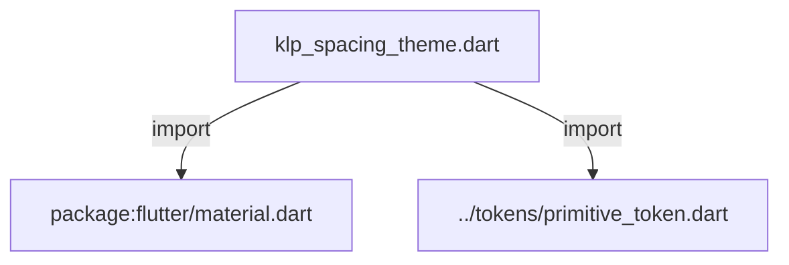
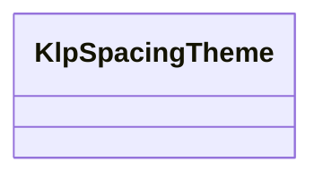
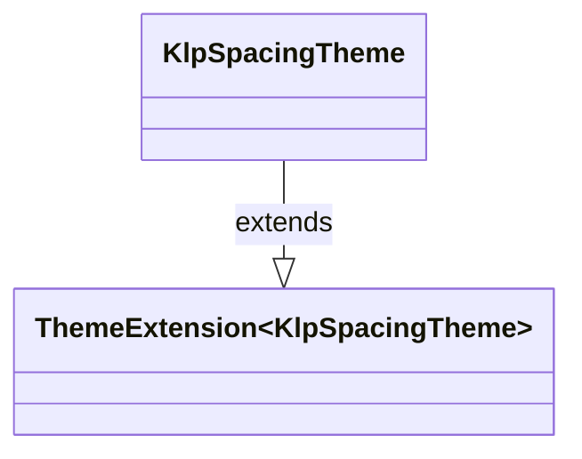

# klp_spacing_theme.dart：直接依賴與宣告架構

[回到目錄](README.md) · [來源檔案](../../../../lib/src/theme/klp_spacing_theme.dart)

## 範圍

核心是 `lib/src/theme/klp_spacing_theme.dart`。主要視角為該檔案明寫的 import／export／part；輔助視角為本檔宣告及 extends／implements／with／on 關係。只展開一層外部邊界。

## 直接依賴圖

## 依賴證據

| 關係 | 原始 directive | 來源 |
|---|---|---|
| import | <code>import &#x27;package:flutter/material.dart&#x27;;</code> | [lib/src/theme/klp_spacing_theme.dart:1](../../../../lib/src/theme/klp_spacing_theme.dart#L1) |
| import | <code>import &#x27;../tokens/primitive_token.dart&#x27;;</code> | [lib/src/theme/klp_spacing_theme.dart:3](../../../../lib/src/theme/klp_spacing_theme.dart#L3) |

## 宣告關係圖

本組節點是本檔宣告；沒有箭頭的宣告未在此圖主張互相依賴。

## 宣告與成員證據

成員包含 public 與 private；簽章取自來源，省略函式本體與欄位初始值。`(inferred)` 表示來源未明寫型別；建構子只顯示參數部分，不含初始化列表。

### KlpSpacingTheme

ClassDeclaration · public · [lib/src/theme/klp_spacing_theme.dart:5](../../../../lib/src/theme/klp_spacing_theme.dart#L5)

<code>class KlpSpacingTheme extends ThemeExtension&lt;KlpSpacingTheme&gt;</code>

來源註解摘要：Layer 2：間距與密度的 semantic token。 這是換風格時差異最大的一組 token——高密度與寬鬆兩種取向用的是同一批元件。 因此 padding **必須**由 theme 提供；元件內寫死 `EdgeInsets.all(12)` 會讓該元件在 換風格時原地不動，是最典型的風格不對齊。

- `extends` → <code>ThemeExtension&lt;KlpSpacingTheme&gt;</code>：[lib/src/theme/klp_spacing_theme.dart:11](../../../../lib/src/theme/klp_spacing_theme.dart#L11)

| 成員 | 可見性 | 簽章／型別 | 來源註解摘要 | 證據 |
|---|---|---|---|---|
| constructor <code>KlpSpacingTheme</code> | public | <code>const KlpSpacingTheme({ this.space0_5 = KlpScale.space50, this.space1 = KlpScale.space100, this.space2 = KlpScale.space200, this.space3 = KlpScale.space300, this.space4 = KlpScale.space400, this.space6 = KlpScale.space600, this.space8 = KlpScale.space800, this.space12 = KlpScale.space1200, this.space16 = KlpScale.space1600, this.space24 = KlpScale.space2400, required this.hairline, required this.tight, this.contentInlineGap = KlpScale.space200, this.contentStackGap = KlpScale.space200, this.contentInset = KlpScale.space200, this.controlContentGap = KlpScale.space200, this.controlInset = KlpScale.space200, this.actionGap = KlpScale.space200, this.chromeGap = KlpScale.space200, this.chromePanelInset = KlpScale.space200, this.chromeToolbarGap = KlpScale.space200, this.navigationItemInset = KlpScale.space200, this.navigationRailInset = KlpScale.space200, this.navigationRailItemGap = KlpScale.space200, this.overlayContentInset = KlpScale.space200, this.overlayHeadingGap = KlpScale.space200, this.overlayItemGap = KlpScale.space200, this.navigationSectionGap = KlpScale.space200 - KlpScale.space50, this.appFrameInset = KlpScale.space100, this.workbenchContentInset = KlpScale.space100, this.windowHeaderMargin = KlpScale.space100, this.dockMargin = KlpScale.space100, required this.base, required this.comfortable, required this.loose, required this.section, this.sectionLarge = KlpScale.space1200, required this.page, this.pageLarge = KlpScale.space2400, this.controlPaddingXSmall = KlpScale.space300, required this.controlPaddingX, this.controlPaddingXLarge = KlpScale.space600, this.controlPaddingXXLarge = KlpScale.space800, required this.controlPaddingY, required this.containerPadding, required this.itemGap, required this.groupGap, required this.controlHeight, this.controlHeightXSmall = 30, required this.controlHeightSmall, required this.controlHeightLarge, this.controlHeightXLarge = 56, required this.iconSmall, this.iconBase = 16, this.iconGlyph = 18, required this.icon, this.iconMedium = 24, required this.iconLarge, required this.chromeHeader, required this.chromeStatusBar, required this.chromeRail, required this.chromeTab, required this.iconButton, required this.iconTiny, required this.indicatorDot, required this.indicatorDotLarge, required this.noticeIconSlot, required this.toastIconSlot, required this.gutterNumber, required this.gutterMarker, required this.micro, required this.calendarContentCell, this.gridTileWidth = 170, required this.iconMicro, required this.avatarSmall, required this.progressTrack, required this.skeletonLine, required this.railItem, })</code> |  | [lib/src/theme/klp_spacing_theme.dart:12](../../../../lib/src/theme/klp_spacing_theme.dart#L12) |
| field <code>space0_5</code> | public | <code>final double space0_5</code> |  | [lib/src/theme/klp_spacing_theme.dart:96](../../../../lib/src/theme/klp_spacing_theme.dart#L96) |
| field <code>space1</code> | public | <code>final double space1</code> |  | [lib/src/theme/klp_spacing_theme.dart:97](../../../../lib/src/theme/klp_spacing_theme.dart#L97) |
| field <code>space2</code> | public | <code>final double space2</code> |  | [lib/src/theme/klp_spacing_theme.dart:98](../../../../lib/src/theme/klp_spacing_theme.dart#L98) |
| field <code>space3</code> | public | <code>final double space3</code> |  | [lib/src/theme/klp_spacing_theme.dart:99](../../../../lib/src/theme/klp_spacing_theme.dart#L99) |
| field <code>space4</code> | public | <code>final double space4</code> |  | [lib/src/theme/klp_spacing_theme.dart:100](../../../../lib/src/theme/klp_spacing_theme.dart#L100) |
| field <code>space6</code> | public | <code>final double space6</code> |  | [lib/src/theme/klp_spacing_theme.dart:101](../../../../lib/src/theme/klp_spacing_theme.dart#L101) |
| field <code>space8</code> | public | <code>final double space8</code> |  | [lib/src/theme/klp_spacing_theme.dart:102](../../../../lib/src/theme/klp_spacing_theme.dart#L102) |
| field <code>space12</code> | public | <code>final double space12</code> |  | [lib/src/theme/klp_spacing_theme.dart:103](../../../../lib/src/theme/klp_spacing_theme.dart#L103) |
| field <code>space16</code> | public | <code>final double space16</code> |  | [lib/src/theme/klp_spacing_theme.dart:104](../../../../lib/src/theme/klp_spacing_theme.dart#L104) |
| field <code>space24</code> | public | <code>final double space24</code> |  | [lib/src/theme/klp_spacing_theme.dart:105](../../../../lib/src/theme/klp_spacing_theme.dart#L105) |
| field <code>hairline</code> | public | <code>final double hairline</code> |  | [lib/src/theme/klp_spacing_theme.dart:108](../../../../lib/src/theme/klp_spacing_theme.dart#L108) |
| field <code>tight</code> | public | <code>final double tight</code> |  | [lib/src/theme/klp_spacing_theme.dart:109](../../../../lib/src/theme/klp_spacing_theme.dart#L109) |
| field <code>contentInlineGap</code> | public | <code>final double contentInlineGap</code> |  | [lib/src/theme/klp_spacing_theme.dart:110](../../../../lib/src/theme/klp_spacing_theme.dart#L110) |
| field <code>contentStackGap</code> | public | <code>final double contentStackGap</code> |  | [lib/src/theme/klp_spacing_theme.dart:111](../../../../lib/src/theme/klp_spacing_theme.dart#L111) |
| field <code>contentInset</code> | public | <code>final double contentInset</code> |  | [lib/src/theme/klp_spacing_theme.dart:112](../../../../lib/src/theme/klp_spacing_theme.dart#L112) |
| field <code>controlContentGap</code> | public | <code>final double controlContentGap</code> |  | [lib/src/theme/klp_spacing_theme.dart:113](../../../../lib/src/theme/klp_spacing_theme.dart#L113) |
| field <code>controlInset</code> | public | <code>final double controlInset</code> |  | [lib/src/theme/klp_spacing_theme.dart:114](../../../../lib/src/theme/klp_spacing_theme.dart#L114) |
| field <code>actionGap</code> | public | <code>final double actionGap</code> |  | [lib/src/theme/klp_spacing_theme.dart:115](../../../../lib/src/theme/klp_spacing_theme.dart#L115) |
| field <code>chromeGap</code> | public | <code>final double chromeGap</code> |  | [lib/src/theme/klp_spacing_theme.dart:116](../../../../lib/src/theme/klp_spacing_theme.dart#L116) |
| field <code>chromePanelInset</code> | public | <code>final double chromePanelInset</code> |  | [lib/src/theme/klp_spacing_theme.dart:117](../../../../lib/src/theme/klp_spacing_theme.dart#L117) |
| field <code>chromeToolbarGap</code> | public | <code>final double chromeToolbarGap</code> |  | [lib/src/theme/klp_spacing_theme.dart:118](../../../../lib/src/theme/klp_spacing_theme.dart#L118) |
| field <code>navigationItemInset</code> | public | <code>final double navigationItemInset</code> |  | [lib/src/theme/klp_spacing_theme.dart:119](../../../../lib/src/theme/klp_spacing_theme.dart#L119) |
| field <code>navigationRailInset</code> | public | <code>final double navigationRailInset</code> |  | [lib/src/theme/klp_spacing_theme.dart:120](../../../../lib/src/theme/klp_spacing_theme.dart#L120) |
| field <code>navigationRailItemGap</code> | public | <code>final double navigationRailItemGap</code> |  | [lib/src/theme/klp_spacing_theme.dart:121](../../../../lib/src/theme/klp_spacing_theme.dart#L121) |
| field <code>overlayContentInset</code> | public | <code>final double overlayContentInset</code> |  | [lib/src/theme/klp_spacing_theme.dart:122](../../../../lib/src/theme/klp_spacing_theme.dart#L122) |
| field <code>overlayHeadingGap</code> | public | <code>final double overlayHeadingGap</code> |  | [lib/src/theme/klp_spacing_theme.dart:123](../../../../lib/src/theme/klp_spacing_theme.dart#L123) |
| field <code>overlayItemGap</code> | public | <code>final double overlayItemGap</code> |  | [lib/src/theme/klp_spacing_theme.dart:124](../../../../lib/src/theme/klp_spacing_theme.dart#L124) |
| field <code>navigationSectionGap</code> | public | <code>final double navigationSectionGap</code> |  | [lib/src/theme/klp_spacing_theme.dart:125](../../../../lib/src/theme/klp_spacing_theme.dart#L125) |
| field <code>appFrameInset</code> | public | <code>final double appFrameInset</code> |  | [lib/src/theme/klp_spacing_theme.dart:126](../../../../lib/src/theme/klp_spacing_theme.dart#L126) |
| field <code>workbenchContentInset</code> | public | <code>final double workbenchContentInset</code> |  | [lib/src/theme/klp_spacing_theme.dart:127](../../../../lib/src/theme/klp_spacing_theme.dart#L127) |
| field <code>windowHeaderMargin</code> | public | <code>final double windowHeaderMargin</code> |  | [lib/src/theme/klp_spacing_theme.dart:128](../../../../lib/src/theme/klp_spacing_theme.dart#L128) |
| field <code>dockMargin</code> | public | <code>final double dockMargin</code> |  | [lib/src/theme/klp_spacing_theme.dart:129](../../../../lib/src/theme/klp_spacing_theme.dart#L129) |
| field <code>base</code> | public | <code>final double base</code> |  | [lib/src/theme/klp_spacing_theme.dart:130](../../../../lib/src/theme/klp_spacing_theme.dart#L130) |
| field <code>comfortable</code> | public | <code>final double comfortable</code> |  | [lib/src/theme/klp_spacing_theme.dart:131](../../../../lib/src/theme/klp_spacing_theme.dart#L131) |
| field <code>loose</code> | public | <code>final double loose</code> |  | [lib/src/theme/klp_spacing_theme.dart:132](../../../../lib/src/theme/klp_spacing_theme.dart#L132) |
| field <code>section</code> | public | <code>final double section</code> |  | [lib/src/theme/klp_spacing_theme.dart:133](../../../../lib/src/theme/klp_spacing_theme.dart#L133) |
| field <code>sectionLarge</code> | public | <code>final double sectionLarge</code> |  | [lib/src/theme/klp_spacing_theme.dart:134](../../../../lib/src/theme/klp_spacing_theme.dart#L134) |
| field <code>page</code> | public | <code>final double page</code> |  | [lib/src/theme/klp_spacing_theme.dart:135](../../../../lib/src/theme/klp_spacing_theme.dart#L135) |
| field <code>pageLarge</code> | public | <code>final double pageLarge</code> |  | [lib/src/theme/klp_spacing_theme.dart:136](../../../../lib/src/theme/klp_spacing_theme.dart#L136) |
| field <code>controlPaddingXSmall</code> | public | <code>final double controlPaddingXSmall</code> |  | [lib/src/theme/klp_spacing_theme.dart:140](../../../../lib/src/theme/klp_spacing_theme.dart#L140) |
| field <code>controlPaddingX</code> | public | <code>final double controlPaddingX</code> |  | [lib/src/theme/klp_spacing_theme.dart:141](../../../../lib/src/theme/klp_spacing_theme.dart#L141) |
| field <code>controlPaddingXLarge</code> | public | <code>final double controlPaddingXLarge</code> |  | [lib/src/theme/klp_spacing_theme.dart:142](../../../../lib/src/theme/klp_spacing_theme.dart#L142) |
| field <code>controlPaddingXXLarge</code> | public | <code>final double controlPaddingXXLarge</code> |  | [lib/src/theme/klp_spacing_theme.dart:143](../../../../lib/src/theme/klp_spacing_theme.dart#L143) |
| field <code>controlPaddingY</code> | public | <code>final double controlPaddingY</code> |  | [lib/src/theme/klp_spacing_theme.dart:144](../../../../lib/src/theme/klp_spacing_theme.dart#L144) |
| field <code>containerPadding</code> | public | <code>final double containerPadding</code> |  | [lib/src/theme/klp_spacing_theme.dart:145](../../../../lib/src/theme/klp_spacing_theme.dart#L145) |
| field <code>itemGap</code> | public | <code>final double itemGap</code> |  | [lib/src/theme/klp_spacing_theme.dart:146](../../../../lib/src/theme/klp_spacing_theme.dart#L146) |
| field <code>groupGap</code> | public | <code>final double groupGap</code> |  | [lib/src/theme/klp_spacing_theme.dart:147](../../../../lib/src/theme/klp_spacing_theme.dart#L147) |
| field <code>controlHeightXSmall</code> | public | <code>final double controlHeightXSmall</code> |  | [lib/src/theme/klp_spacing_theme.dart:150](../../../../lib/src/theme/klp_spacing_theme.dart#L150) |
| field <code>controlHeightSmall</code> | public | <code>final double controlHeightSmall</code> |  | [lib/src/theme/klp_spacing_theme.dart:151](../../../../lib/src/theme/klp_spacing_theme.dart#L151) |
| field <code>controlHeight</code> | public | <code>final double controlHeight</code> |  | [lib/src/theme/klp_spacing_theme.dart:152](../../../../lib/src/theme/klp_spacing_theme.dart#L152) |
| field <code>controlHeightLarge</code> | public | <code>final double controlHeightLarge</code> |  | [lib/src/theme/klp_spacing_theme.dart:153](../../../../lib/src/theme/klp_spacing_theme.dart#L153) |
| field <code>controlHeightXLarge</code> | public | <code>final double controlHeightXLarge</code> |  | [lib/src/theme/klp_spacing_theme.dart:154](../../../../lib/src/theme/klp_spacing_theme.dart#L154) |
| field <code>iconSmall</code> | public | <code>final double iconSmall</code> |  | [lib/src/theme/klp_spacing_theme.dart:157](../../../../lib/src/theme/klp_spacing_theme.dart#L157) |
| field <code>iconBase</code> | public | <code>final double iconBase</code> |  | [lib/src/theme/klp_spacing_theme.dart:158](../../../../lib/src/theme/klp_spacing_theme.dart#L158) |
| field <code>iconGlyph</code> | public | <code>final double iconGlyph</code> | 畫在 [icon] 尺寸格子裡的字形大小。 導覽列等圖示保留固定格線，但字形略小，避免字形頂滿格線而顯得過重。 | [lib/src/theme/klp_spacing_theme.dart:163](../../../../lib/src/theme/klp_spacing_theme.dart#L163) |
| field <code>icon</code> | public | <code>final double icon</code> |  | [lib/src/theme/klp_spacing_theme.dart:164](../../../../lib/src/theme/klp_spacing_theme.dart#L164) |
| field <code>iconMedium</code> | public | <code>final double iconMedium</code> |  | [lib/src/theme/klp_spacing_theme.dart:165](../../../../lib/src/theme/klp_spacing_theme.dart#L165) |
| field <code>iconLarge</code> | public | <code>final double iconLarge</code> |  | [lib/src/theme/klp_spacing_theme.dart:166](../../../../lib/src/theme/klp_spacing_theme.dart#L166) |
| field <code>chromeHeader</code> | public | <code>final double chromeHeader</code> |  | [lib/src/theme/klp_spacing_theme.dart:169](../../../../lib/src/theme/klp_spacing_theme.dart#L169) |
| field <code>chromeStatusBar</code> | public | <code>final double chromeStatusBar</code> |  | [lib/src/theme/klp_spacing_theme.dart:170](../../../../lib/src/theme/klp_spacing_theme.dart#L170) |
| field <code>chromeRail</code> | public | <code>final double chromeRail</code> |  | [lib/src/theme/klp_spacing_theme.dart:171](../../../../lib/src/theme/klp_spacing_theme.dart#L171) |
| getter <code>workbenchRailExtent</code> | public | <code>double get workbenchRailExtent</code> | Workbench Rail surface 加上與 Sidebar surface 之間的語意間距。 | [lib/src/theme/klp_spacing_theme.dart:173](../../../../lib/src/theme/klp_spacing_theme.dart#L173) |
| field <code>chromeTab</code> | public | <code>final double chromeTab</code> |  | [lib/src/theme/klp_spacing_theme.dart:176](../../../../lib/src/theme/klp_spacing_theme.dart#L176) |
| field <code>iconButton</code> | public | <code>final double iconButton</code> |  | [lib/src/theme/klp_spacing_theme.dart:177](../../../../lib/src/theme/klp_spacing_theme.dart#L177) |
| field <code>iconTiny</code> | public | <code>final double iconTiny</code> | 10px。狀態圓點形式的圖示 | [lib/src/theme/klp_spacing_theme.dart:182](../../../../lib/src/theme/klp_spacing_theme.dart#L182) |
| field <code>indicatorDot</code> | public | <code>final double indicatorDot</code> | 6px。狀態圓點（badge、狀態列） | [lib/src/theme/klp_spacing_theme.dart:185](../../../../lib/src/theme/klp_spacing_theme.dart#L185) |
| field <code>indicatorDotLarge</code> | public | <code>final double indicatorDotLarge</code> | 8px。導覽軌上的未讀圓點 | [lib/src/theme/klp_spacing_theme.dart:188](../../../../lib/src/theme/klp_spacing_theme.dart#L188) |
| field <code>noticeIconSlot</code> | public | <code>final double noticeIconSlot</code> | 28px。行內提示的圖示格 | [lib/src/theme/klp_spacing_theme.dart:197](../../../../lib/src/theme/klp_spacing_theme.dart#L197) |
| field <code>toastIconSlot</code> | public | <code>final double toastIconSlot</code> | 22px。浮動提示的圖示格 | [lib/src/theme/klp_spacing_theme.dart:200](../../../../lib/src/theme/klp_spacing_theme.dart#L200) |
| field <code>gutterNumber</code> | public | <code>final double gutterNumber</code> | 24px。程式碼行號欄寬 | [lib/src/theme/klp_spacing_theme.dart:203](../../../../lib/src/theme/klp_spacing_theme.dart#L203) |
| field <code>gutterMarker</code> | public | <code>final double gutterMarker</code> | 14px。差異標記欄寬 | [lib/src/theme/klp_spacing_theme.dart:206](../../../../lib/src/theme/klp_spacing_theme.dart#L206) |
| field <code>micro</code> | public | <code>final double micro</code> | 1px。視覺上僅作分隔用的最小間隙 | [lib/src/theme/klp_spacing_theme.dart:209](../../../../lib/src/theme/klp_spacing_theme.dart#L209) |
| field <code>calendarContentCell</code> | public | <code>final double calendarContentCell</code> | 帶內容的月曆日期格最小高度。 只在 [KlpCalendar] 給了 `dayContentBuilder` 時生效——純日期選擇的格子用 [controlHeightSmall]，塞進內容後那個高度會擠成一團。 | [lib/src/theme/klp_spacing_theme.dart:215](../../../../lib/src/theme/klp_spacing_theme.dart#L215) |
| field <code>gridTileWidth</code> | public | <code>final double gridTileWidth</code> | 卡片式網格的單欄寬度。 瀑布流與磚牆排版以單欄寬度維持規律節奏；元件只能讀此語意 token， 不得把欄寬分散成各自的風格常數。 | [lib/src/theme/klp_spacing_theme.dart:221](../../../../lib/src/theme/klp_spacing_theme.dart#L221) |
| field <code>iconMicro</code> | public | <code>final double iconMicro</code> | 11px。狀態字形用的最小圖示 | [lib/src/theme/klp_spacing_theme.dart:224](../../../../lib/src/theme/klp_spacing_theme.dart#L224) |
| field <code>avatarSmall</code> | public | <code>final double avatarSmall</code> | 28px。頭像堆疊中的小頭像 | [lib/src/theme/klp_spacing_theme.dart:227](../../../../lib/src/theme/klp_spacing_theme.dart#L227) |
| field <code>progressTrack</code> | public | <code>final double progressTrack</code> | 3px。進度條軌道厚度 | [lib/src/theme/klp_spacing_theme.dart:230](../../../../lib/src/theme/klp_spacing_theme.dart#L230) |
| field <code>skeletonLine</code> | public | <code>final double skeletonLine</code> | 10px。骨架屏的單行高 | [lib/src/theme/klp_spacing_theme.dart:233](../../../../lib/src/theme/klp_spacing_theme.dart#L233) |
| field <code>railItem</code> | public | <code>final double railItem</code> | 32px。導覽軌上的正方形可點區塊。 | [lib/src/theme/klp_spacing_theme.dart:236](../../../../lib/src/theme/klp_spacing_theme.dart#L236) |
| getter <code>xxs</code> | public | <code>double get xxs</code> |  | [lib/src/theme/klp_spacing_theme.dart:242](../../../../lib/src/theme/klp_spacing_theme.dart#L242) |
| getter <code>controlInsets</code> | public | <code>EdgeInsets get controlInsets</code> |  | [lib/src/theme/klp_spacing_theme.dart:244](../../../../lib/src/theme/klp_spacing_theme.dart#L244) |
| getter <code>containerInsets</code> | public | <code>EdgeInsets get containerInsets</code> |  | [lib/src/theme/klp_spacing_theme.dart:249](../../../../lib/src/theme/klp_spacing_theme.dart#L249) |
| field <code>comfortableDensity</code> | public | <code>static const KlpSpacingTheme comfortableDensity</code> | 現代風：呼吸感優先，控制項預設 40px。 | [lib/src/theme/klp_spacing_theme.dart:252](../../../../lib/src/theme/klp_spacing_theme.dart#L252) |
| method <code>copyWith</code> | public | <code>KlpSpacingTheme copyWith({ double? iconTiny, double? indicatorDot, double? indicatorDotLarge, double? noticeIconSlot, double? toastIconSlot, double? gutterNumber, double? gutterMarker, double? micro, double? calendarContentCell, double? gridTileWidth, double? iconMicro, double? avatarSmall, double? progressTrack, double? skeletonLine, double? railItem, double? space0_5, double? space1, double? space2, double? space3, double? space4, double? space6, double? space8, double? space12, double? space16, double? space24, double? hairline, double? tight, double? contentInlineGap, double? contentStackGap, double? contentInset, double? controlContentGap, double? controlInset, double? actionGap, double? chromeGap, double? chromePanelInset, double? chromeToolbarGap, double? navigationItemInset, double? navigationRailInset, double? navigationRailItemGap, double? overlayContentInset, double? overlayHeadingGap, double? overlayItemGap, double? navigationSectionGap, double? appFrameInset, double? workbenchContentInset, double? windowHeaderMargin, double? dockMargin, double? base, double? comfortable, double? loose, double? section, double? sectionLarge, double? page, double? pageLarge, double? controlPaddingXSmall, double? controlPaddingX, double? controlPaddingXLarge, double? controlPaddingXXLarge, double? controlPaddingY, double? containerPadding, double? itemGap, double? groupGap, double? controlHeight, double? controlHeightXSmall, double? controlHeightSmall, double? controlHeightLarge, double? controlHeightXLarge, double? iconSmall, double? iconBase, double? iconGlyph, double? icon, double? iconMedium, double? iconLarge, double? chromeHeader, double? chromeStatusBar, double? chromeRail, double? chromeTab, double? iconButton, })</code> |  | [lib/src/theme/klp_spacing_theme.dart:333](../../../../lib/src/theme/klp_spacing_theme.dart#L333) |
| method <code>lerp</code> | public | <code>KlpSpacingTheme lerp(covariant KlpSpacingTheme? other, double t)</code> |  | [lib/src/theme/klp_spacing_theme.dart:501](../../../../lib/src/theme/klp_spacing_theme.dart#L501) |
| method <code>==</code> | public | <code>bool operator ==(Object other)</code> |  | [lib/src/theme/klp_spacing_theme.dart:507](../../../../lib/src/theme/klp_spacing_theme.dart#L507) |
| getter <code>hashCode</code> | public | <code>int get hashCode</code> |  | [lib/src/theme/klp_spacing_theme.dart:592](../../../../lib/src/theme/klp_spacing_theme.dart#L592) |

## 閱讀說明與限制

箭頭只表示來源明寫的靜態關係；import 不等於呼叫。未分析動態呼叫、欄位的實際物件擁有權、狀態轉移或渲染流程；型別未進行語意解析，繼承目標保留原始型別拼寫。public／private 依 Dart 名稱前綴判斷；public 宣告不代表已由 `lib/kallopis.dart` 匯出。

本頁由 `tool/architecture_atlas` 產生；編輯來源或生成工具後重新產生，避免手改本頁。
