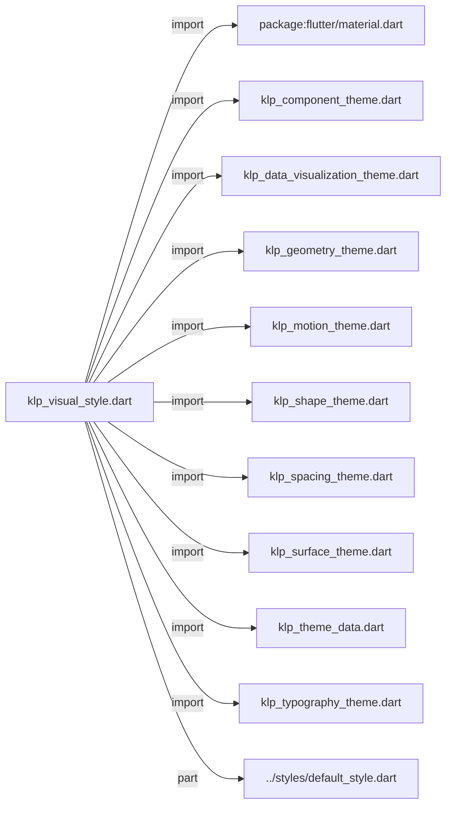
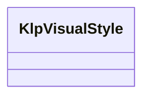

# klp_visual_style.dart：直接依賴與宣告架構

[回到目錄](README.md) · [來源檔案](../../../../lib/src/theme/klp_visual_style.dart)

## 範圍

核心是 `lib/src/theme/klp_visual_style.dart`。主要視角為該檔案明寫的 import／export／part；輔助視角為本檔宣告及 extends／implements／with／on 關係。只展開一層外部邊界。

## 直接依賴圖

## 依賴證據

| 關係 | 原始 directive | 來源 |
|---|---|---|
| import | <code>import &#x27;package:flutter/material.dart&#x27;;</code> | [lib/src/theme/klp_visual_style.dart:1](../../../../lib/src/theme/klp_visual_style.dart#L1) |
| import | <code>import &#x27;klp_component_theme.dart&#x27;;</code> | [lib/src/theme/klp_visual_style.dart:3](../../../../lib/src/theme/klp_visual_style.dart#L3) |
| import | <code>import &#x27;klp_data_visualization_theme.dart&#x27;;</code> | [lib/src/theme/klp_visual_style.dart:4](../../../../lib/src/theme/klp_visual_style.dart#L4) |
| import | <code>import &#x27;klp_geometry_theme.dart&#x27;;</code> | [lib/src/theme/klp_visual_style.dart:5](../../../../lib/src/theme/klp_visual_style.dart#L5) |
| import | <code>import &#x27;klp_motion_theme.dart&#x27;;</code> | [lib/src/theme/klp_visual_style.dart:6](../../../../lib/src/theme/klp_visual_style.dart#L6) |
| import | <code>import &#x27;klp_shape_theme.dart&#x27;;</code> | [lib/src/theme/klp_visual_style.dart:7](../../../../lib/src/theme/klp_visual_style.dart#L7) |
| import | <code>import &#x27;klp_spacing_theme.dart&#x27;;</code> | [lib/src/theme/klp_visual_style.dart:8](../../../../lib/src/theme/klp_visual_style.dart#L8) |
| import | <code>import &#x27;klp_surface_theme.dart&#x27;;</code> | [lib/src/theme/klp_visual_style.dart:9](../../../../lib/src/theme/klp_visual_style.dart#L9) |
| import | <code>import &#x27;klp_theme_data.dart&#x27;;</code> | [lib/src/theme/klp_visual_style.dart:10](../../../../lib/src/theme/klp_visual_style.dart#L10) |
| import | <code>import &#x27;klp_typography_theme.dart&#x27;;</code> | [lib/src/theme/klp_visual_style.dart:11](../../../../lib/src/theme/klp_visual_style.dart#L11) |
| part | <code>part &#x27;../styles/default_style.dart&#x27;;</code> | [lib/src/theme/klp_visual_style.dart:13](../../../../lib/src/theme/klp_visual_style.dart#L13) |

## 宣告關係圖

本組節點是本檔宣告；沒有箭頭的宣告未在此圖主張互相依賴。

## 宣告與成員證據

成員包含 public 與 private；簽章取自來源，省略函式本體與欄位初始值。`(inferred)` 表示來源未明寫型別；建構子只顯示參數部分，不含初始化列表。

### KlpVisualStyle

ClassDeclaration · public · [lib/src/theme/klp_visual_style.dart:15](../../../../lib/src/theme/klp_visual_style.dart#L15)

<code>class KlpVisualStyle</code>

來源註解摘要：一整套視覺風格。 這個型別存在的理由是**讓「換一套視覺風格」成為單一動作**。若風格散落在多個 `ThemeExtension` 各自設定，消費者遲早會只換其中三個——換出一個圓角是方的、動畫卻還在 的半套風格。把它們綁成一個必須整組給定的物件，那種狀態就無法表達。 消費者要微調，是取一個現成風格再 [copyWith] 單一層，而不是自己拼所有 extension。

| 成員 | 可見性 | 簽章／型別 | 來源註解摘要 | 證據 |
|---|---|---|---|---|
| constructor <code>KlpVisualStyle</code> | public | <code>const KlpVisualStyle({ required this.name, required this.colors, required this.typography, required this.spacing, required this.shape, required this.motion, required this.surface, required this.components, this.dataVisualization = KlpDataVisualizationTheme.light, this.geometry = KlpGeometryTheme.standard, })</code> |  | [lib/src/theme/klp_visual_style.dart:24](../../../../lib/src/theme/klp_visual_style.dart#L24) |
| field <code>name</code> | public | <code>final String name</code> |  | [lib/src/theme/klp_visual_style.dart:37](../../../../lib/src/theme/klp_visual_style.dart#L37) |
| field <code>colors</code> | public | <code>final KlpThemeData colors</code> |  | [lib/src/theme/klp_visual_style.dart:38](../../../../lib/src/theme/klp_visual_style.dart#L38) |
| field <code>typography</code> | public | <code>final KlpTypographyTheme typography</code> |  | [lib/src/theme/klp_visual_style.dart:39](../../../../lib/src/theme/klp_visual_style.dart#L39) |
| field <code>spacing</code> | public | <code>final KlpSpacingTheme spacing</code> |  | [lib/src/theme/klp_visual_style.dart:40](../../../../lib/src/theme/klp_visual_style.dart#L40) |
| field <code>shape</code> | public | <code>final KlpShapeTheme shape</code> |  | [lib/src/theme/klp_visual_style.dart:41](../../../../lib/src/theme/klp_visual_style.dart#L41) |
| field <code>motion</code> | public | <code>final KlpMotionTheme motion</code> |  | [lib/src/theme/klp_visual_style.dart:42](../../../../lib/src/theme/klp_visual_style.dart#L42) |
| field <code>surface</code> | public | <code>final KlpSurfaceTheme surface</code> |  | [lib/src/theme/klp_visual_style.dart:43](../../../../lib/src/theme/klp_visual_style.dart#L43) |
| field <code>components</code> | public | <code>final KlpComponentTheme components</code> |  | [lib/src/theme/klp_visual_style.dart:44](../../../../lib/src/theme/klp_visual_style.dart#L44) |
| field <code>dataVisualization</code> | public | <code>final KlpDataVisualizationTheme dataVisualization</code> |  | [lib/src/theme/klp_visual_style.dart:45](../../../../lib/src/theme/klp_visual_style.dart#L45) |
| field <code>geometry</code> | public | <code>final KlpGeometryTheme geometry</code> |  | [lib/src/theme/klp_visual_style.dart:46](../../../../lib/src/theme/klp_visual_style.dart#L46) |
| field <code>defaultStyle</code> | public | <code>static const KlpVisualStyle defaultStyle</code> | 預設風格：比例字體、圓角、陰影分層、寬鬆密度、有過場動畫。 | [lib/src/theme/klp_visual_style.dart:49](../../../../lib/src/theme/klp_visual_style.dart#L49) |
| field <code>modern</code> | public | <code>static const KlpVisualStyle modern</code> | 舊名稱別名，相容於既有程式碼。 | [lib/src/theme/klp_visual_style.dart:52](../../../../lib/src/theme/klp_visual_style.dart#L52) |
| method <code>forBrightness</code> | public | <code>static KlpVisualStyle forBrightness(Brightness brightness)</code> | 取得預設風格在指定明暗模式下的完整色彩組合。 這不是第二套視覺 preset；字體、間距、形狀、動態與元件 token 都沿用 [defaultStyle]，只有本來就隨明暗切換的色彩層與資料視覺化色盤成組切換。 | [lib/src/theme/klp_visual_style.dart:54](../../../../lib/src/theme/klp_visual_style.dart#L54) |
| getter <code>extensions</code> | public | <code>List&lt;ThemeExtension&lt;dynamic&gt;&gt; get extensions</code> | 交給 `ThemeData.extensions` 的完整清單。少放任何一項，該層就會退回預設值而不會 報錯——因此這裡刻意不提供「部分產生」的版本。 | [lib/src/theme/klp_visual_style.dart:86](../../../../lib/src/theme/klp_visual_style.dart#L86) |
| method <code>copyWith</code> | public | <code>KlpVisualStyle copyWith({ String? name, KlpThemeData? colors, KlpTypographyTheme? typography, KlpSpacingTheme? spacing, KlpShapeTheme? shape, KlpMotionTheme? motion, KlpSurfaceTheme? surface, KlpComponentTheme? components, KlpDataVisualizationTheme? dataVisualization, KlpGeometryTheme? geometry, })</code> |  | [lib/src/theme/klp_visual_style.dart:100](../../../../lib/src/theme/klp_visual_style.dart#L100) |
| method <code>withReducedMotion</code> | public | <code>KlpVisualStyle withReducedMotion(bool reduce)</code> | 套用系統的「減少動態效果」設定。無障礙規則由庫負責，不交給每個消費者各自實作。 | [lib/src/theme/klp_visual_style.dart:126](../../../../lib/src/theme/klp_visual_style.dart#L126) |

## 閱讀說明與限制

箭頭只表示來源明寫的靜態關係；import 不等於呼叫。未分析動態呼叫、欄位的實際物件擁有權、狀態轉移或渲染流程；型別未進行語意解析，繼承目標保留原始型別拼寫。public／private 依 Dart 名稱前綴判斷；public 宣告不代表已由 `lib/kallopis.dart` 匯出。

本頁由 `tool/architecture_atlas` 產生；編輯來源或生成工具後重新產生，避免手改本頁。
