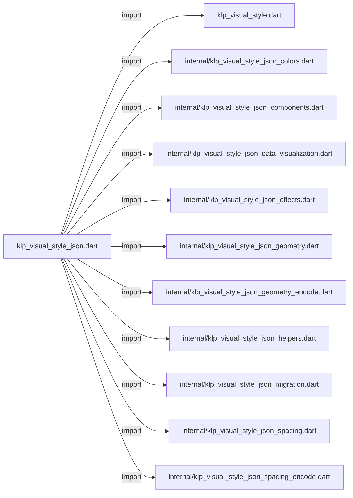
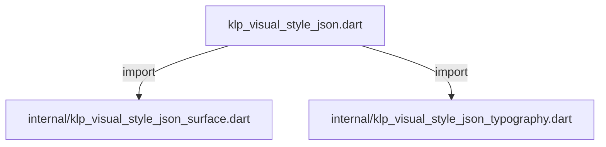
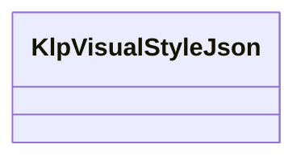

# klp_visual_style_json.dart：直接依賴與宣告架構

[回到目錄](README.md) · [來源檔案](../../../../lib/src/theme/klp_visual_style_json.dart)

## 範圍

核心是 `lib/src/theme/klp_visual_style_json.dart`。主要視角為該檔案明寫的 import／export／part；輔助視角為本檔宣告及 extends／implements／with／on 關係。只展開一層外部邊界。

## 直接依賴圖

## 依賴證據

| 關係 | 原始 directive | 來源 |
|---|---|---|
| import | <code>import &#x27;klp_visual_style.dart&#x27;;</code> | [lib/src/theme/klp_visual_style_json.dart:1](../../../../lib/src/theme/klp_visual_style_json.dart#L1) |
| import | <code>import &#x27;internal/klp_visual_style_json_colors.dart&#x27;;</code> | [lib/src/theme/klp_visual_style_json.dart:2](../../../../lib/src/theme/klp_visual_style_json.dart#L2) |
| import | <code>import &#x27;internal/klp_visual_style_json_components.dart&#x27;;</code> | [lib/src/theme/klp_visual_style_json.dart:3](../../../../lib/src/theme/klp_visual_style_json.dart#L3) |
| import | <code>import &#x27;internal/klp_visual_style_json_data_visualization.dart&#x27;;</code> | [lib/src/theme/klp_visual_style_json.dart:4](../../../../lib/src/theme/klp_visual_style_json.dart#L4) |
| import | <code>import &#x27;internal/klp_visual_style_json_effects.dart&#x27;;</code> | [lib/src/theme/klp_visual_style_json.dart:5](../../../../lib/src/theme/klp_visual_style_json.dart#L5) |
| import | <code>import &#x27;internal/klp_visual_style_json_geometry.dart&#x27;;</code> | [lib/src/theme/klp_visual_style_json.dart:6](../../../../lib/src/theme/klp_visual_style_json.dart#L6) |
| import | <code>import &#x27;internal/klp_visual_style_json_geometry_encode.dart&#x27;;</code> | [lib/src/theme/klp_visual_style_json.dart:7](../../../../lib/src/theme/klp_visual_style_json.dart#L7) |
| import | <code>import &#x27;internal/klp_visual_style_json_helpers.dart&#x27;;</code> | [lib/src/theme/klp_visual_style_json.dart:8](../../../../lib/src/theme/klp_visual_style_json.dart#L8) |
| import | <code>import &#x27;internal/klp_visual_style_json_migration.dart&#x27;;</code> | [lib/src/theme/klp_visual_style_json.dart:9](../../../../lib/src/theme/klp_visual_style_json.dart#L9) |
| import | <code>import &#x27;internal/klp_visual_style_json_spacing.dart&#x27;;</code> | [lib/src/theme/klp_visual_style_json.dart:10](../../../../lib/src/theme/klp_visual_style_json.dart#L10) |
| import | <code>import &#x27;internal/klp_visual_style_json_spacing_encode.dart&#x27;;</code> | [lib/src/theme/klp_visual_style_json.dart:11](../../../../lib/src/theme/klp_visual_style_json.dart#L11) |
| import | <code>import &#x27;internal/klp_visual_style_json_surface.dart&#x27;;</code> | [lib/src/theme/klp_visual_style_json.dart:12](../../../../lib/src/theme/klp_visual_style_json.dart#L12) |
| import | <code>import &#x27;internal/klp_visual_style_json_typography.dart&#x27;;</code> | [lib/src/theme/klp_visual_style_json.dart:13](../../../../lib/src/theme/klp_visual_style_json.dart#L13) |

## 宣告關係圖

本組節點是本檔宣告；沒有箭頭的宣告未在此圖主張互相依賴。

## 宣告與成員證據

成員包含 public 與 private；簽章取自來源，省略函式本體與欄位初始值。`(inferred)` 表示來源未明寫型別；建構子只顯示參數部分，不含初始化列表。

### KlpVisualStyleJson

ClassDeclaration · public · [lib/src/theme/klp_visual_style_json.dart:15](../../../../lib/src/theme/klp_visual_style_json.dart#L15)

<code>abstract final class KlpVisualStyleJson</code>

來源註解摘要：[KlpVisualStyle] 唯一的 JSON 編解碼邊界。 JSON 的 curve 契約只支援四點 cubic；公開 model 仍可使用任意 `Curve`，但非 `Cubic` 無法無損序列化，encode 會以完整欄位路徑拋出 [FormatException]。

| 成員 | 可見性 | 簽章／型別 | 來源註解摘要 | 證據 |
|---|---|---|---|---|
| field <code>schemaVersion</code> | public | <code>static const int schemaVersion</code> |  | [lib/src/theme/klp_visual_style_json.dart:20](../../../../lib/src/theme/klp_visual_style_json.dart#L20) |
| field <code>_keys</code> | private | <code>static const (inferred) _keys</code> |  | [lib/src/theme/klp_visual_style_json.dart:22](../../../../lib/src/theme/klp_visual_style_json.dart#L22) |
| method <code>encode</code> | public | <code>static Map&lt;String, Object?&gt; encode(KlpVisualStyle style)</code> | 輸出完整且順序穩定的 JSON object。 | [lib/src/theme/klp_visual_style_json.dart:36](../../../../lib/src/theme/klp_visual_style_json.dart#L36) |
| method <code>decode</code> | public | <code>static KlpVisualStyle decode( Map&lt;String, Object?&gt; json, { KlpVisualStyle base = KlpVisualStyle.defaultStyle, })</code> | 將局部 JSON 疊加到 [base]；缺少的欄位完整沿用 base。 | [lib/src/theme/klp_visual_style_json.dart:51](../../../../lib/src/theme/klp_visual_style_json.dart#L51) |
| method <code>_validateSchemaVersion</code> | private | <code>static void _validateSchemaVersion(KlpJsonMap json)</code> |  | [lib/src/theme/klp_visual_style_json.dart:97](../../../../lib/src/theme/klp_visual_style_json.dart#L97) |

## 閱讀說明與限制

箭頭只表示來源明寫的靜態關係；import 不等於呼叫。未分析動態呼叫、欄位的實際物件擁有權、狀態轉移或渲染流程；型別未進行語意解析，繼承目標保留原始型別拼寫。public／private 依 Dart 名稱前綴判斷；public 宣告不代表已由 `lib/kallopis.dart` 匯出。

本頁由 `tool/architecture_atlas` 產生；編輯來源或生成工具後重新產生，避免手改本頁。
