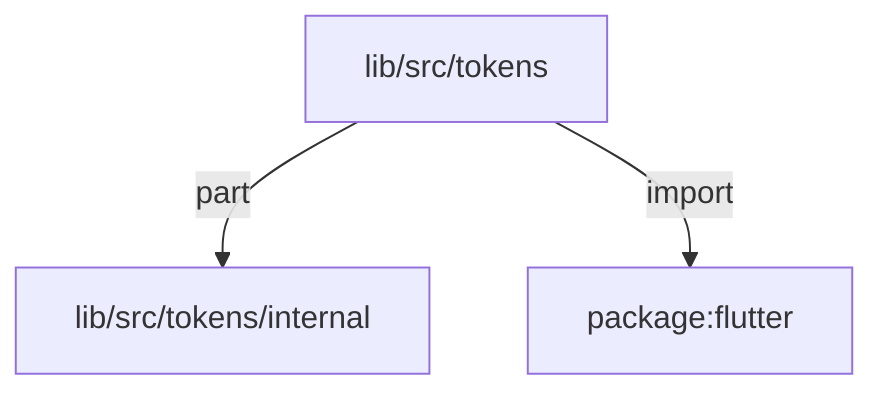
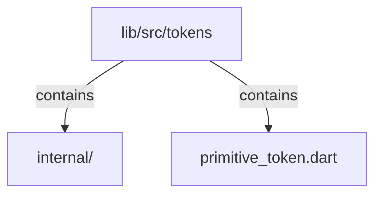

# lib/src/tokens：架構分析入口

[上一層](../README.md)

## 範圍

閱讀 `lib/src/tokens` 的直接子目錄與 Dart 檔案。結構圖表示實際檔案包含關係；依賴圖表示本層檔案明寫的 directives。每個檔案頁另列直接依賴、宣告、欄位、方法、建構子及行號證據。

## 模組閱讀重點

## 分析入口

`tokens/primitive_token.dart` 直接定義 KlpScale 數值階梯與 KlpPalette 色彩階梯，是設計語言的原始值來源。公開顏色只以色族與色階命名；資料視覺化用途與模式由 KlpDataVisualizationTheme 組合。`internal/klp_accent.dart` 以 part 共用同一 library 的私有色值，定義 KlpAccent 明暗配對。語意模型各自位於 `theme/`，由 `lib/kallopis_theme.dart` 明確公開；tokens 目錄不再保存轉接 barrel。裝飾色盤不屬於設計語言，留在 foundation。

| 想查的問題 | 符號與來源 |
| --- | --- |
| 原始數值定義在哪？ | KlpScale — `lib/src/tokens/primitive_token.dart:16` |
| 原始色彩定義在哪？ | KlpPalette — `lib/src/tokens/primitive_token.dart:137` |
| accent 如何共用私有色值？ | part — `lib/src/tokens/primitive_token.dart:3`；KlpAccent — `lib/src/tokens/internal/klp_accent.dart:8` |
| semantic 類型如何公開？ | 職責入口 — `lib/kallopis_theme.dart` |
| theme 如何讀取階梯？ | KlpSpacingTheme 的 import — `lib/src/theme/klp_spacing_theme.dart:3` |

重要關係：

- `primitive_token.dart` → `internal/klp_accent.dart` 是 part，共用同一 library；反向 part of 不是循環 import（`lib/src/tokens/primitive_token.dart:3`、`lib/src/tokens/internal/klp_accent.dart:1`）。
- theme 各模型單向 import primitive scale；公開可見性由套件根目錄的 `kallopis_theme.dart` 宣告，不在 `src/tokens` 建立反向轉匯。

import／export 顯示可見性與靜態依賴，不是執行順序或資料更新流程。

## 本層直接依賴圖

箭頭以本層 Dart 檔案明寫的 directive 彙總到目標所在目錄或外部套件邊界；不遞迴將子目錄依賴算入本層。相同目標的不同 directive 類型分開計數。

| 目標邊界 | 關係 | directive 數 | 第一筆來源證據 |
|---|---|---|---|
| <code>lib/src/tokens/internal</code> | part | 1 | [lib/src/tokens/primitive_token.dart:3](../../../../lib/src/tokens/primitive_token.dart#L3) |
| <code>package:flutter</code> | import | 1 | [lib/src/tokens/primitive_token.dart:1](../../../../lib/src/tokens/primitive_token.dart#L1) |

## 目錄結構圖

## 子目錄

| 目錄 | 導航 | 來源證據 |
|---|---|---|
| `internal/` | [架構入口](internal/README.md) | [來源目錄](../../../../lib/src/tokens/internal) |

## 本層檔案

| 檔案 | 宣告 | 細節 | 來源證據 |
|---|---|---|---|
| `primitive_token.dart` | KlpScale, _inkAccentLight, _inkAccentDark, _terracottaAccentLight, _terracottaAccentDark, _ochreAccentLight, _ochreAccentDark, _oliveAccentLight, _oliveAccentDark, _slateAccentLight, _slateAccentDark, _crimsonAccentLight, _crimsonAccentDark, KlpPalette | [架構與 API](primitive_token.md) | [lib/src/tokens/primitive_token.dart:1](../../../../lib/src/tokens/primitive_token.dart#L1) |

## 閱讀說明

箭頭只表示來源明寫的靜態關係；import 不等於呼叫。未分析動態呼叫、欄位的實際物件擁有權、狀態轉移或渲染流程；型別未進行語意解析，繼承目標保留原始型別拼寫。public／private 依 Dart 名稱前綴判斷；public 宣告不代表已由 `lib/kallopis.dart` 匯出。

本頁的目錄與檔案由來源清冊產生；`manifest.json` 位於本圖集根目錄，可核對 SHA-256 與覆蓋數。人工模組摘要存於 `tool/architecture_atlas/briefs/`，重新生成時保留。
