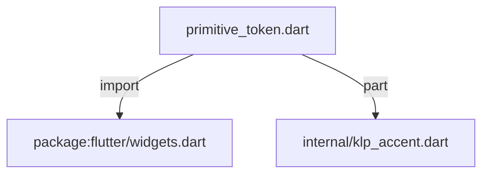
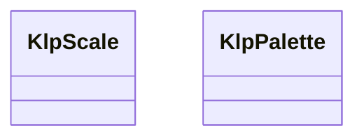

# primitive_token.dart：直接依賴與宣告架構

[回到目錄](README.md) · [來源檔案](../../../../lib/src/tokens/primitive_token.dart)

## 範圍

核心是 `lib/src/tokens/primitive_token.dart`。主要視角為該檔案明寫的 import／export／part；輔助視角為本檔宣告及 extends／implements／with／on 關係。只展開一層外部邊界。

## 直接依賴圖

## 依賴證據

| 關係 | 原始 directive | 來源 |
|---|---|---|
| import | <code>import &#x27;package:flutter/widgets.dart&#x27;;</code> | [lib/src/tokens/primitive_token.dart:1](../../../../lib/src/tokens/primitive_token.dart#L1) |
| part | <code>part &#x27;internal/klp_accent.dart&#x27;;</code> | [lib/src/tokens/primitive_token.dart:3](../../../../lib/src/tokens/primitive_token.dart#L3) |

## 宣告關係圖

本組節點是本檔宣告；沒有箭頭的宣告未在此圖主張互相依賴。

## 宣告與成員證據

成員包含 public 與 private；簽章取自來源，省略函式本體與欄位初始值。`(inferred)` 表示來源未明寫型別；建構子只顯示參數部分，不含初始化列表。

### KlpScale

ClassDeclaration · public · [lib/src/tokens/primitive_token.dart:5](../../../../lib/src/tokens/primitive_token.dart#L5)

<code>abstract final class KlpScale</code>

來源註解摘要：Layer 1：primitive token（原始階梯）。 這一層只有數值，**沒有語意**——`space400` 不知道自己會被用在哪裡。任何「這個位置該用 多少」的判斷都屬於 layer 2（semantic）或 layer 3（component）。 primitive 刻意維持 `static const` 且**不可被消費者覆寫**：它是設計語言的字彙表，不是 設定項。消費者要調整外觀，覆寫的是 semantic 或 component token（兩者都是 `ThemeExtension`），而不是重新定義「4 是多少」。 命名採數值階梯而非 t-shirt size，因為 t-shirt size 本身就是一種語意宣稱 （「md 是預設」），那屬於 layer 2。

| 成員 | 可見性 | 簽章／型別 | 來源註解摘要 | 證據 |
|---|---|---|---|---|
| field <code>space0</code> | public | <code>static const double space0</code> |  | [lib/src/tokens/primitive_token.dart:18](../../../../lib/src/tokens/primitive_token.dart#L18) |
| field <code>space50</code> | public | <code>static const double space50</code> |  | [lib/src/tokens/primitive_token.dart:19](../../../../lib/src/tokens/primitive_token.dart#L19) |
| field <code>space100</code> | public | <code>static const double space100</code> |  | [lib/src/tokens/primitive_token.dart:20](../../../../lib/src/tokens/primitive_token.dart#L20) |
| field <code>space200</code> | public | <code>static const double space200</code> |  | [lib/src/tokens/primitive_token.dart:21](../../../../lib/src/tokens/primitive_token.dart#L21) |
| field <code>space250</code> | public | <code>static const double space250</code> |  | [lib/src/tokens/primitive_token.dart:22](../../../../lib/src/tokens/primitive_token.dart#L22) |
| field <code>space300</code> | public | <code>static const double space300</code> |  | [lib/src/tokens/primitive_token.dart:23](../../../../lib/src/tokens/primitive_token.dart#L23) |
| field <code>space400</code> | public | <code>static const double space400</code> |  | [lib/src/tokens/primitive_token.dart:24](../../../../lib/src/tokens/primitive_token.dart#L24) |
| field <code>space600</code> | public | <code>static const double space600</code> |  | [lib/src/tokens/primitive_token.dart:25](../../../../lib/src/tokens/primitive_token.dart#L25) |
| field <code>space800</code> | public | <code>static const double space800</code> |  | [lib/src/tokens/primitive_token.dart:26](../../../../lib/src/tokens/primitive_token.dart#L26) |
| field <code>space1000</code> | public | <code>static const double space1000</code> |  | [lib/src/tokens/primitive_token.dart:27](../../../../lib/src/tokens/primitive_token.dart#L27) |
| field <code>space1200</code> | public | <code>static const double space1200</code> |  | [lib/src/tokens/primitive_token.dart:28](../../../../lib/src/tokens/primitive_token.dart#L28) |
| field <code>space1600</code> | public | <code>static const double space1600</code> |  | [lib/src/tokens/primitive_token.dart:29](../../../../lib/src/tokens/primitive_token.dart#L29) |
| field <code>space2400</code> | public | <code>static const double space2400</code> |  | [lib/src/tokens/primitive_token.dart:30](../../../../lib/src/tokens/primitive_token.dart#L30) |
| field <code>radius0</code> | public | <code>static const double radius0</code> |  | [lib/src/tokens/primitive_token.dart:33](../../../../lib/src/tokens/primitive_token.dart#L33) |
| field <code>radius50</code> | public | <code>static const double radius50</code> |  | [lib/src/tokens/primitive_token.dart:34](../../../../lib/src/tokens/primitive_token.dart#L34) |
| field <code>radius100</code> | public | <code>static const double radius100</code> |  | [lib/src/tokens/primitive_token.dart:35](../../../../lib/src/tokens/primitive_token.dart#L35) |
| field <code>radius150</code> | public | <code>static const double radius150</code> |  | [lib/src/tokens/primitive_token.dart:36](../../../../lib/src/tokens/primitive_token.dart#L36) |
| field <code>radius200</code> | public | <code>static const double radius200</code> |  | [lib/src/tokens/primitive_token.dart:37](../../../../lib/src/tokens/primitive_token.dart#L37) |
| field <code>radius250</code> | public | <code>static const double radius250</code> |  | [lib/src/tokens/primitive_token.dart:38](../../../../lib/src/tokens/primitive_token.dart#L38) |
| field <code>radius300</code> | public | <code>static const double radius300</code> |  | [lib/src/tokens/primitive_token.dart:39](../../../../lib/src/tokens/primitive_token.dart#L39) |
| field <code>radius400</code> | public | <code>static const double radius400</code> |  | [lib/src/tokens/primitive_token.dart:40](../../../../lib/src/tokens/primitive_token.dart#L40) |
| field <code>radiusFull</code> | public | <code>static const double radiusFull</code> |  | [lib/src/tokens/primitive_token.dart:41](../../../../lib/src/tokens/primitive_token.dart#L41) |
| field <code>stroke0</code> | public | <code>static const double stroke0</code> |  | [lib/src/tokens/primitive_token.dart:44](../../../../lib/src/tokens/primitive_token.dart#L44) |
| field <code>stroke100</code> | public | <code>static const double stroke100</code> |  | [lib/src/tokens/primitive_token.dart:45](../../../../lib/src/tokens/primitive_token.dart#L45) |
| field <code>stroke200</code> | public | <code>static const double stroke200</code> |  | [lib/src/tokens/primitive_token.dart:46](../../../../lib/src/tokens/primitive_token.dart#L46) |
| field <code>font100</code> | public | <code>static const double font100</code> |  | [lib/src/tokens/primitive_token.dart:49](../../../../lib/src/tokens/primitive_token.dart#L49) |
| field <code>font200</code> | public | <code>static const double font200</code> |  | [lib/src/tokens/primitive_token.dart:50](../../../../lib/src/tokens/primitive_token.dart#L50) |
| field <code>font300</code> | public | <code>static const double font300</code> |  | [lib/src/tokens/primitive_token.dart:51](../../../../lib/src/tokens/primitive_token.dart#L51) |
| field <code>font400</code> | public | <code>static const double font400</code> |  | [lib/src/tokens/primitive_token.dart:52](../../../../lib/src/tokens/primitive_token.dart#L52) |
| field <code>font500</code> | public | <code>static const double font500</code> |  | [lib/src/tokens/primitive_token.dart:53](../../../../lib/src/tokens/primitive_token.dart#L53) |
| field <code>font600</code> | public | <code>static const double font600</code> |  | [lib/src/tokens/primitive_token.dart:54](../../../../lib/src/tokens/primitive_token.dart#L54) |
| field <code>font700</code> | public | <code>static const double font700</code> |  | [lib/src/tokens/primitive_token.dart:55](../../../../lib/src/tokens/primitive_token.dart#L55) |
| field <code>font800</code> | public | <code>static const double font800</code> |  | [lib/src/tokens/primitive_token.dart:56](../../../../lib/src/tokens/primitive_token.dart#L56) |
| field <code>font900</code> | public | <code>static const double font900</code> |  | [lib/src/tokens/primitive_token.dart:57](../../../../lib/src/tokens/primitive_token.dart#L57) |
| field <code>font1000</code> | public | <code>static const double font1000</code> |  | [lib/src/tokens/primitive_token.dart:58](../../../../lib/src/tokens/primitive_token.dart#L58) |
| field <code>leading100</code> | public | <code>static const double leading100</code> |  | [lib/src/tokens/primitive_token.dart:61](../../../../lib/src/tokens/primitive_token.dart#L61) |
| field <code>leading116</code> | public | <code>static const double leading116</code> |  | [lib/src/tokens/primitive_token.dart:62](../../../../lib/src/tokens/primitive_token.dart#L62) |
| field <code>leading120</code> | public | <code>static const double leading120</code> |  | [lib/src/tokens/primitive_token.dart:63](../../../../lib/src/tokens/primitive_token.dart#L63) |
| field <code>leading122</code> | public | <code>static const double leading122</code> |  | [lib/src/tokens/primitive_token.dart:64](../../../../lib/src/tokens/primitive_token.dart#L64) |
| field <code>leading127</code> | public | <code>static const double leading127</code> |  | [lib/src/tokens/primitive_token.dart:65](../../../../lib/src/tokens/primitive_token.dart#L65) |
| field <code>leading128</code> | public | <code>static const double leading128</code> |  | [lib/src/tokens/primitive_token.dart:66](../../../../lib/src/tokens/primitive_token.dart#L66) |
| field <code>leading133</code> | public | <code>static const double leading133</code> |  | [lib/src/tokens/primitive_token.dart:67](../../../../lib/src/tokens/primitive_token.dart#L67) |
| field <code>leading142</code> | public | <code>static const double leading142</code> |  | [lib/src/tokens/primitive_token.dart:68](../../../../lib/src/tokens/primitive_token.dart#L68) |
| field <code>leading150</code> | public | <code>static const double leading150</code> |  | [lib/src/tokens/primitive_token.dart:69](../../../../lib/src/tokens/primitive_token.dart#L69) |
| field <code>leading155</code> | public | <code>static const double leading155</code> |  | [lib/src/tokens/primitive_token.dart:70](../../../../lib/src/tokens/primitive_token.dart#L70) |
| field <code>leading150Legacy</code> | public | <code>static const double leading150Legacy</code> |  | [lib/src/tokens/primitive_token.dart:71](../../../../lib/src/tokens/primitive_token.dart#L71) |
| field <code>leading200</code> | public | <code>static const double leading200</code> |  | [lib/src/tokens/primitive_token.dart:72](../../../../lib/src/tokens/primitive_token.dart#L72) |
| field <code>leading300</code> | public | <code>static const double leading300</code> |  | [lib/src/tokens/primitive_token.dart:73](../../../../lib/src/tokens/primitive_token.dart#L73) |
| field <code>leading350</code> | public | <code>static const double leading350</code> |  | [lib/src/tokens/primitive_token.dart:74](../../../../lib/src/tokens/primitive_token.dart#L74) |
| field <code>leading400</code> | public | <code>static const double leading400</code> |  | [lib/src/tokens/primitive_token.dart:75](../../../../lib/src/tokens/primitive_token.dart#L75) |
| field <code>leading450</code> | public | <code>static const double leading450</code> |  | [lib/src/tokens/primitive_token.dart:76](../../../../lib/src/tokens/primitive_token.dart#L76) |
| field <code>leading500</code> | public | <code>static const double leading500</code> |  | [lib/src/tokens/primitive_token.dart:77](../../../../lib/src/tokens/primitive_token.dart#L77) |
| field <code>leading550</code> | public | <code>static const double leading550</code> |  | [lib/src/tokens/primitive_token.dart:78](../../../../lib/src/tokens/primitive_token.dart#L78) |
| field <code>leading650</code> | public | <code>static const double leading650</code> |  | [lib/src/tokens/primitive_token.dart:79](../../../../lib/src/tokens/primitive_token.dart#L79) |
| field <code>tracking0</code> | public | <code>static const double tracking0</code> |  | [lib/src/tokens/primitive_token.dart:82](../../../../lib/src/tokens/primitive_token.dart#L82) |
| field <code>trackingTight</code> | public | <code>static const double trackingTight</code> |  | [lib/src/tokens/primitive_token.dart:83](../../../../lib/src/tokens/primitive_token.dart#L83) |
| field <code>trackingWide</code> | public | <code>static const double trackingWide</code> |  | [lib/src/tokens/primitive_token.dart:84](../../../../lib/src/tokens/primitive_token.dart#L84) |
| field <code>trackingWider</code> | public | <code>static const double trackingWider</code> |  | [lib/src/tokens/primitive_token.dart:85](../../../../lib/src/tokens/primitive_token.dart#L85) |
| field <code>weight400</code> | public | <code>static const FontWeight weight400</code> |  | [lib/src/tokens/primitive_token.dart:88](../../../../lib/src/tokens/primitive_token.dart#L88) |
| field <code>weight500</code> | public | <code>static const FontWeight weight500</code> |  | [lib/src/tokens/primitive_token.dart:89](../../../../lib/src/tokens/primitive_token.dart#L89) |
| field <code>weight600</code> | public | <code>static const FontWeight weight600</code> |  | [lib/src/tokens/primitive_token.dart:90](../../../../lib/src/tokens/primitive_token.dart#L90) |
| field <code>weight700</code> | public | <code>static const FontWeight weight700</code> |  | [lib/src/tokens/primitive_token.dart:91](../../../../lib/src/tokens/primitive_token.dart#L91) |
| field <code>weight800</code> | public | <code>static const FontWeight weight800</code> |  | [lib/src/tokens/primitive_token.dart:92](../../../../lib/src/tokens/primitive_token.dart#L92) |
| field <code>duration0</code> | public | <code>static const Duration duration0</code> |  | [lib/src/tokens/primitive_token.dart:96](../../../../lib/src/tokens/primitive_token.dart#L96) |
| field <code>duration100</code> | public | <code>static const Duration duration100</code> |  | [lib/src/tokens/primitive_token.dart:97](../../../../lib/src/tokens/primitive_token.dart#L97) |
| field <code>duration150</code> | public | <code>static const Duration duration150</code> |  | [lib/src/tokens/primitive_token.dart:98](../../../../lib/src/tokens/primitive_token.dart#L98) |
| field <code>duration400</code> | public | <code>static const Duration duration400</code> |  | [lib/src/tokens/primitive_token.dart:99](../../../../lib/src/tokens/primitive_token.dart#L99) |
| field <code>duration500</code> | public | <code>static const Duration duration500</code> |  | [lib/src/tokens/primitive_token.dart:100](../../../../lib/src/tokens/primitive_token.dart#L100) |
| field <code>easeStandard</code> | public | <code>static const Curve easeStandard</code> |  | [lib/src/tokens/primitive_token.dart:103](../../../../lib/src/tokens/primitive_token.dart#L103) |
| field <code>easeEmphasized</code> | public | <code>static const Curve easeEmphasized</code> |  | [lib/src/tokens/primitive_token.dart:104](../../../../lib/src/tokens/primitive_token.dart#L104) |
| field <code>opacity100</code> | public | <code>static const double opacity100</code> |  | [lib/src/tokens/primitive_token.dart:107](../../../../lib/src/tokens/primitive_token.dart#L107) |
| field <code>opacity120</code> | public | <code>static const double opacity120</code> |  | [lib/src/tokens/primitive_token.dart:108](../../../../lib/src/tokens/primitive_token.dart#L108) |
| field <code>opacity140</code> | public | <code>static const double opacity140</code> |  | [lib/src/tokens/primitive_token.dart:109](../../../../lib/src/tokens/primitive_token.dart#L109) |
| field <code>opacity160</code> | public | <code>static const double opacity160</code> |  | [lib/src/tokens/primitive_token.dart:110](../../../../lib/src/tokens/primitive_token.dart#L110) |
| field <code>opacity180</code> | public | <code>static const double opacity180</code> |  | [lib/src/tokens/primitive_token.dart:111](../../../../lib/src/tokens/primitive_token.dart#L111) |
| field <code>opacity220</code> | public | <code>static const double opacity220</code> |  | [lib/src/tokens/primitive_token.dart:112](../../../../lib/src/tokens/primitive_token.dart#L112) |
| field <code>opacity280</code> | public | <code>static const double opacity280</code> |  | [lib/src/tokens/primitive_token.dart:113](../../../../lib/src/tokens/primitive_token.dart#L113) |
| field <code>opacity320</code> | public | <code>static const double opacity320</code> |  | [lib/src/tokens/primitive_token.dart:114](../../../../lib/src/tokens/primitive_token.dart#L114) |
| field <code>opacity440</code> | public | <code>static const double opacity440</code> |  | [lib/src/tokens/primitive_token.dart:115](../../../../lib/src/tokens/primitive_token.dart#L115) |
| field <code>opacity480</code> | public | <code>static const double opacity480</code> |  | [lib/src/tokens/primitive_token.dart:116](../../../../lib/src/tokens/primitive_token.dart#L116) |
| field <code>opacity550</code> | public | <code>static const double opacity550</code> |  | [lib/src/tokens/primitive_token.dart:117](../../../../lib/src/tokens/primitive_token.dart#L117) |
| field <code>opacity620</code> | public | <code>static const double opacity620</code> |  | [lib/src/tokens/primitive_token.dart:118](../../../../lib/src/tokens/primitive_token.dart#L118) |
| field <code>opacity720</code> | public | <code>static const double opacity720</code> |  | [lib/src/tokens/primitive_token.dart:119](../../../../lib/src/tokens/primitive_token.dart#L119) |
| field <code>opacity780</code> | public | <code>static const double opacity780</code> |  | [lib/src/tokens/primitive_token.dart:120](../../../../lib/src/tokens/primitive_token.dart#L120) |
| field <code>opacity820</code> | public | <code>static const double opacity820</code> |  | [lib/src/tokens/primitive_token.dart:121](../../../../lib/src/tokens/primitive_token.dart#L121) |

### _inkAccentLight

top-level variable · private · [lib/src/tokens/primitive_token.dart:124](../../../../lib/src/tokens/primitive_token.dart#L124)

<code>const Color _inkAccentLight</code>

### _inkAccentDark

top-level variable · private · [lib/src/tokens/primitive_token.dart:125](../../../../lib/src/tokens/primitive_token.dart#L125)

<code>const Color _inkAccentDark</code>

### _terracottaAccentLight

top-level variable · private · [lib/src/tokens/primitive_token.dart:126](../../../../lib/src/tokens/primitive_token.dart#L126)

<code>const Color _terracottaAccentLight</code>

### _terracottaAccentDark

top-level variable · private · [lib/src/tokens/primitive_token.dart:127](../../../../lib/src/tokens/primitive_token.dart#L127)

<code>const Color _terracottaAccentDark</code>

### _ochreAccentLight

top-level variable · private · [lib/src/tokens/primitive_token.dart:128](../../../../lib/src/tokens/primitive_token.dart#L128)

<code>const Color _ochreAccentLight</code>

### _ochreAccentDark

top-level variable · private · [lib/src/tokens/primitive_token.dart:129](../../../../lib/src/tokens/primitive_token.dart#L129)

<code>const Color _ochreAccentDark</code>

### _oliveAccentLight

top-level variable · private · [lib/src/tokens/primitive_token.dart:130](../../../../lib/src/tokens/primitive_token.dart#L130)

<code>const Color _oliveAccentLight</code>

### _oliveAccentDark

top-level variable · private · [lib/src/tokens/primitive_token.dart:131](../../../../lib/src/tokens/primitive_token.dart#L131)

<code>const Color _oliveAccentDark</code>

### _slateAccentLight

top-level variable · private · [lib/src/tokens/primitive_token.dart:132](../../../../lib/src/tokens/primitive_token.dart#L132)

<code>const Color _slateAccentLight</code>

### _slateAccentDark

top-level variable · private · [lib/src/tokens/primitive_token.dart:133](../../../../lib/src/tokens/primitive_token.dart#L133)

<code>const Color _slateAccentDark</code>

### _crimsonAccentLight

top-level variable · private · [lib/src/tokens/primitive_token.dart:134](../../../../lib/src/tokens/primitive_token.dart#L134)

<code>const Color _crimsonAccentLight</code>

### _crimsonAccentDark

top-level variable · private · [lib/src/tokens/primitive_token.dart:135](../../../../lib/src/tokens/primitive_token.dart#L135)

<code>const Color _crimsonAccentDark</code>

### KlpPalette

ClassDeclaration · public · [lib/src/tokens/primitive_token.dart:137](../../../../lib/src/tokens/primitive_token.dart#L137)

<code>abstract final class KlpPalette</code>

| 成員 | 可見性 | 簽章／型別 | 來源註解摘要 | 證據 |
|---|---|---|---|---|
| field <code>transparent</code> | public | <code>static const Color transparent</code> | 「沒有顏色」。這不是風格決定，但仍然需要一個名字——散落各處的 `Color(0x00000000)` 無法與真正寫死的顏色區分，會讓紀律檢查失去意義。 | [lib/src/tokens/primitive_token.dart:140](../../../../lib/src/tokens/primitive_token.dart#L140) |
| field <code>ink50</code> | public | <code>static const Color ink50</code> |  | [lib/src/tokens/primitive_token.dart:156](../../../../lib/src/tokens/primitive_token.dart#L156) |
| field <code>ink100</code> | public | <code>static const Color ink100</code> |  | [lib/src/tokens/primitive_token.dart:157](../../../../lib/src/tokens/primitive_token.dart#L157) |
| field <code>ink150</code> | public | <code>static const Color ink150</code> |  | [lib/src/tokens/primitive_token.dart:158](../../../../lib/src/tokens/primitive_token.dart#L158) |
| field <code>ink200</code> | public | <code>static const Color ink200</code> |  | [lib/src/tokens/primitive_token.dart:159](../../../../lib/src/tokens/primitive_token.dart#L159) |
| field <code>ink250</code> | public | <code>static const Color ink250</code> |  | [lib/src/tokens/primitive_token.dart:160](../../../../lib/src/tokens/primitive_token.dart#L160) |
| field <code>ink300</code> | public | <code>static const Color ink300</code> |  | [lib/src/tokens/primitive_token.dart:161](../../../../lib/src/tokens/primitive_token.dart#L161) |
| field <code>ink350</code> | public | <code>static const Color ink350</code> |  | [lib/src/tokens/primitive_token.dart:162](../../../../lib/src/tokens/primitive_token.dart#L162) |
| field <code>ink400</code> | public | <code>static const Color ink400</code> |  | [lib/src/tokens/primitive_token.dart:163](../../../../lib/src/tokens/primitive_token.dart#L163) |
| field <code>ink450</code> | public | <code>static const Color ink450</code> |  | [lib/src/tokens/primitive_token.dart:164](../../../../lib/src/tokens/primitive_token.dart#L164) |
| field <code>ink500</code> | public | <code>static const Color ink500</code> |  | [lib/src/tokens/primitive_token.dart:165](../../../../lib/src/tokens/primitive_token.dart#L165) |
| field <code>ink550</code> | public | <code>static const Color ink550</code> |  | [lib/src/tokens/primitive_token.dart:166](../../../../lib/src/tokens/primitive_token.dart#L166) |
| field <code>ink600</code> | public | <code>static const Color ink600</code> |  | [lib/src/tokens/primitive_token.dart:167](../../../../lib/src/tokens/primitive_token.dart#L167) |
| field <code>ink650</code> | public | <code>static const Color ink650</code> |  | [lib/src/tokens/primitive_token.dart:168](../../../../lib/src/tokens/primitive_token.dart#L168) |
| field <code>ink700</code> | public | <code>static const Color ink700</code> |  | [lib/src/tokens/primitive_token.dart:169](../../../../lib/src/tokens/primitive_token.dart#L169) |
| field <code>ink750</code> | public | <code>static const Color ink750</code> |  | [lib/src/tokens/primitive_token.dart:170](../../../../lib/src/tokens/primitive_token.dart#L170) |
| field <code>ink800</code> | public | <code>static const Color ink800</code> |  | [lib/src/tokens/primitive_token.dart:171](../../../../lib/src/tokens/primitive_token.dart#L171) |
| field <code>ink850</code> | public | <code>static const Color ink850</code> |  | [lib/src/tokens/primitive_token.dart:172](../../../../lib/src/tokens/primitive_token.dart#L172) |
| field <code>ink900</code> | public | <code>static const Color ink900</code> |  | [lib/src/tokens/primitive_token.dart:173](../../../../lib/src/tokens/primitive_token.dart#L173) |
| field <code>ink950</code> | public | <code>static const Color ink950</code> |  | [lib/src/tokens/primitive_token.dart:174](../../../../lib/src/tokens/primitive_token.dart#L174) |
| field <code>warmNeutral25</code> | public | <code>static const Color warmNeutral25</code> |  | [lib/src/tokens/primitive_token.dart:178](../../../../lib/src/tokens/primitive_token.dart#L178) |
| field <code>warmNeutral50</code> | public | <code>static const Color warmNeutral50</code> |  | [lib/src/tokens/primitive_token.dart:179](../../../../lib/src/tokens/primitive_token.dart#L179) |
| field <code>warmNeutral100</code> | public | <code>static const Color warmNeutral100</code> |  | [lib/src/tokens/primitive_token.dart:180](../../../../lib/src/tokens/primitive_token.dart#L180) |
| field <code>warmNeutral200</code> | public | <code>static const Color warmNeutral200</code> |  | [lib/src/tokens/primitive_token.dart:181](../../../../lib/src/tokens/primitive_token.dart#L181) |
| field <code>warmNeutral300</code> | public | <code>static const Color warmNeutral300</code> |  | [lib/src/tokens/primitive_token.dart:182](../../../../lib/src/tokens/primitive_token.dart#L182) |
| field <code>warmNeutral400</code> | public | <code>static const Color warmNeutral400</code> |  | [lib/src/tokens/primitive_token.dart:183](../../../../lib/src/tokens/primitive_token.dart#L183) |
| field <code>warmNeutral450</code> | public | <code>static const Color warmNeutral450</code> |  | [lib/src/tokens/primitive_token.dart:184](../../../../lib/src/tokens/primitive_token.dart#L184) |
| field <code>warmNeutral500</code> | public | <code>static const Color warmNeutral500</code> |  | [lib/src/tokens/primitive_token.dart:185](../../../../lib/src/tokens/primitive_token.dart#L185) |
| field <code>warmNeutral600</code> | public | <code>static const Color warmNeutral600</code> |  | [lib/src/tokens/primitive_token.dart:186](../../../../lib/src/tokens/primitive_token.dart#L186) |
| field <code>warmNeutral700</code> | public | <code>static const Color warmNeutral700</code> |  | [lib/src/tokens/primitive_token.dart:187](../../../../lib/src/tokens/primitive_token.dart#L187) |
| field <code>warmNeutral750</code> | public | <code>static const Color warmNeutral750</code> |  | [lib/src/tokens/primitive_token.dart:188](../../../../lib/src/tokens/primitive_token.dart#L188) |
| field <code>warmNeutral800</code> | public | <code>static const Color warmNeutral800</code> |  | [lib/src/tokens/primitive_token.dart:189](../../../../lib/src/tokens/primitive_token.dart#L189) |
| field <code>warmNeutral900</code> | public | <code>static const Color warmNeutral900</code> |  | [lib/src/tokens/primitive_token.dart:190](../../../../lib/src/tokens/primitive_token.dart#L190) |
| field <code>sand50</code> | public | <code>static const Color sand50</code> |  | [lib/src/tokens/primitive_token.dart:194](../../../../lib/src/tokens/primitive_token.dart#L194) |
| field <code>sand300</code> | public | <code>static const Color sand300</code> |  | [lib/src/tokens/primitive_token.dart:195](../../../../lib/src/tokens/primitive_token.dart#L195) |
| field <code>sand500</code> | public | <code>static const Color sand500</code> |  | [lib/src/tokens/primitive_token.dart:196](../../../../lib/src/tokens/primitive_token.dart#L196) |
| field <code>sand800</code> | public | <code>static const Color sand800</code> |  | [lib/src/tokens/primitive_token.dart:197](../../../../lib/src/tokens/primitive_token.dart#L197) |
| field <code>sand900</code> | public | <code>static const Color sand900</code> |  | [lib/src/tokens/primitive_token.dart:198](../../../../lib/src/tokens/primitive_token.dart#L198) |
| field <code>gold50</code> | public | <code>static const Color gold50</code> |  | [lib/src/tokens/primitive_token.dart:199](../../../../lib/src/tokens/primitive_token.dart#L199) |
| field <code>gold300</code> | public | <code>static const Color gold300</code> |  | [lib/src/tokens/primitive_token.dart:200](../../../../lib/src/tokens/primitive_token.dart#L200) |
| field <code>gold500</code> | public | <code>static const Color gold500</code> |  | [lib/src/tokens/primitive_token.dart:201](../../../../lib/src/tokens/primitive_token.dart#L201) |
| field <code>gold800</code> | public | <code>static const Color gold800</code> |  | [lib/src/tokens/primitive_token.dart:202](../../../../lib/src/tokens/primitive_token.dart#L202) |
| field <code>gold900</code> | public | <code>static const Color gold900</code> |  | [lib/src/tokens/primitive_token.dart:203](../../../../lib/src/tokens/primitive_token.dart#L203) |
| field <code>ochre50</code> | public | <code>static const Color ochre50</code> |  | [lib/src/tokens/primitive_token.dart:204](../../../../lib/src/tokens/primitive_token.dart#L204) |
| field <code>ochre300</code> | public | <code>static const Color ochre300</code> |  | [lib/src/tokens/primitive_token.dart:205](../../../../lib/src/tokens/primitive_token.dart#L205) |
| field <code>ochre500</code> | public | <code>static const Color ochre500</code> |  | [lib/src/tokens/primitive_token.dart:206](../../../../lib/src/tokens/primitive_token.dart#L206) |
| field <code>ochre800</code> | public | <code>static const Color ochre800</code> |  | [lib/src/tokens/primitive_token.dart:207](../../../../lib/src/tokens/primitive_token.dart#L207) |
| field <code>ochre900</code> | public | <code>static const Color ochre900</code> |  | [lib/src/tokens/primitive_token.dart:208](../../../../lib/src/tokens/primitive_token.dart#L208) |
| field <code>terracotta50</code> | public | <code>static const Color terracotta50</code> |  | [lib/src/tokens/primitive_token.dart:209](../../../../lib/src/tokens/primitive_token.dart#L209) |
| field <code>terracotta300</code> | public | <code>static const Color terracotta300</code> |  | [lib/src/tokens/primitive_token.dart:210](../../../../lib/src/tokens/primitive_token.dart#L210) |
| field <code>terracotta500</code> | public | <code>static const Color terracotta500</code> |  | [lib/src/tokens/primitive_token.dart:211](../../../../lib/src/tokens/primitive_token.dart#L211) |
| field <code>terracotta800</code> | public | <code>static const Color terracotta800</code> |  | [lib/src/tokens/primitive_token.dart:212](../../../../lib/src/tokens/primitive_token.dart#L212) |
| field <code>terracotta900</code> | public | <code>static const Color terracotta900</code> |  | [lib/src/tokens/primitive_token.dart:213](../../../../lib/src/tokens/primitive_token.dart#L213) |
| field <code>clay50</code> | public | <code>static const Color clay50</code> |  | [lib/src/tokens/primitive_token.dart:214](../../../../lib/src/tokens/primitive_token.dart#L214) |
| field <code>clay300</code> | public | <code>static const Color clay300</code> |  | [lib/src/tokens/primitive_token.dart:215](../../../../lib/src/tokens/primitive_token.dart#L215) |
| field <code>clay500</code> | public | <code>static const Color clay500</code> |  | [lib/src/tokens/primitive_token.dart:216](../../../../lib/src/tokens/primitive_token.dart#L216) |
| field <code>clay800</code> | public | <code>static const Color clay800</code> |  | [lib/src/tokens/primitive_token.dart:217](../../../../lib/src/tokens/primitive_token.dart#L217) |
| field <code>clay900</code> | public | <code>static const Color clay900</code> |  | [lib/src/tokens/primitive_token.dart:218](../../../../lib/src/tokens/primitive_token.dart#L218) |
| field <code>umber50</code> | public | <code>static const Color umber50</code> |  | [lib/src/tokens/primitive_token.dart:219](../../../../lib/src/tokens/primitive_token.dart#L219) |
| field <code>umber300</code> | public | <code>static const Color umber300</code> |  | [lib/src/tokens/primitive_token.dart:220](../../../../lib/src/tokens/primitive_token.dart#L220) |
| field <code>umber500</code> | public | <code>static const Color umber500</code> |  | [lib/src/tokens/primitive_token.dart:221](../../../../lib/src/tokens/primitive_token.dart#L221) |
| field <code>umber800</code> | public | <code>static const Color umber800</code> |  | [lib/src/tokens/primitive_token.dart:222](../../../../lib/src/tokens/primitive_token.dart#L222) |
| field <code>umber900</code> | public | <code>static const Color umber900</code> |  | [lib/src/tokens/primitive_token.dart:223](../../../../lib/src/tokens/primitive_token.dart#L223) |
| field <code>green100</code> | public | <code>static const Color green100</code> |  | [lib/src/tokens/primitive_token.dart:227](../../../../lib/src/tokens/primitive_token.dart#L227) |
| field <code>green400</code> | public | <code>static const Color green400</code> |  | [lib/src/tokens/primitive_token.dart:228](../../../../lib/src/tokens/primitive_token.dart#L228) |
| field <code>green500</code> | public | <code>static const Color green500</code> |  | [lib/src/tokens/primitive_token.dart:229](../../../../lib/src/tokens/primitive_token.dart#L229) |
| field <code>green600</code> | public | <code>static const Color green600</code> |  | [lib/src/tokens/primitive_token.dart:230](../../../../lib/src/tokens/primitive_token.dart#L230) |
| field <code>green800</code> | public | <code>static const Color green800</code> |  | [lib/src/tokens/primitive_token.dart:231](../../../../lib/src/tokens/primitive_token.dart#L231) |
| field <code>green900</code> | public | <code>static const Color green900</code> |  | [lib/src/tokens/primitive_token.dart:232](../../../../lib/src/tokens/primitive_token.dart#L232) |
| field <code>red100</code> | public | <code>static const Color red100</code> |  | [lib/src/tokens/primitive_token.dart:233](../../../../lib/src/tokens/primitive_token.dart#L233) |
| field <code>red300</code> | public | <code>static const Color red300</code> |  | [lib/src/tokens/primitive_token.dart:234](../../../../lib/src/tokens/primitive_token.dart#L234) |
| field <code>red400</code> | public | <code>static const Color red400</code> |  | [lib/src/tokens/primitive_token.dart:235](../../../../lib/src/tokens/primitive_token.dart#L235) |
| field <code>red600</code> | public | <code>static const Color red600</code> |  | [lib/src/tokens/primitive_token.dart:236](../../../../lib/src/tokens/primitive_token.dart#L236) |
| field <code>red800</code> | public | <code>static const Color red800</code> |  | [lib/src/tokens/primitive_token.dart:237](../../../../lib/src/tokens/primitive_token.dart#L237) |
| field <code>red900</code> | public | <code>static const Color red900</code> |  | [lib/src/tokens/primitive_token.dart:238](../../../../lib/src/tokens/primitive_token.dart#L238) |
| field <code>amber500</code> | public | <code>static const Color amber500</code> |  | [lib/src/tokens/primitive_token.dart:239](../../../../lib/src/tokens/primitive_token.dart#L239) |
| field <code>blue500</code> | public | <code>static const Color blue500</code> |  | [lib/src/tokens/primitive_token.dart:240](../../../../lib/src/tokens/primitive_token.dart#L240) |
| field <code>scrim</code> | public | <code>static const Color scrim</code> | 遮罩。ink950 @ 60%。 | [lib/src/tokens/primitive_token.dart:248](../../../../lib/src/tokens/primitive_token.dart#L248) |
| field <code>line</code> | public | <code>static const Color line</code> | 邊框預設透明：結構表面靠 tone 分層，不靠描邊。 | [lib/src/tokens/primitive_token.dart:251](../../../../lib/src/tokens/primitive_token.dart#L251) |
| field <code>transparentSurface</code> | public | <code>static const Color transparentSurface</code> | 半透明視窗的表面。ink800／ink700 加上視窗透明度。 | [lib/src/tokens/primitive_token.dart:254](../../../../lib/src/tokens/primitive_token.dart#L254) |
| field <code>transparentSurfaceInset</code> | public | <code>static const Color transparentSurfaceInset</code> |  | [lib/src/tokens/primitive_token.dart:255](../../../../lib/src/tokens/primitive_token.dart#L255) |
| field <code>pureWhite</code> | public | <code>static const Color pureWhite</code> | 對比前景的兩個極值。`KlpThemeContrast` 用它們挑「在這個底色上該用黑字還白字」， **不作為表面或文字的 token**——表面與文字一律取梯上的階。 | [lib/src/tokens/primitive_token.dart:259](../../../../lib/src/tokens/primitive_token.dart#L259) |
| field <code>pureBlack</code> | public | <code>static const Color pureBlack</code> |  | [lib/src/tokens/primitive_token.dart:260](../../../../lib/src/tokens/primitive_token.dart#L260) |

## 閱讀說明與限制

箭頭只表示來源明寫的靜態關係；import 不等於呼叫。未分析動態呼叫、欄位的實際物件擁有權、狀態轉移或渲染流程；型別未進行語意解析，繼承目標保留原始型別拼寫。public／private 依 Dart 名稱前綴判斷；public 宣告不代表已由 `lib/kallopis.dart` 匯出。

本頁由 `tool/architecture_atlas` 產生；編輯來源或生成工具後重新產生，避免手改本頁。
