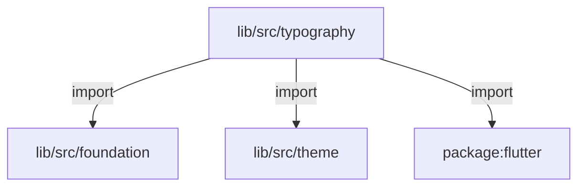
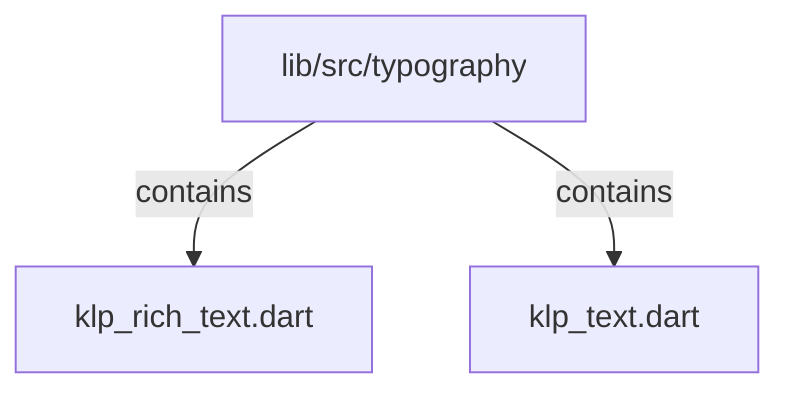

# lib/src/typography：架構分析入口

[上一層](../README.md)

## 範圍

閱讀 `lib/src/typography` 的直接子目錄與 Dart 檔案。結構圖表示實際檔案包含關係；依賴圖表示本層檔案明寫的 directives。每個檔案頁另列直接依賴、宣告、欄位、方法、建構子及行號證據。

## 模組閱讀重點

## 分析入口

`typography/` 以 KlpTextRole、KlpTextTone、字型角色與色階，將 theme 字型／色彩轉成文字呈現；KlpText 是單段文字入口。KlpRichText 接受 spans 或 nodes，依節點種類產生 TextSpan／WidgetSpan，並以 callback 回報連結及 mention 點擊。此目錄無巢狀子目錄，資料節點描述的是這組顯示元件的輸入格式。

| 想查的問題 | 符號與來源 |
| --- | --- |
| 角色如何轉換字體樣式？ | KlpTextStyles／KlpTextStyleDefinition.toTextStyle — `lib/src/typography/klp_text.dart:101`、`lib/src/typography/klp_text.dart:79` |
| 單段文字在哪建構？ | KlpText.build — `lib/src/typography/klp_text.dart:313` |
| 富文字節點種類？ | KlpRichTextKind／KlpRichTextNode — `lib/src/typography/klp_rich_text.dart:22`、`lib/src/typography/klp_rich_text.dart:41` |
| 混排節點如何展開？ | KlpRichText._spanFor — `lib/src/typography/klp_rich_text.dart:123` |

重要關係：

- `KlpText.build` → role definition → `toTextStyle`：依目前 theme typography 解析，而非固定 TextStyle（`lib/src/typography/klp_text.dart:313`）。
- `KlpRichText._spanFor` → 自身遞迴處理 children；code 分支建立 `KlpInlineCode` 的 WidgetSpan（`lib/src/typography/klp_rich_text.dart:123`、`lib/src/typography/klp_rich_text.dart:134`）。
- `KlpRichText` → 消費者 callback：mention 觸發 onOpenMention；link 的 TapGestureRecognizer 觸發 onOpenLink（`lib/src/typography/klp_rich_text.dart:150`、`lib/src/typography/klp_rich_text.dart:177`）。

import 不代表解析或互動順序；遞迴與 callback 關係需對照實際方法。

## 本層直接依賴圖

箭頭以本層 Dart 檔案明寫的 directive 彙總到目標所在目錄或外部套件邊界；不遞迴將子目錄依賴算入本層。相同目標的不同 directive 類型分開計數。

| 目標邊界 | 關係 | directive 數 | 第一筆來源證據 |
|---|---|---|---|
| <code>lib/src/foundation</code> | import | 1 | [lib/src/typography/klp_rich_text.dart:4](../../../../lib/src/typography/klp_rich_text.dart#L4) |
| <code>lib/src/theme</code> | import | 3 | [lib/src/typography/klp_rich_text.dart:5](../../../../lib/src/typography/klp_rich_text.dart#L5) |
| <code>package:flutter</code> | import | 4 | [lib/src/typography/klp_rich_text.dart:1](../../../../lib/src/typography/klp_rich_text.dart#L1) |

### 同目錄依賴

| 來源 → 目標 | 關係 | 證據 |
|---|---|---|
| <code>klp_rich_text.dart → klp_text.dart</code> | import | [lib/src/typography/klp_rich_text.dart:6](../../../../lib/src/typography/klp_rich_text.dart#L6) |

## 目錄結構圖

## 子目錄

| 目錄 | 導航 | 來源證據 |
|---|---|---|
| 無 | 目前沒有下一層目錄 | — |

## 本層檔案

| 檔案 | 宣告 | 細節 | 來源證據 |
|---|---|---|---|
| `klp_rich_text.dart` | KlpRichTextSpan, KlpRichTextKind, KlpRichTextNode, KlpRichText | [架構與 API](klp_rich_text.md) | [lib/src/typography/klp_rich_text.dart:1](../../../../lib/src/typography/klp_rich_text.dart#L1) |
| `klp_text.dart` | KlpTextRole, KlpTextTone, KlpTextColorTier, KlpFontRole, KlpTextStyleDefinition, KlpTextStyles, KlpText, _KlpOpticalShift, _RenderKlpOpticalShift | [架構與 API](klp_text.md) | [lib/src/typography/klp_text.dart:1](../../../../lib/src/typography/klp_text.dart#L1) |

## 閱讀說明

箭頭只表示來源明寫的靜態關係；import 不等於呼叫。未分析動態呼叫、欄位的實際物件擁有權、狀態轉移或渲染流程；型別未進行語意解析，繼承目標保留原始型別拼寫。public／private 依 Dart 名稱前綴判斷；public 宣告不代表已由 `lib/kallopis.dart` 匯出。

本頁的目錄與檔案由來源清冊產生；`manifest.json` 位於本圖集根目錄，可核對 SHA-256 與覆蓋數。人工模組摘要存於 `tool/architecture_atlas/briefs/`，重新生成時保留。
