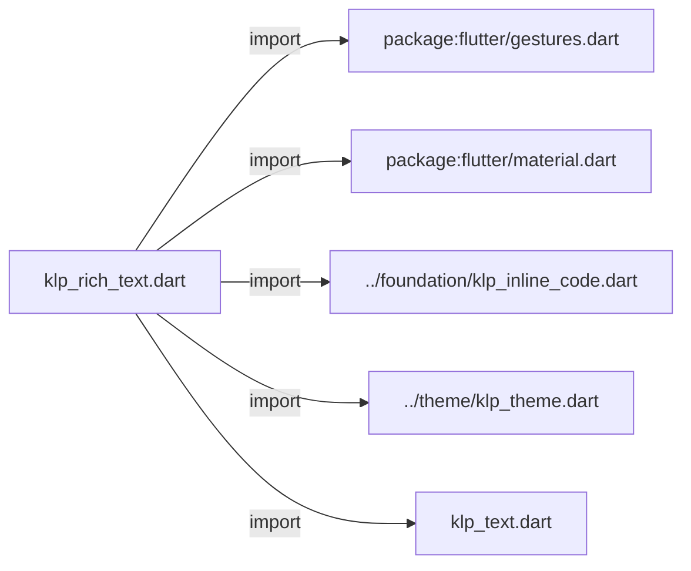
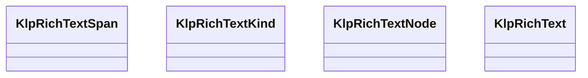
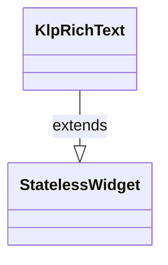

# klp_rich_text.dart：直接依賴與宣告架構

[回到目錄](README.md) · [來源檔案](../../../../lib/src/typography/klp_rich_text.dart)

## 範圍

核心是 `lib/src/typography/klp_rich_text.dart`。主要視角為該檔案明寫的 import／export／part；輔助視角為本檔宣告及 extends／implements／with／on 關係。只展開一層外部邊界。

## 直接依賴圖

## 依賴證據

| 關係 | 原始 directive | 來源 |
|---|---|---|
| import | <code>import &#x27;package:flutter/gestures.dart&#x27;;</code> | [lib/src/typography/klp_rich_text.dart:1](../../../../lib/src/typography/klp_rich_text.dart#L1) |
| import | <code>import &#x27;package:flutter/material.dart&#x27;;</code> | [lib/src/typography/klp_rich_text.dart:2](../../../../lib/src/typography/klp_rich_text.dart#L2) |
| import | <code>import &#x27;../foundation/klp_inline_code.dart&#x27;;</code> | [lib/src/typography/klp_rich_text.dart:4](../../../../lib/src/typography/klp_rich_text.dart#L4) |
| import | <code>import &#x27;../theme/klp_theme.dart&#x27;;</code> | [lib/src/typography/klp_rich_text.dart:5](../../../../lib/src/typography/klp_rich_text.dart#L5) |
| import | <code>import &#x27;klp_text.dart&#x27;;</code> | [lib/src/typography/klp_rich_text.dart:6](../../../../lib/src/typography/klp_rich_text.dart#L6) |

## 宣告關係圖

本組節點是本檔宣告；沒有箭頭的宣告未在此圖主張互相依賴。

## 宣告與成員證據

成員包含 public 與 private；簽章取自來源，省略函式本體與欄位初始值。`(inferred)` 表示來源未明寫型別；建構子只顯示參數部分，不含初始化列表。

### KlpRichTextSpan

ClassDeclaration · public · [lib/src/typography/klp_rich_text.dart:8](../../../../lib/src/typography/klp_rich_text.dart#L8)

<code>class KlpRichTextSpan</code>

來源註解摘要：[KlpRichText.spans] 的簡化片段：一段純文字，只能加粗或換色，沒有連結、 提及或行內程式碼這類結構。適合輕量的混排場合；需要連結、mention 或巢狀 結構時請改用 [KlpRichTextNode]（[KlpRichText.nodes]）。

| 成員 | 可見性 | 簽章／型別 | 來源註解摘要 | 證據 |
|---|---|---|---|---|
| constructor <code>KlpRichTextSpan</code> | public | <code>const KlpRichTextSpan({required this.text, this.strong = false, this.color})</code> |  | [lib/src/typography/klp_rich_text.dart:13](../../../../lib/src/typography/klp_rich_text.dart#L13) |
| field <code>text</code> | public | <code>final String text</code> |  | [lib/src/typography/klp_rich_text.dart:15](../../../../lib/src/typography/klp_rich_text.dart#L15) |
| field <code>strong</code> | public | <code>final bool strong</code> |  | [lib/src/typography/klp_rich_text.dart:16](../../../../lib/src/typography/klp_rich_text.dart#L16) |
| field <code>color</code> | public | <code>final Color? color</code> |  | [lib/src/typography/klp_rich_text.dart:17](../../../../lib/src/typography/klp_rich_text.dart#L17) |

### KlpRichTextKind

EnumDeclaration · public · [lib/src/typography/klp_rich_text.dart:20](../../../../lib/src/typography/klp_rich_text.dart#L20)

<code>enum KlpRichTextKind</code>

來源註解摘要：[KlpRichTextNode] 代表的行內語意種類。[lineBreak] 是硬換行，[code] 會用 [KlpInlineCode] 渲染成 `WidgetSpan`，[mention] 會渲染成可點擊的標籤膠囊。

| 成員 | 可見性 | 簽章／型別 | 來源註解摘要 | 證據 |
|---|---|---|---|---|
| enum value <code>text</code> | public | <code>text</code> |  | [lib/src/typography/klp_rich_text.dart:23](../../../../lib/src/typography/klp_rich_text.dart#L23) |
| enum value <code>strong</code> | public | <code>strong</code> |  | [lib/src/typography/klp_rich_text.dart:24](../../../../lib/src/typography/klp_rich_text.dart#L24) |
| enum value <code>emphasis</code> | public | <code>emphasis</code> |  | [lib/src/typography/klp_rich_text.dart:25](../../../../lib/src/typography/klp_rich_text.dart#L25) |
| enum value <code>strike</code> | public | <code>strike</code> |  | [lib/src/typography/klp_rich_text.dart:26](../../../../lib/src/typography/klp_rich_text.dart#L26) |
| enum value <code>code</code> | public | <code>code</code> |  | [lib/src/typography/klp_rich_text.dart:27](../../../../lib/src/typography/klp_rich_text.dart#L27) |
| enum value <code>link</code> | public | <code>link</code> |  | [lib/src/typography/klp_rich_text.dart:28](../../../../lib/src/typography/klp_rich_text.dart#L28) |
| enum value <code>mention</code> | public | <code>mention</code> |  | [lib/src/typography/klp_rich_text.dart:29](../../../../lib/src/typography/klp_rich_text.dart#L29) |
| enum value <code>lineBreak</code> | public | <code>lineBreak</code> |  | [lib/src/typography/klp_rich_text.dart:30](../../../../lib/src/typography/klp_rich_text.dart#L30) |

### KlpRichTextNode

ClassDeclaration · public · [lib/src/typography/klp_rich_text.dart:33](../../../../lib/src/typography/klp_rich_text.dart#L33)

<code>class KlpRichTextNode</code>

來源註解摘要：結構化的行內文字節點，可巢狀組成粗體、斜體、連結、mention 等混排內容。 [missing] 標示這個 mention 指向的實體已不存在（例如被刪除的使用者）， 會改用危險色並附加提示文字；[unsafe] 標示內容本身可能不安全（例如未經 驗證的外部連結），會加上波浪底線並換成危險色作為視覺警示。兩者都只影響 呈現，不會阻止 [KlpRichText] 渲染或觸發 [KlpRichText.onOpenLink] 之類的 callback——是否要真的擋下動作由呼叫端在 callback 裡自行判斷。

| 成員 | 可見性 | 簽章／型別 | 來源註解摘要 | 證據 |
|---|---|---|---|---|
| constructor <code>KlpRichTextNode</code> | public | <code>const KlpRichTextNode({ this.kind = KlpRichTextKind.text, this.text, this.href, this.label, this.missing = false, this.unsafe = false, this.children = const [], })</code> |  | [lib/src/typography/klp_rich_text.dart:42](../../../../lib/src/typography/klp_rich_text.dart#L42) |
| field <code>kind</code> | public | <code>final KlpRichTextKind kind</code> |  | [lib/src/typography/klp_rich_text.dart:52](../../../../lib/src/typography/klp_rich_text.dart#L52) |
| field <code>text</code> | public | <code>final String? text</code> |  | [lib/src/typography/klp_rich_text.dart:53](../../../../lib/src/typography/klp_rich_text.dart#L53) |
| field <code>href</code> | public | <code>final String? href</code> |  | [lib/src/typography/klp_rich_text.dart:54](../../../../lib/src/typography/klp_rich_text.dart#L54) |
| field <code>label</code> | public | <code>final String? label</code> |  | [lib/src/typography/klp_rich_text.dart:55](../../../../lib/src/typography/klp_rich_text.dart#L55) |
| field <code>missing</code> | public | <code>final bool missing</code> |  | [lib/src/typography/klp_rich_text.dart:56](../../../../lib/src/typography/klp_rich_text.dart#L56) |
| field <code>unsafe</code> | public | <code>final bool unsafe</code> |  | [lib/src/typography/klp_rich_text.dart:57](../../../../lib/src/typography/klp_rich_text.dart#L57) |
| field <code>children</code> | public | <code>final List&lt;KlpRichTextNode&gt; children</code> |  | [lib/src/typography/klp_rich_text.dart:58](../../../../lib/src/typography/klp_rich_text.dart#L58) |

### KlpRichText

ClassDeclaration · public · [lib/src/typography/klp_rich_text.dart:61](../../../../lib/src/typography/klp_rich_text.dart#L61)

<code>class KlpRichText extends StatelessWidget</code>

來源註解摘要：行內混排文字：連結、mention、粗斜體、行內程式碼可以出現在同一段落裡。 [spans] 與 [nodes] 是兩種不同精細度的輸入，二擇一——給了 [nodes]（非空） 就完全忽略 [spans]；只需要簡單加粗／換色時用 [spans] 即可，不需要為此 組出完整的節點樹。[onOpenLink]／[onOpenMention] 為 null 時，對應的連結與 mention 仍會照樣顯示，只是不可點擊。

- `extends` → <code>StatelessWidget</code>：[lib/src/typography/klp_rich_text.dart:67](../../../../lib/src/typography/klp_rich_text.dart#L67)

| 成員 | 可見性 | 簽章／型別 | 來源註解摘要 | 證據 |
|---|---|---|---|---|
| constructor <code>KlpRichText</code> | public | <code>const KlpRichText({ super.key, this.spans = const [], this.nodes = const [], this.selectable = false, this.onOpenLink, this.onOpenMention, })</code> |  | [lib/src/typography/klp_rich_text.dart:68](../../../../lib/src/typography/klp_rich_text.dart#L68) |
| field <code>spans</code> | public | <code>final List&lt;KlpRichTextSpan&gt; spans</code> |  | [lib/src/typography/klp_rich_text.dart:77](../../../../lib/src/typography/klp_rich_text.dart#L77) |
| field <code>nodes</code> | public | <code>final List&lt;KlpRichTextNode&gt; nodes</code> |  | [lib/src/typography/klp_rich_text.dart:78](../../../../lib/src/typography/klp_rich_text.dart#L78) |
| field <code>selectable</code> | public | <code>final bool selectable</code> |  | [lib/src/typography/klp_rich_text.dart:79](../../../../lib/src/typography/klp_rich_text.dart#L79) |
| field <code>onOpenLink</code> | public | <code>final ValueChanged&lt;String&gt;? onOpenLink</code> |  | [lib/src/typography/klp_rich_text.dart:80](../../../../lib/src/typography/klp_rich_text.dart#L80) |
| field <code>onOpenMention</code> | public | <code>final ValueChanged&lt;String&gt;? onOpenMention</code> |  | [lib/src/typography/klp_rich_text.dart:81](../../../../lib/src/typography/klp_rich_text.dart#L81) |
| method <code>build</code> | public | <code>Widget build(BuildContext context)</code> |  | [lib/src/typography/klp_rich_text.dart:83](../../../../lib/src/typography/klp_rich_text.dart#L83) |
| method <code>_spanFor</code> | private | <code>InlineSpan _spanFor(BuildContext context, KlpRichTextNode node)</code> |  | [lib/src/typography/klp_rich_text.dart:123](../../../../lib/src/typography/klp_rich_text.dart#L123) |

## 閱讀說明與限制

箭頭只表示來源明寫的靜態關係；import 不等於呼叫。未分析動態呼叫、欄位的實際物件擁有權、狀態轉移或渲染流程；型別未進行語意解析，繼承目標保留原始型別拼寫。public／private 依 Dart 名稱前綴判斷；public 宣告不代表已由 `lib/kallopis.dart` 匯出。

本頁由 `tool/architecture_atlas` 產生；編輯來源或生成工具後重新產生，避免手改本頁。
