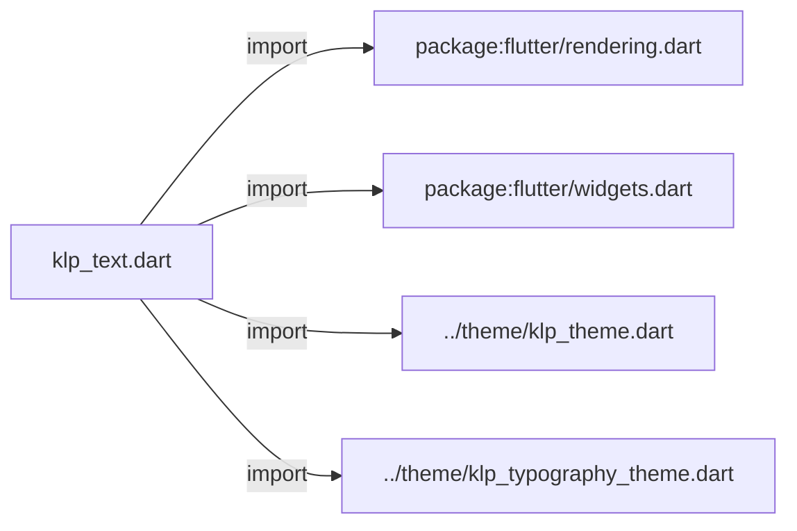
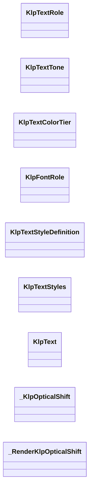
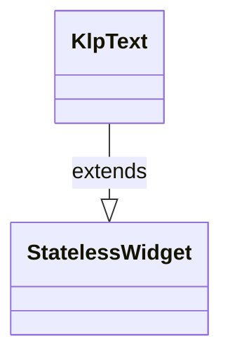
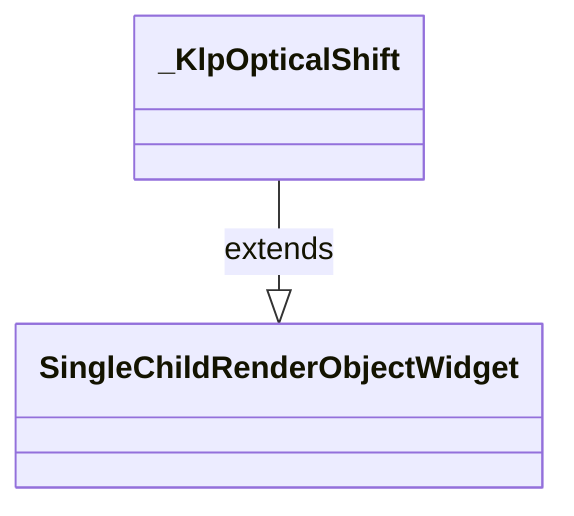
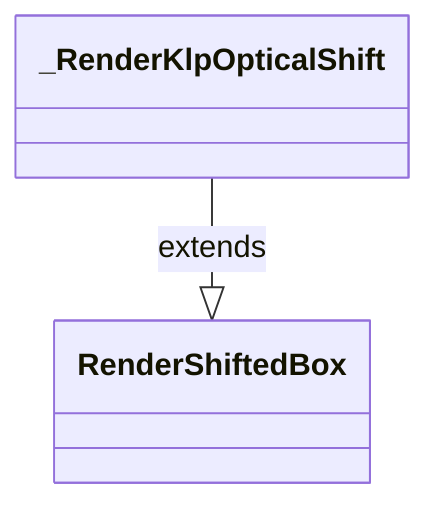

# klp_text.dart：直接依賴與宣告架構

[回到目錄](README.md) · [來源檔案](../../../../lib/src/typography/klp_text.dart)

## 範圍

核心是 `lib/src/typography/klp_text.dart`。主要視角為該檔案明寫的 import／export／part；輔助視角為本檔宣告及 extends／implements／with／on 關係。只展開一層外部邊界。

## 直接依賴圖

## 依賴證據

| 關係 | 原始 directive | 來源 |
|---|---|---|
| import | <code>import &#x27;package:flutter/rendering.dart&#x27;;</code> | [lib/src/typography/klp_text.dart:1](../../../../lib/src/typography/klp_text.dart#L1) |
| import | <code>import &#x27;package:flutter/widgets.dart&#x27;;</code> | [lib/src/typography/klp_text.dart:2](../../../../lib/src/typography/klp_text.dart#L2) |
| import | <code>import &#x27;../theme/klp_theme.dart&#x27;;</code> | [lib/src/typography/klp_text.dart:4](../../../../lib/src/typography/klp_text.dart#L4) |
| import | <code>import &#x27;../theme/klp_typography_theme.dart&#x27;;</code> | [lib/src/typography/klp_text.dart:5](../../../../lib/src/typography/klp_text.dart#L5) |

## 宣告關係圖

本組節點是本檔宣告；沒有箭頭的宣告未在此圖主張互相依賴。

## 宣告與成員證據

成員包含 public 與 private；簽章取自來源，省略函式本體與欄位初始值。`(inferred)` 表示來源未明寫型別；建構子只顯示參數部分，不含初始化列表。

### KlpTextRole

EnumDeclaration · public · [lib/src/typography/klp_text.dart:7](../../../../lib/src/typography/klp_text.dart#L7)

<code>enum KlpTextRole</code>

來源註解摘要：文字扮演的角色，決定 [KlpText] 要套用哪一組字級／行高／字重／字族。 這是語意分類而非樣式選擇——例如 [terminal] 與 [editor] 字級相同，差別只在 字族（等寬 vs 比例）。挑角色時想「這段文字在頁面上是什麼」，而不是 「我想要多大的字」；真的找不到合適角色時才用 [KlpText.color] 之類的 覆寫參數，不要為了單一畫面新增角色。

| 成員 | 可見性 | 簽章／型別 | 來源註解摘要 | 證據 |
|---|---|---|---|---|
| enum value <code>display</code> | public | <code>display</code> |  | [lib/src/typography/klp_text.dart:14](../../../../lib/src/typography/klp_text.dart#L14) |
| enum value <code>h1</code> | public | <code>h1</code> |  | [lib/src/typography/klp_text.dart:15](../../../../lib/src/typography/klp_text.dart#L15) |
| enum value <code>h2</code> | public | <code>h2</code> |  | [lib/src/typography/klp_text.dart:16](../../../../lib/src/typography/klp_text.dart#L16) |
| enum value <code>h3</code> | public | <code>h3</code> |  | [lib/src/typography/klp_text.dart:17](../../../../lib/src/typography/klp_text.dart#L17) |
| enum value <code>h4</code> | public | <code>h4</code> |  | [lib/src/typography/klp_text.dart:18](../../../../lib/src/typography/klp_text.dart#L18) |
| enum value <code>lead</code> | public | <code>lead</code> |  | [lib/src/typography/klp_text.dart:19](../../../../lib/src/typography/klp_text.dart#L19) |
| enum value <code>body</code> | public | <code>body</code> |  | [lib/src/typography/klp_text.dart:20](../../../../lib/src/typography/klp_text.dart#L20) |
| enum value <code>sub</code> | public | <code>sub</code> |  | [lib/src/typography/klp_text.dart:21](../../../../lib/src/typography/klp_text.dart#L21) |
| enum value <code>caption</code> | public | <code>caption</code> |  | [lib/src/typography/klp_text.dart:22](../../../../lib/src/typography/klp_text.dart#L22) |
| enum value <code>captionStrong</code> | public | <code>captionStrong</code> |  | [lib/src/typography/klp_text.dart:23](../../../../lib/src/typography/klp_text.dart#L23) |
| enum value <code>micro</code> | public | <code>micro</code> |  | [lib/src/typography/klp_text.dart:24](../../../../lib/src/typography/klp_text.dart#L24) |
| enum value <code>title</code> | public | <code>title</code> |  | [lib/src/typography/klp_text.dart:25](../../../../lib/src/typography/klp_text.dart#L25) |
| enum value <code>section</code> | public | <code>section</code> |  | [lib/src/typography/klp_text.dart:26](../../../../lib/src/typography/klp_text.dart#L26) |
| enum value <code>editor</code> | public | <code>editor</code> |  | [lib/src/typography/klp_text.dart:27](../../../../lib/src/typography/klp_text.dart#L27) |
| enum value <code>terminal</code> | public | <code>terminal</code> |  | [lib/src/typography/klp_text.dart:28](../../../../lib/src/typography/klp_text.dart#L28) |
| enum value <code>bodyStrong</code> | public | <code>bodyStrong</code> |  | [lib/src/typography/klp_text.dart:29](../../../../lib/src/typography/klp_text.dart#L29) |
| enum value <code>appTitle</code> | public | <code>appTitle</code> |  | [lib/src/typography/klp_text.dart:30](../../../../lib/src/typography/klp_text.dart#L30) |
| enum value <code>header</code> | public | <code>header</code> |  | [lib/src/typography/klp_text.dart:31](../../../../lib/src/typography/klp_text.dart#L31) |
| enum value <code>status</code> | public | <code>status</code> |  | [lib/src/typography/klp_text.dart:32](../../../../lib/src/typography/klp_text.dart#L32) |
| enum value <code>label</code> | public | <code>label</code> |  | [lib/src/typography/klp_text.dart:33](../../../../lib/src/typography/klp_text.dart#L33) |
| enum value <code>code</code> | public | <code>code</code> |  | [lib/src/typography/klp_text.dart:34](../../../../lib/src/typography/klp_text.dart#L34) |

### KlpTextTone

EnumDeclaration · public · [lib/src/typography/klp_text.dart:37](../../../../lib/src/typography/klp_text.dart#L37)

<code>enum KlpTextTone</code>

來源註解摘要：[KlpText] 的顯示色調。[automatic]（預設）依 [KlpTextRole] 查 [KlpTextStyles.tiers] 決定色階；其餘值明確覆寫成對應的語意色， 用於強調（[danger]／[success]）或降低視覺權重（[muted]／[faint]）等 角色本身無法表達的場合。

| 成員 | 可見性 | 簽章／型別 | 來源註解摘要 | 證據 |
|---|---|---|---|---|
| enum value <code>automatic</code> | public | <code>automatic</code> |  | [lib/src/typography/klp_text.dart:41](../../../../lib/src/typography/klp_text.dart#L41) |
| enum value <code>primary</code> | public | <code>primary</code> |  | [lib/src/typography/klp_text.dart:41](../../../../lib/src/typography/klp_text.dart#L41) |
| enum value <code>muted</code> | public | <code>muted</code> |  | [lib/src/typography/klp_text.dart:41](../../../../lib/src/typography/klp_text.dart#L41) |
| enum value <code>faint</code> | public | <code>faint</code> |  | [lib/src/typography/klp_text.dart:41](../../../../lib/src/typography/klp_text.dart#L41) |
| enum value <code>accent</code> | public | <code>accent</code> |  | [lib/src/typography/klp_text.dart:41](../../../../lib/src/typography/klp_text.dart#L41) |
| enum value <code>danger</code> | public | <code>danger</code> |  | [lib/src/typography/klp_text.dart:41](../../../../lib/src/typography/klp_text.dart#L41) |
| enum value <code>success</code> | public | <code>success</code> |  | [lib/src/typography/klp_text.dart:41](../../../../lib/src/typography/klp_text.dart#L41) |

### KlpTextColorTier

EnumDeclaration · public · [lib/src/typography/klp_text.dart:43](../../../../lib/src/typography/klp_text.dart#L43)

<code>enum KlpTextColorTier</code>

來源註解摘要：文字色彩的視覺權重階層：[prominent] 最清楚、[subdued] 最不顯眼。 這一層把「角色該多顯眼」與「實際顏色數值」分開——[KlpTextStyles.colorFor] 用 tier 去查目前 theme 的 `tokens.text`／`textMuted`／`textFaint`， 因此換 theme 時同一個 tier 會自動對到新的顏色。

| 成員 | 可見性 | 簽章／型別 | 來源註解摘要 | 證據 |
|---|---|---|---|---|
| enum value <code>prominent</code> | public | <code>prominent</code> |  | [lib/src/typography/klp_text.dart:48](../../../../lib/src/typography/klp_text.dart#L48) |
| enum value <code>standard</code> | public | <code>standard</code> |  | [lib/src/typography/klp_text.dart:48](../../../../lib/src/typography/klp_text.dart#L48) |
| enum value <code>subdued</code> | public | <code>subdued</code> |  | [lib/src/typography/klp_text.dart:48](../../../../lib/src/typography/klp_text.dart#L48) |

### KlpFontRole

EnumDeclaration · public · [lib/src/typography/klp_text.dart:50](../../../../lib/src/typography/klp_text.dart#L50)

<code>enum KlpFontRole</code>

來源註解摘要：字族角色。實際家族由 theme 的 typography 層決定，這裡只表達「這段文字扮演什麼角色」 閱讀；程式碼固定等寬。三者互斥，故以 enum 表達而非多個 bool。

| 成員 | 可見性 | 簽章／型別 | 來源註解摘要 | 證據 |
|---|---|---|---|---|
| enum value <code>ui</code> | public | <code>ui</code> |  | [lib/src/typography/klp_text.dart:52](../../../../lib/src/typography/klp_text.dart#L52) |
| enum value <code>body</code> | public | <code>body</code> |  | [lib/src/typography/klp_text.dart:52](../../../../lib/src/typography/klp_text.dart#L52) |
| enum value <code>mono</code> | public | <code>mono</code> |  | [lib/src/typography/klp_text.dart:52](../../../../lib/src/typography/klp_text.dart#L52) |

### KlpTextStyleDefinition

ClassDeclaration · public · [lib/src/typography/klp_text.dart:54](../../../../lib/src/typography/klp_text.dart#L54)

<code>class KlpTextStyleDefinition</code>

來源註解摘要：單一 [KlpTextRole] 解析後的完整樣式參數，由 [KlpTextStyles.definitionsFor] 依目前 theme 現算產生。 不是編譯期常數——字級、行高等數值都取自 [KlpTypographyTheme]，因此同一個 role 在不同 theme 下會得到不同的 [KlpTextStyleDefinition]。一般消費者不需 要直接建構它，改讀 [KlpTextRole] 搭配 [KlpText] 即可；只有要自行接手渲染 （例如 `TextSpan` 混排）時才需要透過 [toTextStyle] 轉成 Flutter 的 [TextStyle]。

| 成員 | 可見性 | 簽章／型別 | 來源註解摘要 | 證據 |
|---|---|---|---|---|
| constructor <code>KlpTextStyleDefinition</code> | public | <code>const KlpTextStyleDefinition({ required this.fontSize, required this.lineHeight, required this.fontWeight, required this.tier, this.letterSpacing, this.family = KlpFontRole.ui, })</code> |  | [lib/src/typography/klp_text.dart:64](../../../../lib/src/typography/klp_text.dart#L64) |
| field <code>fontSize</code> | public | <code>final double fontSize</code> |  | [lib/src/typography/klp_text.dart:73](../../../../lib/src/typography/klp_text.dart#L73) |
| field <code>lineHeight</code> | public | <code>final double lineHeight</code> |  | [lib/src/typography/klp_text.dart:74](../../../../lib/src/typography/klp_text.dart#L74) |
| field <code>fontWeight</code> | public | <code>final FontWeight fontWeight</code> |  | [lib/src/typography/klp_text.dart:75](../../../../lib/src/typography/klp_text.dart#L75) |
| field <code>tier</code> | public | <code>final KlpTextColorTier tier</code> |  | [lib/src/typography/klp_text.dart:76](../../../../lib/src/typography/klp_text.dart#L76) |
| field <code>letterSpacing</code> | public | <code>final double? letterSpacing</code> |  | [lib/src/typography/klp_text.dart:77](../../../../lib/src/typography/klp_text.dart#L77) |
| field <code>family</code> | public | <code>final KlpFontRole family</code> |  | [lib/src/typography/klp_text.dart:78](../../../../lib/src/typography/klp_text.dart#L78) |
| method <code>toTextStyle</code> | public | <code>TextStyle toTextStyle(KlpTypographyTheme type)</code> | 字體家族由 theme 決定，不是編譯期常數——「全域等寬」這種要求應該換 theme 就能 達成。呼叫端必須提供 [type]，因此忘記傳會是編譯錯誤而不是靜默用錯字體。 | [lib/src/typography/klp_text.dart:80](../../../../lib/src/typography/klp_text.dart#L80) |

### KlpTextStyles

ClassDeclaration · public · [lib/src/typography/klp_text.dart:101](../../../../lib/src/typography/klp_text.dart#L101)

<code>abstract final class KlpTextStyles</code>

來源註解摘要：把 [KlpTextRole] 解析成具體樣式與顏色的靜態工具集合。[KlpText] 內部就是 透過這個類別取得樣式，只有要繞過 [KlpText]（例如自訂 `RichText`）時才需要 直接呼叫 [definitionOf] 或 [colorFor]。

| 成員 | 可見性 | 簽章／型別 | 來源註解摘要 | 證據 |
|---|---|---|---|---|
| method <code>definitionsFor</code> | public | <code>static Map&lt;KlpTextRole, KlpTextStyleDefinition&gt; definitionsFor( KlpTypographyTheme type, )</code> | 字級與行高由 theme 決定，因此不能是編譯期常數的 map。 | [lib/src/typography/klp_text.dart:105](../../../../lib/src/typography/klp_text.dart#L105) |
| method <code>definitionOf</code> | public | <code>static KlpTextStyleDefinition definitionOf( KlpTextRole role, KlpTypographyTheme type, )</code> |  | [lib/src/typography/klp_text.dart:250](../../../../lib/src/typography/klp_text.dart#L250) |
| field <code>tiers</code> | public | <code>static const Map&lt;KlpTextRole, KlpTextColorTier&gt; tiers</code> | 角色對應的色階預設皆為 prominent（淺色最黑 ink900，深色最白 ink50）。 只有註解與說明 explicitly 傳入 tone 時才套用 muted / faint。 | [lib/src/typography/klp_text.dart:259](../../../../lib/src/typography/klp_text.dart#L259) |
| method <code>colorFor</code> | public | <code>static Color colorFor( KlpThemeData tokens, { required KlpTextRole role, KlpTextTone tone = KlpTextTone.automatic, Color? requestedColor, })</code> |  | [lib/src/typography/klp_text.dart:283](../../../../lib/src/typography/klp_text.dart#L283) |
| method <code>_tierForTone</code> | private | <code>static KlpTextColorTier _tierForTone(KlpTextRole role, KlpTextTone tone)</code> |  | [lib/src/typography/klp_text.dart:301](../../../../lib/src/typography/klp_text.dart#L301) |

### KlpText

ClassDeclaration · public · [lib/src/typography/klp_text.dart:312](../../../../lib/src/typography/klp_text.dart#L312)

<code>class KlpText extends StatelessWidget</code>

來源註解摘要：文字。以**角色**指定樣式（`role`），不指定字級與字體——實際的字級、行高與 家族由 theme 的 typography 層決定，因此換風格時整體會一起變。

- `extends` → <code>StatelessWidget</code>：[lib/src/typography/klp_text.dart:314](../../../../lib/src/typography/klp_text.dart#L314)

| 成員 | 可見性 | 簽章／型別 | 來源註解摘要 | 證據 |
|---|---|---|---|---|
| constructor <code>KlpText</code> | public | <code>const KlpText( this.data, { super.key, this.role = KlpTextRole.body, this.tone = KlpTextTone.automatic, this.maxLines, this.overflow, this.textAlign, this.color, this.decoration, this.ellipsisText, })</code> |  | [lib/src/typography/klp_text.dart:315](../../../../lib/src/typography/klp_text.dart#L315) |
| field <code>data</code> | public | <code>final String data</code> |  | [lib/src/typography/klp_text.dart:331](../../../../lib/src/typography/klp_text.dart#L331) |
| field <code>role</code> | public | <code>final KlpTextRole role</code> |  | [lib/src/typography/klp_text.dart:332](../../../../lib/src/typography/klp_text.dart#L332) |
| field <code>tone</code> | public | <code>final KlpTextTone tone</code> |  | [lib/src/typography/klp_text.dart:333](../../../../lib/src/typography/klp_text.dart#L333) |
| field <code>maxLines</code> | public | <code>final int? maxLines</code> |  | [lib/src/typography/klp_text.dart:334](../../../../lib/src/typography/klp_text.dart#L334) |
| field <code>overflow</code> | public | <code>final TextOverflow? overflow</code> |  | [lib/src/typography/klp_text.dart:335](../../../../lib/src/typography/klp_text.dart#L335) |
| field <code>textAlign</code> | public | <code>final TextAlign? textAlign</code> |  | [lib/src/typography/klp_text.dart:336](../../../../lib/src/typography/klp_text.dart#L336) |
| field <code>color</code> | public | <code>final Color? color</code> |  | [lib/src/typography/klp_text.dart:337](../../../../lib/src/typography/klp_text.dart#L337) |
| field <code>decoration</code> | public | <code>final TextDecoration? decoration</code> |  | [lib/src/typography/klp_text.dart:338](../../../../lib/src/typography/klp_text.dart#L338) |
| field <code>ellipsisText</code> | public | <code>final String? ellipsisText</code> |  | [lib/src/typography/klp_text.dart:339](../../../../lib/src/typography/klp_text.dart#L339) |
| method <code>build</code> | public | <code>Widget build(BuildContext context)</code> |  | [lib/src/typography/klp_text.dart:341](../../../../lib/src/typography/klp_text.dart#L341) |
| method <code>_resolveVisibleData</code> | private | <code>String _resolveVisibleData( BuildContext context, BoxConstraints constraints, TextStyle style, )</code> |  | [lib/src/typography/klp_text.dart:396](../../../../lib/src/typography/klp_text.dart#L396) |
| method <code>_fits</code> | private | <code>bool _fits( BuildContext context, String value, BoxConstraints constraints, TextStyle style, )</code> |  | [lib/src/typography/klp_text.dart:424](../../../../lib/src/typography/klp_text.dart#L424) |

### _KlpOpticalShift

ClassDeclaration · private · [lib/src/typography/klp_text.dart:443](../../../../lib/src/typography/klp_text.dart#L443)

<code>class _KlpOpticalShift extends SingleChildRenderObjectWidget</code>

- `extends` → <code>SingleChildRenderObjectWidget</code>：[lib/src/typography/klp_text.dart:443](../../../../lib/src/typography/klp_text.dart#L443)

| 成員 | 可見性 | 簽章／型別 | 來源註解摘要 | 證據 |
|---|---|---|---|---|
| constructor <code>_KlpOpticalShift</code> | private | <code>const _KlpOpticalShift({required this.offsetY, required super.child})</code> |  | [lib/src/typography/klp_text.dart:444](../../../../lib/src/typography/klp_text.dart#L444) |
| field <code>offsetY</code> | public | <code>final double offsetY</code> |  | [lib/src/typography/klp_text.dart:446](../../../../lib/src/typography/klp_text.dart#L446) |
| method <code>createRenderObject</code> | public | <code>RenderObject createRenderObject(BuildContext context)</code> |  | [lib/src/typography/klp_text.dart:448](../../../../lib/src/typography/klp_text.dart#L448) |
| method <code>updateRenderObject</code> | public | <code>void updateRenderObject( BuildContext context, _RenderKlpOpticalShift renderObject, )</code> |  | [lib/src/typography/klp_text.dart:452](../../../../lib/src/typography/klp_text.dart#L452) |

### _RenderKlpOpticalShift

ClassDeclaration · private · [lib/src/typography/klp_text.dart:461](../../../../lib/src/typography/klp_text.dart#L461)

<code>class _RenderKlpOpticalShift extends RenderShiftedBox</code>

- `extends` → <code>RenderShiftedBox</code>：[lib/src/typography/klp_text.dart:461](../../../../lib/src/typography/klp_text.dart#L461)

| 成員 | 可見性 | 簽章／型別 | 來源註解摘要 | 證據 |
|---|---|---|---|---|
| constructor <code>_RenderKlpOpticalShift</code> | private | <code>_RenderKlpOpticalShift(this._offsetY)</code> |  | [lib/src/typography/klp_text.dart:462](../../../../lib/src/typography/klp_text.dart#L462) |
| field <code>_offsetY</code> | private | <code>double _offsetY</code> |  | [lib/src/typography/klp_text.dart:464](../../../../lib/src/typography/klp_text.dart#L464) |
| setter <code>offsetY</code> | public | <code>set offsetY(double value)</code> |  | [lib/src/typography/klp_text.dart:466](../../../../lib/src/typography/klp_text.dart#L466) |
| method <code>performLayout</code> | public | <code>void performLayout()</code> |  | [lib/src/typography/klp_text.dart:472](../../../../lib/src/typography/klp_text.dart#L472) |
| method <code>computeDistanceToActualBaseline</code> | public | <code>double? computeDistanceToActualBaseline(TextBaseline baseline)</code> |  | [lib/src/typography/klp_text.dart:479](../../../../lib/src/typography/klp_text.dart#L479) |

## 閱讀說明與限制

箭頭只表示來源明寫的靜態關係；import 不等於呼叫。未分析動態呼叫、欄位的實際物件擁有權、狀態轉移或渲染流程；型別未進行語意解析，繼承目標保留原始型別拼寫。public／private 依 Dart 名稱前綴判斷；public 宣告不代表已由 `lib/kallopis.dart` 匯出。

本頁由 `tool/architecture_atlas` 產生；編輯來源或生成工具後重新產生，避免手改本頁。
