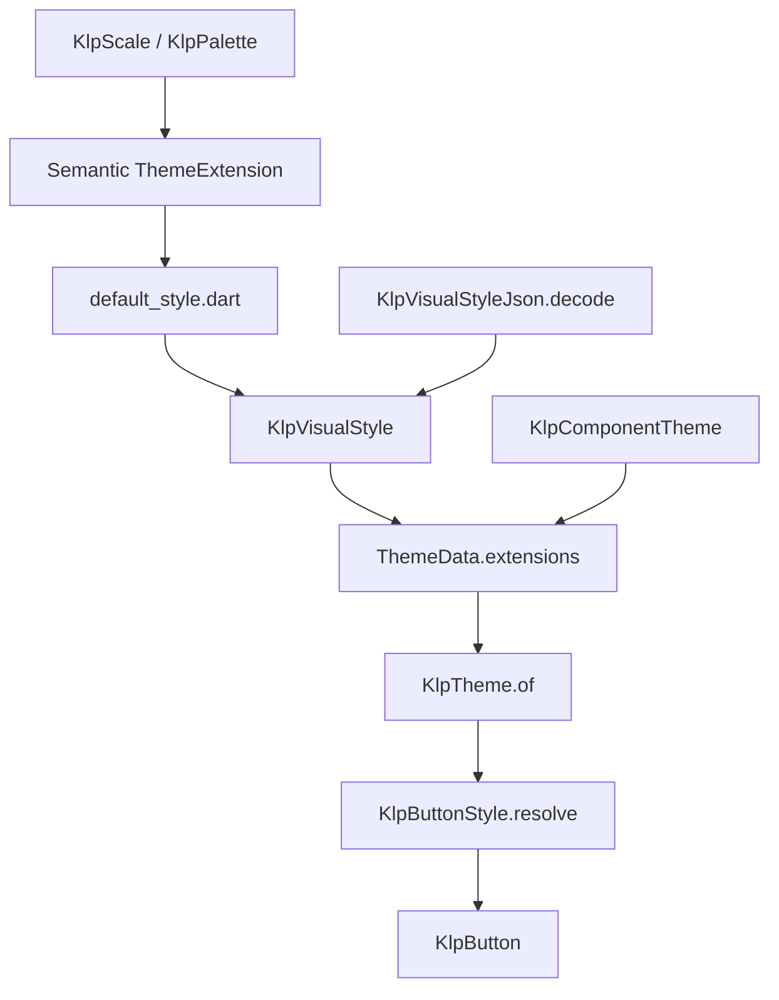
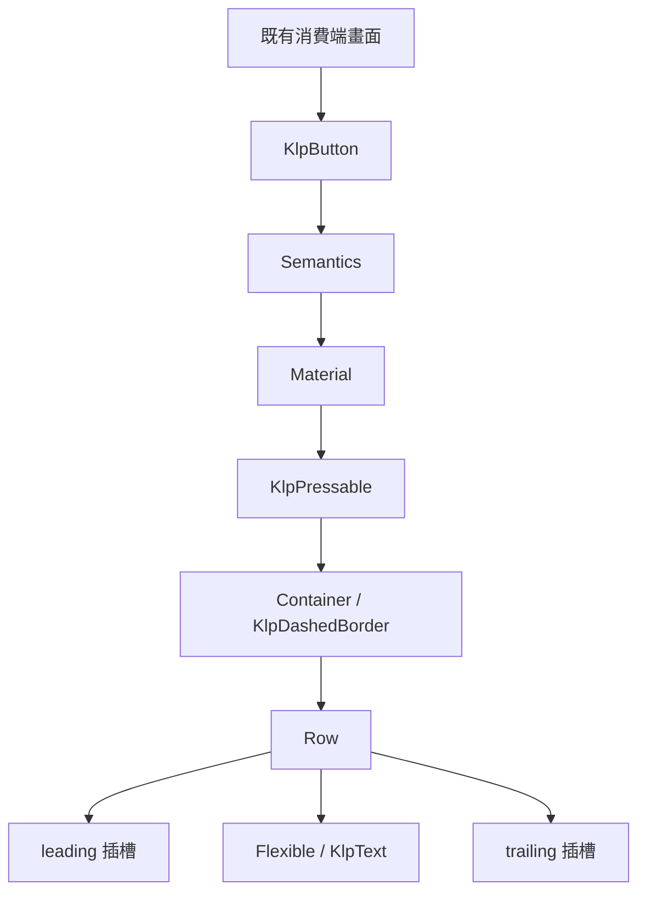

# Token 與元件風格解析

本文件供 Kallopis 維護者查找風格值、增加元件風格表與追蹤消費端注入。
2026-09-07 使用者核准架構優化：建立 primitive／semantic 入口、獨立預設風格，
先以按鈕集中各位置與互動狀態的風格解析。此批保留現有數值與行為。

## 模組責任

| 模組 | 唯一責任 |
|---|---|
| [`primitive_token.dart`](../../lib/src/tokens/primitive_token.dart) | `KlpScale` 基礎階梯：stroke、spacing、radius、排版、時長與透明度；同檔直接定義 `KlpPalette` 色彩與 accent 私有色值；`tokens/internal/klp_accent.dart` 以 part 提供 `KlpAccent`。裝飾用 `KlpDecorativePalette` 留在 foundation。 |
| [`kallopis_theme.dart`](../../lib/kallopis_theme.dart) | 公開列出色彩、間距、形狀、排版與 geometry 語意模型；不透過 `src/tokens` 轉接桶。 |
| [`default_style.dart`](../../lib/src/styles/default_style.dart) | 唯一預設風格組裝表，以 part 共用風格模型函式庫；不是可獨立 import 的函式庫。 |
| [`KlpVisualStyle`](../../lib/src/theme/klp_visual_style.dart) | 完整風格模型、copyWith 與 ThemeExtension 清單；`defaultStyle` 和 `modern` 保留相容入口。 |
| [`KlpSpacingTheme`](../../lib/src/theme/klp_spacing_theme.dart) | 依 content、control、action、chrome、navigation、overlay 與 App 組合 scope 暴露獨立語意；8px 與 4px 只是在預設風格共同指向相同 primitive，不共用萬用欄位。 |
| [`KlpComponentTheme`](../../lib/src/theme/klp_component_theme.dart) | 消費端可選的稀疏元件覆寫，null 沿用語意預設。 |
| [`KlpTheme`](../../lib/src/theme/klp_theme_scope.dart) | 從目前 Theme scope 讀取並解析 component override。 |
| [`KlpButtonStyle`](../../lib/src/controls/internal/klp_button_style.dart) | 按鈕各位置的最終風格表；每次建構依當前 KlpTheme、tone、size 與狀態重新解析。 |
| [`KlpButton`](../../lib/src/controls/button/klp_button.dart) | 組合內容插槽，持有 hover／focus，轉交按壓與長按事件。 |

`KlpPalette` 的資料視覺化原色以 `sand500`、`warmNeutral100`、`green600` 等色族與色階命名。`series`、`axis`、`grid`、`marketUp` 及 `light`／`dark`／`ultraDark` 都由 `KlpDataVisualizationTheme` 組合，避免 primitive 宣告使用情境。

新消費端使用 `package:kallopis/kallopis_theme.dart` 取得風格契約；`kallopis.dart` 保留相容總入口。風格表屬內部實作，不新增另一組產品設定 API。
`KlpButtonTone` 移至 types 檔，原按鈕函式庫仍 re-export，避免 widget 與風格表互相 import。

## 風格繼承



元件不得直接讀 primitive 或 defaultStyle。`context.klp` 仍是取值起點，
包含祖先 `KlpTokenOverride` 的局部色彩；風格表不保存全域快取。
JSON 仍由 `KlpVisualStyleJson` 匯入／匯出，不另外手工維護一份預設 JSON。

## 按鈕位置與來源

| 位置 | 解析來源／既有行為 |
|---|---|
| 外框高度 | XS／SM／MD／LG／XL 對應 `KlpTheme.buttonHeight*`；MD 支援既有 component height override。 |
| 水平內距 | XS controlInset、SM controlPaddingXSmall、MD buttonInsets.left、LG controlPaddingXLarge、XL controlPaddingXXLarge。 |
| 垂直內距 | 保留原本僅使用水平內距的行為；不把 buttonPaddingY 意外帶入按鈕。 |
| 圓角與邊框 | buttonRadius／buttonBorderWidth resolver；邊框色取 color.border。 |
| 背景與前景 | 依 tone 解析；停用優先，selected wash 優先於 hover／focus，primary 前景依混色後背景決定。 |
| 標籤 | 尺寸決定文字角色，primary 的 caption／body 提升為 strong。 |
| 圖文間距 | space.controlContentGap。 |
| 長按進度 | primary 使用 onPrimary，其餘使用 interactionSoft；opacity 取 surface.pressProgressOpacity。 |
| 虛線 | dashed tone 保留 KlpDashedBorder 的既有繪製責任。 |

解析順序如下；component 覆寫與 semantic fallback 的判斷仍唯一存在於 KlpTheme resolver。

```text
KlpButton.build(context)
	讀取 context.klp
	解析 KlpButtonStyle（tone、size、disabled、active、selected）
	以 style.height／insets／border／background／foreground 等欄位組合畫面
```

## 元件與畫面構成



此批沒有新 screen、布局或產品體驗。事件與 widget 組合沿用既有按鈕契約，
風格表僅接收狀態，不取得產品狀態所有權。

## 除錯與後續元件遷移

1. 先看元件風格表對應位置的欄位，確認 tone、size 與互動狀態。
2. 沿該欄位追到 KlpTheme resolver，檢查 component override 與 semantic fallback。
3. 檢查目前 scope 的主題與局部色彩覆寫，最後才查 primitive 階梯。
4. 為其他元件增加風格表時，只移動原有映射；不要新增另一份預設或順手改數值。

Catalog 風格追蹤會沿明確 import 的 `Klp*Style.resolve` 依賴讀取 token 來源，
避免抽離風格後型錄遺失資料。公開入口檢查支援 transitive export，part 必須由可達的
函式庫正確宣告；不可用直接 export part 取代所有權驗證。

## 驗證與界線

- 資料測試涵蓋 JSON 注入到按鈕位置、預設風格未被修改、再次解析取得新主題、停用狀態與非法輸入。
- 原有按鈕與主題回歸測試用於檢查重構，不建立或更新全畫面 golden。
- Windows Catalog 編譯與實際啟動用於交付驗證；結果與截圖另記驗證報告。
- 其他元件尚未搬到個別風格表。KlpApp 既有明暗色彩政策及產品資料層不在此批修改範圍。

此環境 2026-09-07 實測 SDK 為 `D:/flutter/bin/flutter.bat`；既有文件中的
`C:/development/flutter/bin/flutter.bat` 在本次環境不存在。
