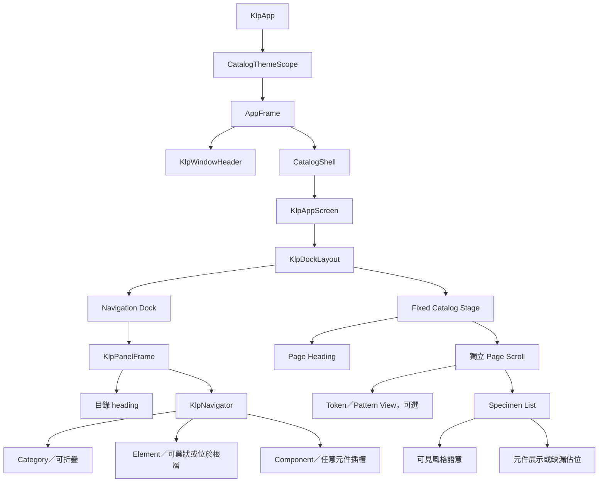
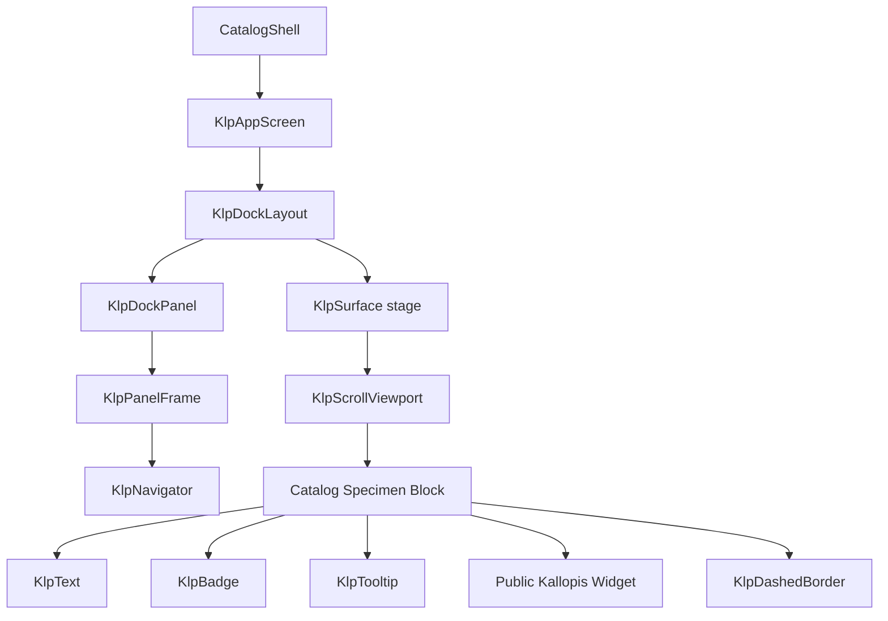
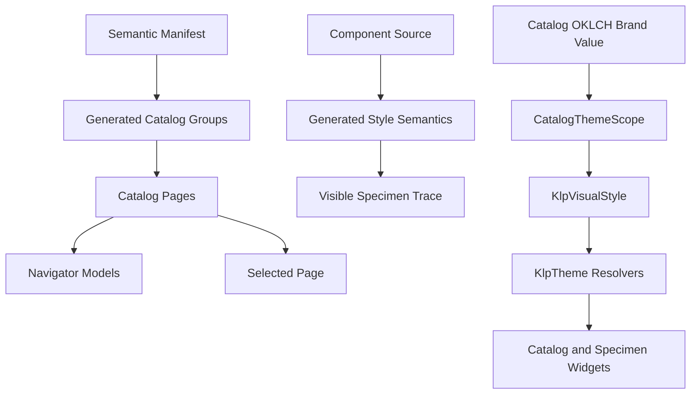

# Catalog 畫面組成

Kallopis Catalog 是用來瀏覽與人工檢查預設風格語意的單一畫面。它不是產品編輯器，
也不包含永久 Inspector。畫面由 App chrome、Dock shell、Navigator 與固定 Stage
四層組成。

本文件是公開組裝指南；設計狀態與驗收權威仍以
`kallopis-design-contract/references/design-knowledge/screen-composition.md` 為準。

## 畫面構成架構



### App chrome

- `AppFrame` 在 app background 上套用一層 `appFrameInset`，預設 4px，並同時
  包住 Header 與 Catalog 主內容。
- `KlpWindowHeader` 自身再套用 `windowHeaderMargin`。完整 Header 表面可拖動原生視窗，
  內部按鈕與選單仍保留點擊事件。
- `KlpPanelFrame` 解析 `dockMargin`。相鄰兩層各提供 4px，形成 8px gutter。

### Navigation Dock

Catalog 只有一個 `catalog-navigation` panel。它預設出現在左側，可以移到右側，
但不能移到底部：

```dart
KlpDockPanel(
	id: 'catalog-navigation',
	header: const KlpText('目錄', role: KlpTextRole.code),
	content: navigation,
	contentScrollController: navigationScrollController,
	allowSide: true,
	allowBottom: false,
)
```

導覽內容使用 `KlpNavigator` 的三種公開注入模型：

- `KlpNavigatorCategory`：可展開、收合的分類。
- `KlpNavigatorElement`：可選取、可遞迴巢狀，也可不依賴分類直接放在根層。
- `KlpNavigatorComponent`：搜尋框、虛線分隔線、按鈕列表等任意元件插槽。

Category 與 Element 的列高由 Kallopis 統一管理；Component 的高度與 padding 由被注入
元件自行決定。Catalog 的分類依序為 Primitives、Foundation semantics、Component
recipes 與 Patterns。

`KlpPanelFrame` 與 Navigator 共用同一個 `ScrollController`。Scrollbar 位於 panel
尾側的 8px content-padding 槽內，不侵入 padding 後的內容區，也不另外建立第二條
捲動軌道。

### Catalog Stage

Stage 固定占據 Dock 剩餘空間，使用 `KlpSurface` 的 stage tone。它分為：

1. Page Heading：顯示頁面名稱、說明與展示數量。
2. Page Scroll：獨立於目錄捲動，容納 token view 與 specimen blocks。

每個一般 specimen block 依序包含：

- 公開元件型別名稱。
- 「風格語意」標記；tooltip 只提供補充，不是唯一入口。
- specimen 說明與直接可見的語意追蹤資料。
- 元件展示；尚未提供展示時使用虛線缺漏佔位。

語意追蹤至少涵蓋來源、顏色、surface、邊框／shape、padding／spacing、字體、geometry、
motion 與 component resolver。Token／Pattern 專頁可使用自訂 `tokenView`，但仍應提供
等價的可見語意說明，不能繞過 Catalog 的可追溯要求。

## 元件繼承架構



Catalog shell 只組裝公開 Kallopis 元件、目錄資料與選取事件；Dock、panel、scrollbar、
Navigator 列狀態與 specimen 元件的視覺呈現仍由 Kallopis 擁有。

## 風格與邏輯語意繼承



頁面資料與元件展示的注入條件如下：

```text
composeCatalog(manifest, componentSources, selectedPageId):
	groups = generateCatalogGroups(manifest)
	pages = flatten(groups)
	styleSemantics = generateStyleSemantics(componentSources)
	navigation = map groups to Category and pages to Element
	stage = resolve selectedPageId from pages
	for each specimen in stage:
		attach matching styleSemantics
		render visible trace
		render demo or dashed missing-demo placeholder
	return navigation + fixed stage
```

品牌預覽的解析條件如下：

```text
resolveCatalogTheme(oklchBrand):
	brand = convert OKLCH input to an opaque display color
	primary = resolve from brand
	preserve accent, interaction and status semantics
	rebuild CatalogThemeScope
	do not enter a user-created Design System scope
```

Catalog 中編輯 OKLCH brand 會即時更新整個 Catalog 的 primary 呈現。Accent、一般操作色
與狀態色維持獨立；這個預覽 scope 也不得影響使用者建立的 Design System。

## 所有權界線

| 項目 | 所有者 |
|---|---|
| App padding、Header margin、Dock margin | Kallopis layout semantics |
| Panel surface、停靠、調整尺寸與 scrollbar 軌道 | `KlpDockLayout`／`KlpPanelFrame` |
| 分類、頁面、選取狀態與 specimen 資料 | Catalog |
| Category／Element 視覺、縮排、hover、selected、fold | `KlpNavigator` |
| Stage surface、文字、badge、tooltip 與缺漏佔位呈現 | Kallopis components |
| 元件風格分類與追蹤內容 | Semantic manifest／generated style semantics |
| 可編輯品牌值 | `CatalogThemeScope` |

產品不得以 `Row`、`Stack` 或局部 scrollbar 重寫這些 Dock 行為，也不得在 Catalog shell
重做元件內部的 hover、selected、surface 或 typography 決策。

## 捲動與響應規則

- 目錄 panel 與 Stage 各自擁有獨立的垂直捲動位置。
- 目錄 panel 初始寬度在 compact viewport 為 200px，一般 viewport 為 260px。
- Side area 可在 180–360px 範圍內調整。
- Right area 是同一個目錄 panel 的合法停靠位置，不代表永久 Inspector。
- Bottom area 對 Catalog 目錄保持停用。

相關文件：

- [Sidebar＋Stage 畫面組合](sidebar-stage-layout.md)
- [KlpNavigator 組裝指南](navigator-composition.md)
- [KlpDockLayout 元件架構](../architecture/components/layout/klp_dock_layout.md)
