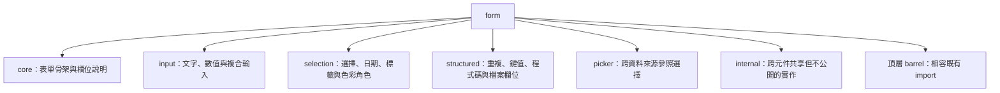
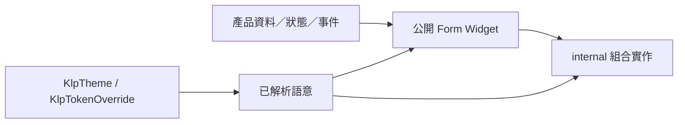

# Form 原始碼組織

`lib/src/form/` 採「一個公開 Widget 一份檔案」；同類元件放在同一個子資料夾。
此規則只調整原始碼所有權，不改變元件的視覺、互動、狀態或公開名稱。

## 目錄責任



- `core/`：`KlpForm`、`KlpField`、section、label、description、error 與 actions。
- `input/`：使用者直接輸入文字或數值的控制項與輸入框組合。
- `selection/`：從候選集合、日期、標籤或語意角色中選值的控制項。
- `structured/`：編輯集合、鍵值、程式碼、檔案與審核步驟的複合欄位。
- `picker/`：需要搜尋、瀏覽與引用外部項目的選擇器。
- `internal/`：可跨上述子領域共用，但不得由 `kallopis.dart` 匯出的技術實作。

## 公開入口

```dart
package:kallopis/kallopis_foundation.dart
	-> lib/src/form/klp_*.dart
		-> lib/src/form/<類型>/klp_<component>.dart
```

頂層既有檔案保留為 compatibility barrel。消費端應優先匯入
`package:kallopis/kallopis_foundation.dart`；既有的相容總入口可繼續運作，但不應依賴
`internal/`。新增公開 Form Widget 時，必須建立獨立檔案、加入對應 barrel，並由
`lib/kallopis_foundation.dart` 的 Form barrel 鏈路對外公開。

## 繼承與注入不變量



```dart
產品注入資料、狀態與事件
	-> 公開元件負責無產品語意的表單呈現
		-> internal 只共用技術實作，不建立第二套公開 API

KlpTheme / KlpTokenOverride
	-> 已解析語意值
		-> 公開元件與 internal 實作共同讀取
```

原始碼拆分不得新增平行 token、硬編碼風格或改變語意解析路徑。`internal/` 也必須
遵循相同 token discipline，且不列入公開元件清冊、Catalog 風格語意索引或元件樹文件。
