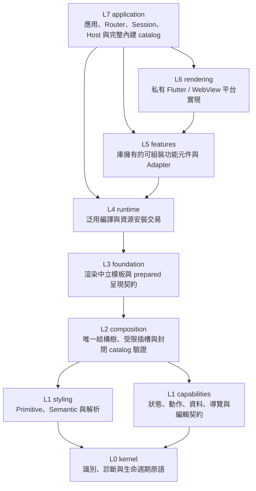

# lib/src 架構總覽與責任分層

> 現行 module 清單、依賴層級與 protected contract 以 [`architecture.md`](architecture.md) 為準。本頁是導覽摘要；若內容不一致，先修正本頁，不得用摘要覆蓋 module contract。

本目錄為 Kallopis 的核心內部實作（內部 private 實作，外部透過 `kallopis_declarative.dart` 等公開入口存取）。本專案依據 [KLP-0019](../../spec/decisions/KLP-0019-declarative-framework-migration.md) 進行全新宣告式架構重構，落實「唯一結構樹、受限插槽、固定 primitive schema 整套替換、無 Widget 洩漏」的架構契約。

## 架構分層與資料流

目標依賴只可指向較低層；Application 是最終組合根，Rendering 是私有平台實現：

現況仍有六組反向依賴，均已在 [`architecture.md`](architecture.md) 登錄移轉切片；上圖只表示目標邊界，不替現況債務背書。

## 子目錄職責清單

| 子目錄 | 核心職責 | 代表性型別與機制 |
|---|---|---|
| [`kernel/`](kernel/README.md) | 純 Dart 跨層底層基底：契約錯誤診斷、結構化放置標識與操作租約生命週期 | `KlpContractError`, `KlpPlacementId`, `KlpFrameLease`, `KlpLifecycleException` |
| [`composition/`](composition/README.md) | 純 Dart 結構樹契約：節點介面、唯一插槽約束、庫內封閉 catalog 與單次快照擷取驗證 | `KlpNode`, `KlpSlot`, `KlpChildren`, `KlpTreeCapture`；definition/registry 僅供庫內使用 |
| [`styling/`](styling/README.md) | 宣告式樣式契約：固定 8 槽原料、強型別參照、語意用途定義與庫內解析求值 | `KlpPrimitives`, `KlpSemanticUsage`, `KlpStylingResolver`, `KlpPalette` |
| [`foundation/`](foundation/README.md) | 受控基礎原語與呈現資料綁定：封閉模板系統、呈現結構資料封裝與底層視覺基底 | `KlpTextTemplate`, `KlpLinearTemplate`, `KlpSurfaceTemplate`, `KlpBoundPlacement`, `KlpIcon` |
| [`capabilities/`](capabilities/README.md) | 中立領域能力：狀態擁有與借用、非同步生命週期、路由狀態機與筆記編輯資料契約 | `KlpState`, `KlpMutableState`, `KlpAsyncData`, `KlpNavigationMachine`, `KlpCompositionText` |
| [`features/`](features/README.md) | 面向高階場景的功能元件與適配層：將高階功能降維轉譯為 Foundation 模板與資源 | `KlpRail`, `KlpRailItem`, `KlpRailAdapter`, `KlpPreparedRail` |
| [`runtime/`](runtime/README.md) | 執行期核心：整樹編譯準備、放置資源跨幀重用與交易式呈現快照提交 | `KlpTreeRuntime`, `KlpInstallation`, `KlpPlacementResource`, `KlpRuntimeFrame` |
| [`rendering/`](rendering/README.md) | 平台渲染原語：將不可變的 Bound 模板映射為真實 Flutter Widget、焦點與無障礙語意 | `KlpFlutterRenderer`, `KlpFlutterChoice`, `KlpFlutterRegions`, `KlpFlutterRetainedStack` |
| [`application/`](application/README.md) | 宣告式應用根宿主：runKlpApp、型別化路由、保留頁面協同與全域環境接線 | `KlpApplication`, `KlpRouter`, `runKlpApp`, `KlpApplicationSession` |
