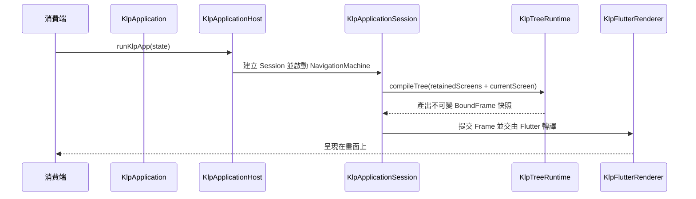

# lib/src/application：應用進入點、路由與宿主環境

[返回上層 (lib/src)](../README.md)

## 目錄職責

`lib/src/application` 是整個 Kallopis 宣告式應用的頂層進入點與宿主組合根（Application Composition Root）。它定義了整份應用程式的根資料結構 `KlpApplication`、型別化路由 `KlpRouter`、平台宿主 Adapter，並管理唯一的 `KlpApplicationSession`，負責驅動整棵樹的編譯、多畫面保留堆疊與全域生命週期。

## 子目錄結構與職責

| 子目錄 | 核心職責 | 關鍵型別與實作 |
|---|---|---|
| `structure/` | **應用結構宣告**：定義應用根宣告 `KlpApplication`（包含 App 標題、Primitive 風格集合、必填 Router 與全域元件註冊）以及畫面宣告 `KlpScreen`（具備 `KlpScreenBody` 插槽約束）。 | `KlpApplication`, `KlpScreen` |
| `routing/` | **宣告式型別化路由**：提供型別化路由宣告 `KlpRouter`、`KlpRoute<P, R>` 與畫面輸入參數 `KlpRouteInput<P, R>`，以純宣告資料驅動頁面切換。 | `KlpRouter`, `KlpRoute`, `KlpRouteInput` |
| `bootstrap/` | **宿主啟動與執行期 Session**：提供公開啟動函式 `runKlpApp(KlpState<KlpApplication>)`，內部組合 Flutter 宿主 (`internal/klp_application_host.dart`) 與應用管理會話 (`internal/klp_application_session.dart`)。 | `runKlpApp`, `KlpApplicationSession` |
| `environment/` | **環境策略管理**：封裝視窗尺寸、深淺色偏好、動態效果偏好（Reduced Motion）等系統環境策略。 | 環境政策與設定模型 |
| `localization/` | **在地化與語系策略**：語系切換、文字方向（RTL/LTR）與字串資源對齊接線。 | 語系設定接點 |
| `legacy/` | **舊版 KlpApp 組合根**：相容舊式基於 Widget/Theme 的啟動進入點（過渡保留）。 | 舊版相容 App 根 |

## 架構依賴與運作流程

## 架構依賴與邊界約定

- **消費端無 Widget 暴露**：外部開發者使用 `runKlpApp(KlpState<KlpApplication>)` 啟動應用，只需更新狀態宣告，不直接編寫或回傳 Flutter Widget。
- **單一 Session 統籌**：全應用只維持一個 Session 與導覽狀態機，所有保留畫面（Retained Screens）合併於同一棵 Scoped 樹中編譯與安裝，避免多個獨立 Runtime 分裂提交。
- **世代隔離**：宿主使用來源世代（Source Generation）排斥過期或延遲發出的更新通知，保證導覽切換與非同步更新的嚴格順序性。
