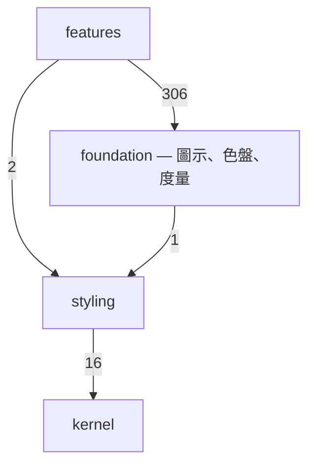
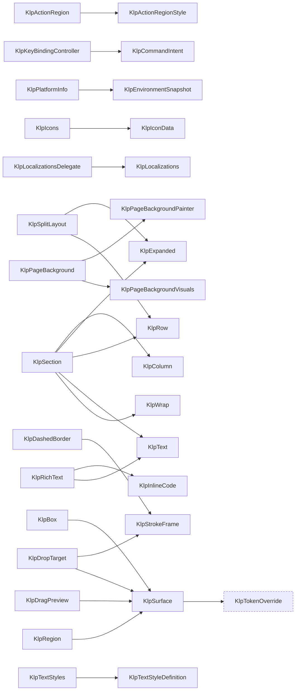

# 元件清單與組合關係

> 本檔由 `dart run tool/inventory.dart` 從實際程式碼產生，不是手寫的。
> 元件樹是**真的**組合關係——解析每個型別實作區段內出現的其他 `Klp*` 建構
> 呼叫，因此它不會與程式碼分岔；手寫的架構圖會，而且分岔時沒有任何徵兆。

## 總覽

- 公開型別 **409** 個，其中 widget **160** 個
- 分為 **20** 個領域

### 領域之間的依賴方向

箭頭是「用到」，數字是引用次數。這張圖唯一該有的形狀是**單向**——
`controls` 可以用 `surface`，`surface` 不可以用 `controls`。
出現回頭的箭頭就代表分層破了。

### 分層違規

無。每一條組合關係都是由上層指向下層。

## 各領域的元件樹

### foundation — 圖示、色盤、度量

型別 111 個，widget 56 個。

| 型別 | 行數 | 組成 |
|---|---|---|
| `KlpActionRegion` | 80 | `KlpActionRegionStyle` |
| `KlpActionRegionShape` | 1 | （葉節點） |
| `KlpActionRegionStyle` | 5 | （葉節點） |
| `KlpActionRegionTone` | 1 | （葉節點） |
| `KlpAdaptive` | 39 | （葉節點） |
| `KlpAdaptiveMode` | 20 | （葉節點） |
| `KlpAlign` | 21 | （葉節點） |
| `KlpAppPlatform` | 1 | （葉節點） |
| `KlpBox` | 123 | `KlpSurface` |
| `KlpBoxConstraints` | 13 | （葉節點） |
| `KlpBoxInsets` | 22 | （葉節點） |
| `KlpCenter` | 21 | （葉節點） |
| `KlpColumn` | 37 | （葉節點） |
| `KlpCommandIntent` | 5 | （葉節點） |
| `KlpConstrainedBox` | 23 | （葉節點） |
| `KlpControlSize` | 1 | （葉節點） |
| `KlpDashedBorder` | 51 | `KlpStrokeFrame` |
| `KlpDashedDivider` | 111 | （葉節點） |
| `KlpDecorativePalette` | 18 | （葉節點） |
| `KlpDeviceClass` | 1 | （葉節點） |
| `KlpDirectionalPosition` | 39 | （葉節點） |
| `KlpDirectionalPositioned` | 23 | （葉節點） |
| `KlpDisplayMode` | 1 | （葉節點） |
| `KlpDivider` | 14 | （葉節點） |
| `KlpDragPreview` | 18 | `KlpSurface` |
| `KlpDropIndicator` | 19 | （葉節點） |
| `KlpDropTarget` | 19 | `KlpStrokeFrame`、`KlpSurface` |
| `KlpEnvironmentScope` | 28 | （葉節點） |
| `KlpEnvironmentSnapshot` | 102 | （葉節點） |
| `KlpExcludeSemantics` | 8 | （葉節點） |
| `KlpExpanded` | 11 | （葉節點） |
| `KlpFilePicker` | 15 | （葉節點） |
| `KlpFilterOption` | 13 | （葉節點） |
| `KlpFit` | 22 | （葉節點） |
| `KlpFitMode` | 1 | （葉節點） |
| `KlpFlexible` | 17 | （葉節點） |
| `KlpFocusRegion` | 24 | （葉節點） |
| `KlpFontRole` | 1 | （葉節點） |
| `KlpGap` | 179 | （葉節點） |
| `KlpGeometricSpinner` | 24 | （葉節點） |
| `KlpGestureRegion` | 39 | （葉節點） |
| `KlpHighlightState` | 19 | （葉節點） |
| `KlpIcon` | 53 | （葉節點） |
| `KlpIconData` | 18 | （葉節點） |
| `KlpIconFonts` | 5 | （葉節點） |
| `KlpIconWeight` | 1 | （葉節點） |
| `KlpIcons` | 123 | `KlpIconData` |
| `KlpIdScope` | 35 | （葉節點） |
| `KlpInlineCode` | 54 | （葉節點） |
| `KlpInteractionSettings` | 27 | （葉節點） |
| `KlpKeyBinding` | 17 | （葉節點） |
| `KlpKeyBindingController` | 89 | `KlpCommandIntent` |
| `KlpKeyBindingHost` | 19 | （葉節點） |
| `KlpKeyBindingRegion` | 34 | （葉節點） |
| `KlpKeyBindingScope` | 3 | （葉節點） |
| `KlpLayoutBuilder` | 10 | （葉節點） |
| `KlpLocalizations` | 473 | （葉節點） |
| `KlpLocalizationsDelegate` | 14 | `KlpLocalizations` |
| `KlpMasonryGrid` | 56 | （葉節點） |
| `KlpOklchColor` | 144 | （葉節點） |
| `KlpOrientation` | 1 | （葉節點） |
| `KlpOverlayHost` | 16 | （葉節點） |
| `KlpPageBackground` | 52 | `KlpPageBackgroundPainter`、`KlpPageBackgroundVisuals` |
| `KlpPageBackgroundEditor` | 184 | （葉節點） |
| `KlpPageBackgroundPainter` | 52 | （葉節點） |
| `KlpPageBackgroundStyle` | 3 | （葉節點） |
| `KlpPageBackgroundVisuals` | 31 | （葉節點） |
| `KlpPlatformInfo` | 72 | `KlpEnvironmentSnapshot` |
| `KlpPointerBlocker` | 15 | （葉節點） |
| `KlpPositioned` | 46 | （葉節點） |
| `KlpPressable` | 191 | （葉節點） |
| `KlpQuarterTurn` | 1 | （葉節點） |
| `KlpRegion` | 38 | `KlpSurface` |
| `KlpResizablePane` | 11 | （葉節點） |
| `KlpResizeHandle` | 86 | （葉節點） |
| `KlpRichText` | 135 | `KlpInlineCode`、`KlpText` |
| `KlpRichTextKind` | 10 | （葉節點） |
| `KlpRichTextNode` | 19 | （葉節點） |
| `KlpRichTextSpan` | 7 | （葉節點） |
| `KlpRotate` | 18 | （葉節點） |
| `KlpRovingIndex` | 41 | （葉節點） |
| `KlpRow` | 40 | （葉節點） |
| `KlpScrollViewport` | 21 | （葉節點） |
| `KlpSection` | 46 | `KlpColumn`、`KlpExpanded`、`KlpRow`、`KlpText`、`KlpWrap` |
| `KlpSegmentedProgress` | 34 | （葉節點） |
| `KlpSelectionAction` | 13 | （葉節點） |
| `KlpSemanticRegion` | 33 | （葉節點） |
| `KlpSpaceSize` | 70 | （葉節點） |
| `KlpSpacer` | 10 | （葉節點） |
| `KlpSplitLayout` | 45 | `KlpExpanded`、`KlpRow` |
| `KlpSplitPaneSize` | 7 | （葉節點） |
| `KlpStack` | 24 | （葉節點） |
| `KlpStateHighlight` | 43 | （葉節點） |
| `KlpStrokeFrame` | 139 | （葉節點） |
| `KlpStrokeRole` | 2 | （葉節點） |
| `KlpStrokeState` | 2 | （葉節點） |
| `KlpSurface` | 101 | `KlpTokenOverride` |
| `KlpSurfaceTone` | 13 | （葉節點） |
| `KlpText` | 141 | （葉節點） |
| `KlpTextColorTier` | 1 | （葉節點） |
| `KlpTextRole` | 24 | （葉節點） |
| `KlpTextStyleDefinition` | 35 | （葉節點） |
| `KlpTextStyles` | 215 | `KlpTextStyleDefinition` |
| `KlpTextTone` | 1 | （葉節點） |
| `KlpTextTracking` | 1 | （葉節點） |
| `KlpTranslate` | 18 | （葉節點） |
| `KlpTranslation` | 6 | （葉節點） |
| `KlpVeil` | 19 | （葉節點） |
| `KlpVirtualGrid` | 43 | （葉節點） |
| `KlpVirtualList` | 24 | （葉節點） |
| `KlpWrap` | 49 | （葉節點） |

虛線框是其他領域的型別。

## 葉節點

不組合任何其他 Kallopis 型別的 widget。它們是這套視覺語言的**詞根**——
每一個都直接對應一個不可再分的視覺概念。

`KlpAdaptive`、`KlpAlign`、`KlpCenter`、`KlpColorRoleField`、`KlpColumn`、`KlpConditionalFieldRegion`、`KlpConstrainedBox`、`KlpContextMenu`、`KlpDashedDivider`、`KlpDateField`、`KlpDirectionalPositioned`、`KlpDivider`、`KlpDropIndicator`、`KlpErrorState`、`KlpExcludeSemantics`、`KlpExpanded`、`KlpFileExplorerSection`、`KlpFit`、`KlpFlexible`、`KlpFocusBoundary`、`KlpFocusRegion`、`KlpGap`、`KlpGeometricSpinner`、`KlpGestureRegion`、`KlpIcon`、`KlpInlineCode`、`KlpKeyBindingHost`、`KlpKeyBindingRegion`、`KlpLayoutBuilder`、`KlpLiveRegion`、`KlpMasonryGrid`、`KlpMenu`、`KlpModalFrame`、`KlpNumberField`、`KlpOverlayHost`、`KlpPageBackgroundEditor`、`KlpPageBackgroundPainter`、`KlpPanelFooter`、`KlpPanelFrame`、`KlpPermissionState`、`KlpPointerBlocker`、`KlpPositioned`、`KlpPressable`、`KlpResizablePane`、`KlpResizeHandle`、`KlpRotate`、`KlpRow`、`KlpScrollViewport`、`KlpSegmentedProgress`、`KlpSemanticRegion`、`KlpSettingsSearchField`、`KlpSidebarNavigationButton`、`KlpSidebarNavigationGroup`、`KlpSpacer`、`KlpStack`、`KlpStateHighlight`、`KlpStepper`、`KlpStrokeFrame`、`KlpText`、`KlpTextArea`、`KlpTokenOverride`、`KlpTooltip`、`KlpTranslate`、`KlpVeil`、`KlpVirtualGrid`、`KlpVirtualList`、`KlpWrap`

## 被最多型別使用的

改動這些的影響面最大。

| 型別 | 被幾個型別使用 |
|---|---|
| `KlpText` | 50 |
| `KlpColumn` | 36 |
| `KlpRow` | 36 |
| `KlpBox` | 35 |
| `KlpExpanded` | 31 |
| `KlpSurface` | 25 |
| `KlpContractError` | 16 |
| `KlpWrap` | 12 |
| `KlpGestureRegion` | 11 |
| `KlpCenter` | 9 |
| `KlpFlexible` | 7 |
| `KlpIcon` | 7 |
| `KlpStack` | 7 |
| `KlpLayoutBuilder` | 6 |
| `KlpAlign` | 5 |

