# 元件清單與組合關係

> 本檔由 `dart run tool/inventory.dart` 從實際程式碼產生，不是手寫的。
> 元件樹是**真的**組合關係——解析每個型別實作區段內出現的其他 `Klp*` 建構
> 呼叫，因此它不會與程式碼分岔；手寫的架構圖會，而且分岔時沒有任何徵兆。

## 總覽

- 公開型別 **215** 個，其中 widget **125** 個
- 分為 **16** 個領域

### 領域之間的依賴方向

箭頭是「用到」，數字是引用次數。這張圖唯一該有的形狀是**單向**——
`controls` 可以用 `surface`，`surface` 不可以用 `controls`。
出現回頭的箭頭就代表分層破了。

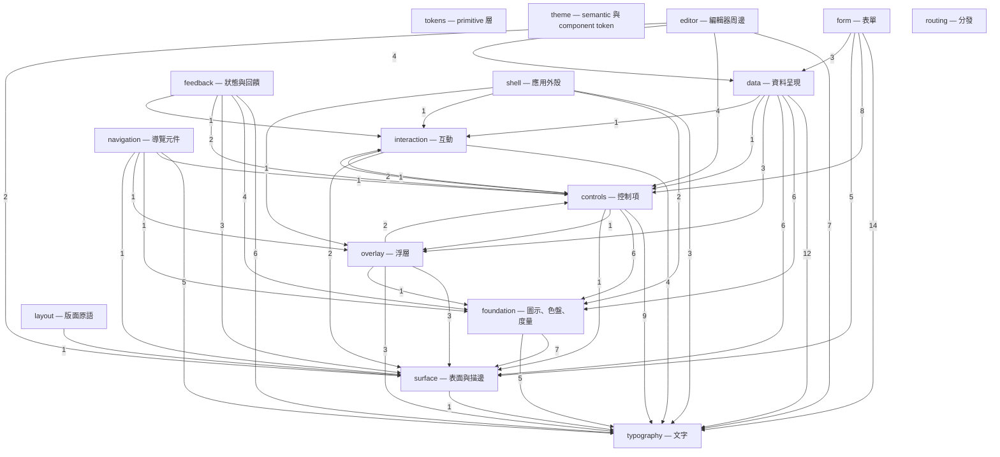

### 分層違規

以下型別用到了比自己更上層的領域。**這些不是待辦事項清單，是設計債**
——一個底層元件依賴上層，代表它被歸錯領域，或它其實不屬於這個庫。

- `foundation/KlpAvatar → typography/KlpText`
- `foundation/KlpBlock → surface/KlpSurface`
- `foundation/KlpBlockCanvas → surface/KlpSurface`
- `foundation/KlpDragPreview → surface/KlpSurface`
- `foundation/KlpDropTarget → surface/KlpStrokeFrame`
- `foundation/KlpDropTarget → surface/KlpSurface`
- `foundation/KlpPopover → surface/KlpSurface`
- `foundation/KlpRichText → typography/KlpText`
- `foundation/KlpSortControl → typography/KlpText`
- `foundation/KlpStatusIndicator → typography/KlpText`
- `foundation/KlpThemeToggle → surface/KlpSurface`
- `foundation/KlpThemeToggle → typography/KlpText`
- `interaction/KlpSelectionToolbar → controls/KlpButton`
- `overlay/KlpDialog → controls/KlpButton`
- `overlay/KlpMenuItem → controls/KlpToggleIndicator`

## 各領域的元件樹

### tokens — primitive 層

型別 1 個，widget 0 個。

| 型別 | 行數 | 組成 |
|---|---|---|
| `KlpScale` | 75 | （葉節點） |

### theme — semantic 與 component token

型別 15 個，widget 0 個。

| 型別 | 行數 | 組成 |
|---|---|---|
| `KlpComponentTheme` | 170 | （葉節點） |
| `KlpDataVisualizationTheme` | 216 | （葉節點） |
| `KlpFieldFillState` | 2 | （葉節點） |
| `KlpFieldStyle` | 241 | （葉節點） |
| `KlpMotionTheme` | 127 | （葉節點） |
| `KlpShapeTheme` | 132 | （葉節點） |
| `KlpSpacingTheme` | 241 | （葉節點） |
| `KlpSurfaceSeparation` | 10 | （葉節點） |
| `KlpSurfaceTheme` | 107 | （葉節點） |
| `KlpTheme` | 95 | `KlpVisualStyle` |
| `KlpThemeContrast` | 25 | （葉節點） |
| `KlpThemeData` | 258 | （葉節點） |
| `KlpThemeVariant` | 2 | （葉節點） |
| `KlpTypographyTheme` | 224 | （葉節點） |
| `KlpVisualStyle` | 88 | （葉節點） |

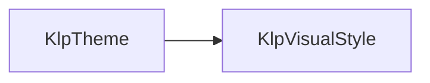

虛線框是其他領域的型別。

### foundation — 圖示、色盤、度量

型別 36 個，widget 14 個。

| 型別 | 行數 | 組成 |
|---|---|---|
| `KlpAccent` | 25 | （葉節點） |
| `KlpAvatar` | 41 | `KlpText` |
| `KlpAvatarData` | 8 | （葉節點） |
| `KlpAvatarGroup` | 28 | `KlpAvatar` |
| `KlpBlock` | 25 | `KlpSurface` |
| `KlpBlockCanvas` | 21 | `KlpSurface` |
| `KlpCodeMetrics` | 15 | （葉節點） |
| `KlpControlMetrics` | 9 | （葉節點） |
| `KlpDecorativePalette` | 18 | （葉節點） |
| `KlpDragPreview` | 18 | `KlpSurface` |
| `KlpDropIndicator` | 18 | （葉節點） |
| `KlpDropTarget` | 19 | `KlpStrokeFrame`、`KlpSurface` |
| `KlpElevation` | 7 | （葉節點） |
| `KlpFormMetrics` | 13 | （葉節點） |
| `KlpIcon` | 34 | （葉節點） |
| `KlpIcons` | 59 | （葉節點） |
| `KlpInteraction` | 4 | （葉節點） |
| `KlpLayoutGap` | 4 | （葉節點） |
| `KlpLine` | 8 | （葉節點） |
| `KlpMotion` | 5 | （葉節點） |
| `KlpPalette` | 68 | （葉節點） |
| `KlpPlaceholderMetrics` | 18 | （葉節點） |
| `KlpPopover` | 16 | `KlpSurface` |
| `KlpRadius` | 12 | （葉節點） |
| `KlpRichText` | 130 | `KlpText` |
| `KlpRichTextKind` | 12 | （葉節點） |
| `KlpRichTextNode` | 20 | （葉節點） |
| `KlpRichTextSpan` | 8 | （葉節點） |
| `KlpSegmentedProgress` | 35 | （葉節點） |
| `KlpSize` | 27 | （葉節點） |
| `KlpSortControl` | 33 | `KlpIcon`、`KlpText` |
| `KlpSpace` | 11 | （葉節點） |
| `KlpStatusIndicator` | 37 | `KlpText` |
| `KlpThemeToggle` | 30 | `KlpSurface`、`KlpText` |
| `KlpTransparency` | 4 | （葉節點） |
| `KlpTypography` | 51 | （葉節點） |

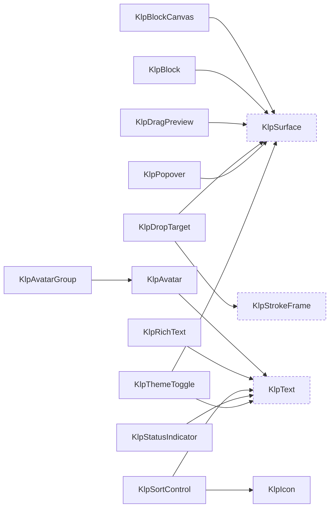

虛線框是其他領域的型別。

### typography — 文字

型別 7 個，widget 1 個。

| 型別 | 行數 | 組成 |
|---|---|---|
| `KlpFontRole` | 3 | （葉節點） |
| `KlpText` | 123 | （葉節點） |
| `KlpTextColorTier` | 4 | （葉節點） |
| `KlpTextRole` | 13 | （葉節點） |
| `KlpTextStyleDefinition` | 37 | （葉節點） |
| `KlpTextStyles` | 141 | `KlpTextStyleDefinition` |
| `KlpTextTone` | 2 | （葉節點） |

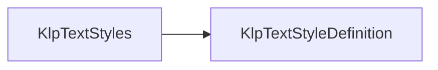

虛線框是其他領域的型別。

### surface — 表面與描邊

型別 9 個，widget 6 個。

| 型別 | 行數 | 組成 |
|---|---|---|
| `KlpDashedBorder` | 32 | `KlpStrokeFrame` |
| `KlpDashedDivider` | 75 | （葉節點） |
| `KlpDivider` | 14 | （葉節點） |
| `KlpSection` | 46 | `KlpText` |
| `KlpStrokeFrame` | 128 | （葉節點） |
| `KlpStrokeRole` | 2 | （葉節點） |
| `KlpStrokeState` | 2 | （葉節點） |
| `KlpSurface` | 43 | （葉節點） |
| `KlpSurfaceTone` | 12 | （葉節點） |

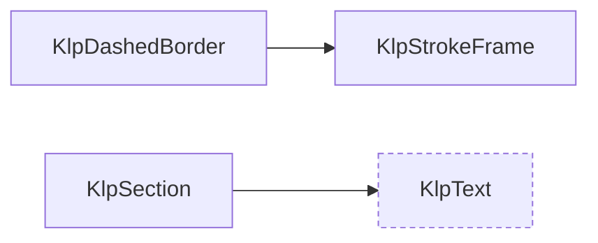

虛線框是其他領域的型別。

### interaction — 互動

型別 8 個，widget 5 個。

| 型別 | 行數 | 組成 |
|---|---|---|
| `KlpFilterBar` | 76 | `KlpText` |
| `KlpFilterOption` | 7 | （葉節點） |
| `KlpInteractionSettings` | 27 | （葉節點） |
| `KlpPresenceIndicator` | 33 | `KlpText` |
| `KlpPressable` | 136 | （葉節點） |
| `KlpSelectionAction` | 14 | （葉節點） |
| `KlpSelectionToolbar` | 49 | `KlpButton`、`KlpSurface`、`KlpText` |
| `KlpShortcutHint` | 19 | `KlpSurface`、`KlpText` |

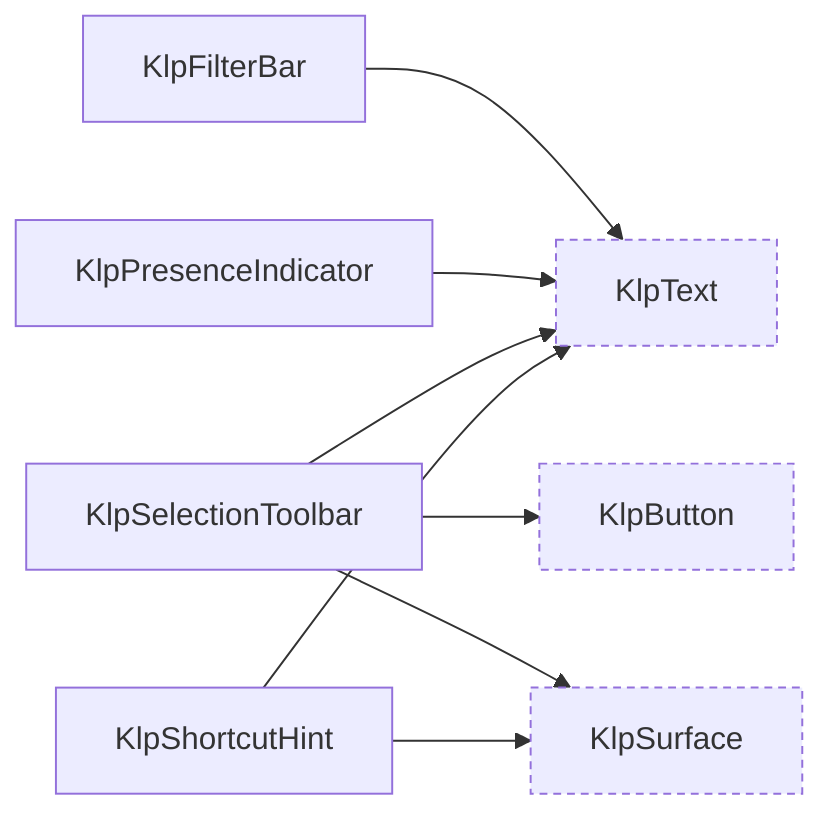

虛線框是其他領域的型別。

### layout — 版面原語

型別 8 個，widget 8 個。

| 型別 | 行數 | 組成 |
|---|---|---|
| `KlpOverlayHost` | 16 | （葉節點） |
| `KlpRegion` | 36 | `KlpSurface` |
| `KlpResizablePane` | 12 | （葉節點） |
| `KlpResizeHandle` | 22 | （葉節點） |
| `KlpScrollViewport` | 22 | （葉節點） |
| `KlpSplitLayout` | 27 | （葉節點） |
| `KlpVirtualGrid` | 37 | （葉節點） |
| `KlpVirtualList` | 25 | （葉節點） |

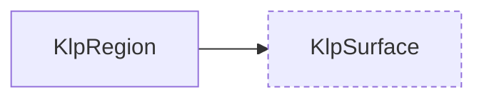

虛線框是其他領域的型別。

### overlay — 浮層

型別 8 個，widget 5 個。

| 型別 | 行數 | 組成 |
|---|---|---|
| `KlpDialog` | 74 | `KlpButton`、`KlpSurface`、`KlpText` |
| `KlpMenu` | 72 | `KlpDivider`、`KlpMenuItem`、`KlpSurface`、`KlpText` |
| `KlpMenuItem` | 102 | `KlpIcon`、`KlpText`、`KlpToggleIndicator` |
| `KlpMenuItemData` | 28 | （葉節點） |
| `KlpMenuLayout` | 74 | （葉節點） |
| `KlpMenuStyle` | 21 | （葉節點） |
| `KlpTooltip` | 12 | （葉節點） |
| `KlpTooltipSurface` | 42 | （葉節點） |

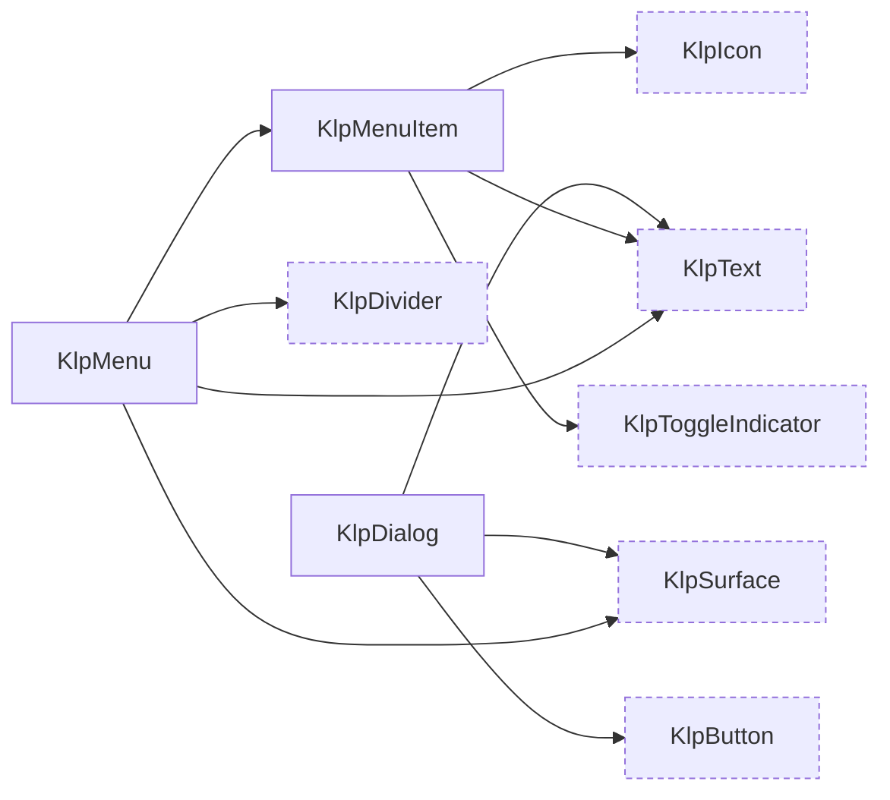

虛線框是其他領域的型別。

### controls — 控制項

型別 16 個，widget 12 個。

| 型別 | 行數 | 組成 |
|---|---|---|
| `KlpButton` | 111 | `KlpPressable`、`KlpText` |
| `KlpButtonTone` | 4 | （葉節點） |
| `KlpCheckbox` | 77 | `KlpIcon`、`KlpText` |
| `KlpCompactSwitch` | 58 | `KlpPressable` |
| `KlpIconButton` | 74 | `KlpIcon`、`KlpTooltip` |
| `KlpRadioGroup` | 97 | `KlpText` |
| `KlpSegmentedControl` | 143 | `KlpIcon`、`KlpText` |
| `KlpSelect` | 86 | `KlpIcon`、`KlpStrokeFrame`、`KlpText` |
| `KlpSelectionOption` | 7 | （葉節點） |
| `KlpSlider` | 88 | `KlpText` |
| `KlpSlidingSelection` | 96 | `KlpIcon` |
| `KlpTextField` | 105 | `KlpIcon`、`KlpText` |
| `KlpToggle` | 49 | `KlpText`、`KlpToggleIndicator` |
| `KlpToggleIndicator` | 53 | （葉節點） |
| `KlpTriState` | 2 | （葉節點） |
| `KlpTriStateToggle` | 40 | `KlpSelectionOption`、`KlpSlidingSelection`、`KlpText` |

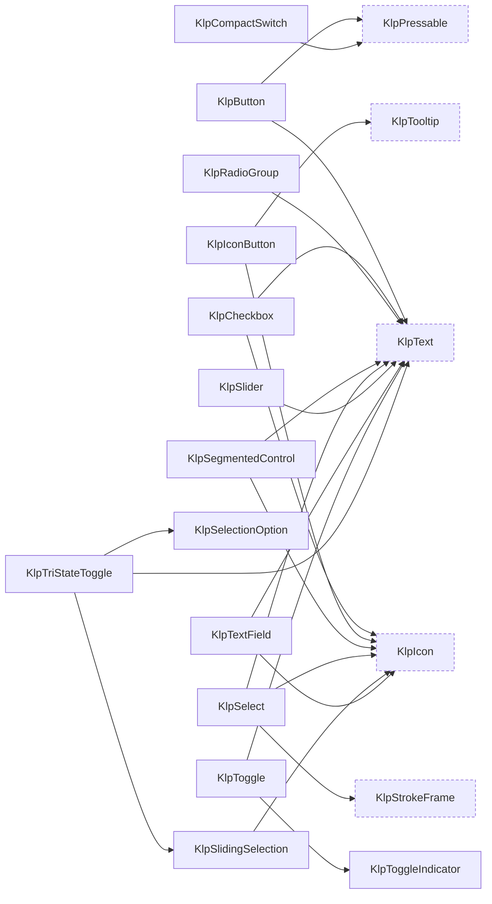

虛線框是其他領域的型別。

### data — 資料呈現

型別 26 個，widget 13 個。

| 型別 | 行數 | 組成 |
|---|---|---|
| `KlpBadge` | 54 | `KlpText` |
| `KlpCard` | 68 | `KlpText` |
| `KlpCodeLanguageOption` | 12 | （葉節點） |
| `KlpCodeLanguages` | 31 | `KlpCodeLanguageOption` |
| `KlpCodeViewer` | 502 | `KlpDashedBorder`、`KlpIcon`、`KlpMenu`、`KlpMenuItemData`、`KlpPressable`、`KlpSurface`、`KlpText`、`KlpTooltip` |
| `KlpCodeViewerLabels` | 27 | （葉節點） |
| `KlpDataAlignment` | 2 | （葉節點） |
| `KlpDataColumn` | 18 | （葉節點） |
| `KlpDataRow` | 7 | （葉節點） |
| `KlpDataSort` | 8 | （葉節點） |
| `KlpDataTable` | 195 | `KlpCheckbox`、`KlpDashedDivider`、`KlpIcon`、`KlpSurface`、`KlpText` |
| `KlpFilePreview` | 159 | `KlpDashedDivider`、`KlpText` |
| `KlpFilePreviewState` | 2 | （葉節點） |
| `KlpJsonTree` | 182 | `KlpIcon`、`KlpSurface`、`KlpText` |
| `KlpKeyValueItem` | 16 | （葉節點） |
| `KlpKeyValueList` | 71 | `KlpIcon`、`KlpText` |
| `KlpKeyValueRowData` | 7 | （葉節點） |
| `KlpKeyValueTable` | 63 | `KlpText` |
| `KlpListTile` | 115 | `KlpIcon`、`KlpText` |
| `KlpProgress` | 82 | `KlpText` |
| `KlpProgressState` | 2 | （葉節點） |
| `KlpSortDirection` | 3 | （葉節點） |
| `KlpTag` | 42 | `KlpText` |
| `KlpTree` | 40 | （葉節點） |
| `KlpTreeItem` | 126 | `KlpIcon`、`KlpText` |
| `KlpTreeNode` | 24 | （葉節點） |

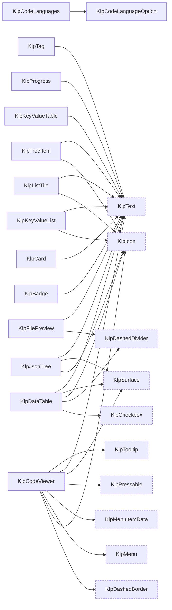

虛線框是其他領域的型別。

### form — 表單

型別 28 個，widget 22 個。

| 型別 | 行數 | 組成 |
|---|---|---|
| `KlpChoiceOption` | 12 | （葉節點） |
| `KlpCodeField` | 42 | `KlpCodeViewer`、`KlpText`、`KlpTextArea` |
| `KlpColorRoleField` | 29 | `KlpSelectField` |
| `KlpConditionalFieldRegion` | 18 | （葉節點） |
| `KlpDateField` | 30 | `KlpTextField` |
| `KlpField` | 47 | `KlpFieldDescription`、`KlpFieldError`、`KlpFieldLabel`、`KlpText` |
| `KlpFieldDescription` | 15 | `KlpText` |
| `KlpFieldError` | 18 | `KlpText` |
| `KlpFieldGroup` | 25 | `KlpField` |
| `KlpFieldLabel` | 11 | `KlpText` |
| `KlpFieldVisualState` | 13 | （葉節點） |
| `KlpFileField` | 41 | `KlpButton`、`KlpFilePreview`、`KlpText` |
| `KlpFileValue` | 8 | （葉節點） |
| `KlpForm` | 35 | （葉節點） |
| `KlpFormActions` | 48 | `KlpButton` |
| `KlpFormErrorSummary` | 47 | `KlpSurface`、`KlpText` |
| `KlpFormSection` | 48 | `KlpSurface`、`KlpText` |
| `KlpKeyValueEditor` | 60 | `KlpText`、`KlpTextField` |
| `KlpKeyValueEntry` | 20 | （葉節點） |
| `KlpMultiSelectField` | 69 | `KlpText` |
| `KlpNumberField` | 39 | `KlpTextField` |
| `KlpPasswordField` | 55 | `KlpText` |
| `KlpReferenceOption` | 16 | （葉節點） |
| `KlpReferencePicker` | 94 | `KlpBadge`、`KlpSurface`、`KlpText`、`KlpTextField` |
| `KlpRepeaterField` | 55 | `KlpButton`、`KlpSurface`、`KlpText` |
| `KlpRepeaterItem` | 7 | （葉節點） |
| `KlpSelectField` | 96 | `KlpStrokeFrame`、`KlpText` |
| `KlpTextArea` | 32 | `KlpTextField` |

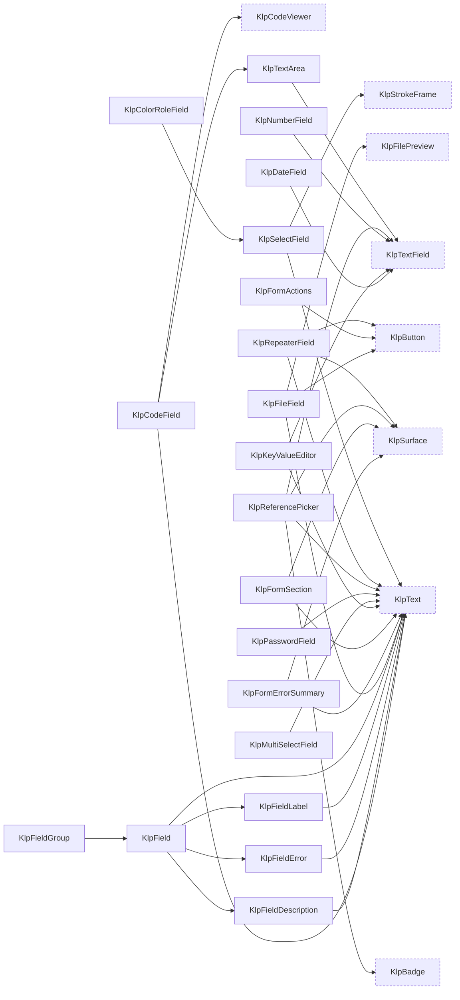

虛線框是其他領域的型別。

### feedback — 狀態與回饋

型別 12 個，widget 10 個。

| 型別 | 行數 | 組成 |
|---|---|---|
| `KlpEmptyState` | 60 | `KlpIcon`、`KlpText` |
| `KlpErrorState` | 34 | `KlpButton` |
| `KlpFeedbackTone` | 29 | （葉節點） |
| `KlpInlineNotice` | 97 | `KlpIcon`、`KlpSurface`、`KlpText` |
| `KlpLoadingState` | 31 | `KlpText` |
| `KlpPermissionState` | 26 | （葉節點） |
| `KlpProgressOverlay` | 77 | `KlpIcon`、`KlpLoadingState`、`KlpSurface`、`KlpText` |
| `KlpRegionPlaceholder` | 262 | `KlpPressable`、`KlpStrokeFrame`、`KlpText` |
| `KlpRegionPlaceholderTone` | 2 | （葉節點） |
| `KlpSkeletonLine` | 19 | （葉節點） |
| `KlpToast` | 113 | `KlpButton`、`KlpIcon`、`KlpText` |
| `KlpToastStack` | 20 | （葉節點） |

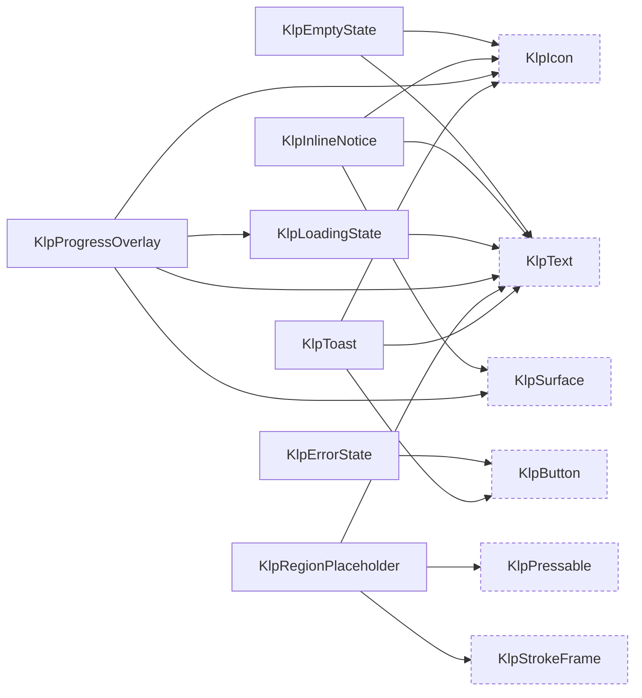

虛線框是其他領域的型別。

### navigation — 導覽元件

型別 8 個，widget 7 個。

| 型別 | 行數 | 組成 |
|---|---|---|
| `KlpActionGroup` | 15 | （葉節點） |
| `KlpBreadcrumb` | 34 | `KlpText` |
| `KlpPagination` | 45 | `KlpButton`、`KlpText` |
| `KlpRailItem` | 126 | `KlpIcon`、`KlpTooltipSurface` |
| `KlpSidebarSectionLabel` | 24 | `KlpText` |
| `KlpTabs` | 71 | `KlpText` |
| `KlpViewOption` | 8 | （葉節點） |
| `KlpViewSwitcher` | 83 | `KlpSurface`、`KlpText` |

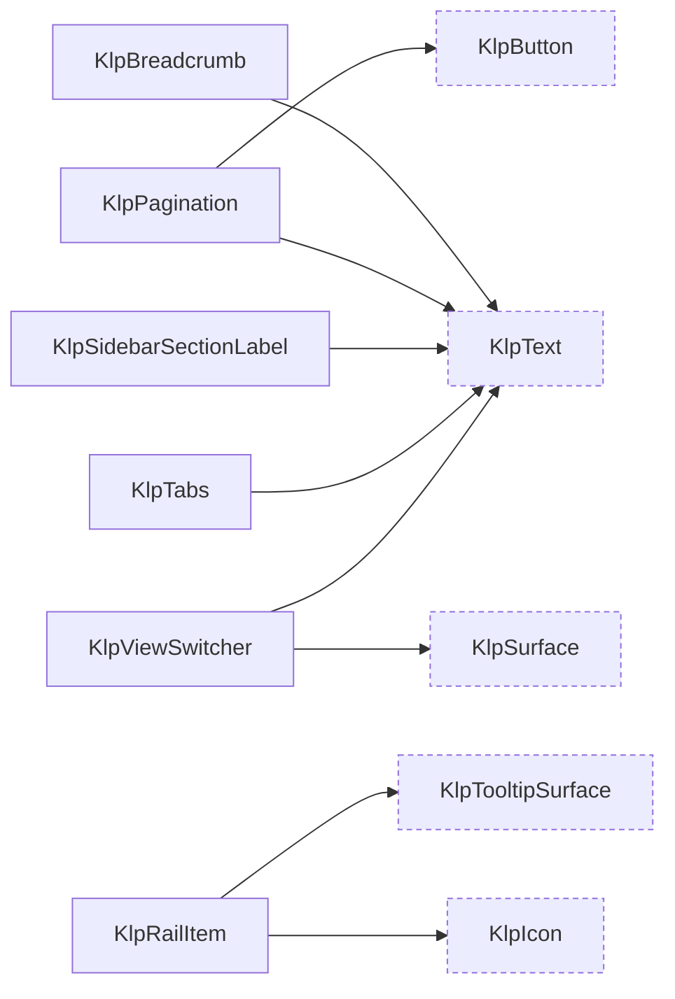

虛線框是其他領域的型別。

### editor — 編輯器周邊

型別 14 個，widget 8 個。

| 型別 | 行數 | 組成 |
|---|---|---|
| `KlpBulkActionBar` | 26 | `KlpText` |
| `KlpCommandItemData` | 19 | （葉節點） |
| `KlpCommandMenu` | 111 | `KlpText` |
| `KlpCommandSectionData` | 7 | （葉節點） |
| `KlpEditorActionData` | 14 | （葉節點） |
| `KlpEditorToolbar` | 17 | （葉節點） |
| `KlpEntityPicker` | 110 | `KlpBadge`、`KlpButton`、`KlpText`、`KlpTextField` |
| `KlpEntityResultData` | 14 | （葉節點） |
| `KlpPageChrome` | 54 | `KlpBadge`、`KlpSurface`、`KlpText` |
| `KlpPropertyBadgeData` | 11 | （葉節點） |
| `KlpPropertySummary` | 43 | `KlpBadge`、`KlpSurface`、`KlpTag`、`KlpText` |
| `KlpSaveStatusCard` | 46 | `KlpText` |
| `KlpSearchNavigator` | 111 | `KlpIconButton`、`KlpText`、`KlpTextField` |
| `KlpStatusMessageData` | 10 | （葉節點） |

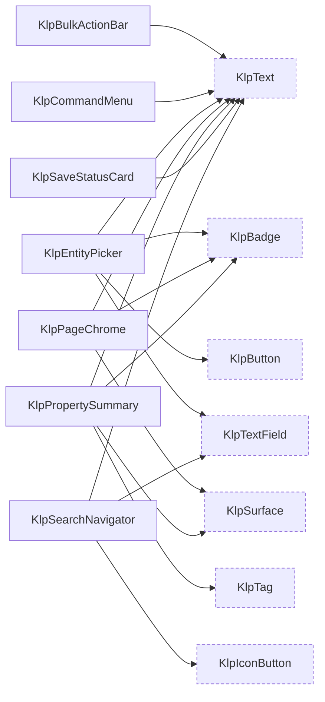

虛線框是其他領域的型別。

### routing — 分發

型別 5 個，widget 2 個。

| 型別 | 行數 | 組成 |
|---|---|---|
| `KlpRoute` | 30 | （葉節點） |
| `KlpRouteNotFound` | 32 | （葉節點） |
| `KlpRouter` | 84 | `KlpRouteNotFound` |
| `KlpRouterOutlet` | 11 | （葉節點） |
| `KlpRouterScope` | 27 | （葉節點） |

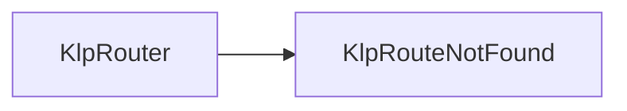

虛線框是其他領域的型別。

### shell — 應用外殼

型別 14 個，widget 12 個。

| 型別 | 行數 | 組成 |
|---|---|---|
| `KlpAppScreen` | 26 | （葉節點） |
| `KlpAppWindowHeader` | 21 | `KlpPanelHeader` |
| `KlpContentState` | 3 | （葉節點） |
| `KlpPaneCollapseControl` | 37 | `KlpIcon` |
| `KlpPanelFrame` | 52 | （葉節點） |
| `KlpPanelHeader` | 55 | `KlpText` |
| `KlpResponsivePaneCoordinator` | 22 | （葉節點） |
| `KlpSidebarFrame` | 31 | `KlpPanelFrame` |
| `KlpStageFrame` | 37 | （葉節點） |
| `KlpStatusBar` | 55 | `KlpText` |
| `KlpThemePreviewMode` | 2 | （葉節點） |
| `KlpThemePreviewTile` | 322 | `KlpPressable`、`KlpText` |
| `KlpWindowControls` | 118 | `KlpIcon`、`KlpTooltip` |
| `KlpWorkbenchShell` | 135 | （葉節點） |

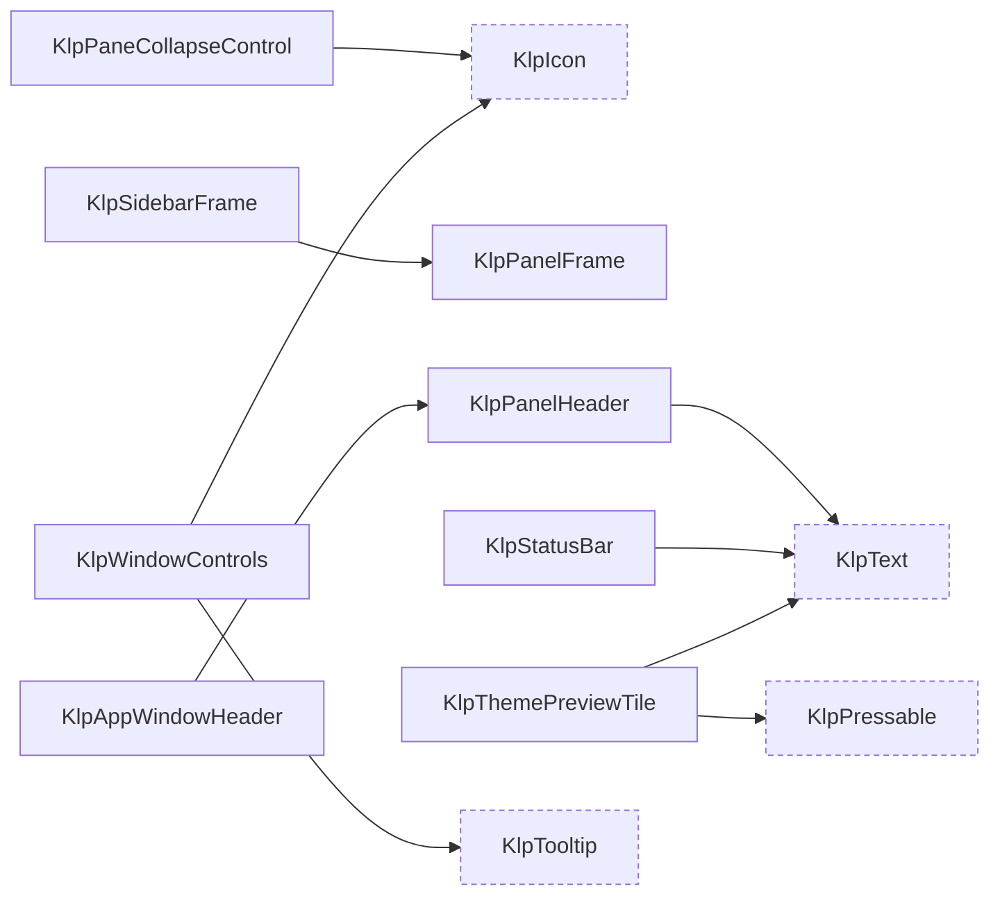

虛線框是其他領域的型別。

## 葉節點

不組合任何其他 Kallopis 型別的 widget。它們是這套視覺語言的**詞根**——
每一個都直接對應一個不可再分的視覺概念。

`KlpActionGroup`、`KlpAppScreen`、`KlpConditionalFieldRegion`、`KlpDashedDivider`、`KlpDivider`、`KlpDropIndicator`、`KlpEditorToolbar`、`KlpForm`、`KlpIcon`、`KlpOverlayHost`、`KlpPanelFrame`、`KlpPermissionState`、`KlpPressable`、`KlpResizablePane`、`KlpResizeHandle`、`KlpResponsivePaneCoordinator`、`KlpRouterOutlet`、`KlpRouterScope`、`KlpScrollViewport`、`KlpSegmentedProgress`、`KlpSkeletonLine`、`KlpSplitLayout`、`KlpStageFrame`、`KlpStrokeFrame`、`KlpSurface`、`KlpText`、`KlpToastStack`、`KlpToggleIndicator`、`KlpTooltip`、`KlpTooltipSurface`、`KlpTree`、`KlpVirtualGrid`、`KlpVirtualList`、`KlpWorkbenchShell`

## 被最多型別使用的

改動這些的影響面最大。

| 型別 | 被幾個型別使用 |
|---|---|
| `KlpText` | 69 |
| `KlpSurface` | 23 |
| `KlpIcon` | 21 |
| `KlpButton` | 9 |
| `KlpTextField` | 7 |
| `KlpPressable` | 5 |
| `KlpStrokeFrame` | 5 |
| `KlpBadge` | 4 |
| `KlpTooltip` | 3 |
| `KlpDashedDivider` | 2 |
| `KlpToggleIndicator` | 2 |
| `KlpAvatar` | 1 |
| `KlpCheckbox` | 1 |
| `KlpCodeLanguageOption` | 1 |
| `KlpCodeViewer` | 1 |

