# 元件清單與組合關係

> 本檔由 `dart run tool/inventory.dart` 從實際程式碼產生，不是手寫的。
> 元件樹是**真的**組合關係——解析每個型別實作區段內出現的其他 `Klp*` 建構
> 呼叫，因此它不會與程式碼分岔；手寫的架構圖會，而且分岔時沒有任何徵兆。

## 總覽

- 公開型別 **252** 個，其中 widget **146** 個
- 分為 **17** 個領域

### 領域之間的依賴方向

箭頭是「用到」，數字是引用次數。這張圖唯一該有的形狀是**單向**——
`controls` 可以用 `surface`，`surface` 不可以用 `controls`。
出現回頭的箭頭就代表分層破了。

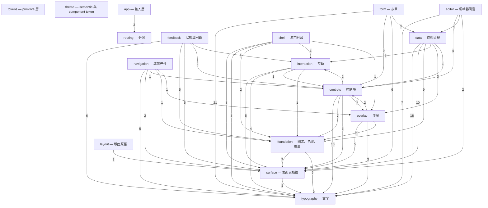

### 分層違規

以下型別用到了比自己更上層的領域。**這些不是待辦事項清單，是設計債**
——一個底層元件依賴上層，代表它被歸錯領域，或它其實不屬於這個庫。

- `foundation/KlpAvatar → typography/KlpText`
- `foundation/KlpBlock → surface/KlpSurface`
- `foundation/KlpBlockCanvas → surface/KlpSurface`
- `foundation/KlpDragPreview → surface/KlpSurface`
- `foundation/KlpDropTarget → surface/KlpStrokeFrame`
- `foundation/KlpDropTarget → surface/KlpSurface`
- `foundation/KlpPopover → surface/KlpSurface`
- `foundation/KlpRichText → typography/KlpText`
- `foundation/KlpSortControl → typography/KlpText`
- `foundation/KlpStatusIndicator → typography/KlpText`
- `foundation/KlpThemeToggle → surface/KlpSurface`
- `foundation/KlpThemeToggle → typography/KlpText`
- `interaction/KlpSelectionToolbar → controls/KlpButton`
- `overlay/KlpDialog → controls/KlpButton`
- `overlay/KlpMenuItem → controls/KlpToggleIndicator`

## 各領域的元件樹

### tokens — primitive 層

型別 1 個，widget 0 個。

| 型別 | 行數 | 組成 |
|---|---|---|
| `KlpScale` | 107 | （葉節點） |

### theme — semantic 與 component token

型別 15 個，widget 0 個。

| 型別 | 行數 | 組成 |
|---|---|---|
| `KlpComponentTheme` | 174 | （葉節點） |
| `KlpDataVisualizationTheme` | 232 | （葉節點） |
| `KlpFieldFillState` | 2 | （葉節點） |
| `KlpFieldStyle` | 241 | （葉節點） |
| `KlpMotionTheme` | 127 | （葉節點） |
| `KlpShapeTheme` | 138 | （葉節點） |
| `KlpSpacingTheme` | 510 | （葉節點） |
| `KlpSurfaceSeparation` | 19 | （葉節點） |
| `KlpSurfaceTheme` | 211 | （葉節點） |
| `KlpTheme` | 103 | `KlpVisualStyle` |
| `KlpThemeContrast` | 20 | （葉節點） |
| `KlpThemeData` | 314 | （葉節點） |
| `KlpThemeVariant` | 2 | （葉節點） |
| `KlpTypographyTheme` | 377 | （葉節點） |
| `KlpVisualStyle` | 88 | （葉節點） |

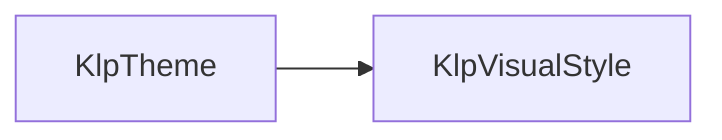

虛線框是其他領域的型別。

### foundation — 圖示、色盤、度量

型別 38 個，widget 16 個。

| 型別 | 行數 | 組成 |
|---|---|---|
| `KlpAccent` | 26 | （葉節點） |
| `KlpAvatar` | 41 | `KlpText` |
| `KlpAvatarData` | 8 | （葉節點） |
| `KlpAvatarGroup` | 37 | `KlpAvatar` |
| `KlpBlock` | 24 | `KlpSurface` |
| `KlpBlockCanvas` | 21 | `KlpSurface` |
| `KlpCodeMetrics` | 15 | （葉節點） |
| `KlpControlMetrics` | 9 | （葉節點） |
| `KlpDecorativePalette` | 18 | （葉節點） |
| `KlpDragPreview` | 18 | `KlpSurface` |
| `KlpDropIndicator` | 18 | （葉節點） |
| `KlpDropTarget` | 19 | `KlpStrokeFrame`、`KlpSurface` |
| `KlpElevation` | 7 | （葉節點） |
| `KlpFormMetrics` | 13 | （葉節點） |
| `KlpGeometricSpinner` | 152 | （葉節點） |
| `KlpIcon` | 34 | （葉節點） |
| `KlpIcons` | 78 | （葉節點） |
| `KlpInlineCode` | 54 | （葉節點） |
| `KlpLayoutGap` | 4 | （葉節點） |
| `KlpLine` | 8 | （葉節點） |
| `KlpMotion` | 5 | （葉節點） |
| `KlpPalette` | 102 | （葉節點） |
| `KlpPlaceholderMetrics` | 18 | （葉節點） |
| `KlpPopover` | 16 | `KlpSurface` |
| `KlpRadius` | 13 | （葉節點） |
| `KlpRichText` | 136 | `KlpInlineCode`、`KlpText` |
| `KlpRichTextKind` | 12 | （葉節點） |
| `KlpRichTextNode` | 20 | （葉節點） |
| `KlpRichTextSpan` | 8 | （葉節點） |
| `KlpSegmentedProgress` | 35 | （葉節點） |
| `KlpSize` | 30 | （葉節點） |
| `KlpSortControl` | 33 | `KlpIcon`、`KlpText` |
| `KlpSpace` | 13 | （葉節點） |
| `KlpStatusIndicator` | 87 | `KlpIcon`、`KlpText` |
| `KlpStatusKind` | 21 | （葉節點） |
| `KlpThemeToggle` | 25 | `KlpSurface`、`KlpText` |
| `KlpTransparency` | 4 | （葉節點） |
| `KlpTypography` | 66 | （葉節點） |

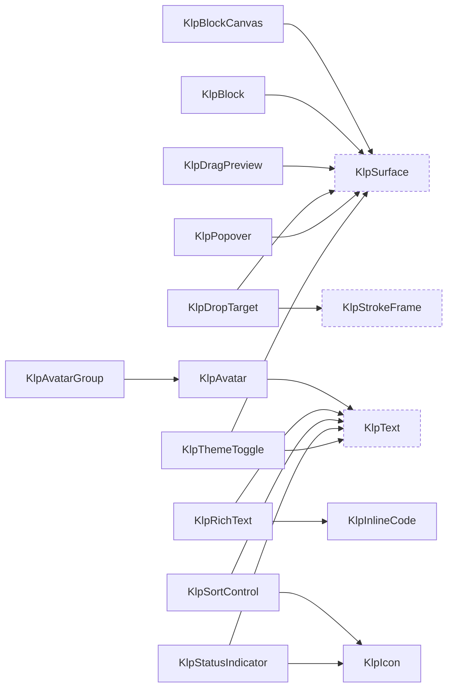

虛線框是其他領域的型別。

### typography — 文字

型別 7 個，widget 1 個。

| 型別 | 行數 | 組成 |
|---|---|---|
| `KlpFontRole` | 3 | （葉節點） |
| `KlpText` | 127 | （葉節點） |
| `KlpTextColorTier` | 4 | （葉節點） |
| `KlpTextRole` | 20 | （葉節點） |
| `KlpTextStyleDefinition` | 38 | （葉節點） |
| `KlpTextStyles` | 175 | `KlpTextStyleDefinition` |
| `KlpTextTone` | 2 | （葉節點） |

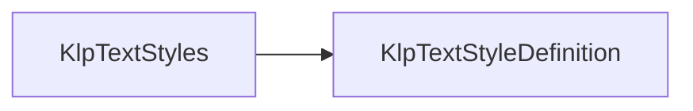

虛線框是其他領域的型別。

### surface — 表面與描邊

型別 9 個，widget 6 個。

| 型別 | 行數 | 組成 |
|---|---|---|
| `KlpDashedBorder` | 51 | `KlpStrokeFrame` |
| `KlpDashedDivider` | 111 | （葉節點） |
| `KlpDivider` | 14 | （葉節點） |
| `KlpSection` | 46 | `KlpText` |
| `KlpStrokeFrame` | 135 | （葉節點） |
| `KlpStrokeRole` | 2 | （葉節點） |
| `KlpStrokeState` | 2 | （葉節點） |
| `KlpSurface` | 116 | （葉節點） |
| `KlpSurfaceTone` | 16 | （葉節點） |

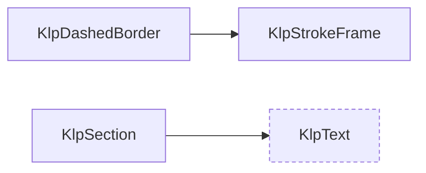

虛線框是其他領域的型別。

### interaction — 互動

型別 8 個，widget 5 個。

| 型別 | 行數 | 組成 |
|---|---|---|
| `KlpFilterBar` | 169 | `KlpDashedBorder`、`KlpIcon`、`KlpPressable`、`KlpText` |
| `KlpFilterOption` | 15 | （葉節點） |
| `KlpInteractionSettings` | 27 | （葉節點） |
| `KlpPresenceIndicator` | 33 | `KlpText` |
| `KlpPressable` | 169 | `KlpDashedBorder` |
| `KlpSelectionAction` | 15 | （葉節點） |
| `KlpSelectionToolbar` | 75 | `KlpButton`、`KlpDashedBorder`、`KlpPressable`、`KlpSurface`、`KlpText` |
| `KlpShortcutHint` | 20 | `KlpSurface`、`KlpText` |

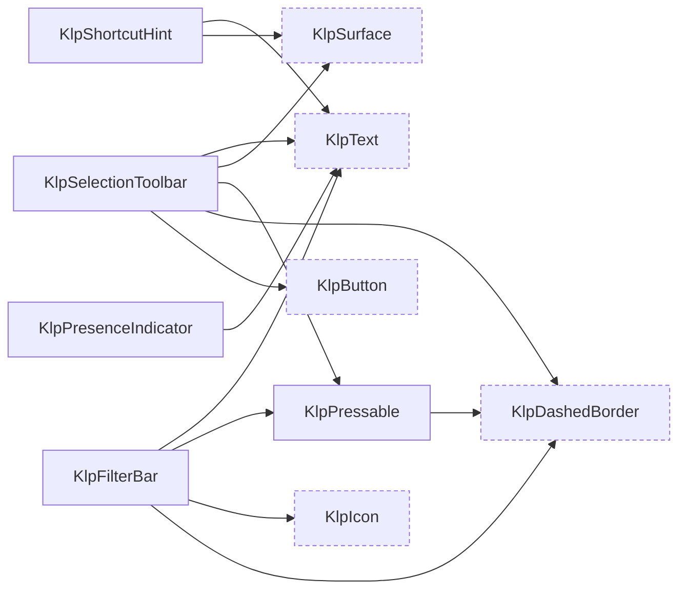

虛線框是其他領域的型別。

### layout — 版面原語

型別 8 個，widget 8 個。

| 型別 | 行數 | 組成 |
|---|---|---|
| `KlpOverlayHost` | 16 | （葉節點） |
| `KlpRegion` | 40 | `KlpSurface` |
| `KlpResizablePane` | 13 | （葉節點） |
| `KlpResizeHandle` | 23 | （葉節點） |
| `KlpScrollViewport` | 23 | （葉節點） |
| `KlpSplitLayout` | 57 | `KlpDashedDivider` |
| `KlpVirtualGrid` | 45 | （葉節點） |
| `KlpVirtualList` | 26 | （葉節點） |

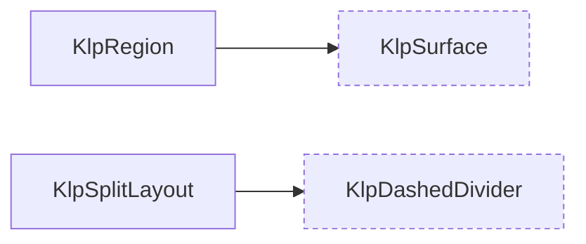

虛線框是其他領域的型別。

### overlay — 浮層

型別 11 個，widget 7 個。

| 型別 | 行數 | 組成 |
|---|---|---|
| `KlpContextMenu` | 114 | `KlpMenu`、`KlpMenuItemData` |
| `KlpDialog` | 74 | `KlpButton`、`KlpSurface`、`KlpText` |
| `KlpDrawer` | 94 | `KlpSurface` |
| `KlpDrawerEdge` | 9 | （葉節點） |
| `KlpMenu` | 72 | `KlpDivider`、`KlpMenuItem`、`KlpSurface`、`KlpText` |
| `KlpMenuItem` | 112 | `KlpDashedBorder`、`KlpIcon`、`KlpText`、`KlpToggleIndicator` |
| `KlpMenuItemData` | 28 | （葉節點） |
| `KlpMenuLayout` | 74 | （葉節點） |
| `KlpMenuStyle` | 21 | （葉節點） |
| `KlpTooltip` | 12 | （葉節點） |
| `KlpTooltipSurface` | 42 | （葉節點） |

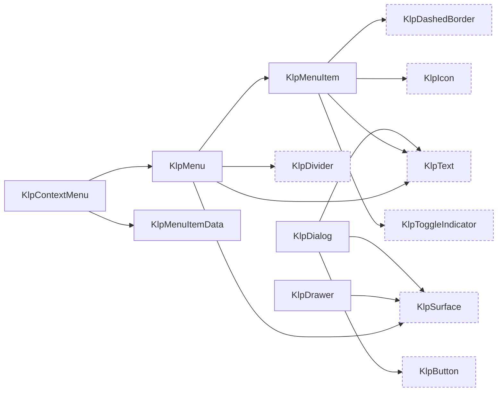

虛線框是其他領域的型別。

### controls — 控制項

型別 21 個，widget 15 個。

| 型別 | 行數 | 組成 |
|---|---|---|
| `KlpButton` | 141 | `KlpDashedBorder`、`KlpPressable`、`KlpText` |
| `KlpButtonTone` | 5 | （葉節點） |
| `KlpCheckbox` | 74 | `KlpIcon`、`KlpText` |
| `KlpCombobox` | 197 | `KlpMenu`、`KlpMenuItemData`、`KlpTextField` |
| `KlpComboboxOption` | 23 | （葉節點） |
| `KlpCompactSwitch` | 58 | `KlpPressable` |
| `KlpControlSize` | 1 | （葉節點） |
| `KlpIconButton` | 77 | `KlpDashedBorder`、`KlpIcon`、`KlpTooltip` |
| `KlpPhaseOption` | 19 | （葉節點） |
| `KlpPhaseToggle` | 161 | `KlpIcon`、`KlpText` |
| `KlpRadioGroup` | 133 | `KlpText` |
| `KlpSegmentedControl` | 152 | `KlpDashedBorder`、`KlpIcon`、`KlpText` |
| `KlpSelect` | 92 | `KlpDashedBorder`、`KlpIcon`、`KlpStrokeFrame`、`KlpText` |
| `KlpSelectionOption` | 7 | （葉節點） |
| `KlpSlider` | 78 | `KlpText` |
| `KlpSlidingSelection` | 111 | `KlpIcon` |
| `KlpTextField` | 274 | `KlpDashedBorder`、`KlpIcon`、`KlpText` |
| `KlpToggle` | 51 | `KlpText`、`KlpToggleIndicator` |
| `KlpToggleIndicator` | 53 | （葉節點） |
| `KlpTriState` | 2 | （葉節點） |
| `KlpTriStateToggle` | 41 | `KlpSelectionOption`、`KlpSlidingSelection`、`KlpText` |

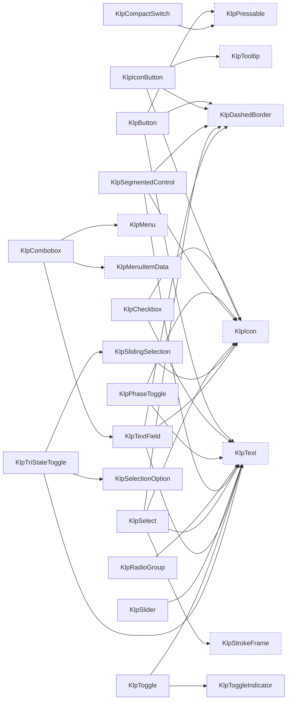

虛線框是其他領域的型別。

### data — 資料呈現

型別 39 個，widget 19 個。

| 型別 | 行數 | 組成 |
|---|---|---|
| `KlpAccordion` | 171 | `KlpDashedBorder`、`KlpIcon`、`KlpText` |
| `KlpAccordionItemData` | 20 | （葉節點） |
| `KlpBadge` | 76 | `KlpText` |
| `KlpBadgeVariant` | 12 | （葉節點） |
| `KlpCard` | 86 | `KlpDashedBorder`、`KlpText` |
| `KlpCodeLanguageOption` | 12 | （葉節點） |
| `KlpCodeLanguages` | 31 | `KlpCodeLanguageOption` |
| `KlpCodeViewer` | 561 | `KlpDashedBorder`、`KlpIcon`、`KlpMenu`、`KlpMenuItemData`、`KlpPressable`、`KlpText`、`KlpTooltip` |
| `KlpCodeViewerLabels` | 27 | （葉節點） |
| `KlpDataAlignment` | 2 | （葉節點） |
| `KlpDataColumn` | 18 | （葉節點） |
| `KlpDataRow` | 7 | （葉節點） |
| `KlpDataSort` | 8 | （葉節點） |
| `KlpDataTable` | 201 | `KlpCheckbox`、`KlpDashedDivider`、`KlpIcon`、`KlpSurface`、`KlpText` |
| `KlpDiffLine` | 32 | （葉節點） |
| `KlpDiffLineType` | 13 | （葉節點） |
| `KlpDiffViewer` | 191 | `KlpPressable`、`KlpText` |
| `KlpFilePreview` | 176 | `KlpDashedDivider`、`KlpGeometricSpinner`、`KlpText` |
| `KlpFilePreviewState` | 2 | （葉節點） |
| `KlpJsonTree` | 182 | `KlpIcon`、`KlpSurface`、`KlpText` |
| `KlpKeyValueItem` | 16 | （葉節點） |
| `KlpKeyValueList` | 74 | `KlpIcon`、`KlpText` |
| `KlpKeyValueRowData` | 7 | （葉節點） |
| `KlpKeyValueTable` | 62 | `KlpSurface`、`KlpText` |
| `KlpListTile` | 138 | `KlpDashedBorder`、`KlpIcon`、`KlpText` |
| `KlpMetricCard` | 102 | `KlpText` |
| `KlpProgress` | 82 | `KlpText` |
| `KlpProgressState` | 2 | （葉節點） |
| `KlpSortDirection` | 3 | （葉節點） |
| `KlpStepData` | 11 | （葉節點） |
| `KlpStepStatus` | 4 | （葉節點） |
| `KlpStepper` | 225 | `KlpIcon`、`KlpText` |
| `KlpTag` | 61 | `KlpText` |
| `KlpTerminal` | 119 | `KlpPressable`、`KlpText` |
| `KlpTimeline` | 99 | `KlpText` |
| `KlpTimelineItemData` | 20 | （葉節點） |
| `KlpTree` | 40 | （葉節點） |
| `KlpTreeItem` | 175 | `KlpDashedBorder`、`KlpIcon`、`KlpText` |
| `KlpTreeNode` | 26 | （葉節點） |

```mermaid
graph LR
  KlpAccordion["KlpAccordion"]
  KlpBadge["KlpBadge"]
  KlpCard["KlpCard"]
  KlpCheckbox["KlpCheckbox"]:::external
  KlpCodeLanguageOption["KlpCodeLanguageOption"]
  KlpCodeLanguages["KlpCodeLanguages"]
  KlpCodeViewer["KlpCodeViewer"]
  KlpDashedBorder["KlpDashedBorder"]:::external
  KlpDashedDivider["KlpDashedDivider"]:::external
  KlpDataTable["KlpDataTable"]
  KlpDiffViewer["KlpDiffViewer"]
  KlpFilePreview["KlpFilePreview"]
  KlpGeometricSpinner["KlpGeometricSpinner"]:::external
  KlpIcon["KlpIcon"]:::external
  KlpJsonTree["KlpJsonTree"]
  KlpKeyValueList["KlpKeyValueList"]
  KlpKeyValueTable["KlpKeyValueTable"]
  KlpListTile["KlpListTile"]
  KlpMenu["KlpMenu"]:::external
  KlpMenuItemData["KlpMenuItemData"]:::external
  KlpMetricCard["KlpMetricCard"]
  KlpPressable["KlpPressable"]:::external
  KlpProgress["KlpProgress"]
  KlpStepper["KlpStepper"]
  KlpSurface["KlpSurface"]:::external
  KlpTag["KlpTag"]
  KlpTerminal["KlpTerminal"]
  KlpText["KlpText"]:::external
  KlpTimeline["KlpTimeline"]
  KlpTooltip["KlpTooltip"]:::external
  KlpTreeItem["KlpTreeItem"]
  KlpAccordion --> KlpDashedBorder
  KlpAccordion --> KlpIcon
  KlpAccordion --> KlpText
  KlpBadge --> KlpText
  KlpCard --> KlpDashedBorder
  KlpCard --> KlpText
  KlpCodeLanguages --> KlpCodeLanguageOption
  KlpCodeViewer --> KlpDashedBorder
  KlpCodeViewer --> KlpIcon
  KlpCodeViewer --> KlpMenu
  KlpCodeViewer --> KlpMenuItemData
  KlpCodeViewer --> KlpPressable
  KlpCodeViewer --> KlpText
  KlpCodeViewer --> KlpTooltip
  KlpDataTable --> KlpCheckbox
  KlpDataTable --> KlpDashedDivider
  KlpDataTable --> KlpIcon
  KlpDataTable --> KlpSurface
  KlpDataTable --> KlpText
  KlpDiffViewer --> KlpPressable
  KlpDiffViewer --> KlpText
  KlpFilePreview --> KlpDashedDivider
  KlpFilePreview --> KlpGeometricSpinner
  KlpFilePreview --> KlpText
  KlpJsonTree --> KlpIcon
  KlpJsonTree --> KlpSurface
  KlpJsonTree --> KlpText
  KlpKeyValueList --> KlpIcon
  KlpKeyValueList --> KlpText
  KlpKeyValueTable --> KlpSurface
  KlpKeyValueTable --> KlpText
  KlpListTile --> KlpDashedBorder
  KlpListTile --> KlpIcon
  KlpListTile --> KlpText
  KlpMetricCard --> KlpText
  KlpProgress --> KlpText
  KlpStepper --> KlpIcon
  KlpStepper --> KlpText
  KlpTag --> KlpText
  KlpTerminal --> KlpPressable
  KlpTerminal --> KlpText
  KlpTimeline --> KlpText
  KlpTreeItem --> KlpDashedBorder
  KlpTreeItem --> KlpIcon
  KlpTreeItem --> KlpText
  classDef external stroke-dasharray: 4 3;
```

虛線框是其他領域的型別。

### form — 表單

型別 41 個，widget 29 個。

| 型別 | 行數 | 組成 |
|---|---|---|
| `KlpApprovalStepData` | 8 | （葉節點） |
| `KlpApprovalStepsField` | 153 | `KlpText` |
| `KlpCalendar` | 247 | `KlpDashedBorder`、`KlpIconButton`、`KlpText` |
| `KlpCalendarRange` | 28 | （葉節點） |
| `KlpCalendarSelectionMode` | 7 | （葉節點） |
| `KlpChoiceOption` | 12 | （葉節點） |
| `KlpCodeEditorField` | 107 | `KlpText` |
| `KlpCodeField` | 39 | `KlpCodeViewer`、`KlpText`、`KlpTextArea` |
| `KlpColorRoleField` | 29 | `KlpSelectField` |
| `KlpConditionalFieldRegion` | 18 | （葉節點） |
| `KlpDateField` | 81 | `KlpCalendar`、`KlpTextField` |
| `KlpDateFieldCalendar` | 33 | （葉節點） |
| `KlpField` | 119 | `KlpFieldDescription`、`KlpFieldLabel`、`KlpText` |
| `KlpFieldDescription` | 15 | `KlpText` |
| `KlpFieldError` | 18 | `KlpText` |
| `KlpFieldGroup` | 25 | `KlpField` |
| `KlpFieldLabel` | 11 | `KlpText` |
| `KlpFieldVisualState` | 13 | （葉節點） |
| `KlpFileAttachment` | 13 | （葉節點） |
| `KlpFileDropzoneField` | 148 | `KlpText` |
| `KlpFileField` | 43 | `KlpButton`、`KlpFilePreview`、`KlpText` |
| `KlpFileValue` | 8 | （葉節點） |
| `KlpForm` | 35 | （葉節點） |
| `KlpFormActions` | 48 | `KlpButton` |
| `KlpFormErrorSummary` | 47 | `KlpSurface`、`KlpText` |
| `KlpFormSection` | 48 | `KlpSurface`、`KlpText` |
| `KlpKeyValueEditor` | 60 | `KlpText`、`KlpTextField` |
| `KlpKeyValueEntry` | 20 | （葉節點） |
| `KlpMultiSelectField` | 64 | `KlpText` |
| `KlpNumberField` | 41 | `KlpTextField` |
| `KlpPasswordField` | 148 | `KlpText` |
| `KlpPasswordRequirement` | 8 | （葉節點） |
| `KlpReferenceOption` | 16 | （葉節點） |
| `KlpReferencePicker` | 81 | `KlpBadge`、`KlpSurface`、`KlpText`、`KlpTextField` |
| `KlpRepeaterField` | 55 | `KlpButton`、`KlpSurface`、`KlpText` |
| `KlpRepeaterItem` | 7 | （葉節點） |
| `KlpSelectField` | 96 | `KlpStrokeFrame`、`KlpText` |
| `KlpStatusRoleSwatches` | 80 | `KlpText` |
| `KlpTagChip` | 44 | `KlpText` |
| `KlpTagInputField` | 84 | `KlpTagChip`、`KlpText` |
| `KlpTextArea` | 32 | `KlpTextField` |

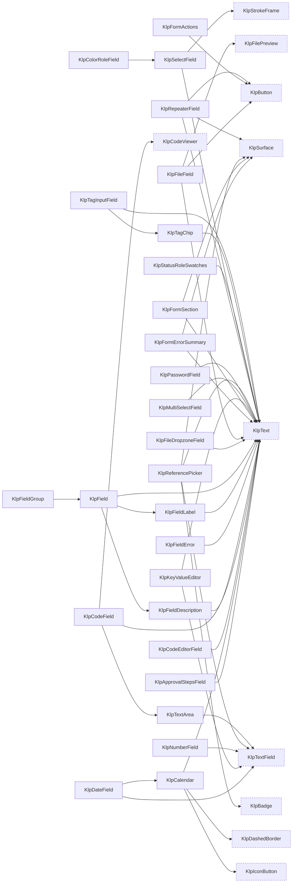

虛線框是其他領域的型別。

### feedback — 狀態與回饋

型別 12 個，widget 10 個。

| 型別 | 行數 | 組成 |
|---|---|---|
| `KlpEmptyState` | 52 | `KlpDashedBorder`、`KlpIcon`、`KlpText` |
| `KlpErrorState` | 34 | `KlpButton` |
| `KlpFeedbackTone` | 29 | （葉節點） |
| `KlpInlineNotice` | 97 | `KlpIcon`、`KlpSurface`、`KlpText` |
| `KlpLoadingState` | 35 | `KlpGeometricSpinner`、`KlpText` |
| `KlpPermissionState` | 26 | （葉節點） |
| `KlpProgressOverlay` | 95 | `KlpDashedBorder`、`KlpIcon`、`KlpLoadingState`、`KlpText` |
| `KlpRegionPlaceholder` | 270 | `KlpDashedBorder`、`KlpPressable`、`KlpStrokeFrame`、`KlpText` |
| `KlpRegionPlaceholderTone` | 2 | （葉節點） |
| `KlpSkeletonLine` | 19 | （葉節點） |
| `KlpToast` | 113 | `KlpButton`、`KlpIcon`、`KlpText` |
| `KlpToastStack` | 20 | （葉節點） |

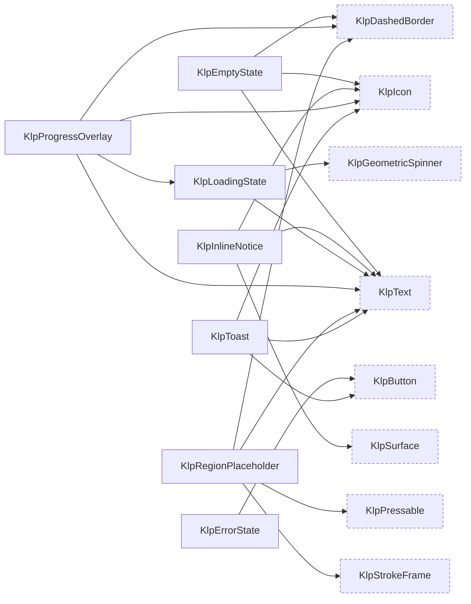

虛線框是其他領域的型別。

### navigation — 導覽元件

型別 8 個，widget 7 個。

| 型別 | 行數 | 組成 |
|---|---|---|
| `KlpActionGroup` | 15 | （葉節點） |
| `KlpBreadcrumb` | 34 | `KlpText` |
| `KlpPagination` | 45 | `KlpButton`、`KlpText` |
| `KlpRailItem` | 132 | `KlpDashedBorder`、`KlpIcon`、`KlpTooltipSurface` |
| `KlpSidebarSectionLabel` | 24 | `KlpText` |
| `KlpTabs` | 71 | `KlpText` |
| `KlpViewOption` | 8 | （葉節點） |
| `KlpViewSwitcher` | 83 | `KlpSurface`、`KlpText` |

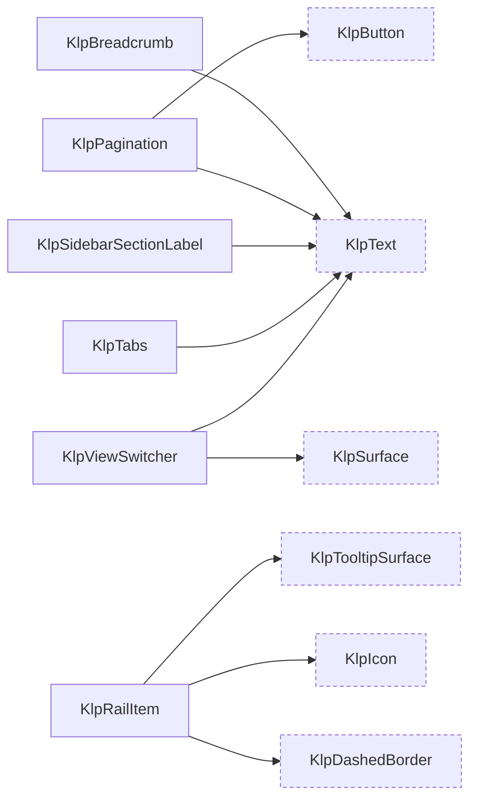

虛線框是其他領域的型別。

### editor — 編輯器周邊

型別 14 個，widget 8 個。

| 型別 | 行數 | 組成 |
|---|---|---|
| `KlpBulkActionBar` | 26 | `KlpText` |
| `KlpCommandItemData` | 19 | （葉節點） |
| `KlpCommandMenu` | 111 | `KlpText` |
| `KlpCommandSectionData` | 7 | （葉節點） |
| `KlpEditorActionData` | 14 | （葉節點） |
| `KlpEditorToolbar` | 17 | （葉節點） |
| `KlpEntityPicker` | 110 | `KlpBadge`、`KlpButton`、`KlpText`、`KlpTextField` |
| `KlpEntityResultData` | 14 | （葉節點） |
| `KlpPageChrome` | 54 | `KlpBadge`、`KlpSurface`、`KlpText` |
| `KlpPropertyBadgeData` | 11 | （葉節點） |
| `KlpPropertySummary` | 43 | `KlpBadge`、`KlpSurface`、`KlpTag`、`KlpText` |
| `KlpSaveStatusCard` | 46 | `KlpText` |
| `KlpSearchNavigator` | 111 | `KlpIconButton`、`KlpText`、`KlpTextField` |
| `KlpStatusMessageData` | 10 | （葉節點） |

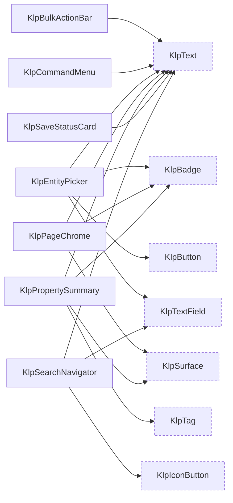

虛線框是其他領域的型別。

### routing — 分發

型別 5 個，widget 2 個。

| 型別 | 行數 | 組成 |
|---|---|---|
| `KlpRoute` | 30 | （葉節點） |
| `KlpRouteNotFound` | 32 | （葉節點） |
| `KlpRouter` | 84 | `KlpRouteNotFound` |
| `KlpRouterOutlet` | 11 | （葉節點） |
| `KlpRouterScope` | 27 | （葉節點） |

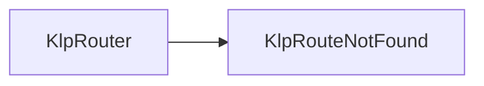

虛線框是其他領域的型別。

### shell — 應用外殼

型別 14 個，widget 12 個。

| 型別 | 行數 | 組成 |
|---|---|---|
| `KlpAppScreen` | 40 | （葉節點） |
| `KlpAppWindowHeader` | 26 | `KlpPanelHeader` |
| `KlpContentState` | 3 | （葉節點） |
| `KlpPaneCollapseControl` | 58 | `KlpDashedBorder`、`KlpIcon` |
| `KlpPanelFrame` | 73 | （葉節點） |
| `KlpPanelHeader` | 57 | `KlpText` |
| `KlpResponsivePaneCoordinator` | 22 | （葉節點） |
| `KlpSidebarFrame` | 33 | `KlpPanelFrame` |
| `KlpStageFrame` | 60 | （葉節點） |
| `KlpStatusBar` | 55 | `KlpText` |
| `KlpThemePreviewMode` | 2 | （葉節點） |
| `KlpThemePreviewTile` | 305 | `KlpDashedBorder`、`KlpPressable`、`KlpText` |
| `KlpWindowControls` | 124 | `KlpDashedBorder`、`KlpIcon`、`KlpTooltip` |
| `KlpWorkbenchShell` | 130 | （葉節點） |

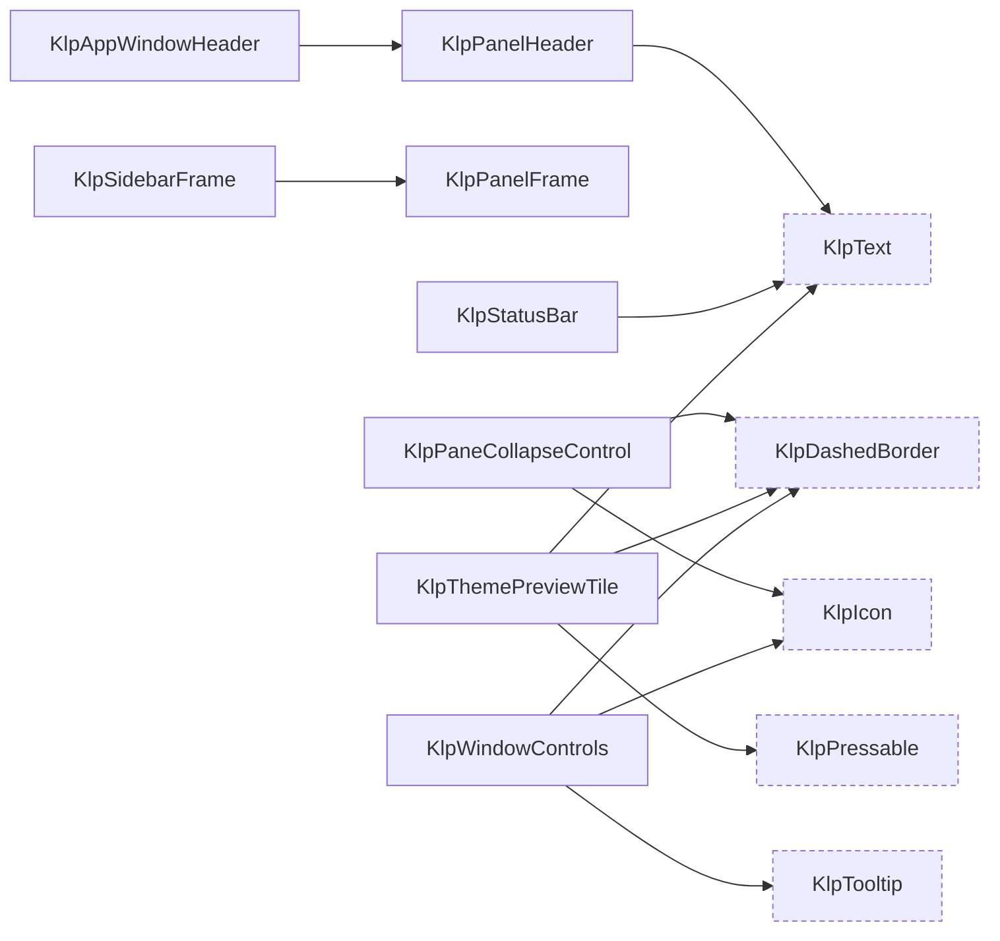

虛線框是其他領域的型別。

### app — 接入層

型別 1 個，widget 1 個。

| 型別 | 行數 | 組成 |
|---|---|---|
| `KlpApp` | 137 | `KlpRouterOutlet`、`KlpRouterScope` |

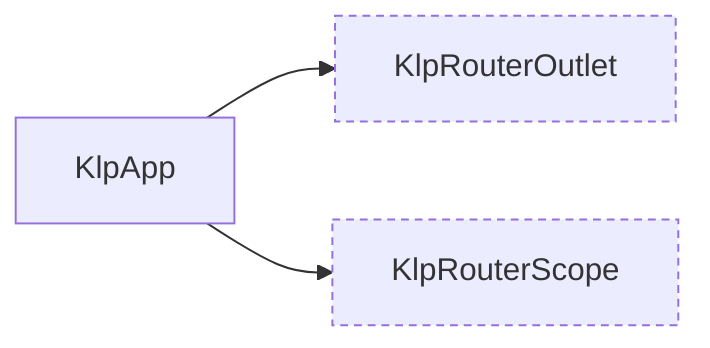

虛線框是其他領域的型別。

## 葉節點

不組合任何其他 Kallopis 型別的 widget。它們是這套視覺語言的**詞根**——
每一個都直接對應一個不可再分的視覺概念。

`KlpActionGroup`、`KlpAppScreen`、`KlpConditionalFieldRegion`、`KlpDashedDivider`、`KlpDivider`、`KlpDropIndicator`、`KlpEditorToolbar`、`KlpForm`、`KlpGeometricSpinner`、`KlpIcon`、`KlpInlineCode`、`KlpOverlayHost`、`KlpPanelFrame`、`KlpPermissionState`、`KlpResizablePane`、`KlpResizeHandle`、`KlpResponsivePaneCoordinator`、`KlpRouterOutlet`、`KlpRouterScope`、`KlpScrollViewport`、`KlpSegmentedProgress`、`KlpSkeletonLine`、`KlpStageFrame`、`KlpStrokeFrame`、`KlpSurface`、`KlpText`、`KlpToastStack`、`KlpToggleIndicator`、`KlpTooltip`、`KlpTooltipSurface`、`KlpTree`、`KlpVirtualGrid`、`KlpVirtualList`、`KlpWorkbenchShell`

## 被最多型別使用的

改動這些的影響面最大。

| 型別 | 被幾個型別使用 |
|---|---|
| `KlpText` | 83 |
| `KlpIcon` | 26 |
| `KlpSurface` | 23 |
| `KlpDashedBorder` | 22 |
| `KlpButton` | 9 |
| `KlpPressable` | 9 |
| `KlpTextField` | 8 |
| `KlpStrokeFrame` | 5 |
| `KlpBadge` | 4 |
| `KlpDashedDivider` | 3 |
| `KlpMenu` | 3 |
| `KlpMenuItemData` | 3 |
| `KlpTooltip` | 3 |
| `KlpGeometricSpinner` | 2 |
| `KlpIconButton` | 2 |

