# 元件清單與組合關係

> 本檔由 `dart run tool/inventory.dart` 從實際程式碼產生，不是手寫的。
> 元件樹是**真的**組合關係——解析每個型別實作區段內出現的其他 `Klp*` 建構
> 呼叫，因此它不會與程式碼分岔；手寫的架構圖會，而且分岔時沒有任何徵兆。

## 總覽

- 公開型別 **392** 個，其中 widget **226** 個
- 分為 **19** 個領域

### 領域之間的依賴方向

箭頭是「用到」，數字是引用次數。這張圖唯一該有的形狀是**單向**——
`controls` 可以用 `surface`，`surface` 不可以用 `controls`。
出現回頭的箭頭就代表分層破了。

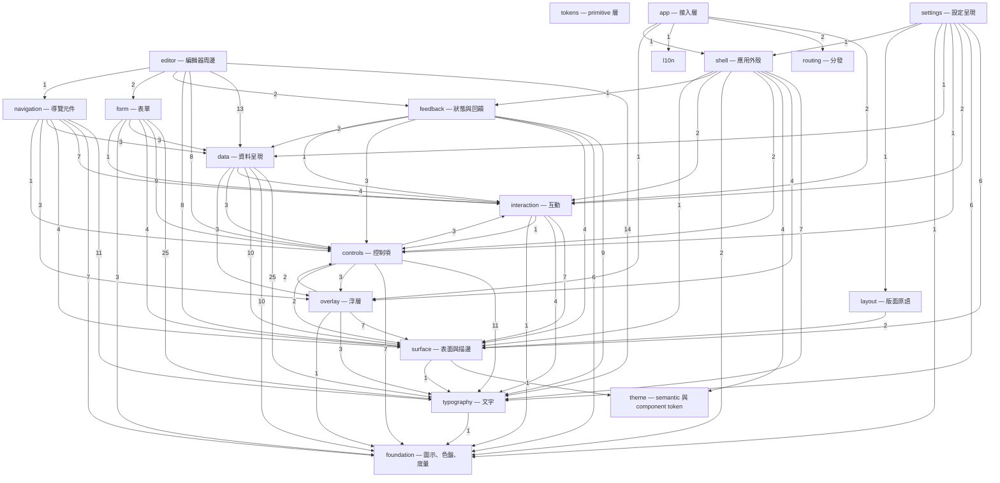

### 分層違規

以下型別用到了比自己更上層的領域。**這些不是待辦事項清單，是設計債**
——一個底層元件依賴上層，代表它被歸錯領域，或它其實不屬於這個庫。

- `interaction/KlpSelectionToolbar → controls/KlpButton`
- `overlay/KlpDialog → controls/KlpButton`
- `overlay/KlpMenuItem → controls/KlpToggleIndicator`

## 各領域的元件樹

### tokens — primitive 層

型別 2 個，widget 0 個。

| 型別 | 行數 | 組成 |
|---|---|---|
| `KlpPalette` | 125 | （葉節點） |
| `KlpScale` | 121 | （葉節點） |

### theme — semantic 與 component token

型別 22 個，widget 1 個。

| 型別 | 行數 | 組成 |
|---|---|---|
| `KlpComponentTheme` | 174 | （葉節點） |
| `KlpControlGeometry` | 222 | （葉節點） |
| `KlpDataGeometry` | 99 | （葉節點） |
| `KlpDataVisualizationTheme` | 145 | （葉節點） |
| `KlpFieldFillState` | 3 | （葉節點） |
| `KlpFieldStyle` | 270 | （葉節點） |
| `KlpGeometryTheme` | 129 | `KlpControlGeometry`、`KlpDataGeometry`、`KlpLayoutGeometry`、`KlpOpticalGeometry` |
| `KlpLayoutGeometry` | 237 | （葉節點） |
| `KlpMotionTheme` | 128 | （葉節點） |
| `KlpOpticalGeometry` | 34 | （葉節點） |
| `KlpShapeTheme` | 138 | （葉節點） |
| `KlpSpacingTheme` | 665 | （葉節點） |
| `KlpSurfaceSeparation` | 19 | （葉節點） |
| `KlpSurfaceTheme` | 262 | （葉節點） |
| `KlpTheme` | 155 | `KlpVisualStyle` |
| `KlpThemeContrast` | 26 | （葉節點） |
| `KlpThemeData` | 300 | （葉節點） |
| `KlpThemeVariant` | 8 | （葉節點） |
| `KlpTokenOverride` | 41 | （葉節點） |
| `KlpTypographyTheme` | 314 | （葉節點） |
| `KlpVisualStyle` | 107 | （葉節點） |
| `KlpVisualStyleJson` | 86 | `KlpVisualStyle` |

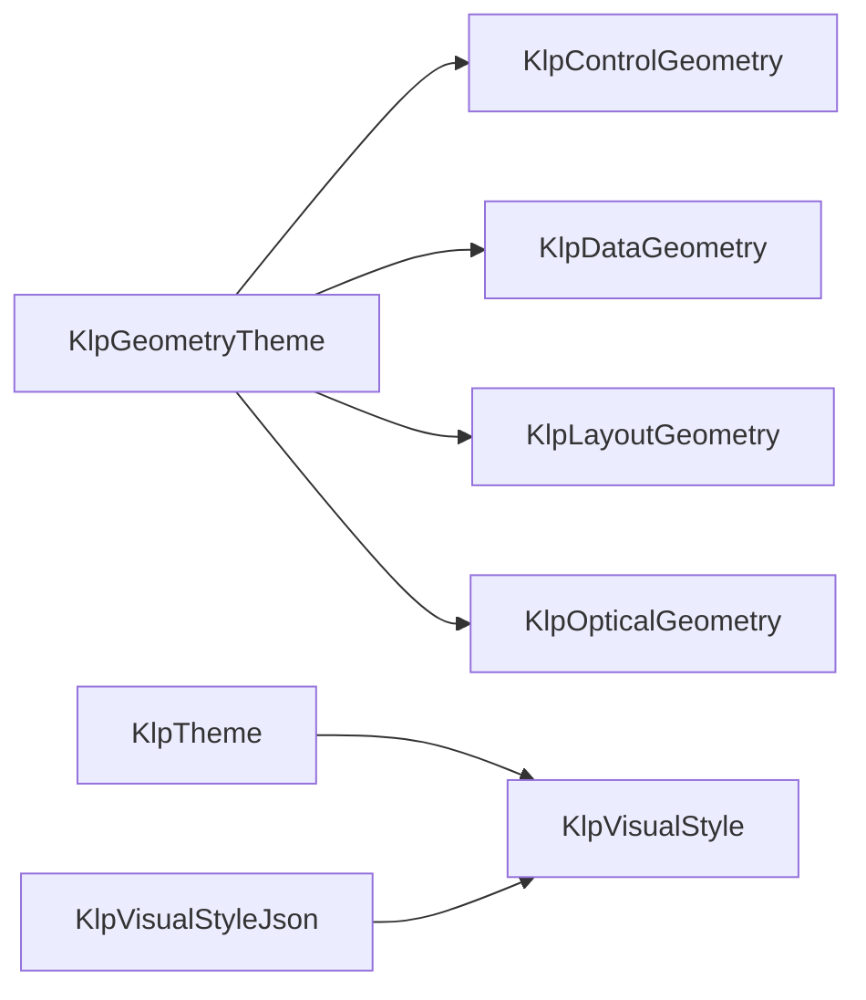

虛線框是其他領域的型別。

### foundation — 圖示、色盤、度量

型別 22 個，widget 4 個。

| 型別 | 行數 | 組成 |
|---|---|---|
| `KlpCodeMetrics` | 20 | （葉節點） |
| `KlpControlMetrics` | 14 | （葉節點） |
| `KlpDecorativePalette` | 18 | （葉節點） |
| `KlpElevation` | 14 | （葉節點） |
| `KlpFormMetrics` | 18 | （葉節點） |
| `KlpGeometricSpinner` | 164 | （葉節點） |
| `KlpIcon` | 50 | （葉節點） |
| `KlpIconData` | 20 | （葉節點） |
| `KlpIconWeight` | 2 | （葉節點） |
| `KlpIcons` | 62 | `KlpIconData` |
| `KlpInlineCode` | 54 | （葉節點） |
| `KlpLayoutGap` | 8 | （葉節點） |
| `KlpLine` | 13 | （葉節點） |
| `KlpMotion` | 9 | （葉節點） |
| `KlpOklchColor` | 132 | （葉節點） |
| `KlpPlaceholderMetrics` | 23 | （葉節點） |
| `KlpRadius` | 18 | （葉節點） |
| `KlpSegmentedProgress` | 34 | （葉節點） |
| `KlpSize` | 34 | （葉節點） |
| `KlpSpace` | 16 | （葉節點） |
| `KlpTransparency` | 4 | （葉節點） |
| `KlpTypography` | 72 | （葉節點） |

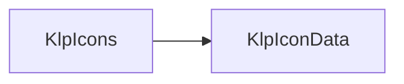

虛線框是其他領域的型別。

### typography — 文字

型別 11 個，widget 2 個。

| 型別 | 行數 | 組成 |
|---|---|---|
| `KlpFontRole` | 11 | （葉節點） |
| `KlpRichText` | 135 | `KlpInlineCode`、`KlpText` |
| `KlpRichTextKind` | 19 | （葉節點） |
| `KlpRichTextNode` | 26 | （葉節點） |
| `KlpRichTextSpan` | 10 | （葉節點） |
| `KlpText` | 173 | （葉節點） |
| `KlpTextColorTier` | 4 | （葉節點） |
| `KlpTextRole` | 28 | （葉節點） |
| `KlpTextStyleDefinition` | 41 | （葉節點） |
| `KlpTextStyles` | 210 | `KlpTextStyleDefinition` |
| `KlpTextTone` | 7 | （葉節點） |

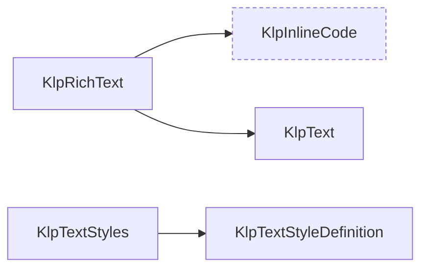

虛線框是其他領域的型別。

### surface — 表面與描邊

型別 14 個，widget 8 個。

| 型別 | 行數 | 組成 |
|---|---|---|
| `KlpDashedBorder` | 51 | `KlpStrokeFrame` |
| `KlpDashedDivider` | 111 | （葉節點） |
| `KlpDivider` | 14 | （葉節點） |
| `KlpPageBackground` | 52 | `KlpPageBackgroundPainter`、`KlpPageBackgroundVisuals` |
| `KlpPageBackgroundEditor` | 162 | （葉節點） |
| `KlpPageBackgroundPainter` | 47 | （葉節點） |
| `KlpPageBackgroundStyle` | 3 | （葉節點） |
| `KlpPageBackgroundVisuals` | 30 | （葉節點） |
| `KlpSection` | 46 | `KlpText` |
| `KlpStrokeFrame` | 139 | （葉節點） |
| `KlpStrokeRole` | 2 | （葉節點） |
| `KlpStrokeState` | 2 | （葉節點） |
| `KlpSurface` | 106 | `KlpTokenOverride` |
| `KlpSurfaceTone` | 16 | （葉節點） |

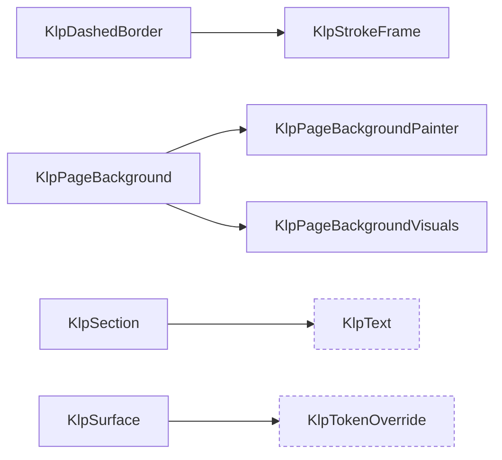

虛線框是其他領域的型別。

### interaction — 互動

型別 20 個，widget 11 個。

| 型別 | 行數 | 組成 |
|---|---|---|
| `KlpCommandIntent` | 5 | （葉節點） |
| `KlpDragPreview` | 18 | `KlpSurface` |
| `KlpDropIndicator` | 19 | （葉節點） |
| `KlpDropTarget` | 19 | `KlpStrokeFrame`、`KlpSurface` |
| `KlpFilterBar` | 166 | `KlpDashedBorder`、`KlpIcon`、`KlpPressable`、`KlpText` |
| `KlpFilterOption` | 16 | （葉節點） |
| `KlpHighlightState` | 19 | （葉節點） |
| `KlpInteractionSettings` | 27 | （葉節點） |
| `KlpKeyBinding` | 17 | （葉節點） |
| `KlpKeyBindingController` | 87 | `KlpCommandIntent` |
| `KlpKeyBindingHost` | 15 | （葉節點） |
| `KlpKeyBindingRegion` | 33 | （葉節點） |
| `KlpKeyBindingScope` | 3 | （葉節點） |
| `KlpPresenceIndicator` | 30 | `KlpText` |
| `KlpPressable` | 191 | （葉節點） |
| `KlpRovingIndex` | 41 | （葉節點） |
| `KlpSelectionAction` | 13 | （葉節點） |
| `KlpSelectionToolbar` | 63 | `KlpButton`、`KlpDashedBorder`、`KlpPressable`、`KlpSurface`、`KlpText` |
| `KlpShortcutHint` | 16 | `KlpSurface`、`KlpText` |
| `KlpStateHighlight` | 43 | （葉節點） |

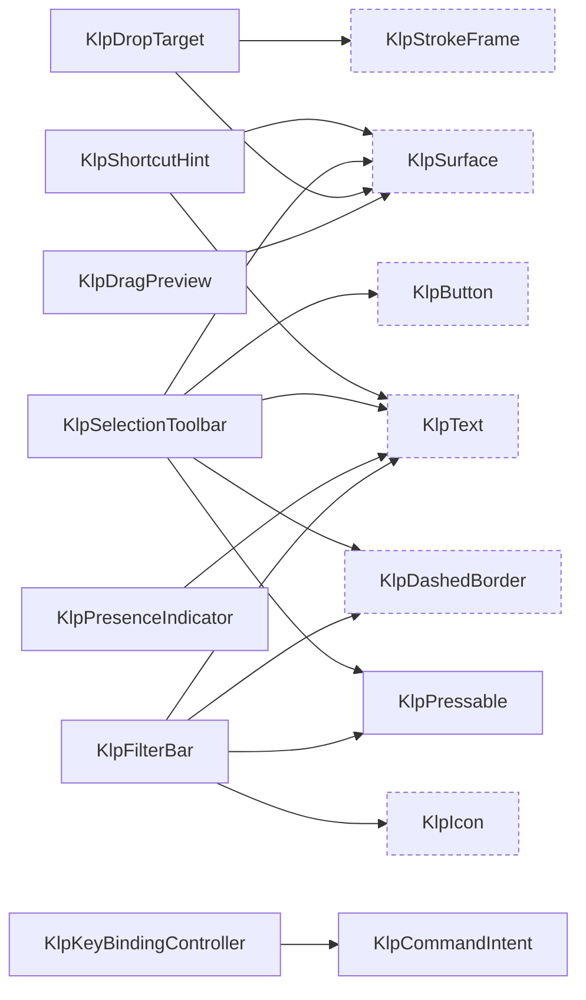

虛線框是其他領域的型別。

### layout — 版面原語

型別 9 個，widget 9 個。

| 型別 | 行數 | 組成 |
|---|---|---|
| `KlpMasonryGrid` | 56 | （葉節點） |
| `KlpOverlayHost` | 16 | （葉節點） |
| `KlpRegion` | 40 | `KlpSurface` |
| `KlpResizablePane` | 13 | （葉節點） |
| `KlpResizeHandle` | 74 | （葉節點） |
| `KlpScrollViewport` | 23 | （葉節點） |
| `KlpSplitLayout` | 62 | `KlpDashedDivider` |
| `KlpVirtualGrid` | 45 | （葉節點） |
| `KlpVirtualList` | 26 | （葉節點） |

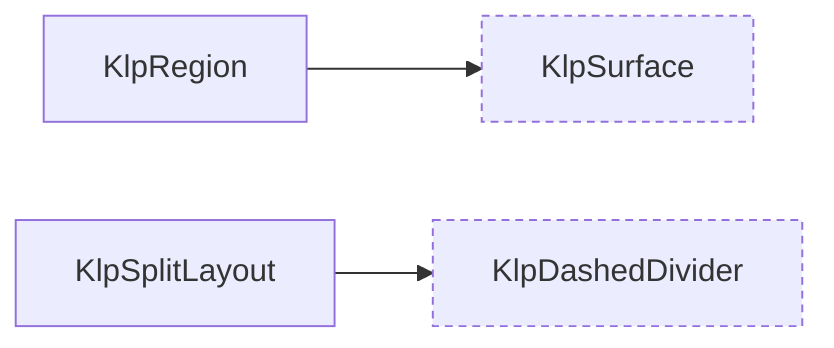

虛線框是其他領域的型別。

### overlay — 浮層

型別 17 個，widget 10 個。

| 型別 | 行數 | 組成 |
|---|---|---|
| `KlpContextMenu` | 146 | `KlpMenu`、`KlpMenuItemData` |
| `KlpContextMenuController` | 31 | （葉節點） |
| `KlpDialog` | 76 | `KlpButton`、`KlpSurface`、`KlpText` |
| `KlpDrawer` | 94 | `KlpSurface` |
| `KlpDrawerEdge` | 9 | （葉節點） |
| `KlpMenu` | 174 | `KlpDashedDivider`、`KlpDivider`、`KlpMenuItem`、`KlpSurface`、`KlpText` |
| `KlpMenuItem` | 120 | `KlpIcon`、`KlpText`、`KlpToggleIndicator` |
| `KlpMenuItemData` | 43 | （葉節點） |
| `KlpMenuLayout` | 111 | （葉節點） |
| `KlpMenuStyle` | 32 | （葉節點） |
| `KlpPopover` | 15 | `KlpSurface` |
| `KlpPopupBackground` | 38 | （葉節點） |
| `KlpPopupInteractionScope` | 20 | （葉節點） |
| `KlpPopupPanel` | 36 | `KlpSurface` |
| `KlpPopupPanelKind` | 3 | （葉節點） |
| `KlpTooltip` | 12 | （葉節點） |
| `KlpTooltipSurface` | 42 | （葉節點） |

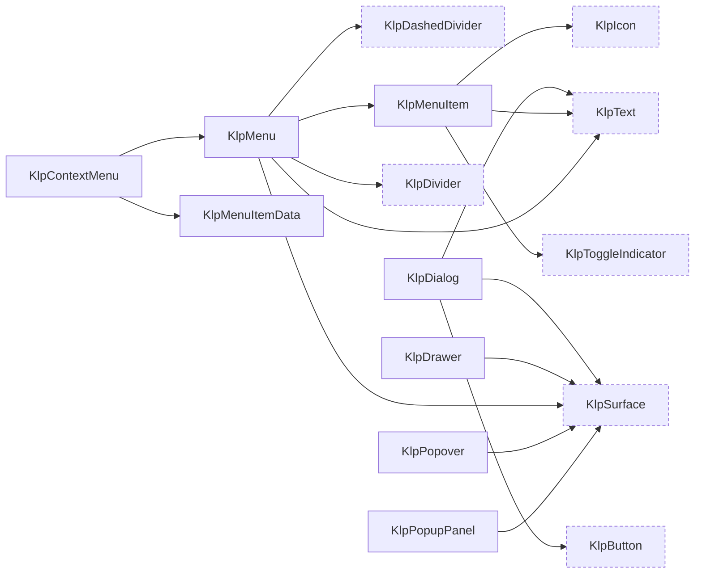

虛線框是其他領域的型別。

### controls — 控制項

型別 25 個，widget 17 個。

| 型別 | 行數 | 組成 |
|---|---|---|
| `KlpButton` | 109 | `KlpDashedBorder`、`KlpPressable`、`KlpText` |
| `KlpButtonTone` | 1 | （葉節點） |
| `KlpCheckbox` | 74 | `KlpIcon`、`KlpText` |
| `KlpCombobox` | 208 | `KlpMenu`、`KlpMenuItemData`、`KlpTextField` |
| `KlpComboboxOption` | 23 | （葉節點） |
| `KlpCompactSwitch` | 58 | `KlpPressable` |
| `KlpControlSize` | 1 | （葉節點） |
| `KlpIconButton` | 91 | `KlpIcon`、`KlpTooltip` |
| `KlpIconButtonSize` | 10 | （葉節點） |
| `KlpIconButtonTone` | 12 | （葉節點） |
| `KlpOklchColorEditor` | 100 | `KlpSlider` |
| `KlpOklchColorPicker` | 319 | `KlpOklchColorEditor`、`KlpText` |
| `KlpPhaseOption` | 19 | （葉節點） |
| `KlpPhaseToggle` | 167 | `KlpIcon`、`KlpText` |
| `KlpRadioGroup` | 136 | `KlpPressable`、`KlpText` |
| `KlpSegmentedControl` | 152 | `KlpIcon`、`KlpText` |
| `KlpSelect` | 84 | `KlpIcon`、`KlpStrokeFrame`、`KlpText` |
| `KlpSelectionOption` | 7 | （葉節點） |
| `KlpSlider` | 78 | `KlpText` |
| `KlpSlidingSelection` | 111 | `KlpIcon` |
| `KlpTextField` | 313 | `KlpIcon`、`KlpText` |
| `KlpToggle` | 51 | `KlpText`、`KlpToggleIndicator` |
| `KlpToggleIndicator` | 53 | （葉節點） |
| `KlpTriState` | 2 | （葉節點） |
| `KlpTriStateToggle` | 41 | `KlpSelectionOption`、`KlpSlidingSelection`、`KlpText` |

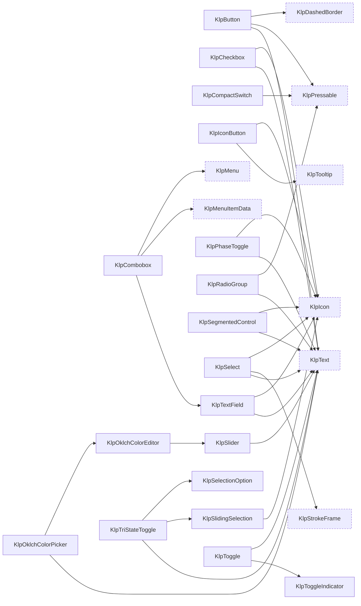

虛線框是其他領域的型別。

### data — 資料呈現

型別 53 個，widget 28 個。

| 型別 | 行數 | 組成 |
|---|---|---|
| `KlpAccordion` | 165 | `KlpIcon`、`KlpText` |
| `KlpAccordionItemData` | 20 | （葉節點） |
| `KlpAvatar` | 53 | `KlpText` |
| `KlpAvatarData` | 8 | （葉節點） |
| `KlpAvatarGroup` | 35 | `KlpAvatar` |
| `KlpBadge` | 92 | `KlpText` |
| `KlpBadgeVariant` | 13 | （葉節點） |
| `KlpCard` | 75 | `KlpText` |
| `KlpCodeLanguageOption` | 13 | （葉節點） |
| `KlpCodeLanguages` | 29 | `KlpCodeLanguageOption` |
| `KlpCodeViewer` | 553 | `KlpIcon`、`KlpMenu`、`KlpMenuItemData`、`KlpPressable`、`KlpText`、`KlpTooltip` |
| `KlpCodeViewerLabels` | 27 | （葉節點） |
| `KlpDataAlignment` | 1 | （葉節點） |
| `KlpDataColumn` | 18 | （葉節點） |
| `KlpDataRow` | 8 | （葉節點） |
| `KlpDataSort` | 8 | （葉節點） |
| `KlpDataTable` | 213 | `KlpCheckbox`、`KlpDashedDivider`、`KlpIcon`、`KlpSurface`、`KlpText` |
| `KlpDateGrid` | 54 | `KlpSurface`、`KlpText` |
| `KlpDateGridItem` | 13 | （葉節點） |
| `KlpDiffLine` | 17 | （葉節點） |
| `KlpDiffLineType` | 4 | （葉節點） |
| `KlpDiffViewer` | 210 | `KlpPressable`、`KlpText` |
| `KlpFilePreview` | 176 | `KlpDashedDivider`、`KlpGeometricSpinner`、`KlpText` |
| `KlpFilePreviewState` | 1 | （葉節點） |
| `KlpJsonTree` | 192 | `KlpIcon`、`KlpSurface`、`KlpText` |
| `KlpKeyValueItem` | 16 | （葉節點） |
| `KlpKeyValueList` | 74 | `KlpIcon`、`KlpText` |
| `KlpKeyValueRowData` | 7 | （葉節點） |
| `KlpKeyValueTable` | 62 | `KlpSurface`、`KlpText` |
| `KlpListTile` | 142 | `KlpIcon`、`KlpText` |
| `KlpMessageAlignment` | 3 | （葉節點） |
| `KlpMessageBubble` | 57 | `KlpSurface`、`KlpText` |
| `KlpMessageThread` | 41 | `KlpButton` |
| `KlpMetricCard` | 102 | `KlpText` |
| `KlpPreviewCard` | 67 | `KlpDashedBorder`、`KlpSurface`、`KlpText` |
| `KlpProgress` | 82 | `KlpText` |
| `KlpProgressState` | 2 | （葉節點） |
| `KlpScheduleItemData` | 13 | （葉節點） |
| `KlpScheduleList` | 44 | `KlpBadge`、`KlpSurface`、`KlpText` |
| `KlpSortControl` | 32 | `KlpIcon`、`KlpText` |
| `KlpSortDirection` | 3 | （葉節點） |
| `KlpStepData` | 11 | （葉節點） |
| `KlpStepStatus` | 4 | （葉節點） |
| `KlpStepper` | 251 | `KlpIcon`、`KlpText` |
| `KlpTag` | 61 | `KlpText` |
| `KlpTaskItemData` | 13 | （葉節點） |
| `KlpTaskList` | 57 | `KlpCheckbox`、`KlpText` |
| `KlpTerminal` | 119 | `KlpPressable`、`KlpText` |
| `KlpTimeline` | 123 | `KlpText` |
| `KlpTimelineItemData` | 20 | （葉節點） |
| `KlpTree` | 45 | （葉節點） |
| `KlpTreeItem` | 174 | `KlpIcon`、`KlpStateHighlight`、`KlpText` |
| `KlpTreeNode` | 26 | （葉節點） |

```mermaid
graph LR
  KlpAccordion["KlpAccordion"]
  KlpAvatar["KlpAvatar"]
  KlpAvatarGroup["KlpAvatarGroup"]
  KlpBadge["KlpBadge"]
  KlpButton["KlpButton"]:::external
  KlpCard["KlpCard"]
  KlpCheckbox["KlpCheckbox"]:::external
  KlpCodeLanguageOption["KlpCodeLanguageOption"]
  KlpCodeLanguages["KlpCodeLanguages"]
  KlpCodeViewer["KlpCodeViewer"]
  KlpDashedBorder["KlpDashedBorder"]:::external
  KlpDashedDivider["KlpDashedDivider"]:::external
  KlpDataTable["KlpDataTable"]
  KlpDateGrid["KlpDateGrid"]
  KlpDiffViewer["KlpDiffViewer"]
  KlpFilePreview["KlpFilePreview"]
  KlpGeometricSpinner["KlpGeometricSpinner"]:::external
  KlpIcon["KlpIcon"]:::external
  KlpJsonTree["KlpJsonTree"]
  KlpKeyValueList["KlpKeyValueList"]
  KlpKeyValueTable["KlpKeyValueTable"]
  KlpListTile["KlpListTile"]
  KlpMenu["KlpMenu"]:::external
  KlpMenuItemData["KlpMenuItemData"]:::external
  KlpMessageBubble["KlpMessageBubble"]
  KlpMessageThread["KlpMessageThread"]
  KlpMetricCard["KlpMetricCard"]
  KlpPressable["KlpPressable"]:::external
  KlpPreviewCard["KlpPreviewCard"]
  KlpProgress["KlpProgress"]
  KlpScheduleList["KlpScheduleList"]
  KlpSortControl["KlpSortControl"]
  KlpStateHighlight["KlpStateHighlight"]:::external
  KlpStepper["KlpStepper"]
  KlpSurface["KlpSurface"]:::external
  KlpTag["KlpTag"]
  KlpTaskList["KlpTaskList"]
  KlpTerminal["KlpTerminal"]
  KlpText["KlpText"]:::external
  KlpTimeline["KlpTimeline"]
  KlpTooltip["KlpTooltip"]:::external
  KlpTreeItem["KlpTreeItem"]
  KlpAccordion --> KlpIcon
  KlpAccordion --> KlpText
  KlpAvatarGroup --> KlpAvatar
  KlpAvatar --> KlpText
  KlpBadge --> KlpText
  KlpCard --> KlpText
  KlpCodeLanguages --> KlpCodeLanguageOption
  KlpCodeViewer --> KlpIcon
  KlpCodeViewer --> KlpMenu
  KlpCodeViewer --> KlpMenuItemData
  KlpCodeViewer --> KlpPressable
  KlpCodeViewer --> KlpText
  KlpCodeViewer --> KlpTooltip
  KlpDataTable --> KlpCheckbox
  KlpDataTable --> KlpDashedDivider
  KlpDataTable --> KlpIcon
  KlpDataTable --> KlpSurface
  KlpDataTable --> KlpText
  KlpDateGrid --> KlpSurface
  KlpDateGrid --> KlpText
  KlpDiffViewer --> KlpPressable
  KlpDiffViewer --> KlpText
  KlpFilePreview --> KlpDashedDivider
  KlpFilePreview --> KlpGeometricSpinner
  KlpFilePreview --> KlpText
  KlpJsonTree --> KlpIcon
  KlpJsonTree --> KlpSurface
  KlpJsonTree --> KlpText
  KlpKeyValueList --> KlpIcon
  KlpKeyValueList --> KlpText
  KlpKeyValueTable --> KlpSurface
  KlpKeyValueTable --> KlpText
  KlpListTile --> KlpIcon
  KlpListTile --> KlpText
  KlpMessageBubble --> KlpSurface
  KlpMessageBubble --> KlpText
  KlpMessageThread --> KlpButton
  KlpMetricCard --> KlpText
  KlpPreviewCard --> KlpDashedBorder
  KlpPreviewCard --> KlpSurface
  KlpPreviewCard --> KlpText
  KlpProgress --> KlpText
  KlpScheduleList --> KlpBadge
  KlpScheduleList --> KlpSurface
  KlpScheduleList --> KlpText
  KlpSortControl --> KlpIcon
  KlpSortControl --> KlpText
  KlpStepper --> KlpIcon
  KlpStepper --> KlpText
  KlpTag --> KlpText
  KlpTaskList --> KlpCheckbox
  KlpTaskList --> KlpText
  KlpTerminal --> KlpPressable
  KlpTerminal --> KlpText
  KlpTimeline --> KlpText
  KlpTreeItem --> KlpIcon
  KlpTreeItem --> KlpStateHighlight
  KlpTreeItem --> KlpText
  classDef external stroke-dasharray: 4 3;
```

虛線框是其他領域的型別。

### form — 表單

型別 45 個，widget 33 個。

| 型別 | 行數 | 組成 |
|---|---|---|
| `KlpAffixedTextField` | 70 | `KlpText` |
| `KlpApprovalStepData` | 7 | （葉節點） |
| `KlpApprovalStepsField` | 150 | `KlpText` |
| `KlpCalendar` | 287 | `KlpIconButton`、`KlpStateHighlight`、`KlpText` |
| `KlpCalendarRange` | 28 | （葉節點） |
| `KlpCalendarSelectionMode` | 7 | （葉節點） |
| `KlpChoiceOption` | 11 | （葉節點） |
| `KlpCodeEditorField` | 106 | `KlpText` |
| `KlpCodeField` | 37 | `KlpCodeViewer`、`KlpText`、`KlpTextArea` |
| `KlpColorRoleField` | 29 | `KlpSelectField` |
| `KlpCompoundField` | 140 | `KlpIcon`、`KlpText` |
| `KlpConditionalFieldRegion` | 18 | （葉節點） |
| `KlpDateField` | 78 | `KlpCalendar`、`KlpTextField` |
| `KlpDateFieldCalendar` | 32 | （葉節點） |
| `KlpDateRangeField` | 79 | `KlpText` |
| `KlpField` | 118 | `KlpFieldDescription`、`KlpFieldLabel`、`KlpText` |
| `KlpFieldDescription` | 14 | `KlpText` |
| `KlpFieldError` | 17 | `KlpText` |
| `KlpFieldGroup` | 24 | `KlpField` |
| `KlpFieldLabel` | 10 | `KlpText` |
| `KlpFieldVisualState` | 12 | （葉節點） |
| `KlpFileAttachment` | 12 | （葉節點） |
| `KlpFileDropzoneField` | 146 | `KlpText` |
| `KlpFileField` | 40 | `KlpButton`、`KlpFilePreview`、`KlpText` |
| `KlpFileValue` | 12 | （葉節點） |
| `KlpForm` | 34 | （葉節點） |
| `KlpFormActions` | 47 | `KlpButton` |
| `KlpFormErrorSummary` | 46 | `KlpSurface`、`KlpText` |
| `KlpFormSection` | 47 | `KlpSurface`、`KlpText` |
| `KlpKeyValueEditor` | 59 | `KlpText`、`KlpTextField` |
| `KlpKeyValueEntry` | 24 | （葉節點） |
| `KlpMultiSelectField` | 99 | `KlpText` |
| `KlpNumberField` | 38 | `KlpTextField` |
| `KlpPasswordField` | 170 | `KlpIcon`、`KlpText` |
| `KlpPasswordRequirement` | 7 | （葉節點） |
| `KlpQuantityField` | 68 | `KlpText` |
| `KlpReferenceOption` | 16 | （葉節點） |
| `KlpReferencePicker` | 82 | `KlpBadge`、`KlpSurface`、`KlpText`、`KlpTextField` |
| `KlpRepeaterField` | 53 | `KlpButton`、`KlpSurface`、`KlpText` |
| `KlpRepeaterItem` | 11 | （葉節點） |
| `KlpSelectField` | 152 | `KlpIcon`、`KlpText` |
| `KlpStatusRoleSwatches` | 73 | `KlpText` |
| `KlpTagChip` | 42 | `KlpText` |
| `KlpTagInputField` | 82 | `KlpTagChip`、`KlpText` |
| `KlpTextArea` | 43 | `KlpTextField` |

```mermaid
graph LR
  KlpAffixedTextField["KlpAffixedTextField"]
  KlpApprovalStepsField["KlpApprovalStepsField"]
  KlpBadge["KlpBadge"]:::external
  KlpButton["KlpButton"]:::external
  KlpCalendar["KlpCalendar"]
  KlpCodeEditorField["KlpCodeEditorField"]
  KlpCodeField["KlpCodeField"]
  KlpCodeViewer["KlpCodeViewer"]:::external
  KlpColorRoleField["KlpColorRoleField"]
  KlpCompoundField["KlpCompoundField"]
  KlpDateField["KlpDateField"]
  KlpDateRangeField["KlpDateRangeField"]
  KlpField["KlpField"]
  KlpFieldDescription["KlpFieldDescription"]
  KlpFieldError["KlpFieldError"]
  KlpFieldGroup["KlpFieldGroup"]
  KlpFieldLabel["KlpFieldLabel"]
  KlpFileDropzoneField["KlpFileDropzoneField"]
  KlpFileField["KlpFileField"]
  KlpFilePreview["KlpFilePreview"]:::external
  KlpFormActions["KlpFormActions"]
  KlpFormErrorSummary["KlpFormErrorSummary"]
  KlpFormSection["KlpFormSection"]
  KlpIcon["KlpIcon"]:::external
  KlpIconButton["KlpIconButton"]:::external
  KlpKeyValueEditor["KlpKeyValueEditor"]
  KlpMultiSelectField["KlpMultiSelectField"]
  KlpNumberField["KlpNumberField"]
  KlpPasswordField["KlpPasswordField"]
  KlpQuantityField["KlpQuantityField"]
  KlpReferencePicker["KlpReferencePicker"]
  KlpRepeaterField["KlpRepeaterField"]
  KlpSelectField["KlpSelectField"]
  KlpStateHighlight["KlpStateHighlight"]:::external
  KlpStatusRoleSwatches["KlpStatusRoleSwatches"]
  KlpSurface["KlpSurface"]:::external
  KlpTagChip["KlpTagChip"]
  KlpTagInputField["KlpTagInputField"]
  KlpText["KlpText"]:::external
  KlpTextArea["KlpTextArea"]
  KlpTextField["KlpTextField"]:::external
  KlpAffixedTextField --> KlpText
  KlpApprovalStepsField --> KlpText
  KlpCalendar --> KlpIconButton
  KlpCalendar --> KlpStateHighlight
  KlpCalendar --> KlpText
  KlpCodeEditorField --> KlpText
  KlpCodeField --> KlpCodeViewer
  KlpCodeField --> KlpText
  KlpCodeField --> KlpTextArea
  KlpColorRoleField --> KlpSelectField
  KlpCompoundField --> KlpIcon
  KlpCompoundField --> KlpText
  KlpDateField --> KlpCalendar
  KlpDateField --> KlpTextField
  KlpDateRangeField --> KlpText
  KlpFieldDescription --> KlpText
  KlpFieldError --> KlpText
  KlpFieldGroup --> KlpField
  KlpFieldLabel --> KlpText
  KlpField --> KlpFieldDescription
  KlpField --> KlpFieldLabel
  KlpField --> KlpText
  KlpFileDropzoneField --> KlpText
  KlpFileField --> KlpButton
  KlpFileField --> KlpFilePreview
  KlpFileField --> KlpText
  KlpFormActions --> KlpButton
  KlpFormErrorSummary --> KlpSurface
  KlpFormErrorSummary --> KlpText
  KlpFormSection --> KlpSurface
  KlpFormSection --> KlpText
  KlpKeyValueEditor --> KlpText
  KlpKeyValueEditor --> KlpTextField
  KlpMultiSelectField --> KlpText
  KlpNumberField --> KlpTextField
  KlpPasswordField --> KlpIcon
  KlpPasswordField --> KlpText
  KlpQuantityField --> KlpText
  KlpReferencePicker --> KlpBadge
  KlpReferencePicker --> KlpSurface
  KlpReferencePicker --> KlpText
  KlpReferencePicker --> KlpTextField
  KlpRepeaterField --> KlpButton
  KlpRepeaterField --> KlpSurface
  KlpRepeaterField --> KlpText
  KlpSelectField --> KlpIcon
  KlpSelectField --> KlpText
  KlpStatusRoleSwatches --> KlpText
  KlpTagChip --> KlpText
  KlpTagInputField --> KlpTagChip
  KlpTagInputField --> KlpText
  KlpTextArea --> KlpTextField
  classDef external stroke-dasharray: 4 3;
```

虛線框是其他領域的型別。

### feedback — 狀態與回饋

型別 20 個，widget 15 個。

| 型別 | 行數 | 組成 |
|---|---|---|
| `KlpEmptyState` | 52 | `KlpDashedBorder`、`KlpIcon`、`KlpText` |
| `KlpErrorState` | 34 | `KlpButton` |
| `KlpFeedbackTone` | 29 | （葉節點） |
| `KlpFocusBoundary` | 32 | （葉節點） |
| `KlpInlineNotice` | 78 | `KlpIcon`、`KlpSurface`、`KlpText` |
| `KlpLiveRegion` | 16 | （葉節點） |
| `KlpLoadingState` | 35 | `KlpGeometricSpinner`、`KlpText` |
| `KlpPermissionState` | 26 | （葉節點） |
| `KlpProgressOverlay` | 95 | `KlpDashedBorder`、`KlpIcon`、`KlpLoadingState`、`KlpText` |
| `KlpRegionPlaceholder` | 275 | `KlpPressable`、`KlpText` |
| `KlpRegionPlaceholderTone` | 2 | （葉節點） |
| `KlpSkeletonLine` | 19 | （葉節點） |
| `KlpStatusIndicator` | 66 | `KlpText` |
| `KlpStatusKind` | 24 | （葉節點） |
| `KlpToast` | 115 | `KlpButton`、`KlpIcon`、`KlpText` |
| `KlpToastStack` | 20 | （葉節點） |
| `KlpWorkflowProgress` | 41 | `KlpBadge`、`KlpText` |
| `KlpWorkflowStageData` | 15 | （葉節點） |
| `KlpWorkflowState` | 4 | （葉節點） |
| `KlpWorkflowStateSurface` | 75 | `KlpBadge`、`KlpButton`、`KlpGeometricSpinner`、`KlpSurface`、`KlpText` |

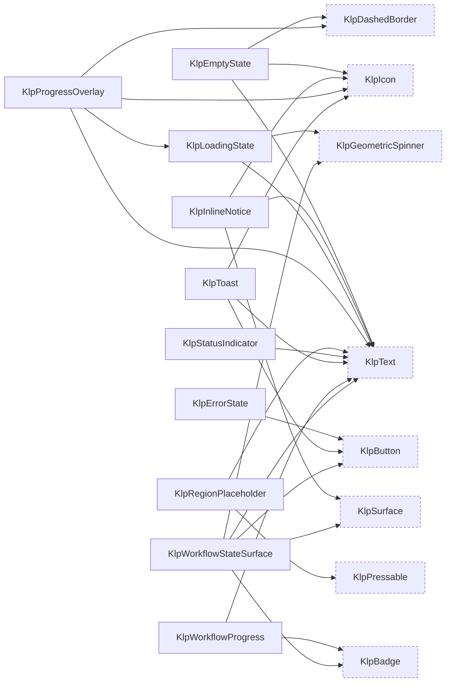

虛線框是其他領域的型別。

### navigation — 導覽元件

型別 33 個，widget 20 個。

| 型別 | 行數 | 組成 |
|---|---|---|
| `KlpActionGroup` | 20 | （葉節點） |
| `KlpBreadcrumb` | 34 | `KlpText` |
| `KlpExplorer` | 104 | `KlpExplorerNode`、`KlpNavigator`、`KlpNavigatorCategory`、`KlpNavigatorElement` |
| `KlpExplorerCategory` | 21 | （葉節點） |
| `KlpExplorerNode` | 29 | （葉節點） |
| `KlpExplorerNodeKind` | 7 | （葉節點） |
| `KlpFileExplorer` | 183 | `KlpFileExplorerSectionView` |
| `KlpFileExplorerFolderView` | 150 | `KlpIcon`、`KlpStateHighlight`、`KlpText` |
| `KlpFileExplorerItem` | 35 | （葉節點） |
| `KlpFileExplorerItemView` | 99 | `KlpIcon`、`KlpStateHighlight`、`KlpText` |
| `KlpFileExplorerSection` | 39 | （葉節點） |
| `KlpFileExplorerSectionView` | 168 | `KlpFileExplorerFolderView`、`KlpFileExplorerItemView`、`KlpIcon`、`KlpPressable`、`KlpText` |
| `KlpNavigationRail` | 253 | `KlpDropIndicator`、`KlpRailDivider` |
| `KlpNavigator` | 416 | `KlpIcon`、`KlpNavigatorCategory`、`KlpNavigatorComponent`、`KlpNavigatorElement`、`KlpPressable`、`KlpStateHighlight`、`KlpSurface`、`KlpText` |
| `KlpNavigatorCategory` | 20 | （葉節點） |
| `KlpNavigatorComponent` | 6 | （葉節點） |
| `KlpNavigatorElement` | 32 | （葉節點） |
| `KlpPagination` | 46 | `KlpButton`、`KlpText` |
| `KlpPreviewTree` | 51 | `KlpTreeItem`、`KlpTreeNode` |
| `KlpPreviewTreeNode` | 17 | （葉節點） |
| `KlpPublicationProgressOverlay` | 15 | （葉節點） |
| `KlpRailButtonEntry` | 28 | `KlpRailItem` |
| `KlpRailDivider` | 9 | `KlpDashedDivider` |
| `KlpRailItem` | 125 | `KlpIcon`、`KlpTooltipSurface` |
| `KlpRailItemGroup` | 15 | （葉節點） |
| `KlpRailMenuEntry` | 67 | `KlpContextMenu`、`KlpContextMenuController`、`KlpRailItem` |
| `KlpSidebarIdentityHeader` | 75 | `KlpAvatar`、`KlpIcon`、`KlpSurface`、`KlpText` |
| `KlpSidebarNavigationButton` | 102 | `KlpIcon`、`KlpPressable`、`KlpText` |
| `KlpSidebarNavigationGroup` | 14 | （葉節點） |
| `KlpSidebarSectionLabel` | 23 | `KlpText` |
| `KlpTabs` | 106 | `KlpText` |
| `KlpViewOption` | 14 | （葉節點） |
| `KlpViewSwitcher` | 83 | `KlpSurface`、`KlpText` |

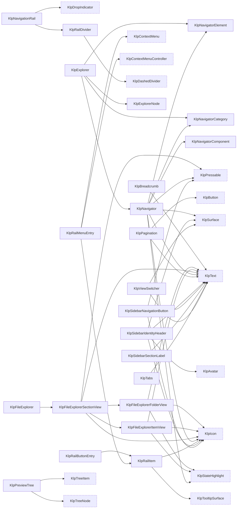

虛線框是其他領域的型別。

### editor — 編輯器周邊

型別 38 個，widget 29 個。

| 型別 | 行數 | 組成 |
|---|---|---|
| `KlpAccessibilityContractPanel` | 13 | `KlpSurface`、`KlpText` |
| `KlpBulkActionBar` | 26 | `KlpText` |
| `KlpCanvasDropIntent` | 19 | （葉節點） |
| `KlpCanvasMinimap` | 17 | `KlpSurface` |
| `KlpCanvasSelectionOverlay` | 30 | （葉節點） |
| `KlpCanvasToolbar` | 14 | `KlpSurface` |
| `KlpCanvasViewport` | 30 | （葉節點） |
| `KlpCommandItemData` | 19 | （葉節點） |
| `KlpCommandMenu` | 214 | `KlpText` |
| `KlpCommandSectionData` | 17 | （葉節點） |
| `KlpComponentDefinitionCard` | 23 | `KlpPreviewCard` |
| `KlpComponentDefinitionData` | 11 | （葉節點） |
| `KlpComponentLibraryGrid` | 20 | `KlpComponentDefinitionCard` |
| `KlpComponentStateSelector` | 12 | `KlpTabs` |
| `KlpDocumentEditActions` | 31 | `KlpButton` |
| `KlpDocumentField` | 13 | `KlpField` |
| `KlpDocumentHeader` | 26 | `KlpBadge`、`KlpText` |
| `KlpDocumentReferenceLink` | 16 | `KlpButton` |
| `KlpDocumentSection` | 25 | `KlpText` |
| `KlpEditorActionData` | 14 | （葉節點） |
| `KlpEditorToolbar` | 17 | （葉節點） |
| `KlpEntityPicker` | 111 | `KlpBadge`、`KlpButton`、`KlpText`、`KlpTextField` |
| `KlpEntityResultData` | 14 | （葉節點） |
| `KlpFlowNodeCard` | 26 | `KlpBadge`、`KlpSurface`、`KlpText` |
| `KlpFlowValidationPanel` | 19 | `KlpInlineNotice`、`KlpText` |
| `KlpLayoutDiagnosticData` | 9 | （葉節點） |
| `KlpLayoutLens` | 19 | `KlpBadge`、`KlpSurface`、`KlpText` |
| `KlpMessageComposer` | 111 | `KlpBadge`、`KlpButton`、`KlpIconButton`、`KlpSurface`、`KlpTextArea` |
| `KlpMessageConversation` | 38 | （葉節點） |
| `KlpPageChrome` | 57 | `KlpBadge`、`KlpSurface`、`KlpText` |
| `KlpPropertyBadgeData` | 11 | （葉節點） |
| `KlpPropertySummary` | 45 | `KlpBadge`、`KlpSurface`、`KlpTag`、`KlpText` |
| `KlpSaveStatusCard` | 55 | `KlpText` |
| `KlpSearchNavigator` | 112 | `KlpIconButton`、`KlpText`、`KlpTextField` |
| `KlpStatusMessageData` | 15 | （葉節點） |
| `KlpTokenDefinitionData` | 12 | （葉節點） |
| `KlpTokenTable` | 29 | `KlpBadge`、`KlpDataColumn`、`KlpDataRow`、`KlpDataTable`、`KlpText` |
| `KlpTokenValidationBanner` | 13 | `KlpInlineNotice` |

```mermaid
graph LR
  KlpAccessibilityContractPanel["KlpAccessibilityContractPanel"]
  KlpBadge["KlpBadge"]:::external
  KlpBulkActionBar["KlpBulkActionBar"]
  KlpButton["KlpButton"]:::external
  KlpCanvasMinimap["KlpCanvasMinimap"]
  KlpCanvasToolbar["KlpCanvasToolbar"]
  KlpCommandMenu["KlpCommandMenu"]
  KlpComponentDefinitionCard["KlpComponentDefinitionCard"]
  KlpComponentLibraryGrid["KlpComponentLibraryGrid"]
  KlpComponentStateSelector["KlpComponentStateSelector"]
  KlpDataColumn["KlpDataColumn"]:::external
  KlpDataRow["KlpDataRow"]:::external
  KlpDataTable["KlpDataTable"]:::external
  KlpDocumentEditActions["KlpDocumentEditActions"]
  KlpDocumentField["KlpDocumentField"]
  KlpDocumentHeader["KlpDocumentHeader"]
  KlpDocumentReferenceLink["KlpDocumentReferenceLink"]
  KlpDocumentSection["KlpDocumentSection"]
  KlpEntityPicker["KlpEntityPicker"]
  KlpField["KlpField"]:::external
  KlpFlowNodeCard["KlpFlowNodeCard"]
  KlpFlowValidationPanel["KlpFlowValidationPanel"]
  KlpIconButton["KlpIconButton"]:::external
  KlpInlineNotice["KlpInlineNotice"]:::external
  KlpLayoutLens["KlpLayoutLens"]
  KlpMessageComposer["KlpMessageComposer"]
  KlpPageChrome["KlpPageChrome"]
  KlpPreviewCard["KlpPreviewCard"]:::external
  KlpPropertySummary["KlpPropertySummary"]
  KlpSaveStatusCard["KlpSaveStatusCard"]
  KlpSearchNavigator["KlpSearchNavigator"]
  KlpSurface["KlpSurface"]:::external
  KlpTabs["KlpTabs"]:::external
  KlpTag["KlpTag"]:::external
  KlpText["KlpText"]:::external
  KlpTextArea["KlpTextArea"]:::external
  KlpTextField["KlpTextField"]:::external
  KlpTokenTable["KlpTokenTable"]
  KlpTokenValidationBanner["KlpTokenValidationBanner"]
  KlpAccessibilityContractPanel --> KlpSurface
  KlpAccessibilityContractPanel --> KlpText
  KlpBulkActionBar --> KlpText
  KlpCanvasMinimap --> KlpSurface
  KlpCanvasToolbar --> KlpSurface
  KlpCommandMenu --> KlpText
  KlpComponentDefinitionCard --> KlpPreviewCard
  KlpComponentLibraryGrid --> KlpComponentDefinitionCard
  KlpComponentStateSelector --> KlpTabs
  KlpDocumentEditActions --> KlpButton
  KlpDocumentField --> KlpField
  KlpDocumentHeader --> KlpBadge
  KlpDocumentHeader --> KlpText
  KlpDocumentReferenceLink --> KlpButton
  KlpDocumentSection --> KlpText
  KlpEntityPicker --> KlpBadge
  KlpEntityPicker --> KlpButton
  KlpEntityPicker --> KlpText
  KlpEntityPicker --> KlpTextField
  KlpFlowNodeCard --> KlpBadge
  KlpFlowNodeCard --> KlpSurface
  KlpFlowNodeCard --> KlpText
  KlpFlowValidationPanel --> KlpInlineNotice
  KlpFlowValidationPanel --> KlpText
  KlpLayoutLens --> KlpBadge
  KlpLayoutLens --> KlpSurface
  KlpLayoutLens --> KlpText
  KlpMessageComposer --> KlpBadge
  KlpMessageComposer --> KlpButton
  KlpMessageComposer --> KlpIconButton
  KlpMessageComposer --> KlpSurface
  KlpMessageComposer --> KlpTextArea
  KlpPageChrome --> KlpBadge
  KlpPageChrome --> KlpSurface
  KlpPageChrome --> KlpText
  KlpPropertySummary --> KlpBadge
  KlpPropertySummary --> KlpSurface
  KlpPropertySummary --> KlpTag
  KlpPropertySummary --> KlpText
  KlpSaveStatusCard --> KlpText
  KlpSearchNavigator --> KlpIconButton
  KlpSearchNavigator --> KlpText
  KlpSearchNavigator --> KlpTextField
  KlpTokenTable --> KlpBadge
  KlpTokenTable --> KlpDataColumn
  KlpTokenTable --> KlpDataRow
  KlpTokenTable --> KlpDataTable
  KlpTokenTable --> KlpText
  KlpTokenValidationBanner --> KlpInlineNotice
  classDef external stroke-dasharray: 4 3;
```

虛線框是其他領域的型別。

### routing — 分發

型別 5 個，widget 2 個。

| 型別 | 行數 | 組成 |
|---|---|---|
| `KlpRoute` | 30 | （葉節點） |
| `KlpRouteNotFound` | 38 | （葉節點） |
| `KlpRouter` | 84 | `KlpRouteNotFound` |
| `KlpRouterOutlet` | 14 | （葉節點） |
| `KlpRouterScope` | 27 | （葉節點） |

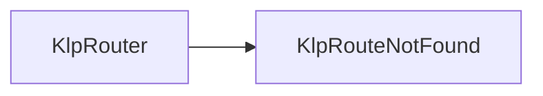

虛線框是其他領域的型別。

### shell — 應用外殼

型別 33 個，widget 22 個。

| 型別 | 行數 | 組成 |
|---|---|---|
| `KlpAppScreen` | 30 | `KlpTokenOverride` |
| `KlpAppWindowHeader` | 25 | `KlpPanelHeader` |
| `KlpContentState` | 3 | （葉節點） |
| `KlpDockAreaConstraints` | 15 | （葉節點） |
| `KlpDockAreaData` | 33 | （葉節點） |
| `KlpDockGroupData` | 33 | （葉節點） |
| `KlpDockHeader` | 122 | `KlpContextMenu`、`KlpContextMenuController`、`KlpIconButton`、`KlpMenuItemData`、`KlpPanelHeader` |
| `KlpDockHeaderAction` | 17 | （葉節點） |
| `KlpDockLayout` | 1093 | `KlpDockHeader`、`KlpDragPreview`、`KlpPanelFrame` |
| `KlpDockLayoutData` | 26 | （葉節點） |
| `KlpDockPanel` | 28 | （葉節點） |
| `KlpNavigationRailFrame` | 4 | （葉節點） |
| `KlpPaneCollapseControl` | 61 | `KlpIcon` |
| `KlpPanelFooter` | 15 | （葉節點） |
| `KlpPanelFrame` | 94 | `KlpPanelFooter`、`KlpTokenOverride` |
| `KlpPanelHeader` | 73 | `KlpText` |
| `KlpPrimarySidebarFrame` | 51 | `KlpSidebarFrame` |
| `KlpResponsivePaneCoordinator` | 22 | （葉節點） |
| `KlpSidebarFrame` | 24 | `KlpPanelFrame` |
| `KlpStageFrame` | 93 | `KlpPanelFooter`、`KlpStageHeader`、`KlpStatusBar`、`KlpTokenOverride` |
| `KlpStageHeader` | 91 | `KlpText` |
| `KlpStageTab` | 50 | `KlpText`、`KlpTokenOverride` |
| `KlpStageTopBar` | 37 | （葉節點） |
| `KlpStatusBar` | 46 | `KlpStatusIndicator`、`KlpText` |
| `KlpThemePreviewMode` | 2 | （葉節點） |
| `KlpThemePreviewTile` | 311 | `KlpPressable`、`KlpText` |
| `KlpThemeToggle` | 25 | `KlpSurface`、`KlpText` |
| `KlpWindowAction` | 65 | （葉節點） |
| `KlpWindowControls` | 147 | `KlpIcon`、`KlpTooltip` |
| `KlpWindowControlsStyle` | 11 | （葉節點） |
| `KlpWindowHeader` | 324 | `KlpText`、`KlpWindowControls` |
| `KlpWorkbenchNavigationRegion` | 24 | （葉節點） |
| `KlpWorkbenchWindowHeader` | 218 | `KlpIconButton`、`KlpWindowHeader` |

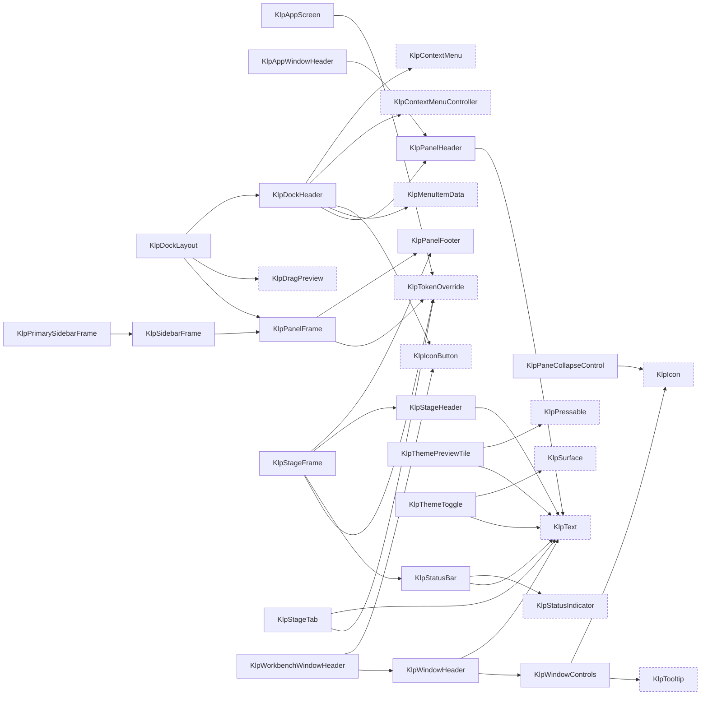

虛線框是其他領域的型別。

### settings — 設定呈現

型別 15 個，widget 13 個。

| 型別 | 行數 | 組成 |
|---|---|---|
| `KlpSettingsActionBar` | 46 | `KlpSurface`、`KlpText` |
| `KlpSettingsContentHeader` | 36 | `KlpText` |
| `KlpSettingsContentPane` | 77 | `KlpSettingsContentHeader`、`KlpSurface` |
| `KlpSettingsDialog` | 37 | （葉節點） |
| `KlpSettingsField` | 40 | `KlpSurface`、`KlpText` |
| `KlpSettingsNavigationGroup` | 37 | `KlpText` |
| `KlpSettingsNavigationHeader` | 90 | `KlpPressable`、`KlpText` |
| `KlpSettingsNavigationItem` | 54 | `KlpListTile`、`KlpSurface` |
| `KlpSettingsNavigationPane` | 47 | `KlpSurface` |
| `KlpSettingsPage` | 91 | `KlpResizeHandle` |
| `KlpSettingsScopeOption` | 8 | （葉節點） |
| `KlpSettingsScopeSwitcher` | 60 | `KlpIcon`、`KlpPressable`、`KlpSurface`、`KlpText` |
| `KlpSettingsSearchField` | 29 | `KlpTextField` |
| `KlpThemeModeOption` | 15 | （葉節點） |
| `KlpThemeModePicker` | 45 | `KlpThemePreviewTile` |

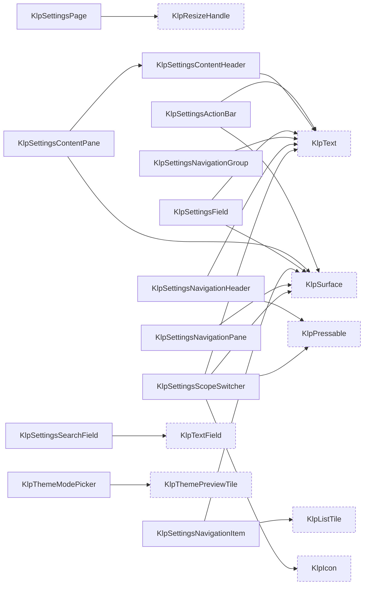

虛線框是其他領域的型別。

### app — 接入層

型別 6 個，widget 2 個。

| 型別 | 行數 | 組成 |
|---|---|---|
| `KlpAdaptive` | 26 | （葉節點） |
| `KlpApp` | 368 | `KlpAppScope`、`KlpEnvironmentScope`、`KlpKeyBindingController`、`KlpKeyBindingHost`、`KlpLocalizationsDelegate`、`KlpPopupInteractionScope`、`KlpRouterOutlet`、`KlpRouterScope`、`KlpWindowHeader` |
| `KlpAppPlatform` | 4 | （葉節點） |
| `KlpAppScope` | 34 | （葉節點） |
| `KlpEnvironmentScope` | 32 | （葉節點） |
| `KlpPlatformInfo` | 23 | （葉節點） |

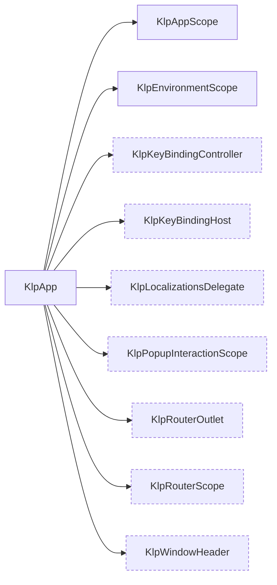

虛線框是其他領域的型別。

## 葉節點

不組合任何其他 Kallopis 型別的 widget。它們是這套視覺語言的**詞根**——
每一個都直接對應一個不可再分的視覺概念。

`KlpActionGroup`、`KlpAdaptive`、`KlpCanvasDropIntent`、`KlpCanvasSelectionOverlay`、`KlpCanvasViewport`、`KlpConditionalFieldRegion`、`KlpDashedDivider`、`KlpDivider`、`KlpDropIndicator`、`KlpEditorToolbar`、`KlpFileExplorerSection`、`KlpFocusBoundary`、`KlpForm`、`KlpGeometricSpinner`、`KlpIcon`、`KlpInlineCode`、`KlpKeyBindingHost`、`KlpKeyBindingRegion`、`KlpLiveRegion`、`KlpMasonryGrid`、`KlpMessageConversation`、`KlpOverlayHost`、`KlpPageBackgroundEditor`、`KlpPageBackgroundPainter`、`KlpPanelFooter`、`KlpPermissionState`、`KlpPopupBackground`、`KlpPressable`、`KlpPublicationProgressOverlay`、`KlpResizablePane`、`KlpResizeHandle`、`KlpResponsivePaneCoordinator`、`KlpRouterOutlet`、`KlpRouterScope`、`KlpScrollViewport`、`KlpSegmentedProgress`、`KlpSettingsDialog`、`KlpSidebarNavigationGroup`、`KlpSkeletonLine`、`KlpStageTopBar`、`KlpStateHighlight`、`KlpStrokeFrame`、`KlpText`、`KlpToastStack`、`KlpToggleIndicator`、`KlpTokenOverride`、`KlpTooltip`、`KlpTooltipSurface`、`KlpTree`、`KlpVirtualGrid`、`KlpVirtualList`、`KlpWorkbenchNavigationRegion`

## 被最多型別使用的

改動這些的影響面最大。

| 型別 | 被幾個型別使用 |
|---|---|
| `KlpText` | 117 |
| `KlpSurface` | 41 |
| `KlpIcon` | 35 |
| `KlpPressable` | 15 |
| `KlpButton` | 14 |
| `KlpBadge` | 12 |
| `KlpTextField` | 9 |
| `KlpDashedBorder` | 6 |
| `KlpDashedDivider` | 5 |
| `KlpIconButton` | 5 |
| `KlpStateHighlight` | 5 |
| `KlpTokenOverride` | 5 |
| `KlpMenuItemData` | 4 |
| `KlpGeometricSpinner` | 3 |
| `KlpMenu` | 3 |

